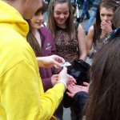

Today I participated in Maths Busking as part of the Science Festival of Leeds. "What is Maths
Busking?" I hear you ask. Maths Busking is a street performance of mathematics whereby the buskers
demonstrate mathematical ideas and engage the public in thinking like a mathematician in the form of
a series of busks. I'm not talking about blackboard maths, but interesting ideas that can be
demonstrated to a small group of people and convey some sense that a mathematical approach can be
used to solve a problem, or even cards tricks and suchlike, which rely on numeracy leading to
deception – clever tricks which we demonstrate, let the participant puzzle over and then fully
explain the "magic" behind so that they get something from the experience. I should point out we
don't ask for money when busking. We're just a bunch of volunteers on behalf of the science
festival.

A largely successful day on Briggate, the pedestrianised highstreet of Leeds city centre, involved
us pacing around in bright yellow 'Maths Busking'-branded hoodies attempting to engage people in our
busks. Sometimes this required us to approach people in the hope our choice of one-line opener would
entice them to stop and ask questions, other times people actually saw what we were doing with
another group and approached us to ask to take part. We mostly aimed for parents with junior school
age children, and groups of teens, but also some middle aged or even elderly people. Some parents
like to get their children engaging in our busks to see our tricks (like they would a magician), and
some people see other participants enjoying being a part of something and want to have a go
themselves. Not everyone is interested, so there is the annoyance of repeatedly being told "No" like
you're trying to "sell" them something, which is disheartening but totally worth it when you
complete a successful busk.

Some of the busks I performed today were:

- The "emergency pentagon" – making a perfectly regular pentagon by knotting a strip of paper and
  folding it (can be used to split a pizza in to 5 equal pieces)
- Handcuffs intertwined – two people each in (rope) handcuffs, with the rope between them
  overlapping – they have to find a way to separate from each other (a solveable topology problem) –
  usually quite hilarious to watch people attempt to get out with various attempts at stepping over
  the rope and hugging lots!
- The "I can read your mind" birthday trick – the participant points out in which columns their
  birthday (first day then month) appears and we say what their birthday is – the columns are powers
  of two, so 1 is in the column 0 only, 2 is in column 1 only, 3 is in both 0 and 1, 4 is in 2 only,
  5 in 2 and 0, etc. – basically they reveal the numbers to us in binary form – surprisingly very
  impressive to some folk!
- Knot the scarf – ask someone to take a scarf from you, ask them to tie a knot in it without
  letting go – they try, but it is impossible to add a knot to a closed line – the solution is to
  start with arms crossed (essentially knotted) and un-cross them to transfer the knot to the scarf

I also juggled to draw attention to our busking efforts, and had my Rubik's cubes at the ready. Some
of the other guys in the group have some pretty good card tricks, and some tricks like being able to
calculate cube roots of 5- or 6- digit numbers in their head (there's a trick to this as the
boundaries of each 10 are easy to remember and the last digit maps one-to-one to their initial last
digit).

I gave some thought to what my objectives were, and came to the conclusion that all I was trying to
do was show people interesting things I'd learned and found interesting, in the hope they would
observe some thinking "outside the box" (I hate the phrase but it's exactly what I mean) – to see
that to some problems there exists a non-obvious solution which lies somewhere outside of everything
which it seems natural to try. It's always nice to observe cleverness and elegant solutions to
problems, and any wise person will welcome such a solution and learn from the way it was achieved.

I've only busked about three times before today, and it's usually been at a science festival of some
sort, where everyone there is there for the science, and usually interested in everything going on.
Today's experience was very out in the wild in that we were having to approach people directly who
were just about their usual weekend business (mostly shopping) and not even aware there was a
science festival going on at all (I'm not actually sure how far away from it we were but I never saw
any hint that it was taking place). I'm not much of a people person when it comes to strangers,
until the point where an interest has been established and I realise they might feel genuine benefit
and appreciation for what I have to say – in which case you can't stop me talking! Fortunately we
busked in pairs which meant my partner could approach people and I could chip in once I felt more
comfortable. It really pays off when you see somebody enjoying and appreciating what you have to
offer them. I love public engagement as a hobby, and I admire anyone who does it for a living or on
a more regular basis.

<dl class="gallery-item">
<dt class="gallery-icon landscape">

</dt></dl><dl class="gallery-item">
<dt class="gallery-icon portrait">

</dt></dl><dl class="gallery-item">
<dt class="gallery-icon portrait">

</dt></dl> 

For more information, of if you would like to book some Maths Buskers for a school, a science
festival or any other event you can get in touch with the organisers at
[www.mathsbusking.com](http://www.mathsbusking.com)
