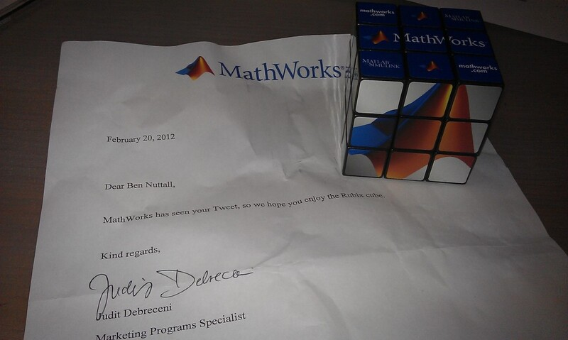

So I'm sitting in my office, bashing away at my keyboard, when a small parcel arrives on my desk. I
wasn't expecting anything, I'm new here so it wouldn't be work-related, it wasn't just a letter but
a small parcel containing an object quite clearly in the third dimension. Who on Earth would be
sending me 3D objects in the post to my work!?

I looked at the address label to verify it was definitely for me. It was.

Then I noticed the Mathworks logo stamped in the corner. I have no dealings with Mathworks, other
than using their software Matlab while I was a student. Most people who know me know I'm a huge fan
of Matlab. But I don't think they know that. Surely they have no reason to write to me, never mind
send me 3D objects in the post.

I opened up the parcel to find a Mathworks-branded Rubik's Cube. I'd seen one of these before – the
week before on Twitter [@MATLAB](http://twitter.com/MATLAB) posted a picture of one of these:

> @[MATLAB](https://twitter.com/MATLAB) Want one!!!
>
> — Ben Nuttall (@Ben_Nuttall) <a href="https://twitter.com/Ben_Nuttall/status/170510481965056000"
> data-datetime="2012-02-17T14:10:41+00:00">February 17, 2012</a>

And so I looked inside the parcel to see if there was anything else. There was a letter:

> Mathworks has seen your Tweet, so we hope you enjoy the Rubix Cube

Brilliant! (Apart from the misspelling of *Rubik's Cube*...)

I then tweeted:

> I genuinely don't believe this just happened. @[MATLAB](https://twitter.com/MATLAB) just sent me a
> Rubik's Cube in the post to my work :D [#thankyou](https://twitter.com/search/%2523thankyou)
> [twitter.com/Ben_Nuttall/st...](http://t.co/aIfjumcN "http://twitter.com/Ben_Nuttall/status/172642588099219456/photo/1")
>
> — Ben Nuttall (@Ben_Nuttall) <a href="https://twitter.com/Ben_Nuttall/status/172642588099219456"
> data-datetime="2012-02-23T11:22:56+00:00">February 23, 2012</a>

I think it's great. It's an interesting puzzle (another addition to my collection of cubes) as each
side contains a different picture made up of the 3×3 grid on each side, rather than just matching
colours. Also I noticed that once I solved it the first time, the centre pieces were the wrong way
round. This is something I've never considered before because on a normal cube, you just have to get
the pieces on the right side. You would know if a corner or edge piece was wrong because then the
colours wouldn't be the same on each side, but the centres – I always assumed they didn't rotate
relative to the corner and edge pieces! But I'd never noticed because there's no orientation to the
centres on normal cubes.

I had a play and couldn't figure out a fool-proof method of solving the centres, so I put it down,
carried on coding (in PHP, not Matlab) and left it for me to figure out on the train. I managed to
do it on the train back to work the next morning, but then messed it up again trying to explain to
[Mike](http://twitter.com/mgldev) how I'd done it! I played with it some more that weekend, and
became a bit more aware of how the middle-centres moved when you did the final step using my solving
method (switching the 4 centres on the top layer around), and can usually solve it using a technique
I developed, but it's far from perfect and seems a bit of a hacky solution. Maybe with more
inspection I'll figure out a general solution for the centres.

Anyway – huge thanks to Mathworks for the prezzie – I love it! Also I appreciate the human touch
applied here.

I think I deserve it, anyway – the amount of PR I've done for them by telling everyone how awesome
Matlab is for the last 3 years or so!
