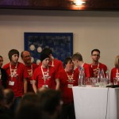

This weekend I attended the fifth (my third) [PHPNW annual
conference](http://conference.phpnw.org.uk/). As a member of the local [PHPNW user
group](http://www.phpnw.org.uk/) and community, I volunteer as a helper which involves getting
delegates registered, getting the speakers to the right place and making sure everything's running
smoothly. Starting on the Friday evening hackathon social, I got chatting with a few faces old and
new and once I'd eaten, got coding with [Mike](http://twitter.com/m1ke) – we did the Ordered Jobs
Kata in PHP – pairing and using PHPUnit. We continued with this, along with getting in conversations
with other delegates, until around midnight – then Mike gave me a kickstarter demo on Phing – the
PHP Deploy tool – which I've used before, but never written build scripts for, so that was a really
useful session – well in to the morning!

Arriving at the conference centre bright and early, donning our new PHPNW12 red helper t-shirts we
got people registered and handed name badges out. Once we had everyone settled in, the event kicked
off with a truly inspiring talk from Google's [Ade Oshineye](https://twitter.com/ade_oshineye) on
relating API design to real world usability (like doors that are hard to work out how to open). I
then shadowed [Patrick_Allaert](http://twitter.com/patrick_allaert) for his talk on PHP Data
Structures – I learned an awful lot about the different [data structures available in
SPL](http://www.php.net/manual/en/spl.datastructures.php) – I had no idea they were even there.
Picked up some other useful tricks and tips too.

I chatted with [Ben Waine](http://twitter.com/bwaine) over lunch and headed over to [Michael
Heap](http://twitter.com/mheap)'s talk on designing systems to scale, though the room was full so I
ended up hanging out in the "corridor track" with the [Magma](http://www.magmadigital.co.uk/) crew.
In the next session I opted for the unconference track for Ben's talk on 'Testing Your Shit with
Behat' – cool to see Behat in action! Next up I was shadowing for Google employee [Ian
Barber](http://twitter.com/ianbarber), who gave last year's keynote (before he worked for Google)
entitled '[How to Stand on the Shoulders of
Giants](http://blip.tv/phpnw/phpnw11-keynote-ian-barber-how-to-stand-on-the-shoulders-of-giants-5777535)',
which is well worth a watch. This year's on 'How to Build a Firehose'. A really interesting talk on
how to deal with exposing live data streams in real time.

Following the usual wrap-up of the day, the social happened.

Somehow I managed to get up in the morning and head back to the conference centre. The first talk
was on Responsive Design at the [BBC](http://www.bbc.co.uk/) – a fantastic and intriguing talk from
[John Cleveley](http://twitter.com/jcleveley). The second talk slot had two talks I really wanted to
see – [Adrian](http://twitter.com/adrianhardy)'s
[talk](http://conference.phpnw.org.uk/phpnw12/schedule/adrian-hardy/) on using
[nginx](http://nginx.org/) on the [Raspberry Pi](http://www.raspberrypi.org/), and '[To SQL or To
No(t)SQL](http://conference.phpnw.org.uk/phpnw12/schedule/jeroen-van-dijk/)' by [Joroen Van
Dijk](http://twitter.com/neorey) – but I was down to shadow the other track, Recognising Smelly
Code, which I really enjoyed – had some really good points and the speaker shared my adoration of
good naming conventions and the [single responsibility
principle](http://en.wikipedia.org/wiki/Single_responsibility_principle).

Another great conference – it gets better every year, without ever having been bad. Thanks to Magma
for organising, and to all the sponsors and delegates for making it an awesome event. It really
reminded me how great the PHP community is.

I will close with a statement expressing my opinion of Drupal:

<figure class="wp-block-image">
<iframe width="560" height="315" src="https://www.youtube.com/embed/ussCHoQttyQ?si=1F20xUz7bnYdI9GN" title="YouTube video player" frameborder="0" allow="accelerometer; autoplay; clipboard-write; encrypted-media; gyroscope; picture-in-picture; web-share" referrerpolicy="strict-origin-when-cross-origin" allowfullscreen></iframe>
</figure>

<dl class="gallery-item">
<dt class="gallery-icon landscape">

</dt></dl><dl class="gallery-item">
<dt class="gallery-icon landscape">

</dt></dl><dl class="gallery-item">
<dt class="gallery-icon landscape">

</dt></dl> <dl class="gallery-item">
<dt class="gallery-icon portrait">

</dt></dl><dl class="gallery-item">
<dt class="gallery-icon landscape">

</dt></dl><dl class="gallery-item">
<dt class="gallery-icon landscape">

</dt></dl> <dl class="gallery-item">
<dt class="gallery-icon landscape">

</dt></dl><dl class="gallery-item">
<dt class="gallery-icon landscape">

</dt></dl><dl class="gallery-item">
<dt class="gallery-icon landscape">

</dt></dl> <dl class="gallery-item">
<dt class="gallery-icon landscape">

</dt></dl><dl class="gallery-item">
<dt class="gallery-icon landscape">

</dt></dl>
 

Photo credit
[akrabat](http://www.flickr.com/photos/akrabat/sets/72157631719100336/with/8066285897/), [Stuart
Herbert](http://www.flickr.com/photos/stuartherbert/sets/72157631714133430/with/8058863294/) and
[vcrgardener](http://www.flickr.com/photos/87765987@N06/sets/72157631724963151/with/8068759789/)
