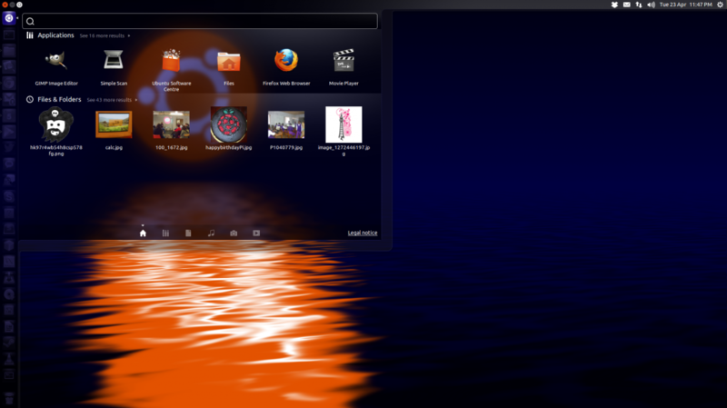

Like a lot of other [Ubuntu](http://www.ubuntu.com/) users, when I installed [Ubuntu
10.10](http://en.wikipedia.org/wiki/List_of_Ubuntu_releases#Ubuntu_10.10_.28Maverick_Meerkat.29) I
hated the new desktop environment Unity. I wanted to get back to the
[Gnome](http://www.uk.gnome.org/) desktop with the `Applications | Places | System` menu where I
knew where things were, I didn't feel comfortable with the silly oversized icons on the left, and I
didn't know where any settings were. I really didn't give it time to grow on me, I just changed back
to Gnome 2.

While working at [Magma](http://www.magmadigital.co.uk/), using
[Fedora](http://fedoraproject.org/get-fedora) 16, I grew to like Gnome 3, but started having
problems with something so [Adrian](http://twitter.com/adrianhardy) suggested I try
[Cinnamon](http://cinnamon.linuxmint.com/), a project from the [Linux Mint](http://linuxmint.com/)
distro. I loved it at the time, and started using it over Gnome 2 on my personal Ubuntu machines.
However one night at a user group, on the topic of the release of Ubuntu 12.04 LTS [Jon
Spriggs](http://twitter.com/jontheniceguy) demonstrated Unity, saying he thought it was great and
the features he showed were really simple and useful. He pointed out that you can change the width
of the Unity bar and commented that he preferred having a bar on the side of the screen, not at the
top or bottom, because he used a widescreen monitor and he had more spare free space there (though I
must say it takes up too much on my netbook which only spans 1024 pixels in width). Hit the "super
key" (windows key) and you get a search/explorer box – start typing the name of a file or
application and it starts suggesting things (hit enter at any point and you open the top result, or
use the arrow keys to navigate), hit the alt key and you get a little command prompt called HUD
(Head Up Display), pin app icons to the Unity bar, drag them to where you want them to stay. Hold
down the super key and you get a list of shortcuts.

Personally I'm a huge fan of workspaces, and I usually have a particular setup of windows
strategically placed for ease of access and avoiding constant alt-tabbing (with multiple monitors I
have commonly paired applications in the same workspace) – currently I'm sporting a 3×3 grid where I
start with my browser and twitter client in the middle and work my way out. Unfortunately because
Unity's management of workspaces in multiple display setups keeps sets of displays together (so a
3×3 grid on a 2 monitor setup is 9 workspaces, not 18), which means you can't move what's on your
right monitor to your left monitor and drag the next window along to the right monitor, you only
move sets of 2 displays at a time (or however many monitors you have). Some would see this as a
problem (some even such a problem they would stop using Unity), others quite like them being tied
together. I find the fact it's quite easy to move windows across workspaces quite useful (Ctrl +
Alt + direction moves workspace – add Alt to that and you take the current window with you).

Also, for someone who is not used to workspaces (or just your arrangement of them), it can be
incredibly difficult for a friend or colleague to navigate between your open applications if the
layout for them is in your head (I remember Adrian describing my setup as being "like a Rubik's
Cube") – but with Unity you click the icon in the Unity bar and it takes you to the open instance of
that application, wherever it is! I noticed how powerful this is when working with someone a couple
of months ago, and one day he came over to my machine, took over the keyboard and tried to alt-tab
between code and browser, and it must have seemed to him that there were no other open applications
running, because that was the only one in the alt-tab switcher. He had to ask me how to get to the
browser. I was a Cinnamon user at the time, but that day I had fallen back to Gnome 2 to overcome a
bug with Netbeans. The next day I had resolved the Netbeans issue and reverted to Cinnamon – he did
the same thing – tried alt-tab and remember he didn't know how to use my computer, and asked me to
move it again. The following day I was using Unity (I don't remember why, exactly – it was before I
was converted by Jon) – but I remember the same thing happening – he just saw the Chrome icon,
clicked it and said "well, that's easier".

I still see people on forums and on twitter complaining, or even just blindly sticking to their
original opinion – "Unity sucks". To these people I say give it a try. But as my friend
[Mike](http://twitter.com/walkingrandomly) said to me recently on this topic:

> [~~@~~**ben_nuttall**](https://twitter.com/ben_nuttall) That's the beauty of Linux I guess.We all
> get to be happy :)
>
> — Mike Croucher (@walkingrandomly)
> <a href="https://twitter.com/walkingrandomly/status/237260970911731712"
> data-datetime="2012-08-19T18:53:18+00:00">August 19, 2012</a>

So true.
