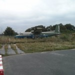
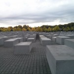
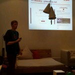
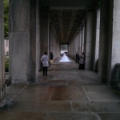
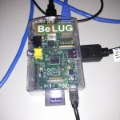
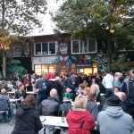
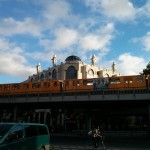
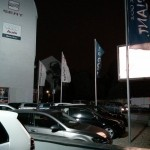

I've heard lots lately about how cool Berlin is — my friend [Martin](http://twitter.com/martinrue)
goes there regularly and hangs out in coffee shops working on projects, and he really enjoys the
atmosphere and culture around the city. Another friend [Sam](http://twitter.com/samtuke) recently
moved here, and he loves it too. There seemed to be a thriving tech scene, and there's plenty of
interesting things to see — so I thought I'd take my summer holiday there this year. I wanted to go
alone too — just for the adventure of getting about and discovering interesting things by myself. I
remembered my trip to the [Spanish Pyrenees](/blog/2008/07/pyrenees-2008/ "Pyrenees 2008")
back in 2008 and how I had to make it across the breadth of Spain by public transport on my own,
with no real plan, in order to make it back for my flight, and how I met a bunch of cool people
along the way. I was really seeking some adventure like this. And I'll be writing the post as I go
along, as reading back over the posts from my past trips reminds me of the detail of the anecdotes
and the emotion I went through at the time — things which are easily lost to time if not recorded.

I set off from Manchester in what I considered plenty of time. Arriving at the station to find the
train I'd planned on getting was delayed, I waited, and eventually made my way to the airport. the
delay had set me back quite a bit so I arrived with less time than I intended to make my way through
check-in (which was much less than the recommended time anyway). I had about 20 minutes till the
gate closed, so I rushed to the check-in desk and saw a huge queue — then realised that the luggage
check-in desk closed 10 minutes before the main check-in — giving me less than ten minutes to get
through the queue. Panicking, I realised I had no choice but to make my way to the front of the
queue, or probably miss the flight. I plucked up the courage to tap somebody on the shoulder and beg
that he let me in front of him — fortunately he was very understanding and let me in, and suggested
I move forward to the front — the few people ahead didn't mind either, and so I got to the desk a
few minutes before it was due to close. Then I made my way to the security scanners to find another
massive queue. Slightly worried the gate close time was getting close, I waited — and a member of
airport staff asked the crowd if there was anyone due to depart before 7am, as they could bypass the
queue to make it through in time — mine was 7.15 departure — and it was 6.45 at the time — so I
figured it wouldn't be a problem. I got through and made my way to the gate as they were calling for
any remaining passengers to board, so it was fine. Feeling relieved, I took my seat. Note to self:
don't push your luck.

I arrived at Schönefeld airport, retrieved my bag from the baggage carousel and made my way out. I
found a ticket machine for the train, and spent a few minutes pressing around to find the correct
ticket — meanwhile a queue was forming behind me. I eventually found the ticket I wanted — an ABC
Zone day ticket (the airport is in zone C, but an AB Zone ticket will do for the rest of the trip) —
and proceeded to attempt to pay for it — but the machine would not take my money (notes). I tried
all the different ways I could think of, but not wanting to hold the queue up I left and tried to
see if I could get some change. I found a change machine and got a bunch of Euro coins out. I
returned to the machine, and watched somebody use the machine perfectly — a green light came on and
they inserted a note. The green light never came on for me. the two people in from of me got to the
machine and the green light didn't come on either, so I pointed this out to them (as I heard them
speaking English). They tried a card and coins but no luck. I tried after them, and the coin slot
didn't open, the green light for the notes didn't come on and it wouldn't take my card. I left and
headed for the station to see if I could find another machine. I joined a queue at a machine in the
station, behind the people I'd been with at the previous machine, and chatted to them while we
waited. Turns out the guy was Irish, from Dublin, and had just moved to Berlin for a year to study
Economics, and the girl he was with was local and had arranged to meet him at the airport. Had a
great chat with them, and when the machine still wouldn't take my money, the guy put all three of
our tickets on his card and I gave him the cash. Phew! But where to? I didn't have any plans for the
day other than to got to [c-base](http://c-base.org/) that evening — and probably meet up with Sam,
who I was staying with to begin. I thought I'd be happy to head to a random cool part of town and
hang out until Sam was available — but really didn't know where to go. I didn't have data on my
phone and just had a map of the subway system. I called Sam for a suggestion and he said he was
available so he'd come and meet me. He called me and directed me to his nearest stop. There are four
types of public transport on the Berlin network — the U-bahn (mostly underground), the S-bahn
(mostly overground), the metro (trams) and the bus. A zone ticket permits travel on all of these.
Many stations have both U-bahn and S-bahn which makes for easy connections, and a few of the main
stations are railway stations too — for connections to other cities and further afield by train.

We walked to his apartment and had a bite to eat — we chatted for a while about the developments in
the tech scene in Manchester, and he told me about what's going on in Berlin. After a while I let
him get back to work and went for a walk. Sam lives near the former [Tempelhof
Airport](http://en.wikipedia.org/wiki/Berlin_Tempelhof_Airport), so I took the chance to walk
through it. The airport was built in the 1920s and reconstructed by the Nazis in the 1930s, and has
only been defunct since 2008. The airport building still stands, and the runways are still in tact
but the fields surrounding it are now used for sports, grills, art exhibitions and such. I took a
walk down the runway and then made my way towards Gneisenaustraße where I saw some interesting
graffiti — some of it made me chuckle and reminded me that's part of why I wanted to come here — the
attitude and expression of the residents of Berlin is fascinating. Then I spotted some brilliant
Berlin postcards in a little art shop and I wandered further and discovered Werderscher Kirchhof – a
huge and beautifully green cemetery with incredible architecture seen in massive family
monuments. It proceeded to rain heavily so I retreated to the nearest U-bahn station and headed over
to Jannowitzbrücke and while waiting to meet Sam for dinner, I was lucky enough to witness a
wonderful rainbow over the river — and it was visible as a full semi-circle — which I don't think
I've ever seen before!

<dl class="gallery-item">
<dt class="gallery-icon portrait">

</dt></dl><dl class="gallery-item">
<dt class="gallery-icon portrait">

</dt></dl><dl class="gallery-item">
<dt class="gallery-icon landscape">

</dt></dl><dl class="gallery-item">
<dt class="gallery-icon landscape">

</dt></dl> <dl class="gallery-item">
<dt class="gallery-icon landscape">

</dt></dl><dl class="gallery-item">
<dt class="gallery-icon portrait">

</dt></dl><dl class="gallery-item">
<dt class="gallery-icon portrait">

</dt></dl><dl class="gallery-item">
<dt class="gallery-icon portrait">

</dt></dl> <dl class="gallery-item">
<dt class="gallery-icon landscape">

</dt></dl><dl class="gallery-item">
<dt class="gallery-icon landscape">

</dt></dl><dl class="gallery-item">
<dt class="gallery-icon portrait">

</dt></dl><dl class="gallery-item">
<dt class="gallery-icon landscape">

</dt></dl> <dl class="gallery-item">
<dt class="gallery-icon landscape">

</dt></dl><dl class="gallery-item">
<dt class="gallery-icon landscape">

</dt></dl><dl class="gallery-item">
<dt class="gallery-icon portrait">

</dt></dl><dl class="gallery-item">
<dt class="gallery-icon landscape">

</dt></dl> <dl class="gallery-item">
<dt class="gallery-icon portrait">

</dt></dl><dl class="gallery-item">
<dt class="gallery-icon landscape">

</dt></dl>
 

Sam arrived and we ate at the [Ming Dynasty](http://ming-dynastie.de/) before entering c-base. This
night was the meeting of the [Ubuntu User Group](http://ubuntu-berlin.de/) – which I was looking
forward to. My experience at c-base was unexpectedly odd — no-one greeted or really acknowledged us
until we entered the members' area — to ask if we were members. Sam joined recently so he pointed
this out and introduced me, then after spotting my Raspberry Pi t-shirt, the guy started telling us
about how much better he thought the BeagleBone was. We had a look around and headed back to the bar
and got some drinks. Sam went to speak to someone about his membership and so I looked around for
someone to talk to — I joined a group at the bar, said hello and said I was visiting from the UK.
They basically ignored me, I asked if they were members and they said some of them were, then just
carried on talking amongst themselves. I gathered most people there were just hanging out, and saw a
small group with laptops running Ubuntu, I assumed they were the ones there for the Ubuntu meeting.
I approached the table, said hello and introduced myself to each of the pairs of people in turn,
they said hello but barely looked up from their laptops. When I couldn't seem to engage them at all,
and looked around to see everyone else was in closed groups chatting, I just sat and waited for Sam.
When he returned, I explained how people had been generally unwelcoming and asked if he knew anyone
we could hang out with. Being new to c-base, he didn't know many people there yet, and couldn't see
anyone he recognised. He asked one of the bar staff about the Ubuntu group and he pointed at the
group of people with laptops, and pointed out an older man aside form them who he said was the group
organiser. We approached him and ended up sitting with him for an hour or so, and had a great chat.
He was a retired programmer with several software patents to his name, and had plenty to tell us
about — really interesting and very pleasant. He invited to me a youth club at a community centre
called [E-lok](http://zope2.in-berlin.de:8100/wsb/elok/), which hosts a Linux User Group. I said I'd
try to go next week. C-base is a very cool venue, it has incredibly designed interior (it has a kind
of spaceship theme to it), and it's the most impressive hackspace I've ever seen, but I was not made
to feel welcome there as a visitor. It made me think how regulars at Madlab, Manchester Hackspace or
any user group I attend — myself included — conduct themselves in this situation — and hoped that
others or I did not make any newcomers feel this uncomfortable. User groups are known to have their
share of oddities like socially awkward or partially autistic attendees (geeks will be geeks), but
I'd like to think the groups I attend are rather welcoming and inclusive. I know a significant
number of people at these groups who actively include new people, and know that they avoid making
people feel uncomfortable. I will probably be returning to c-base while I'm here, so I hope my next
visit proves to be more successful.

The next day I took a trip to Alexanderplatz and had some lunch and a coffee while trying to use the
collection of offline maps and Berlin travel apps on my phone to determine where any of the things I
wanted to go to or see were located relative to the places I needed to go. I took a walk around the
area and ended up wandering in to a big shopping centre where I decided to buy a German SIM card so
I could access the internet from anywhere — this proved to be extremely useful. Later that afternoon
I headed to Kottbusser Tor to go to a coworking space called Co.up — which was hosting [Python Users
Berlin](http://www.meetup.com/Python-Users-Berlin-PUB) (PUB) [that
evening](http://www.meetup.com/Python-Users-Berlin-PUB/events/120270982/). As I arrived, the
organisers were setting up the room and projector and things, and speaking to each other in German,
but as soon as they were ready to start one of them welcomed everyone and announced "We'll be
switching to English now" — it's a kind of neutral language, the lowest common denominator — Berlin
being such a major city, its inhabitants are fairly international, and English is the best know
language so that's what they tend to use. I saw a great talk called 'Becoming a Better Programmer'
by Harald Armin Massa (aka the 'Lightning Talk Man'), in which the speaker explained a number of
techniques he has studied to tuning your brain to perform better at certain tasks —
including personal experiences with various motivational, self discipline, learning and information
management techniques. A guy called Andreas announced at the end that he was looking for people to
help coach at a Python for Beginners Workshop coming up on the Saturday — I approached him
afterwards and offered to go along to help out. The group then retreated to a local restaurant. On
the way I thanked the speaker and chatted to him, saying I was visiting from the UK — he said he
would see me at [PyCon UK](http://www.pyconuk.org/) but I said I was missing it as I would still be
in Berlin. At the restaurant I sat next to Andreas and chatted to him about the Python Workshop — it
turns out he's a volunteer for an organisation called
[OpenTechSchool](http://www.opentechschool.org/) which runs free tech workshops, and Berlin is just
one of their bases. I said we do loads of things like that in Manchester under different names — and
that we should collaborate with them, sharing resources and such, maybe get a Manchester
OpenTechSchool centre set up.

The waiter took my order (I pointed at an item on the menu while asking for "the beef casserole")
but he brought me a dish of meat in sauce with mashed potato — I said I thought my dish came with
dumplings, he said "No, the ox cheek comes with mashed potato" and verified by referring to the
menu. Not wanting to cause a fuss, I took the meal and I did enjoy it nonetheless. I had two
weissbiers throughout the meal and towards the end, someone asked for half a weissbier — the waiter
said it came in bottles so did he want to share one with me — I said I'd be happy to. As people were
ready to leave, each one dealt with the waiter and paid their own share individually, and I was the
last one left — I reminded him I'd had "the ox cheek and two and a half weissbiers" but he said
"actually, three — the other guy only paid for two". I felt put on the spot and I had a feeling I
was being taken for granted — I didn't know the guy but I'm sure he wouldn't have left me to pay for
his drink, and wondered why the waiter had let him not pay for it. The ox cheek was probably more
expensive than the dish I'd ordered too! Feeling responsible for it and, again, not wanting to cause
a fuss, I paid, giving him the amount rounded up to the next Euro. He grunted and muttered something
under his breath and walked away without leaving me the change. I was later told people don't leave
tips on the table after a meal in Germany, they just give the waiter what they want to pay on top of
the bill, so he must have thought I was doing that and only giving him a tiny tip. He'd given me the
wrong meal, and made me feel really awkward that I'd been charged for an extra drink, and I really
thought he was just ripping me off, and him being rude when taking my money just made it worse. A
very odd end to the night!

<dl class="gallery-item">
<dt class="gallery-icon landscape">

</dt></dl><dl class="gallery-item">
<dt class="gallery-icon landscape">

</dt></dl><dl class="gallery-item">
<dt class="gallery-icon portrait">

</dt></dl><dl class="gallery-item">
<dt class="gallery-icon landscape">

</dt></dl> 

I then tried to get hold of Sam, as I was staying at his house again, but couldn't reach him so I
texted his housemate James to see if he was at home. He replied to say he was heading out to a party
and I was welcome to come. I didn't really have a choice, but was glad to join him anyway so I
caught the U-bahn and met him at another part of town where we went to a bar for a lock-in. We
stayed there for a few hours, and James went off somewhere else and gave me his keys — I got on the
U-bahn home about 4.30am. I got off where he'd told me to, and checked the map on my phone for where
to walk from there — it looked like the best way would be to walk 7 blocks and turn left. After
about 7 very long blocks, I hadn't seen the road I was looking for so I checked my phone again. The
blue dot showing my location was on the opposite side of the station — I'd walked the wrong way! And
at that moment my phone battery died. I walked back to the station and another 7 blocks, turned left
down it and walked for a while, decided it wasn't right, checked the map on a bus stop, walked
further, and kept going back on myself. By about 6.30 I gave up thinking I was realistically in
walking distance from the apartment and so I went in to a U-bahn station and tried to plan a route
home. I went back and forth a couple of times, trying to get closer, then switched to another line
and found my way back around 7am. What a disaster! Also, while in the pub Sam texted me to say the
person whose room I was staying in would be returning that morning so could I be up and out of the
room by 10am. As I climbed in to bed I put my phone on charge and set my alarm for 10, just three
hours away. I got up, exhausted from walking around aimlessly all night and on barely any sleep —
and realised I needed to do some work on [Pi Weekly](http://piweekly.net/) as it was due to be sent
out at noon that day (BST, so 1pm for me). Luckily I'd arranged for my co-curator
[Ryan](http://twitter.com/ryanteck) to look after it while I was away, so he'd already collected the
links and got it ready to go. I checked the links, layout and wording and all the perfectionist bits
I do before finalising each issue, and scheduled it to be sent. Then Sam awoke and said his other
housemate wasn't coming back after all so I could go back to bed. I slept well in to the
afternoon! After spending the first two nights with Sam, I then moved on to my accommodation for the
rest of the week — an [airbnb](https://www.airbnb.co.uk/) place Martin had recommended — a lovely
couple with a baby, who rent out the spacious spare bedroom in their Kreuzberg apartment.

<dl class="gallery-item">
<dt class="gallery-icon landscape">

</dt></dl><dl class="gallery-item">
<dt class="gallery-icon portrait">

</dt></dl><dl class="gallery-item">
<dt class="gallery-icon landscape">

</dt></dl><dl class="gallery-item">
<dt class="gallery-icon landscape">

</dt></dl> 

The next day I returned to Co.up for the OpenTechSchool Python Workshop (Python for Absolute
Beginners). We had about 30 people turn up for the workshop — and about 12 coaches. Once we were set
up, Andreas briefed the coaches before everyone arrived, and gave an opening presentation when we
started. Rather than a led session or lesson, participants were given the URL of a github project
guiding them through using the Turtle module in Python — something Andreas had said was a good place
to start for beginners as it's all visual and graphical. Everyone seemed to get along with it well
and we were walking around checking people were ok and answering any questions they had. The mix of
operating systems, text editors and spoken languages didn't really bother anyone — we would suggest
editors and IDEs if people asked, and pointed out features in ones they were using, but mostly just
lent a hand with syntax errors and answered general questions. One guy there asked me if there was
any additional material because he'd skipped through it quite fast. I checked with Andreas and he
pointed him to the rest of the OpenTechSchool material, and suggested he looked at something like
[Learn Python The Hard Way](http://learnpythonthehardway.org/). I showed him my [Python
Intro](https://github.com/madlabU18/python-intro) project and got him started with [Python
Challenge](http://www.pythonchallenge.com/) which he really enjoyed.

<dl class="gallery-item">
<dt class="gallery-icon landscape">

</dt></dl><dl class="gallery-item">
<dt class="gallery-icon landscape">

</dt></dl><dl class="gallery-item">
<dt class="gallery-icon landscape">

</dt></dl> 

On Monday I took a walk from the apartment in Kreuzberg to Checkpoint Charlie, and initially just
wandered around the checkpoint to take in what was there. Starbucks, McDonald's and Domino's Pizza.
I spotted a little food stall called 'Checkpoint Curry' and ate a nice currywurst from there. I then
entered the museum, which was full of interesting bits of history from the Berlin Wall, the state of
culture during the divide, various stories of resistance and people daringly crossing the boarder
any way they could, all the events around the fall of the wall and the politics of rebuilding
society in Europe.

<dl class="gallery-item">
<dt class="gallery-icon landscape">

</dt></dl><dl class="gallery-item">
<dt class="gallery-icon landscape">

</dt></dl><dl class="gallery-item">
<dt class="gallery-icon portrait">

</dt></dl><dl class="gallery-item">
<dt class="gallery-icon landscape">

</dt></dl> <dl class="gallery-item">
<dt class="gallery-icon landscape">

</dt></dl><dl class="gallery-item">
<dt class="gallery-icon landscape">

</dt></dl><dl class="gallery-item">
<dt class="gallery-icon portrait">

</dt></dl><dl class="gallery-item">
<dt class="gallery-icon landscape">

</dt></dl> <dl class="gallery-item">
<dt class="gallery-icon portrait">

</dt></dl><dl class="gallery-item">
<dt class="gallery-icon portrait">

</dt></dl>
 

Next I took a walk to Potsdamer Platz, which was thriving with traffic and is full of huge buildings
and massive corporate advertising. It was raining pretty hard at the time too, so I kept walking on.
I reached the Holocaust memorial which is a really cool area full of big stone cuboids of all
different heights, in a grid. They start low on the edges and get higher towards the centre, so I
stepped up on to the first one and walked across them right to the middle, hopping about between
each one as it got higher. I took a few pictures from the centre and from the far end, and proceeded
to walk further until I reached [Brandenburger Tor](http://en.wikipedia.org/wiki/Brandenburg_Gate),
the iconic former gate in the city divide. I took a few pictures of the arch before receiving word
from Sam that he would be heading to cbase.

<dl class="gallery-item">
<dt class="gallery-icon portrait">

</dt></dl><dl class="gallery-item">
<dt class="gallery-icon landscape">

</dt></dl><dl class="gallery-item">
<dt class="gallery-icon portrait">

</dt></dl><dl class="gallery-item">
<dt class="gallery-icon landscape">

</dt></dl> <dl class="gallery-item">
<dt class="gallery-icon landscape">

</dt></dl><dl class="gallery-item">
<dt class="gallery-icon landscape">

</dt></dl><dl class="gallery-item">
<dt class="gallery-icon landscape">

</dt></dl><dl class="gallery-item">
<dt class="gallery-icon landscape">

</dt></dl> <dl class="gallery-item">
<dt class="gallery-icon landscape">

</dt></dl><dl class="gallery-item">
<dt class="gallery-icon landscape">

</dt></dl>
 

I headed off to meet him there. It was the Symphony Stammtisch, a drinks meetup for users of the PHP
framework Symphony. Like the Ubuntu event, not a lot was organised for the meeting, and so Sam and I
just chatted with a couple of people there for Symphony — one of whom was a woman I'd seen at the
Python group the week before, but not had a chance to speak to. I noticed her accent and asked if
she was American — to which she replied she "used to be", but now has German citizenship. The other
was a guy who told us about the startup he works for, which sells customisable muesli. We stayed a
little while and chatted, before heading off for a kebab.

The following morning I went for breakfast at a place Martin had recommended in Kreuzberg — called
*East London*. It's a British style café which does a great Full English Breakfast. I stayed in
there a while, and did some work on Pi Weekly after eating breakfast and while drinking coffee. Once
my battery was drained I returned to my room in the apartment and prepared my presentation for the
talk I was due to give that evening. While I was planning my trip, Martin suggested I checked
meetup.com for any user groups that were on during my stay — I found Python Users Berlin and one
called [Geek2Geek](http://www.meetup.com/geek2geek/) — an event aiming to bring together tech people
in different languages and disciplines. I RSVP'd on the meetup page and discussion began on what
talks they could have. I said I would be visiting from the UK and would be happy to talk about
Raspberry Pi and Raspberry Jams in the UK, which they accepted and invited me to speak. I gave a
lightning talk at [PHPNW](http://www.phpnw.org.uk/) recently, where I just brought up pictures of
Raspberry Pi projects and talked briefly about each of them, and gave a similar short talk at
Madlab, so the slides used evolved between each of these talks and I used these as a starting point
for Geek2Geek. I added some recent projects and expanded on what goes on in Manchester and at
Madlab.

I finished preparing in plenty of time and headed out early to make sure I could find the venue. I
went to the address which was given to me as *Fashion For Home — Showroom im Quartier
208, Behrenstraße 28, 10117 Berlin* and I was asked to arrive at 6.30 for a 7pm start. I found the
street, and walked down looking for number 28 and something labelled *Fashion For Home*. I'm not
sure what I was expecting but I found a furniture shop called *Fashion For Home*. I guessed maybe
the event was in a room upstairs from the shop, so I wandered around looking for an adjacent door
leading to the upstairs offices or something. There were no doors — just shops either side. There
was a printed A4 sign on the door in German which said something about it being closed from 7pm. A
guy in the shop entrance came out to me and said something in German — I said I was there for an
event — he changed to English and said "Geek2Geek", I said yes, and he said I was a bit early. I
said I was told to be there at 6.30 as I was speaking. He said "Oh so are you Ben?" I said yes and
he invited me in. I asked where the event would be held — he said "over there" and pointed at the
middle of the showroom. Shortly after, other people started to arrive and I introduced myself to
each of them, chatting away. One guy turned up and spoke to me and I realised he'd been tweeting me
the last few days — he's an English developer called [James](https://twitter.com/monkeymademe) who
lives in Berlin, and he's subscribed to Pi Weekly, and he read that I would be speaking so he signed
up and came along. I then met another Englishman, also living in Berlin, called [Sam
Carlisle](http://twitter.com/samthetechie), who I was told about by a couple of people before I
left. He was a member of the [London Hackspace](https://london.hackspace.org.uk/) and he's involved
in organising and running events called [Cryptoparties](https://www.cryptoparty.in/). We chatted
briefly and quickly identified a number of mutual friends and events we'd both attended. We'd both
heard about each other from other people.

They started setting up the projector on a bedside cabinet and projected on to a wall in front of a
double bed, and aligned various chairs, sofa seats and loungers facing in the direction of the wall.
More people arrived, we chatted and I plugged my laptop in to the projector. People sat down, I was
introduced and I began. While speaking I constantly reminded myself I was speaking to non-English
natives and so kept slowing down and tried to speak clearly. It seemed to be well received and
people nodded along, laughed at the right times, looked amazed when I told them about Amy speaking
about her Game of Life project at the Jamboree. I was asked a number of questions afterwards, and
then Sam stepped up to speak next. I found a lounger at the back of the room and perched to hear
what he had to say. Sam gave a brilliant talk on Read/Write Society, explaining hackerspace culture,
and the "rules" they live by, such as "repair is better than recycling". He spoke passionately about
the importance of device freedom — expressing despair that companies turn [Turing
Complete](http://en.wikipedia.org/wiki/Turing_completeness) computer systems in to locked down
machines that do limited tasks, and explained how you can fix this with various hacks. Much of what
Sam said related to the Raspberry Pi, and he praised its success in giving people, particularly
young people, the freedom to create things. I chatted with some people afterwards about the
Raspberry Pi, Raspberry Jams, the tech scene in Manchester and the UK and all sorts. James was
interested in helping attending a Berlin Raspberry Jam — and Sam mentioned wanting to help set one
up — so I hope between them and others they can make it happen! Maybe next time I visit Berlin I can
attend a Jam. The slides from my talk are available
[here](https://docs.google.com/presentation/d/1mtmHHvlau5LAR-4MtvNDRSBouh0vDtymXlf3fs6QVng/present#slide=id.ge34ffa37_010).

<dl class="gallery-item">
<dt class="gallery-icon landscape">

</dt></dl><dl class="gallery-item">
<dt class="gallery-icon landscape">

</dt></dl><dl class="gallery-item">
<dt class="gallery-icon portrait">

</dt></dl><dl class="gallery-item">
<dt class="gallery-icon landscape">

</dt></dl> <dl class="gallery-item">
<dt class="gallery-icon landscape">

</dt></dl><dl class="gallery-item">
<dt class="gallery-icon landscape">

</dt></dl><dl class="gallery-item">
<dt class="gallery-icon landscape">

</dt></dl><dl class="gallery-item">
<dt class="gallery-icon landscape">

</dt></dl> <dl class="gallery-item">
<dt class="gallery-icon landscape">

</dt></dl><dl class="gallery-item">
<dt class="gallery-icon landscape">

</dt></dl>
 

The next morning I was due to check out of my airbnb accommodation, so I packed my bags and started
the day by returning to the East London café for breakfast — this time trying their pancakes, which
were very nice. I moved on to a café Martin recommended called [Sankt
Oberholz](http://www.sanktoberholz.de/). Every single table was full of developers working on
laptops. I worked on Pi Weekly there for a while before heading off to meet my friend Sophie. Sophie
is an Austrian who went to my university and was in my [canoe club](http://mmucanoe.co.uk/). She's
now living in Berlin where she teaches English at a school. We met at Alexanderplatz where she
introduced me to her boyfriend and we went on to a cocktail bar and restaurant and caught up and
exchanged stories. I stayed at their place that night, and I'd booked another airbnb for the next
night, for the rest of the week. I arranged to get the keys for that place at noon the next day.
Sophie's is quite far out from the centre, so my route to the new apartment involved four changes on
the train and underground. I took the first train, got off and waited for the next connection. After
a few minutes I saw a train pull in to an adjacent platform, and realised it was the one I needed,
so I jumped up and ran through the underpass to get to the next platform — and managed to hop on
before the doors shut. While looking at my app for how many stops I needed to take, I realised I
didn't have my hold-all with me — just my backpack. I realised I'd left it on the platform. I got
off the train at the next stop, and hoped there would be another train back the same way soon — and
fortunately one came right away. I took it one stop (really hoping it wasn't a different service
taking another route), and hopped off and retrieved my bag from where I'd left it on a seat — phew!
Now running late, I waited for the next train and continued my journey, and texted my contact at the
accommodation to let him know.

<dl class="gallery-item">
<dt class="gallery-icon landscape">

</dt></dl><dl class="gallery-item">
<dt class="gallery-icon landscape">

</dt></dl><dl class="gallery-item">
<dt class="gallery-icon portrait">

</dt></dl><dl class="gallery-item">
<dt class="gallery-icon landscape">

</dt></dl> <dl class="gallery-item">
<dt class="gallery-icon landscape">

</dt></dl>
 

I arrived, collected my key, dropped my bags off and did some clothes washing. Then I went to c-base
and spent some time there with Sam (Carlisle). We discussed cryptoparties, crypto in general, PGP,
[OTR IRC](https://www.cryptoparty.in/communication/irc), encryption and privacy. I'd planned to
attend a Linux group that evening, as invited by the retired chap from the Ubuntu group on my first
night, and when 7.00 came around I left for [E-Lok](http://zope2.in-berlin.de:8100/wsb/elok/). E-Lok
is a youth centre in Warschauer and is the venue for one of the Linux meetups in Berlin — called
[Linux Works](http://friedrichshain.homelinux.org/). I had expected it to be a Linux group for young
people, but I was mistaken — it was an adult group that just meets at the centre. I sat down and
chatted to a couple of people, and spoke to the man who'd invited me — and he asked if I would speak
about the tech scene in Manchester, and so I ended up giving a condensed version of my Geek2Geek
Raspberry Pi & Manchester Raspberry Jam talk — showing the slides from my laptop display for
reference. The talk went down well and everyone was interested in talking to me about its contents.
I got in to a discussion with a guy about Ubuntu and Canonical (he was rather anti), choices in
window managers, and then about some programming languages — PHP, Python and golang — after he
showed me a podcast website he'd written in PHP (which used a huge associative array as its
database!) and how he wanted to rewrite it in go. I also spoke to a guy called Paul who works
part-time at the FSFE with my friend Sam (Tuke). I then met a woman called Jana, who is a Linux
sysadmin and a councillor for the [German Pirate Party](https://twitter.com/piratenpartei). She told
me of some events coming up at the weekend — Software Freedom Day on Saturday and the Pirate
Election Party on Sunday. She also asked if I was going to [Oggcamp](http://oggcamp.org/) — which I
am — and she said she wants to go. Great to hear people outside the UK know about the event!

The next day, Friday, I decided to head to some tourist attractions and museums — and so took a walk
along Torstrasse and turned on to Friedrickstrasse in the direction of Museum Island. I could have
taken a more direct route but was in search of food so stuck to the main roads. While walking down
Friedrickstrasse, I saw someone I knew — Nicola, a friend from sixth form I haven't seen for about 6
years! There were very few people about — I was walking down the street and she was standing under
shelter from the rain, looking out at the street, and we just caught each other's gaze and I went
over to say hello. She was there for a long weekend with her boyfriend. We chatted for a few
minutes, swapped contact details and have since exchanged a few emails. What a coincidence to bump
in to each other like that! I continued walking through the rain, and saw some beautiful
architecture, huge old buildings, all the time thinking they would look much nicer in better
weather. I found Museum Island and discovered most of them, such as the Egyptian Museum, required
prior booking. I kept on walking around seeing the sights, along with crowds of tourists in
raincoats. I witnessed a number of tourists walking around taking photos with their iPads in light
rain. Seriously. I came across a movie set where they were filming — no idea what for but they went
round telling people they were "in the way" and could they move on. I walked around some more,
disappointed that the sights were not at their best, and I spotted a bus pull up displaying that it
was headed for the Zoological Gardens. That was somewhere I intended to go at some point, so I
jumped on. Knowing it was too late to get in to the zoo itself, I thought it would be good to check
out a different part of the city. I got some food from a noodle shop and wandered around. The zoo
closed at 5pm so it wasn't worth going in, especially not as it was raining anyway. I walked off and
went in to a general souvenir shop, where I saw an odd souvenir — a t-shirt with the Android logo
"eating" the Brandenburg Gate, with the word 'Berlin' underneath. It made no sense, really, but I
thought it was funny so I bought one. I wandered around some more and was generally fed up of trying
to be a tourist, and of the rain, so I headed home.

<dl class="gallery-item">
<dt class="gallery-icon portrait">

</dt></dl><dl class="gallery-item">
<dt class="gallery-icon landscape">

</dt></dl><dl class="gallery-item">
<dt class="gallery-icon portrait">

</dt></dl><dl class="gallery-item">
<dt class="gallery-icon landscape">

</dt></dl> <dl class="gallery-item">
<dt class="gallery-icon landscape">

</dt></dl><dl class="gallery-item">
<dt class="gallery-icon landscape">

</dt></dl><dl class="gallery-item">
<dt class="gallery-icon landscape">

</dt></dl><dl class="gallery-item">
<dt class="gallery-icon landscape">

</dt></dl> <dl class="gallery-item">
<dt class="gallery-icon landscape">

</dt></dl><dl class="gallery-item">
<dt class="gallery-icon portrait">

</dt></dl><dl class="gallery-item">
<dt class="gallery-icon landscape">

</dt></dl><dl class="gallery-item">
<dt class="gallery-icon landscape">

</dt></dl> <dl class="gallery-item">
<dt class="gallery-icon landscape">

</dt></dl><dl class="gallery-item">
<dt class="gallery-icon portrait">

</dt></dl><dl class="gallery-item">
<dt class="gallery-icon portrait">

</dt></dl>
 

I chilled out a bit in my room, and later on received a text from Sam (Tuke) who invited me to go
for a drink with him and some Free Software Foundation colleagues and friends so I headed to Wedding
and met them at his friends' apartment and later went to a bar. We stayed out pretty late talking
about free software and development. One of the guys said he used to work for a German social
network website which at one time was very big and had offers to be bought by Facebook for its user
base — the owners refused as the advertising revenue was so big, but it eventually declined in use
(losing users to Facebook) and became unprofitable and unfit for sale. I think he said it did get
sold, but for a tiny proportion of what they were originally offered, and that even then was a
really bad deal for the buyers! He explained how he worked on a recommendation engine for attempting
to invite users to groups based on common connections. It was a crazy explanation, but a really
interesting one! I quoted him at one point as saying the following:

> OH: "We had a 23-dimensional sphere and just eliminated the edge cases and that left us with
> 10,000 vectors and we just picked the closest."
>
> — Ben Nuttall (@ben_nuttall) [September 21,
> 2013](https://twitter.com/ben_nuttall/statuses/381208562284134400)

And then this:

> OH (same guy): "I used to do that. But now I do front-end development."
>
> — Ben Nuttall (@ben_nuttall) [September 21,
> 2013](https://twitter.com/ben_nuttall/statuses/381209228192804865)

I slept well in to the afternoon the next day, and headed straight to the venue of the [Software
Freedom Day](http://softwarefreedomday.org/) I had been told about by Jana at E-Lok. I had a few
connections to make, followed by a walk, to get there. Fortunately it was a much nicer day. I
arrived at [IN-Berlin](http://in-berlin.de/), which is the office of a [non-profit
ISP](http://in-berlin.de/provider/), and the home of another Linux User Group called
[\[Be\]Lug](http://www.belug.de/). The event was just a bunch of Linux geeks (about 12 of us)
sitting around a table eating pastries and cakes and drinking coffee. It was good — had some
interesting chats with people at what soon became the English end of the table — as I was joined by
a student from Istanbul, a 15 year old boy called Reuben (originally from the Isle of Man, been
living in Berlin for 5 years) and later, Jana, who offered to give us a tour of the space. They have
a really cool setup there, with computer desks, soldering kit workstations, plenty of Linux and free
software posters, murals (a weird one of [Richard
Stallman](http://en.wikipedia.org/wiki/Richard_Stallman)) and a huge box of [Linux washing
powder](http://en.wikipedia.org/wiki/R%C3%B6sch)! They also have a lot of cool stuff on display in
their windows at the front — which is a great idea to show the public what they do. They have a 3D
printer (and some 3D printed objects), some official [LibreOffice](http://www.libreoffice.org/) disc
sets, Arduino powered LED displays and such. The guy from Istanbul said he had been in Berlin for 6
months but never been to c-base, so Jana and I said we'd go there next and take him. I told Paul
(FSFE) we were going to c-base and he said he'd come too. I arranged to meet Sam (Carlisle) there
and so I went to look for him when we arrived. We discussed a few things we'd mentioned briefly
previously, including events and initiatives we want to set up and run between us, in Berlin and in
the UK. We shared experiences of doing similar things we've done before, or know other people who've
done similar things. We have a lot in common in terms of what we want to do, and how, and experience
in being involved in these things. We should hopefully be putting some things on together in the UK
next month — watch this space! And we've made a foundation for a Berlin Raspberry Jam too. Sam left
and so Paul, Jana and I headed to Ostkreuz to get something to eat. Jana walked us round showing us
some interesting areas, and we ate at a brilliant grill place. We then proceeded to a bar called
[Liberacion](http://www.kinzig9.de/liberacion.html), where Jana left us and Paul and I had a drink
and a chat.

<dl class="gallery-item">
<dt class="gallery-icon landscape">

</dt></dl><dl class="gallery-item">
<dt class="gallery-icon landscape">

</dt></dl><dl class="gallery-item">
<dt class="gallery-icon landscape">

</dt></dl><dl class="gallery-item">
<dt class="gallery-icon portrait">

</dt></dl> <dl class="gallery-item">
<dt class="gallery-icon landscape">

</dt></dl><dl class="gallery-item">
<dt class="gallery-icon portrait">

</dt></dl><dl class="gallery-item">
<dt class="gallery-icon portrait">

</dt></dl><dl class="gallery-item">
<dt class="gallery-icon landscape">

</dt></dl> <dl class="gallery-item">
<dt class="gallery-icon portrait">

</dt></dl><dl class="gallery-item">
<dt class="gallery-icon landscape">

</dt></dl><dl class="gallery-item">
<dt class="gallery-icon landscape">

</dt></dl><dl class="gallery-item">
<dt class="gallery-icon landscape">

</dt></dl> <dl class="gallery-item">
<dt class="gallery-icon landscape">

</dt></dl><dl class="gallery-item">
<dt class="gallery-icon landscape">

</dt></dl><dl class="gallery-item">
<dt class="gallery-icon landscape">

</dt></dl><dl class="gallery-item">
<dt class="gallery-icon landscape">

</dt></dl> <dl class="gallery-item">
<dt class="gallery-icon portrait">

</dt></dl>
 

On Sunday I met Sam (Carlisle) at c-base again. I rang the doorbell (a three button mouse) when I
arrived and said I was there to meet Sam Carlisle. The guy just said "he's not here yet" and just
stood in front of the entrance giving the impression that I couldn't come in. I said I'd wait for
him and he said ok and shut the door. Ideally I'd have waited inside but apparently this wasn't an
option. I sat on the bench outside and got my laptop out. Sam took a while getting there as he had a
few things to do on the way. He apologised for me not being let in. They're generally not very
welcoming, especially to visitors not accompanied by a member. Understandable that they don't want
people wandering in off the street, but they could have easily let me sit in the bar as I was
meeting a member there. It's more the fact they come across as rude and unwelcoming. Anyway, we
shared a few ideas and discussed some things, and Sam showed me a button he'd just made with a 3D
printer, and he stitched it in to his trousers to repair them — very cool! He's got some other
things he uses daily that have been printed — little things like a handle cable tied to a plastic
bottle and a cable tidy. He's looking at setting up a 3D Copy Shop — a concept whereby people bring
in objects, they get scanned in and reprinted. An awesome idea I'm sure will be commonplace at some
point in the future — and when we start to see things like that, it'll be the start of something
big! We ordered some pizza and then headed to the Pirate Election Party!

<dl class="gallery-item">
<dt class="gallery-icon portrait">

</dt></dl><dl class="gallery-item">
<dt class="gallery-icon landscape">

</dt></dl> 

I was surprised to see so many people there — about 300, I think. There was a crowd standing about
in an open area with a bar, and some screens and cameras and stuff going on in a room inside. The
atmosphere was great — everyone in high spirits, being very social, chatting and getting to know
each other. Sam introduced me to some friends of his he spotted when we walked in, and people were
saying they were disappointed by the exit polls saying they only had about 2% of the vote. At the
time it looked like they hadn't really made any progress and that Merkel would more than likely win,
but possibly not reach a majority. Despite this, everyone enjoyed themselves and we got to chat to
some interesting people. Sam (Tuke) and Paul from FSFE turned up later on too. I was in the room
with the big screen when a result came through and the room erupted with joy — I'm not quite sure
what exactly was being announced, maybe it was the local result — but it said the Pirates got 2.5%
and 2.0%. Discussion that night ranged from tech chat to piracy, privacy and encryption,
[Snowden](http://en.wikipedia.org/wiki/Edward_Snowden) and the NSA, and general German politics. A
real mix of people there — anarchists, punks, rockers, hippies, techies and more. Some discussions
we were involved in were very odd, others quite interesting and thought provoking. It was quite
exhausting! We went off for a kebab at one point, returned for another beer and left around 11pm.

<dl class="gallery-item">
<dt class="gallery-icon landscape">

</dt></dl><dl class="gallery-item">
<dt class="gallery-icon landscape">

</dt></dl><dl class="gallery-item">
<dt class="gallery-icon landscape">

</dt></dl><dl class="gallery-item">
<dt class="gallery-icon landscape">

</dt></dl> <dl class="gallery-item">
<dt class="gallery-icon landscape">

</dt></dl><dl class="gallery-item">
<dt class="gallery-icon landscape">

</dt></dl><dl class="gallery-item">
<dt class="gallery-icon landscape">

</dt></dl>
 

On Monday I went to the FSFE office to meet Sam (Tuke) and went for lunch with him and his
colleagues. We ate at a place called [*White Trash*](http://www.whitetrashfastfood.com/) and had
some nice soup and salad and a rather disappointing burger. Then I decided to take up a
recommendation from my friend Tim, which was also backed by Sam — the [Alternative Berlin
Tour](http://alternativeberlin.com/). I went along not knowing what it would be like and ended up
really enjoying it! Our guide, Lynn — a girl from Luxembourg who studied in Berlin four years ago
and "fell in love" with the city and decided to stay — showed us around parts of the city you'd
probably not otherwise go to. First up, we stopped at an old railway bridge covered in graffiti —
she asked if we thought graffiti was legal in Berlin — it isn't! But enforcement of this ruling is
very minimal, and fines are small, depending on the type. If it's spray painted tags on a corporate
building, that's pretty bad, but a lot of what you see is things like paste-ups (printed pictures
pasted and stuck to walls) which are quick and easy to put up, and time can be spent working on them
from home, so people rarely get caught doing this sort of thing, and these fines are minimal anyway.
There are also spray stencils which are also quick to apply, and are reproducible. Lynn pointed out
some of the artwork and explained the themes behind them — many of which are really interesting! One
artist has a theme of work involving a picture of a girl labelled Little Lucy and pastes a picture
of a dead cat somewhere nearby — the game is to find the cat once you've seen Lucy. She's usually
holding a gun or other clue as to how she killed the cat — and the cat may be shown with a hole in
its chest (as if it's been shot) or just hung from a lamppost or something. Another artist by the
name El Pocho draws pictures of women who have fallen in love with Berlin, and each of these women
is accompanied by a phrase like "I see him but he doesn't see me" or "Goodbye Childhood" which
indicates she is growing up and so is Berlin, and that things are changing. Another theme is a
series of pasted characters in various work outfits — a bus driver, a businessman, a clown — shown
wearing a gas mask — all with the caption "soon", as if to suggest pollution will one day mean we
will go about our daily lives as normal but be forced to wear gas masks. A really intriguing one is
a series of paste-ups — this would be difficult to decipher its meaning without being told — which
consists only of poor quality black and white photographs of people just standing about doing
nothing in particular. Lynn explained that these are of people as they can be seen on Google Street
View in those respective locations. An artist ironically known as Sober just pastes up pictures of
drunk women dancing. There are lots of pieces of art, or just written slogans that simply express
political messages or ideals — many regarding the Berlin Wall (such as "The next wall to fall — Wall
Street"), class divides and often some expressing dismissal of Nazism saying it's not welcome.
There's also a retired man who goes around painting the number 6 everywhere, in no particularly
artistic fashion and without making any statement. Lynn explained that he has been asked about this
and in interviews with magazines he's said he's doing it to make the internet go faster! Something
to do with 6 in German being "sechs", pronounced like "sex". And the internet is full of sex. Makes
sense. We then hopped on the S-bahn and Lynn pointed out the East Wall Gallery — a collection of
artwork on the remaining parts of the Berlin Wall. We didn't stay to look at it, but I made a mental
note to return the next day to take a walk along the wall. Instead we checked out YAAM — the Young
African Art Market, which is an afro-Caribbean style area full of sand, deck chairs, hammocks, beach
football pitches, ping pong tables, and is full of interesting art projects. It lies in what was
once "No Man's Land" between the wall and the river. The slogan "YAAM must survive" was repeated in
many places — this is a reference to the "Media Spree" which is an initiative to make use the land
around the wall for big corporate enterprises. They've already built big office blocks, a sports
stadium and all sorts on this land, all plastered in huge advertising and corporate logos. There are
many slogans painted around the area, such as "Fuck off Media Spree". Unfortunately YAAM has already
been sold off to be used for the same purpose, so the messages are now in vein.

<dl class="gallery-item">
<dt class="gallery-icon landscape">

</dt></dl><dl class="gallery-item">
<dt class="gallery-icon portrait">

</dt></dl><dl class="gallery-item">
<dt class="gallery-icon portrait">

</dt></dl><dl class="gallery-item">
<dt class="gallery-icon portrait">

</dt></dl> <dl class="gallery-item">
<dt class="gallery-icon portrait">

</dt></dl><dl class="gallery-item">
<dt class="gallery-icon landscape">

</dt></dl><dl class="gallery-item">
<dt class="gallery-icon landscape">

</dt></dl><dl class="gallery-item">
<dt class="gallery-icon landscape">

</dt></dl> <dl class="gallery-item">
<dt class="gallery-icon landscape">

</dt></dl><dl class="gallery-item">
<dt class="gallery-icon landscape">

</dt></dl><dl class="gallery-item">
<dt class="gallery-icon landscape">

</dt></dl><dl class="gallery-item">
<dt class="gallery-icon landscape">

</dt></dl> <dl class="gallery-item">
<dt class="gallery-icon landscape">

</dt></dl><dl class="gallery-item">
<dt class="gallery-icon landscape">

</dt></dl><dl class="gallery-item">
<dt class="gallery-icon landscape">

</dt></dl>
 

We then took a walk over the river and she pointed out a house that belonged to a Turkish man during
the divided city years, who built things in and around his house out of other people's trash —
including a tree house. The council thought he might be masking a tunnelling attempt with the tree
house and such, and so ordered an inspection of his property. It turned out he was just building a
tree house and nothing more. Once he was ordered to move, and he refused, and concreted all the
furniture in and around his house to the floor! He now lives in a new apartment across the road from
there during the Winter, and moves back in to his makeshift house in the Summer — he's in his 90s.
Walking further, we entered Kreuzberg and she showed us a piece of artwork on the side of a building
— a giant stencil of an astronaut in black ink. The stencil was done by cutting a sketchbook picture
up in to a grid and making stencils for each piece of the grid. By itself it's a great mural, but
Lynn also pointed out that at night, a flag can be seen waving on the wall too — which she left us
to ponder for a minute before revealing that there was a floodlight across the road and some flags
up around a car showroom — which were there before the picture — and the artist chose to do an
astronaut here knowing that the flag would present itself alongside. The tour ended here and people
donated generously (it was a free tour on a donate-what-you-want basis) as everyone enjoyed it so
much. That evening I returned to co.up for the Continuous learning in Python session put on by
OpenTechSchool. The young boy from the Isle of Man, Reuben, showed up and I worked with him on a
Turtle exercise in Python. I later returned to the Astronaut picture in the dark to witness the flag
appearance — very cool indeed!

<dl class="gallery-item">
<dt class="gallery-icon landscape">

</dt></dl><dl class="gallery-item">
<dt class="gallery-icon landscape">

</dt></dl><dl class="gallery-item">
<dt class="gallery-icon portrait">

</dt></dl><dl class="gallery-item">
<dt class="gallery-icon landscape">

</dt></dl> <dl class="gallery-item">
<dt class="gallery-icon landscape">

</dt></dl><dl class="gallery-item">
<dt class="gallery-icon portrait">

</dt></dl><dl class="gallery-item">
<dt class="gallery-icon portrait">

</dt></dl><dl class="gallery-item">
<dt class="gallery-icon landscape">

</dt></dl>
 

Tuesday was my last full day in Berlin — I revisited the East Wall Gallery and walked all the way
along it, taking pictures of the more interesting paintings. Unfortunately it was raining so wasn't
too pleasant to be walking around — much like the other days I'd attempted to do tourist things! I
ended up walking in to Kreuzberg again and finding a cafe to retreat to. I stayed there for the
afternoon and arranged to meet Sam (Tuke) that evening. We went to a restaurant that evening for
German food — as I hadn't really had any yet! Just kebabs, chinese and such! Had a great meal, and
some interesting discussion about free software and licenses (amongst other things) and headed home.
I stayed with Sam again that night and left early for the airport. This time I arrived over 2 hours
early for the flight — and was turned away when trying to check in my luggage before the luggage
desk was open for my flight. I went for a coffee, checked my bag in and proceeded through security
and eventually to the gate in plenty of time. Much less stressful than the journey two weeks prior!
Lesson learned.

<dl class="gallery-item">
<dt class="gallery-icon landscape">

</dt></dl><dl class="gallery-item">
<dt class="gallery-icon landscape">

</dt></dl><dl class="gallery-item">
<dt class="gallery-icon landscape">

</dt></dl><dl class="gallery-item">
<dt class="gallery-icon landscape">

</dt></dl> <dl class="gallery-item">
<dt class="gallery-icon landscape">

</dt></dl><dl class="gallery-item">
<dt class="gallery-icon landscape">

</dt></dl><dl class="gallery-item">
<dt class="gallery-icon landscape">

</dt></dl><dl class="gallery-item">
<dt class="gallery-icon landscape">

</dt></dl> <dl class="gallery-item">
<dt class="gallery-icon landscape">

</dt></dl><dl class="gallery-item">
<dt class="gallery-icon landscape">

</dt></dl><dl class="gallery-item">
<dt class="gallery-icon landscape">

</dt></dl><dl class="gallery-item">
<dt class="gallery-icon landscape">

</dt></dl> <dl class="gallery-item">
<dt class="gallery-icon landscape">

</dt></dl><dl class="gallery-item">
<dt class="gallery-icon landscape">

</dt></dl><dl class="gallery-item">
<dt class="gallery-icon landscape">

</dt></dl><dl class="gallery-item">
<dt class="gallery-icon landscape">

</dt></dl> <dl class="gallery-item">
<dt class="gallery-icon landscape">

</dt></dl><dl class="gallery-item">
<dt class="gallery-icon landscape">

</dt></dl><dl class="gallery-item">
<dt class="gallery-icon landscape">

</dt></dl><dl class="gallery-item">
<dt class="gallery-icon landscape">

</dt></dl> <dl class="gallery-item">
<dt class="gallery-icon landscape">

</dt></dl><dl class="gallery-item">
<dt class="gallery-icon portrait">

</dt></dl>
 

In summary, I had a brilliant time in Berlin. It was a really relaxing holiday and I got to meet
some great people, have really interesting conversations and see what life in Berlin is like. I'll
definitely return at some point!

When I got back I managed to bundle a Raspberry Pi in with my clothes in the washing machine. But
luckily after drying it out in rice for 2 days, it booted successfully! Phew!

> You know when you open your washing machine and find a
> [@Raspberry_Pi](https://twitter.com/Raspberry_Pi) among your clothes...
> [pic.twitter.com/pKvTg9IwWK](http://t.co/pKvTg9IwWK)
>
> — Ben Nuttall (@ben_nuttall) [September 25,
> 2013](https://twitter.com/ben_nuttall/statuses/382952653824614400)

> Woop! My [@Raspberry_Pi](https://twitter.com/Raspberry_Pi) survived the washing machine! Not sure
> about the PiLite though, seems broken. [pic.twitter.com/Y8rNhmRm1N](http://t.co/Y8rNhmRm1N)
>
> — Ben Nuttall (@ben_nuttall) [September 28,
> 2013](https://twitter.com/ben_nuttall/statuses/384034791361744897)

Recommended apps (Android):

- [aMetro](https://play.google.com/store/apps/details?id=org.ametro) (shows U-bahn map)
- [Fahrinfo](https://play.google.com/store/apps/details?id=de.hafas.android.vbb) (A-B travel planner
  for all transport systems)
- [OsmAnd](https://play.google.com/store/apps/details?id=net.osmand) (offline maps using
  OpenStreetMaps)
- [Offi Public Transport Buddy](https://play.google.com/store/apps/details?id=de.schildbach.oeffi)
  (several apps in one bundle – directions, stations, etc.)
