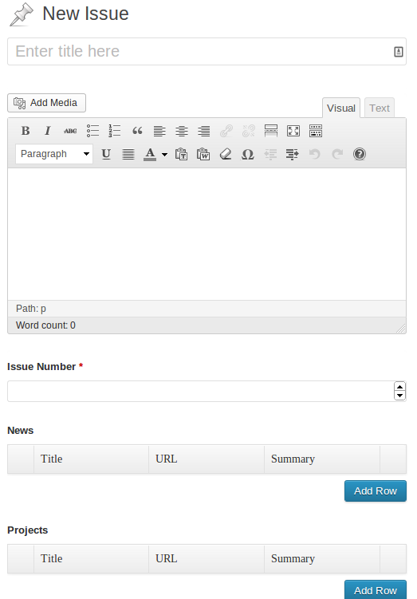
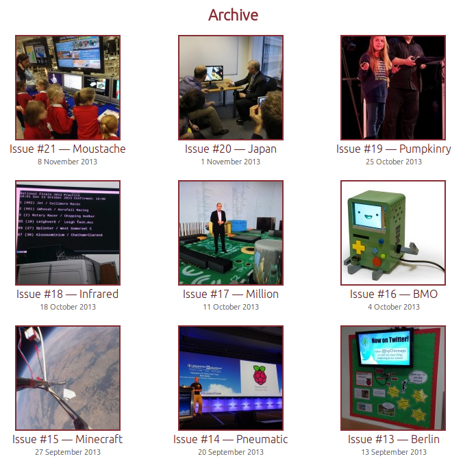

[Pi Weekly](http://piweekly.net/) is an email newsletter I run with fellow Raspberry Pi
enthusiast [Ryan Walmsley](http://twitter.com/ryanteck). Recently it occurred to me that for such a
small project, it's evolved a lot since we launched – and that it's quite impressive that we
launched it so soon after the idea came about, and how it landed me [my dream
job](https://twitter.com/ben_nuttall/status/395550686580342784).

I'm a subscriber of a handful of weekly tech newsletters – most notably a Python one called
[PyCoders Weekly](http://pycoders.com/). I considered one day that there wasn't, to my knowledge, a
Raspberry Pi one. I had a quick look and found nothing – I thought it would be a good project to run
– I began to imagine what form it would take, how it would get put together, who it would benefit
and such. I thought if it was weekly, it would take a lot of effort to take the time to find links
every single week – and realised I'd be best to find someone to help me run it. My immediate thought
was Ryan, which is odd as I'd never met him before – I just know him on Twitter through his
involvement in the Pi community. He's young, keen, dedicated and he makes things happen (see
[Rastrack](http://www.raspberrypi.org/archives/1298),
[Pideas](http://www.raspberrypi.org/archives/3387) and
[others](http://www.raspberrypi.org/archives/tag/ryan-walmsley)) – so I pinged him a DM asking if he
would be interested. That was a Thursday night – we agreed a name the next day, and I registered the
domain and a Twitter account (unfortunately [@piweekly](http://twitter.com/piweekly) was taken
(Personal Injury Weekly – gah!) so we took [@pi_weekly](http://twitter.com/pi_weekly)) and threw
together a basic single page WordPress theme (a responsive design) with a signup form. We had a
website – and even users signed up – by the Friday night. *Minimal Viable Product, right?*

The website looked not far from what it looks like now – the red background, white centre,
centralised signup form and minimal text, but just the one page. Obviously I was keeping this in
version control – see [Initial
Commit](https://github.com/bennuttall/piweekly/commit/10ec1b6cf19d2cc67b1d4afa7d67667f5b3096dc) and
(two commits later) [Version 1.0 first live
deployment](https://github.com/bennuttall/piweekly/commit/b0038df378a3d4944664896874f01e01c597e7f5).

We talked about how we would format the email itself – and decided there would be three sections:
News, Projects and Articles. We threw some links in to a Google Doc and shared ideas for the style.
I said I thought we should keep the list of links to a minimum – and make sure they were good
quality, rather than just throw every single one we find with "raspberry pi" in it. I got some
inspiration from
[PyCoders](http://us4.campaign-archive2.com/?u=9735795484d2e4c204da82a29&id=ba34a19b09) – I liked
their intro paragraph, their Reddit-style domain-in-brackets after each link (e.g. Some Article
(bbc.co.uk)) and I particularly liked it when they went through a phase of naming their issues with
a single word ([Redux](http://us4.campaign-archive2.com/?u=9735795484d2e4c204da82a29&id=252c50d8f1),
[Submit](http://us4.campaign-archive2.com/?u=9735795484d2e4c204da82a29&id=362dc7d43e),
[Air](http://us4.campaign-archive2.com/?u=9735795484d2e4c204da82a29&id=ba34a19b09),
[Glass](http://us4.campaign-archive2.com/?u=9735795484d2e4c204da82a29&id=0eb10a283a),
[Docker](http://us4.campaign-archive2.com/?u=9735795484d2e4c204da82a29&id=8848206a1a),
[Bugs](http://us4.campaign-archive2.com/?u=9735795484d2e4c204da82a29&id=4aeca730ca)) – though they
don't do this all the time; I decided we would.

After a couple of days, I threw the links in to a standard mailchimp template, picked some colours
for the titles and links, and it looked ready to go! I said to Ryan "We can launch on Friday". We
agreed and decided to keep it to ourselves (and a handful of close friends we'd asked for name
ideas) until we sent out the first one – intending to use Issue #1 as a taster to give people
something to go on. That's what we did:

> Announcing <http://t.co/lw6aII9taH> – a [@Raspberry_Pi](https://twitter.com/Raspberry_Pi) email
> newsletter for news & projects by [@ben_nuttall](https://twitter.com/ben_nuttall) &
> [@ryanteck](https://twitter.com/ryanteck) – launching at noon!
>
> — piweekly.net (@pi_weekly) [June 21,
> 2013](https://twitter.com/pi_weekly/statuses/348021716536147968)

We tweeted the link to the Mailchimp-hosted HTML version of the email and to sign up at piweekly.net
– and the link got tweeted by Liz Upton who runs the
[@Raspberry_Pi](http://twitter.com/Raspberry_Pi) account, and that brought us 100 subscribers within
an hour – and over 300 by the end of the weekend:

> Big thanks to [@ben_nuttall](https://twitter.com/ben_nuttall) and
> [@ryanteck](https://twitter.com/ryanteck) for all their work on
> [@pi_weekly](https://twitter.com/pi_weekly) – superb idea! We've added it to our weekly reading
> list. — Raspberry Pi (@Raspberry_Pi) [June 21,
> 2013](https://twitter.com/Raspberry_Pi/statuses/348042828091367424)

We also tweeted that people could tweet or email us links for inclusion. Once the [first
issue](http://piweekly.net/seed) had gone out, as well as including link to the HTML email on the
homepage, I added a some pages – [About](http://piweekly.net/about),
[Archive](http://piweekly.net/archive) and [Submissions](http://piweekly.net/submissions). These
were fairly minimal too. I didn't imagine us needing much more in the website. Content-wise, this is
still the case today – we've not added much wording to the site. By the second week I'd implemented
the link curation in to WordPress using [Advanced Custom
Fields](http://wordpress.org/plugins/advanced-custom-fields/) and its (unfortunately
premium) counterpart [ACF Repeater](http://www.advancedcustomfields.com/add-ons/repeater-field/).
This meant we could edit the upcoming newsletter as if it were a WordPress post – with custom
(repeatable) fields in sections for news, projects and articles – along with the intro paragraph:

<figure class="wp-block-image">

</figure>

Initially this would only be viewed in the back-end of WordPress and not be public facing, and was
only used so both of us could edit it in the browser on the web – and the HTML for the email was
generated by a plugin I wrote based on the Mailchimp template and these sets of fields – the second
issue was sent from this generator.

We kept it running smoothly for the next few weeks and gradually over the next few weeks I made a
number of minor changes to the website template – never altering the content much but tweaking the
markup for SEO and improvement of the mobile experience. I kept slightly changing the way the
generator worked and reworked how the ACF fields were used and such. Ryan I would chat on skype most
days, and throw ideas at each other. One idea we had was to include a  'Picture of the Week' – which
we introduced in [Issue #12](http://piweekly.net/party). That week was particularly special for us
as we'd just been [featured on the Raspberry Pi website](http://www.raspberrypi.org/archives/4770).
Liz posted a shout out to readers to subscribe, which included flattering us – Ryan was "Raspberry
Pi superfan", I was "brain-on-a-stick (and [kayak rescue
hero](http://www.manchestereveningnews.co.uk/news/greater-manchester-news/award-brave-kayakers-who-saved-3414694))"
– and we she couldn't have recommended us more highly. This feature sent our subscriber count from a
few hundred to a few thousand in mere hours. We hit the 4,000 mark from the spike in traffic.

While this was great news, it meant we had to start paying for Mailchimp. We could have run a mail
server ourselves but I'd rather have peace of mind knowing it was dealt with properly – and have no
problems with outage, delivery uncertainty, blacklisting and such. In any case, I knew we would
easily find a sponsor to cover our costs – like most tech newsletters I know of, some even have paid
jobs listings in the email. One quick email to the awesome people at
[Bytemark](http://www.bytemark.co.uk/r/piweekly) (who also provide our hosting for free) and we were
set for the month. We said we'd try to find another sponsor for the next month – and decided we'd
only allow [relevant sponsorship](http://piweekly.net/sponsorship), not just a general ad. We wanted
to provide our readers with something useful, not insult their intelligence, dating habits or
ability to maintain an erection, or whatever ads look like these days. We said we would only approve
sponsors we were proud to give a hat-tip to.

I also consulted with my friend [Dan](http://twitter.com/danlukas), who works in my office as a
freelance web analyst who gave me some tips on how to monitor effectiveness. Dan kept on at me any
time a user would be shown a page that wasn't ours – our archive page just linked to the Mailchimp
HTML email views, our confirmation and thankyou pages were Mailchimp's, and because of the
minimalist style of the site – there was hardly any relevant content on it. I added our own
confirmation and thankyou pages (and included a twitter share link):

> I just signed up to [@pi_weekly](https://twitter.com/pi_weekly) – free Raspberry Pi email
> newsletter at <http://t.co/h2uiEghaCk>
>
> — YellowBall (@hboerchers) [November 8,
> 2013](https://twitter.com/hboerchers/statuses/398811687379148800)

I expressed that minimalism was to be preserved – especially on the homepage as the focus was on the
signup box – but agreed that the past issues should be hosted on the site in the same template.
Luckily, I had them in WordPress as posts – ready to be templated and shown to the world. And soon
after that, I was able to replace links to past issues in the archive to pages on the site, with
nice URLs – like [piweekly.net/lumberjack](http://piweekly.net/lumberjack) – better
than <http://us7.campaign-archive1.com/?u=a3e42d3ea4355ad45198b39ba&id=31b9d1c811&e=>

One of the key things about Pi Weekly for me, at least, is the perfectionism. From day one I said
that our lists of links would take a particular form: Title, in sentence case, followed by
Reddit-style domain-in-brackets, and a one-line description of the link below. The inconsistency in
other newsletters bugs me! Some links in PyCoders Weekly are one line, some two, some a whole
paragraph, some just don't have a description, which just seems indecisive and lazy. I want mine to
be uniform and well presented. Some newsletters I've seen have broken HTML when sent out, so fonts
get messed up, things become misaligned, it just looks unprofessional. Ok so you may think I'm being
obsessive/compulsive, and yeah I probably am, but surely only good can come from being a
perfectionist on this matter? It doesn't take a lot of time, and can be done during a link check
before it gets sent out. A few weeks after launch we discovered there was
[another](http://www.raspiweekly.com/) weekly Raspberry Pi email newsletter – but the site hadn't
been updated, it looked poorly maintained, no care had gone in to it and the author was promoting
several other tech newsletters. To this day, the archive still only lists three past issues (it's
been that way since we found it).

We launched the hosted back issues in time for [Issue #17](http://piweekly.net/million), when we
also announced a new regular feature – Interviews. We arranged to interview [Paul
Beech](http://twitter.com/guru) (Paul designed the Raspberry Pi logo) of
[Pimoroni](http://shop.pimoroni.com/) (they make the
awesome [Pibow](http://shop.pimoroni.com/collections/pibow) rainbow case), which we conducted by
writing questions and sharing him in a Google Doc – he filled them out and I built the idea of
Interview post types in to the WordPress build – amending the original ACF fields to allow
optionally attaching an Interview post to an Issue post, we were good to go. We put Paul's intro in
to the email and linked to the interview page on the site for the whole transcript. We were really
pleased with this and look forward to conducting more in future. Pimoroni also sponsored the
newsletter the month after Bytemark – saying they just wanted to support something they loved, which
was great to hear.

More recently, while I was in London for MozFest, I had a lot of time when I was just sitting around
with my laptop and nothing else to think about – so I worked in some tweaks and new features. I
thought the archive page would look a lot more appealing if I was to use the picture of the week as
a thumbnail by each issue, in a grid. I coded the grid template to test the concept and it looked
great – but only the last few issues had pictures attached to them. Rather than implement this and
leave the old ones blank, I thought it would be worth retrospectively adding images to each issue
(11 without), which didn't take long – and I looked at a few links in each issue to spot a suitable
one. This feature was done fairly quickly, so I added some style rules to make it work just as well
on mobile, and deployed it straight away and showed Ryan. I then swapped out the text link on the
homepage ("Check out our latest issue") for a row of the grid to show the images for the last three
issues. I think it looks *much* nicer this way:

<figure class="wp-block-image">

</figure>

The most recent feature I've added was one essentially by request. Most of the link submission
emails we get are for Raspberry Pi events. We always said we don't feature events as they're
geographical, and the newsletter should really be for all. Also they didn't really fit in any of the
sections (news, projects, articles). We compromised and I added a section where we would list
upcoming events – I imagine these will mostly be in the UK, but we'll gladly promote awareness of
Raspberry Jams and other related events elsewhere in the world.

I could have waited till I was at this level of happiness with the site before launching – but look
how far we've come in the last few months. It was definitely the right decision to launch when we
did, and I'm proud of how it's evolved. If I'd kept it to myself and worked on it alone without any
feedback it might not be what anyone wants. But I've seen the reaction and looked at what works and
what doesn't. I'm sure many people will think I'm stupid to run an email newsletter out of WordPress
– but it works brilliantly! It's so easy to put an issue together, and you click a button to get the
HTML out to paste in to Mailchimp. And it's all integrated with our website, so no need for
duplication or external linking (any more) – and all the issues are immediately (and permanently)
available to view on the web.

Email's a funny thing – it's so easy to subscribe, and to like the *idea* of subscribing to
something, but actually bothering to read it is another matter. Last year I bought a PyCoders
t-shirt (they ran a [teespring](http://teespring.com/) campaign) and I wear it with pride (even
though I'm only a reader) – it's the one I'm wearing in my
[Google+](https://plus.google.com/+BenNuttall) [profile
picture](https://lh4.googleusercontent.com/-6jAMJy5RuYw/UU5TgtROXYI/AAAAAAAABfc/ACQFNFfJIqk/w500-h502-no/vlcsnap-2013-03-24-01h05m08s88.png),
speaking at the Raspberry Jamboree (I realise people will confuse Pi Weekly with PyCoders weekly,
especially if I wear their t-shirt so proudly). Maybe one day Pi Weekly will have t-shirts – I know
Ryan and I both want one to wear! I genuinely do read PyCoders every week – and click through any
links of interest, aided by Gmail filters & labels allowing me to find it when I have time. Some
things I like the idea of, such as the [Full Circle
Podcast](http://fullcirclemagazine.org/category/podcast/), I just don't make the effort to fit it in
to my life, as much as I'd like to. With these things you have to have a system for fitting them in
to your lifestyle – some people have schedules, some naturally work well with routines, others use
reminder systems, but at the end of the day we can't fit everything in.

I keep doing bits of work on the page titles around the site, fixed small CSS bugs and continued to
test the responsive layout, making small adjustments all the time. I really enjoy working on it, and
putting the newsletter together. I imagine this is what it feels like working on a startup or an
open source project. I guess this is something in between! It's all [open
source](http://github.com/bennuttall/piweekly), and I see it as a community project – and Ryan and I
do own it, but we don't intend to make any real money out of it. It feels great to contribute to the
community (and the Raspberry Pi community is an awesome one). We've had some great recognition for
it, and (along with running the [Manchester Raspberry Jam](http://mcrraspjam.org.uk/)) it's a major
part of how [I've been hired by the
Foundation](https://twitter.com/ben_nuttall/status/395550686580342784) to do development and
outreach (my dream job). We're close to six months now, and it's going great. Here's to the next six
months.
