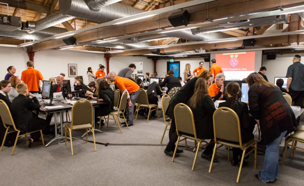
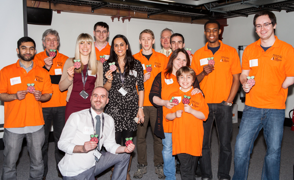

I organised an event with the [STEMNET](http://www.stemnet.org.uk/) (Science, Technology,
Engineering & Maths Network) team at the [Museum of Science and Industry](http://www.mosi.org.uk/)
(MOSI), based on the [Manchester Raspberry Jam](http://mcrraspjam.org.uk/) I run monthly at
[Madlab](http://madlab.org.uk/). The STEM Raspberry Jam was to be a new activity the STEM Ambassador
network could offer to schools, so we ran a pilot (pi-lot) to give the idea a whirl.

MOSI supported the event and kindly offered to host it at their fantastic venue in the museum on
Liverpool Road off Deansgate in Manchester, and the STEM team had invested in ten Raspberry Pi kits
(Pi, SD card, VGA converter, power cable & [PiFace](http://pi.cs.man.ac.uk/interface.htm)) which
they intend to loan out to ambassadors running Raspberry Pi activities! We invited a number of
schools to the Jam, and awaited their response.

I was given the ten SD cards and asked to add the software we'd need to them. I imagined this would
take forever but it was actually rather rapid – I initially wrote the standard
[Raspbian](http://www.raspbian.org/) image with [PiFace
pre-installed](http://www.raspberrypi.org/phpBB3/viewtopic.php?f=45&t=25895) to the first card using
[dd](http://elinux.org/RPi_Easy_SD_Card_Setup#Copying_an_image_to_the_SD_card_in_Linux_.28command_line.29),
booted it up on my Pi, set the raspi-config settings to enable ssh, boot to desktop, correct
timezone, etc. I then updated apt and installed a few essential packages and python modules. I then
ran the `dd` command in reverse (switching input file to the SD card, and output file to a new file on
my machine: stem.img) – this copied the image from the SD card to my computer, in the state I had
left it. I was then able to run the `dd` command again, this time writing stem.img to the blank card.
I tested each one by simply booting it to desktop, with no problems whatsoever!

We set a schedule for the day which included introductions, a morning session playing with Scratch
and the PiFace, followed by an afternoon in Python. We had some Scratch and PiFace activities
prepared, complete with booklets and instructional step-by-step guides. I'd written some Python
activities for the kids to work through in the afternoon. With more time I'd have written these as
part of the image I wrote to the cards but I wanted to make sure the cards worked ASAP, so I had to
add the files on the day. Luckily this wasn't difficult either – I just inserted the card in my
laptop, one by one, and copied the files to the user's home directory when it came up as an inserted
drive, like a USB stick would!

Six schools responded saying they would attend, bringing six pupils each. On the day, we started
with a welcoming word from Donna, the STEM Development Manager, (in her best teacher's voice!)
followed by an intro talk from me (in my normal voice). I explained what the Raspberry Pi is, what
happens at a Raspberry Jam and why it's all important ("*Raspberry Why?*"). I showed some pictures
of the Manchester Raspberry Jam, and other [Jams around the
world](http://raspberryjam.org.uk/blog/2013/01/02/raspberry-jam-tokyo-29-12-12/). I explained what
Scratch and Python are, and talked about the general perspective of "geeks" and compared this to
real world geeks – now popular figures such as Mark Zuckerberg! I talked about [singer will.i.am
donating £500,000 to improve STEM education in the UK](http://www.bbc.co.uk/news/business-21747206),
and how he's now learning to code!

<figure>
<iframe frameborder="0" height="389" loading="lazy" src="https://docs.google.com/presentation/d/1t1fp-lJGberkgSEdYEmB5dZD6xGz53CJgiKDizERB30/embed?start=false&amp;loop=false&amp;delayms=3000" width="480"></iframe>
<figcaption><i>Raspberry Why?</i></figcaption>
</figure>

Then we kicked off with some Scratch and PiFace – we handed out the booklets and let the groups
choose an activity based on their interests and abilities. With a group of STEM ambassadors on hand,
as well as their teachers, there was plenty of guidance available so they weren't left stuck for
what to do. It was great to see the kids building things in Scratch – some following examples by the
letter, others just experimenting and exploring! I've not really used Scratch myself, but I am
amazed to see it in use – some really cool things happening on screens everywhere you look –
animations, controlled characters, games, interaction with real world hardware – really awesome how
they just got on with it.

We stopped for lunch and I chatted with some of the kids and teachers about what they were doing in
school – mostly just dull ICT stuff with Word and PowerPoint, a bit of Scratch and (eugh...)
Dreamweaver. However some of them seemed more excited about [Code Club](http://www.codeclub.org.uk/)
being run after school – so that's something!

<figure class="wp-block-image">

</figure>

For the afternoon session we moved on to the Python activities I'd written late the previous night!
To start, I gave them intro.py – a single Python file containing a linear set of tasks, each
explained in comments in the code. It was just an idea I'd had the night before, as an easy way for
me to make sure they covered all the fundamentals to move on to tackling some interesting problems.
This activity went down really well and lasted the whole afternoon session! All twelve groups (three
kids per Pi) attempted to work their way through it – with ambassadors on hand to help out with
syntax errors and general clarification, it went rather smoothly and as I wandered around the room I
saw amazing progress! The script covered printing, variable assignment, basic data types, lists, if
statements, loops and so on. You could see them working through the challenges and understanding the
concepts.

A few of the teachers (and kids) asked if they could take a copy of the code, or download it from
somewhere. I let anyone with a USB stick take a copy, and promised to publish it on github. I knew
it needed some work to be at a decent standard but it had been a really good exercise that day and
fulfilled its purpose. We wrapped up the day by asking groups to raise their hands if they got past
the first level, then proceeded to raise the bar and see how far everyone had got – every group had
got to around Level 16, and one had reached the very last challenge, Level 22! (I'd purposely made
this one fairly complex)

I uploaded the files to the [MadlabU18](http://yrs.madlab.org.uk/) [Github
account](https://github.com/madlabU18/Python-Intro), and it immediately had a couple of
contributions from my partners from [Coder Dojo](http://madlab.org.uk/content/tag/coderdojo/)! I've
since been considering options for the project's future. This week I [ran a
session](https://docs.google.com/presentation/d/1Q7Xu3-Z_tM0a1PpjA7SEdBPtl-q3VjQQaM8bd_a2t3E/present#slide=id.p)
at the [Python North West User
Group](http://madlab.org.uk/content/tag/north-west-python-user-group/), where we each paired up and
attempted to build a more sophisticated automated learning tool (similar to the [Python
Koans](https://github.com/gregmalcolm/python_koans/wiki), but for kids). From that session I've had
a few more ideas about how it can work. Well, watch this space.

<figure class="wp-block-image">

</figure>

Huge thanks to MOSI, STEMNET, Donna, Dan, and all the ambassadors who volunteered their time and
effort to make this happen – [Arran Gallagher](http://twitter.com/arrang), Graham Nelmes, Etinosa
Ogiesoba, Amin Hoque, Joe Haig, Erinma Ochu, James Burnstone, [Lisa
Mather](http://twitter.com/elsie_m_) and Dan Mather.

Read more on the STEMNET blog » [Pupils celebrate at the first Raspberry Jam for schools at
MOSI](http://networking.stemnet.org.uk/node/24895)
