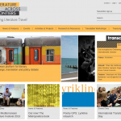
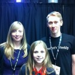
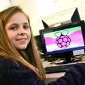
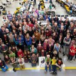
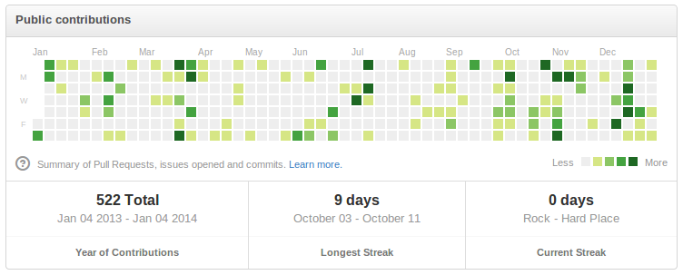
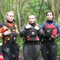

This year I've learned lots, run events, helped mentor young people, contributed to open source,
engaged in much community activity, made and developed some strong friendships and built myself a
new career.

## OH Digital

I began this year working as a web developer at [OH Digital](http://ohdigital.co.uk/), having
started there just two months before the previous Christmas. OH Digital are primarily a WordPress
development agency; initially I was sceptical of the use of WordPress as a full CMS, but grew to
realise its potential the more I used it in a range of commercial websites. We specialised in
delivering a full build to a client, from specification, through design and development iterations
to the launch, and also hosting, administration, third-party integration and maintenance. Our design
work always was done externally, as we had no in-house designers, but had connections with quality
local design companies. It meant we got to concentrate on development according to the specification
(which we'd created ourselves by working directly with clients) and outsource the visuals and
interfaces to professionals who could meet our clients' needs and provide us with excellent designs
to work from.

Working on all levels – specification, user experience, front-end markup and styles, back-end
programming and Linux systems administration – gave me excellent experience in working
professionally, being involved in the whole build, and meant I got to see a project through from
concept to launch and see it in action once live. And being lucky enough to work alongside very
talented designers meant I was always very proud of the piece of work we'd produce after each
project – not only because of the delivery of the technical solutions involved but because the
websites we made looked brilliant. I would be proud to say I worked on a site and would often show
people the finished product. Here is a selection of the projects I worked on at OH Digital:

<dl class="gallery-item">
<dt class="gallery-icon landscape">

</dt>
<dd class="wp-caption-text gallery-caption" id="gallery-3-970">
				Literature Across Frontiers
				</dd></dl><dl class="gallery-item">
<dt class="gallery-icon landscape">

</dt>
<dd class="wp-caption-text gallery-caption" id="gallery-3-969">
				Help Beat Diabetes
				</dd></dl><dl class="gallery-item">
<dt class="gallery-icon landscape">

</dt>
<dd class="wp-caption-text gallery-caption" id="gallery-3-961">
				Fallow Café
				</dd></dl> <dl class="gallery-item">
<dt class="gallery-icon landscape">

</dt>
<dd class="wp-caption-text gallery-caption" id="gallery-3-907">
				Prolific North
				</dd></dl><dl class="gallery-item">
<dt class="gallery-icon landscape">

</dt>
<dd class="wp-caption-text gallery-caption" id="gallery-3-904">
				Incognito
				</dd></dl><dl class="gallery-item">
<dt class="gallery-icon landscape">

</dt>
<dd class="wp-caption-text gallery-caption" id="gallery-3-902">
				Home MCR
				</dd></dl> <dl class="gallery-item">
<dt class="gallery-icon landscape">

</dt>
<dd class="wp-caption-text gallery-caption" id="gallery-3-901">
				Haelo
				</dd></dl><dl class="gallery-item">
<dt class="gallery-icon landscape">

</dt>
<dd class="wp-caption-text gallery-caption" id="gallery-3-900">
				Creative Tourist
				</dd></dl><dl class="gallery-item">
<dt class="gallery-icon landscape">

</dt>
<dd class="wp-caption-text gallery-caption" id="gallery-3-899">
				Comprehensive Communications
				</dd></dl> 

## Manchester Raspberry Jam

Throughout the year I continued to run the [Manchester Raspberry Jam](http://mcrraspjam.org.uk/).
This started in July 2012 and I ran one every month since then, skipping just two (March, for the
[Jamboree](/blog/2013/03/raspberry-jamboree-2013/ "Raspberry Jamboree 2013"), and September
when I was in [Berlin](/blog/2013/09/berlin-2013/ "Berlin 2013")) which we usually had
around 30 – 60 people attending. The Manchester Jam was the first in the UK and they soon spread all
over the country and the rest of the world. The events I ran were very practical focused, and we
regularly had a range of people attending – including young people and families, and everyone was
encouraged to collaborate on projects and learning. At the event in November – Manchester Raspberry
Jam XVI – we had 80 people signed up and a further 20 on the wait list. This event was attended by
several members of the Raspberry Pi Foundation and we ran a full track of talks upstairs as well as
the usual hacking downstairs. The talks were all [video
recorded](http://mcrraspjam.org.uk/jam-16-videos/) by a volunteer AV Team (thanks
[Les](http://twitter.com/biglesp), [Dan](http://twitter.com/methoddan),
[Olly](http://twitter.com/ollyclarkdotorg) & [Tony](http://twitter.com/TonyH1212)).

<dl class="gallery-item">
<dt class="gallery-icon landscape">

</dt></dl><dl class="gallery-item">
<dt class="gallery-icon landscape">

</dt></dl><dl class="gallery-item">
<dt class="gallery-icon landscape">

</dt></dl> <dl class="gallery-item">
<dt class="gallery-icon landscape">

</dt></dl><dl class="gallery-item">
<dt class="gallery-icon landscape">

</dt></dl><dl class="gallery-item">
<dt class="gallery-icon landscape">

</dt></dl> 

A particular success of the Raspberry Jam has been one of the young people I have mentored for the
last couple of years – 14 year old [Amy Mather](http://twitter.com/minigirlgeek) (known as Mini Girl
Geek). Amy is a really keen and very bright young coder and maker. At last December's Jam, we
started a small coding exercise – a test-driven implementation of [Conway's Game of
Life](http://en.wikipedia.org/wiki/Conway's_Game_of_Life) in Python, for her to learn coding
techniques and the language of Python. She came back to the next Jam in January with a fork of the
original code, ported to work with PyGame, a gaming library for Python, rather than just drawing
ASCII characters in the terminal. She improved upon the PyGame version some more at that Jam, adding
features and learning more about Python, and then came back the next month with a version of the
code powering a small LED matrix from a Raspberry Pi and an Arduino. She was then asked to present
this at the Raspberry Jamboree in March (just 13 years old at the time). The video of her
presentation was a big hit online (currently over 50,000 views) and was praised by many people
including [Kent Beck](https://twitter.com/KentBeck/status/313158716734181376) and [Jimmy
Wales](https://twitter.com/jimmy_wales/status/359640425268649984). The video was also [featured on
the Raspberry Pi blog](http://www.raspberrypi.org/archives/3506).

Amy went on to speak at bigger events such as
[CampusPartyEU](http://www.youtube.com/watch?v=vPDYV7zTD0M) at the O2 in London (on stage with
[George Osborne](https://twitter.com/George_Osborne) and Jimmy Wales), [Wired Next
Generation](http://www.wired.co.uk/news/archive/2013-10/19/clive-beale--amy-mather), [Wuthering
Bytes](http://wutheringbytes.com/speakers.html), and won the [*European Digital Girl of the Year*
Award](http://europa.eu/rapid/press-release_IP-13-1047_en.htm?locale=en) presented in Lithuania*.*
I'm very proud of everything she's achieved and I'm pleased to have been lucky enough to be one of
the many people who helped her along the way – and given her the chance to shine.

<dl class="gallery-item">
<dt class="gallery-icon landscape">

</dt></dl><dl class="gallery-item">
<dt class="gallery-icon landscape">

</dt></dl><dl class="gallery-item">
<dt class="gallery-icon landscape">

</dt></dl> 

## STEM

I also attended an event at Manchester University for STEM Ambassadors to be introduced to the
Raspberry Pi. After meeting the coordinators of STEMNET, we discussed the idea of running a
Raspberry Jam for schools – and so over several emails and phone calls, we put an event together,
invited schools to attend and ran the first [STEM Raspberry
Jam](/blog/2013/04/stem-raspberry-jam-pilot/ "STEM Raspberry Jam Pilot"). This kickstarted
Raspberry Pi activity in the STEM network of the North West and there have since been a number of
Raspberry Pi sessions run by the STEM team with a team of trained Ambassadors – in schools and
colleges around the North West, introducing young people to programming and making projects with the
Raspberry Pi.

<dl class="gallery-item">
<dt class="gallery-icon landscape">

</dt></dl><dl class="gallery-item">
<dt class="gallery-icon landscape">

</dt></dl> 

## Pi Weekly

About six months ago I had an idea to set up a weekly Raspberry Pi email newsletter featuring news
and projects from the community – and invited [Ryan Walmsley](http://twitter.com/ryanteck) to join
me in running it. We called it [Pi Weekly](http://piweekly.net/). We grew steadily and a few weeks
after launch it was [featured on the Raspberry Pi blog](http://www.raspberrypi.org/archives/4770) –
which sent out subscriber count through the roof. We then sought sponsorship to continue running at
the new capacity, and developed new features as time passed. I worked on the website, the newsletter
and the generator over time, and wrote up a [full account of its
evolution](/blog/2013/11/pi-weekly-evolution-dream-job/ "Pi Weekly – MVP, Evolution and My Dream Job")
on my blog. At the end of 2013, we'd sent out 28 issues and had over 5,600 subscribers. This week,
Pi Weekly was [translated in to French](http://www.raspfr.org/fr/news/pi-weekly-29) by a Pi
enthusiast with a Raspberry Pi news website.

## Manchester CoderDojo

Another project I've been involved with in the last year has been the [Manchester
CoderDojo](http://mcrcoderdojo.org.uk/). This is a youth club for kids learning to code and make
things. This was started in December 2012 by [Steven Flower](http://twitter.com/stevieflow), and we
started out at Madlab but after a few months outgrew the space and moved to a new venue at the Sharp
Project. I volunteered as a mentor and coach at each of the events in 2013 up to November, where I
ran sessions in Python, HTML/CSS, WordPress and using the Raspberry Pi. I recently revamped the
website and set up a Pi Weekly style newsletter we now send out to parents and supporters.

<dl class="gallery-item">
<dt class="gallery-icon landscape">

</dt></dl><dl class="gallery-item">
<dt class="gallery-icon landscape">

</dt></dl><dl class="gallery-item">
<dt class="gallery-icon landscape">

</dt></dl> 

## User groups and Conferences

I have been attending user groups in Sheffield and Manchester since late 2009 / early 2010, and this
year has been my peak in attendance. This year I've been regularly attending [Python North
West](https://groups.google.com/forum/#!forum/python-north-west), [PHPNW](http://phpnw.org.uk/), [XP
Manchester](http://xpmanchester.wordpress.com/), [manc.js](http://mancjs.com/), Manchester [Maths
Jam](http://www.mathsjam.com/), [IMA North West
Talks](http://www.ima.org.uk/activities/branches/north_west.cfm.html), [Manchester
Werewolf](https://www.eventbrite.com/e/manchester-werewolf-chapter-monthly-tickets-6760568041) and
[Preston GeekUp](http://prestongeekup.co.uk/), as well as helping out with [Manchester Girl
Geeks](http://manchester.girlgeekdinners.com/), volunteering for Manchester CoderDojo and running
Manchester Raspberry Jam. I visited a few events further from home, as one-offs, such as the York
Raspberry Jam and [Blackpool GeekUp](http://blackpoolgeekup.wordpress.com/) I gave many talks at
these user groups throughout the year, the majority related to Raspberry Pi. I gave a total of 32
talks in 2013, including a discussion panel at the Raspberry Jamboree and a couple of talks at user
groups in Berlin.

<dl class="gallery-item">
<dt class="gallery-icon portrait">

</dt></dl><dl class="gallery-item">
<dt class="gallery-icon landscape">

</dt></dl><dl class="gallery-item">
<dt class="gallery-icon landscape">

</dt></dl> 

I also attended the first Raspberry Jamboree (Manchester), my
first [MozFest](http://mozillafestival.org/) (London), my second Oggcamp (Liverpool), my third
[Barcamp Blackpool](http://barcampblackpool.com/), my third [Code Retreat](http://coderetreat.org/),
my third [U](http://ucubed.info/)[3](http://ucubed.info/), my third [Maths Jam
Conference](http://www.mathsjam.com/conference/) (Stone) and my fifth [PHP North West
conference](http://conference.phpnw.org.uk/phpnw13/) (Manchester).

## Open Source

This year I submitted my first patch to [Ubuntu](http://www.ubuntu.com/) – a fix for the
[Guake](https://apps.ubuntu.com/cat/applications/saucy/guake/) package (Quake-style dropdown
terminal) which was merged in to Ubuntu 13.10 (Raring Ringtail) and then-upcoming 13.10 (Saucy
Salamander). See the changelog on
[launchpad](https://launchpad.net/ubuntu/+source/guake/+changelog).

<figure class="wp-block-image">

</figure>

I also fixed minor bugs in a number of smaller projects such as the [Python
Koans](https://github.com/gregmalcolm/python_koans/pull/68), as well as working on a number of small
personal and community projects which are open source, such as [Python
Intro](https://github.com/bennuttall/python-intro), [Acacia
Acuminata](https://github.com/bennuttall/acacia-acuminata), [Acacia
Vanilla](https://github.com/bennuttall/acacia-vanilla) and [Pi
Weekly](https://github.com/bennuttall/piweekly).

My (public) GitHub contributions of 2013:

<figure class="wp-block-image">

</figure>

from [github.com/bennuttall](http://github.com/bennuttall) on 4th January 2014.

## Bravery Award

I was also presented with an award for the [river
rescue](/blog/2012/10/hero-kayakers/ "Hero Kayakers Rescue Whitewater Dinghy Man") I
conducted the previous September with friends from the canoe club. We each received the Chief Fire
Officer's Commendation for bravery at a presentation in the Ramsbottom Fire Station. See the
articles from the Manchester Evening News: [Award for Brave Kayakers who Saved Man's
Life](http://www.manchestereveningnews.co.uk/news/greater-manchester-news/award-brave-kayakers-who-saved-3414694) and
the Greater Manchester Fire & Rescue Service: [River Rescuers Presented with Bravery
Award](http://www.manchesterfire.gov.uk/updates/news/09may2013_brave_river_rescue_commendation.aspx)

<dl class="gallery-item">
<dt class="gallery-icon landscape">

</dt></dl><dl class="gallery-item">
<dt class="gallery-icon landscape">

</dt></dl><dl class="gallery-item">
<dt class="gallery-icon landscape">

</dt></dl> 

## Raspberry Pi Foundation & 2014

In mid-October, around the time I celebrated 1 year at OH Digital, I was invited to visit the
Raspberry Pi Foundation and was offered a job there. Obviously I accepted, and made plans to move to
Cambridge. Prior to this opportunity I had no intention to leave Manchester, and certainly wasn't
looking for a reason to move on from my job or from the city – but the chance to work full time
promoting the thing I have dedicated much of my time and effort to advocate purely because I
believed in it and the Foundation's mission – meant that there was no hesitation in taking the
opportunity to move. I moved at the end of November, two weeks after my final Jam – which was a huge
success, and a great chance for me to show the Foundation what I've been building up over the last
18 months.

<dl class="gallery-item">
<dt class="gallery-icon landscape">

</dt></dl><dl class="gallery-item">
<dt class="gallery-icon landscape">

</dt></dl><dl class="gallery-item">
<dt class="gallery-icon landscape">

</dt></dl> <dl class="gallery-item">
<dt class="gallery-icon landscape">

</dt></dl><dl class="gallery-item">
<dt class="gallery-icon landscape">

</dt></dl><dl class="gallery-item">
<dt class="gallery-icon landscape">

</dt></dl> 

Around the time this happened I had just started taking driving lessons again, and I managed to pass
my test a week before I moved to Cambridge – although I didn't get a car until around Christmas.
Finally at the age of 25 I am no longer a pedestrian!

<figure class="wp-block-image">

</figure>

My role at the Foundation will be in development and outreach. Initially I'll be working on a revamp
for the website, which will be launching early 2014, diversifying the content to include educational
resources, projects and such in a way that helps young people learn and aids teachers delivering
material, so as to progress with the Foundation's educational objectives. Also I will be working
with young people, speaking about Raspberry Pi at events, helping to make the learning experience
with Raspberry Pi more engaging, doing general outreach and fulfilling the Foundation's mission as
well as writing educational material, building tools, working on Pi projects and doing further
development and maintenance on the website. I was there for three weeks before heading back to
Sheffield for Christmas, and loved it so far. I'm getting on really well with the team, and getting
the chance to see the amazing things we have in development. Big things coming in 2014! We hit the
2.3 million sales mark at the end of 2013, which is incredible. We also have the wonderful award
winning teacher and new author [Carrie Anne Philbin](http://twitter.com/missphilbin) joining the
team (starting tomorrow!) which I'm particularly excited about, and very pleased for her to (like
me) be getting the chance to work on what she loves. See my introduction: [Welcome
Ben!](http://www.raspberrypi.org/archives/5349) and my first contribution to the Raspberry Pi blog:
[Pi Powered Ping Pong Pursuit](http://www.raspberrypi.org/archives/5398).

I plan to start a [CodeClub](https://www.codeclub.org.uk/) in Cambridge in 2014. It's something I've
wanted to do for a while, but never had the chance. Now I'm working for the Foundation it's
important for me to get involved in this and see how young people learn, how they interact with
technology and other people, and what they find interesting and engaging. As well as providing the
means for a group of young people to learn to code and build things, I will be learning lots about
the process for myself. Starting a CodeClub is something of a resolution of mine for the new year –
and I'll also try to personally do more hands-on projects, particularly with the Pi. I'll also aim
to make my way through some books I've had but not worked through yet – particularly *[Seven
Languages In Seven Weeks](http://pragprog.com/book/btlang/seven-languages-in-seven-weeks)*. It's
about time.

Thanks to all the friends I made in Manchester – particularly those involved in the machinery of the
tech community, who really do make things happen for people, and often (without realising it) get
the ball rolling for many people's personal and professional lives, and put them on a path to where
they ought to be. Special thanks to Madlab founders [Dave Mee](https://twitter.com/davemee) & [Hwa
Young](https://twitter.com/hwayoung), who gave me the chance to learn, and then the chance to shine;
to [Andrew Disley](http://twitter.com/andrewdisley), who ran Manchester GeekUp – which was my
gateway to all of this; to [Jag](https://twitter.com/Jagusti) & [Hannah
Goraya](https://twitter.com/yorkhannah) who ran the Sheffield tech scene (Jag hosted my first ever
tech event); to [Steven Flower](http://twitter.com/stevieflow) for doing what he does so well, and
bringing out the best in people; to [Sam Tuke](http://twitter.com/samtuke) who helps me understand
and appreciate freedom; to [Jeremy Coates](http://twitter.com/phpcodemonkey) for always keeping an
eye on me; to [Jon Spriggs](http://twitter.com/jontheniceguy) for helping me and others do anything
we want to do, and for sharing all he has with the world (with such passion); to [Robie
Basak](http://twitter.com/robiebasak) and [Sam Headleand](http://twitter.com/samheadleand) for being
alongside me all this year; to [Lisa Mather](http://twitter.com/elsie_m_) for being like a second
Mum; to [Les Pounder](http://twitter.com/biglesp) for making great things happen and living the
dream; and to all the geeks of the North West scene who've been like a family to me the last few
years.
