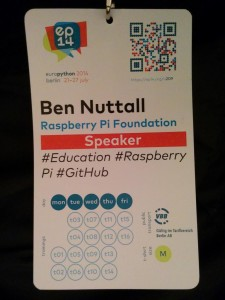

In the last two months I've attended and spoken at five Python conferences around Europe.

<dl class="gallery-item">
<dt class="gallery-icon landscape">

</dt></dl><dl class="gallery-item">
<dt class="gallery-icon landscape">

</dt></dl><dl class="gallery-item">
<dt class="gallery-icon landscape">

</dt></dl><dl class="gallery-item">
<dt class="gallery-icon landscape">

</dt></dl><dl class="gallery-item">
<dt class="gallery-icon landscape">

</dt></dl> 

## EuroPython – Berlin

I submitted a proposal to EuroPython in Berlin for a talk explaining what the Raspberry Pi
Foundation are doing in education. Luckily it was accepted and I got to go to Berlin for a week
(which I'd done for my holiday the year before) and got to see some great talks, catch up with
friends and get to know people in the Python community.

This was the first Python conference I'd attended, and my first major conference talk!

Here's the video of my talk *Pioneering the Future of Computing Education*:

<figure class="wp-block-image">
<iframe width="560" height="315" src="https://www.youtube.com/embed/24eDPoJvmnI?si=N0kOS6dRt2d1xgFU" title="YouTube video player" frameborder="0" allow="accelerometer; autoplay; clipboard-write; encrypted-media; gyroscope; picture-in-picture; web-share" referrerpolicy="strict-origin-when-cross-origin" allowfullscreen></iframe>
</figure>

You'll find the [slides on
slideshare](http://www.slideshare.net/bennuttall/pioneering-the-future-of-computing-education)

<figure class="wp-block-image">

</figure>

## EuroSciPy – Cambridge

I was invited to give the keynote on the second day of EuroSciPy (the European Scientific Python
conference) held in Cambridge.

They'd originally asked me to speak on the topic of *Scientific Programming* but as that's not
really what we do, I decided to focus on what makes learning with Python and Raspberry Pi
interesting and engaging and particularly how they can be used in science education.

Here's the video of my talk *Python Programming in Science Education*:

<figure class="wp-block-image">
<iframe width="560" height="315" src="https://www.youtube.com/embed/c8Qor1WD2kE?si=j9ljWLZ4WmuoyLJO" title="YouTube video player" frameborder="0" allow="accelerometer; autoplay; clipboard-write; encrypted-media; gyroscope; picture-in-picture; web-share" referrerpolicy="strict-origin-when-cross-origin" allowfullscreen></iframe>
</figure>

You'll find the [slides on
slideshare](http://www.slideshare.net/bennuttall/euroscipy-python-programming-in)

## PyCon UK – Coventry

I'd always wanted to go to PyCon UK, but with a normal developer job (and not in Python) it would
have meant taking time off work to go.

<figure class="wp-block-image">
<iframe width="560" height="315" src="https://www.youtube.com/embed/A2w3hg9PTwE?si=4Jfh_qRMHrMQz_KO" title="YouTube video player" frameborder="0" allow="accelerometer; autoplay; clipboard-write; encrypted-media; gyroscope; picture-in-picture; web-share" referrerpolicy="strict-origin-when-cross-origin" allowfullscreen></iframe>
</figure>

## PySS – San Sebastian

I was invited to give a keynote at a new Python conference in Spain, held at the university in San
Sebastian. My talk was *Python on Pi – Interesting Python Projects with the Raspberry Pi*

There's no video recording but you'll find the [slides on
slideshare](http://www.slideshare.net/bennuttall/python-on-pi-keynote-at-pyss14).

I also gave a lightning talk on [mkdocs](http://www.mkdocs.org/), a tool for documenting your
project using Markdown.

## PyCon Ireland – Dublin

I submitted a proposal to PyCon Ireland and it was accepted, which gave me the chance to visit
Ireland again ([I went in 2011](/blog/2011/07/limerick-2011/ "Limerick 2011")).

I gave my talk *Pioneering the Future of Computing Education* – you'll find the [slides on
slideshare.](http://www.slideshare.net/bennuttall/pioneering-the-future-of-computing-education-pycon-ireland)
