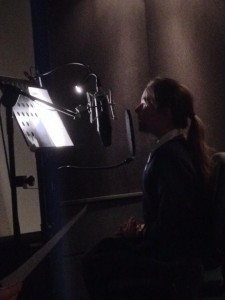

While I was in Manchester, I shared an office with two guys, Sam and Scott, who ran an animation
studio called [Saladhouse](http://saladhouseanimation.com/). Me being me, I used to talk about
Raspberry Pi all the time – and my enthusiasm rubbed off on them both. Scott ordered a Pi kit from
Pimoroni and once used it to display some interesting visuals (Amy Mather's [pygame
implementation](https://gist.github.com/bennuttall/6952575) of [Conway's Game of
Life](http://en.wikipedia.org/wiki/Conway's_Game_of_Life)) as the backdrop of a stage at a gig he
was involved with putting on, and Sam said it would be nice to make an animation explaining what
Raspberry Pi is.

We bounced some ideas around, and discussed what it would be like. We seemed to think alike and have
similar ideas on how it would be – and liked each other's input. I wrote the script, and Sam
storyboarded it. At around this stage, I had just been invited to visit the Raspberry Pi Foundation
– so I put Sam in touch with Liz Upton and she liked the script and the initial storyboard and they
discussed our ideas. We'd intended to do this as a hobby project, but Liz was very keen to make this
happen so it was commissioned by the Foundation, and we went in to production. Sam and Scott came
along to [Manchester Raspberry Jam](http://mcrraspjam.org.uk) in November, which Liz and
Eben also attended, and I introduced them. Liz apologised for taking me away from them, and Scott
replied "Oh, it's ok". I suggested we asked Amy Mather to do the voiceover, Sam liked the idea too
(and Liz loved it), so I introduced Amy to Sam and they arranged the sound recording session. Amy
gave some suggestions which influenced the final piece – such as changing the '80s bedroom poster
from *Back to the Future* to *Hack to the Future*.

I then moved to Cambridge to work at the Foundation and was regularly updated with how it was coming
along, and got to see pictures like this:

<figure class="wp-block-image">

</figure>

The guys worked hard on the animation through December and January and we released it this week!

<figure class="wp-block-image">
<iframe width="560" height="315" src="https://www.youtube.com/embed/e0wkVVVLvR8?si=PSaD-ADc_YJ8K7h7" title="YouTube video player" frameborder="0" allow="accelerometer; autoplay; clipboard-write; encrypted-media; gyroscope; picture-in-picture; web-share" referrerpolicy="strict-origin-when-cross-origin" allowfullscreen></iframe>
</figure>

Huge thanks to [Sam](https://twitter.com/samalderhyde) and Scott at Saladhouse, to Marcus Alexander
for the sound design and to [Amy Mather](http://twitter.com/minigirlgeek) for doing the voiceover.
I'm really proud of how it turned out and we'll be using it to promote Raspberry Pi everywhere we
go!
