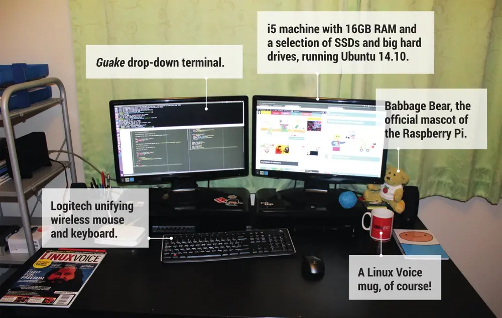
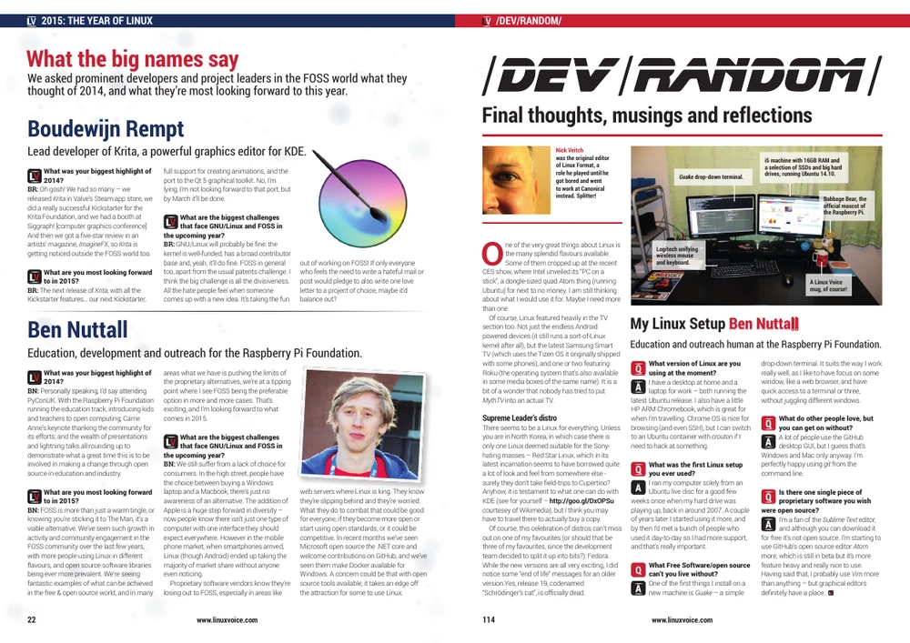

Linux Voice featured me twice in this month's [Issue #12](images/Linux-Voice-Issue-012_pp22-114.pdf).
They asked me for my thoughts on 2014 in open source and a look ahead to 2015, and in their
`/dev/random` section at the back of the magazine, they featured a photo of my humble desk at home
in my rented room in Cambridge, along with a short Q&A on my life with Linux.

<figure>

<figcaption>My desk circa 2015</figcaption>
</figure>

<figure>

<figcaption>What the big names say</figcaption>
</figure>