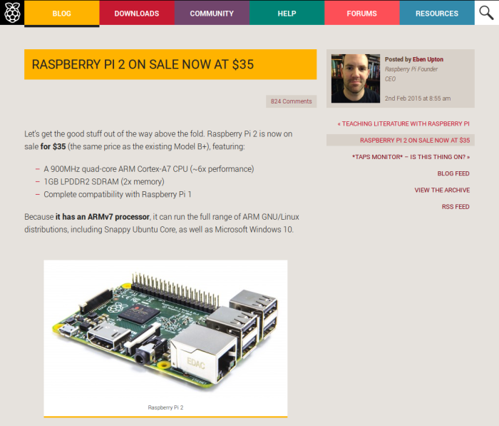

Last month the Raspberry Pi Foundation
[announced](http://www.raspberrypi.org/raspberry-pi-2-on-sale/) the second generation of its
affordable single board computer: the **Raspberry Pi 2 Model B**.

I've been working at Raspberry Pi for over a year now and this is the fourth product launch I've
been involved with: first there was the [compute
module](http://www.raspberrypi.org/raspberry-pi-compute-module-new-product/) for industrial
customers (announced in April, on sale in June); then the [Model
B+](http://www.raspberrypi.org/introducing-raspberry-pi-model-b-plus/), a redesign of the original
Raspberry Pi with a neater form factor and some welcome enhancements;  and finally the [Model
A+](http://www.raspberrypi.org/raspberry-pi-model-a-plus-on-sale/), the lower spec edition of the
'plus' range.

The Raspberry Pi 2 is a huge improvement on the original – it has four times the number of cores and
four times the RAM of the original (though this was soon doubled, so it's twice the RAM of the most
recent model). It's a single board computer that packs:

- Quad core 900MHz ARM7 CPU
- VideoCoreIV 3D GPU
- 1GB RAM
- Micro SD card slot
- Full HDMI
- 4x USB ports
- Ethernet port
- Camera interface (CSI)
- Display interface (DSI)
- Combined composite video and audio jack

and it's available for the same price as the previous models, just \$35 or about £25. As it's now
ARMv7 this now opens up the opportunity for it to run a number of additional operating systems –
it'll run Ubuntu (a [Snappy
Core](https://insights.ubuntu.com/2015/02/02/snappy-ubuntu-core-on-raspberry-pi-2/) image has been
provided by Canonical, and it's feasible for a lightweight version of the desktop to run too), and
there are even plans for it to run a Windows 10 IoT (Internet of Things) platform later in the year
due to some work from Microsoft – who are providing it for free.

It seems amazing to me now that when I look back to 29th February 2012, when I got up at 6am to try
to order a Raspberry Pi on its launch day, hitting F5 on the websites of distributors element14 and
RS Components trying to get a page I could place an order, that in 2015 I was the one responsible
for the Raspberry Pi website for the launch of Raspberry Pi 2!

<figure class="wp-block-image">

</figure>

Prior to the launch I had a conversation with Pete from our web hosts [Mythic
Beasts](http://www.mythic-beasts.com/), and I suggested we put the contents of the announcement blog
post on the server's failover page (rather than "Down for maintenance"). It turns out that was a
brilliant idea as it's what we ended up serving for most of the day! Unfortunately as I'd stripped
the page down to a bare minimum static page with no dependencies on JS libraries, stylesheets or
images, I'd also removed the Google Analytics tracking code, which meant we lost track of millions
of hits (I was excited to share we'd had 1.3 million hits compared to the 0.3 million the previous
day, but Pete said we'd had 11 million). Not that the numbers are crucial but it would have been
nice to have the spike in the history.

See [this blog post](http://www.raspberrypi.org/launch-day-what-happened-to-the-website/) from Pete
on coping with the launch, lessons learned and what he intends to do to our server to cope with
future launches.
