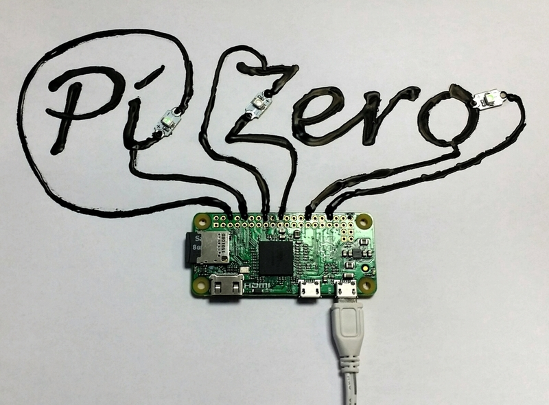

Starting today, shops and newsagents are stocking a computer magazine called
<a href="https://www.raspberrypi.org/magpi/">The MagPi</a>, and as a world's first,
this magazine comes with a free computer—literally stuck to the front cover. It's the newest
Raspberry Pi release, called Pi Zero. This computer also goes on sale around the world for just $5.

Pi Zero is a tiny device and contains the first generation Raspberry Pi's BCM2835 chip, safely
overclocked to 1GHz. Pi Zero packs the same great GPU as the regular Raspberry Pi, and comes with
512MB RAM. It runs Linux, and runs all the programs and applications any other Pi will—including
Python, Sonic Pi, Java, a web browser, and much more. You can run a media center, teach programming
with it, learn to make music, or embed it in a project—and it fits on your keyring!

## How to get hold of one

**In the UK:** The MagPi can be found in
<a href="https://www.whsmith.co.uk/">WHSmith</a>,
<a href="https://www.sainsburys.co.uk/">Sainsbury's</a>, and
<a href="https://www.tesco.com/">Tesco</a>—it costs £5.99 and comes with the Pi Zero
for free.

**In the US:** The December issue of The MagPi will be out soon in
<a href="https://www.barnesandnoble.com/">Barnes &amp; Noble</a>.

**Everyone:** You can buy the magazine online from the Raspberry Pi
<a href="https://swag.raspberrypi.org/collections/magpi">swag store</a> or
<a href="https://www.raspberrypi.org/magpi/subscribe/">order a subscription</a>.
Alternatively, the Pi Zero itself is available to buy from the usual
distributors—<a href="https://www.element14.com/community/welcome">element14</a> and
<a href="https://uk.rs-online.com/web/">RS Components</a>—as well as the swag store
and others.

## Getting started

First look at Pi Zero:

What will you need? If you want to use it like a full computer, you'll need a Micro SD card and some
cables:

- Micro SD card loaded with NOOBS or Raspbian
- Mini HDMI to HDMI adapter or cable
- Micro USB adapter or hub
- Micro USB power cable
- USB mouse & keyboard
- HDMI monitor

## Alternative use

Alternatively, you can prepare your Micro SD card using a regular Raspberry Pi, set your code to run
on boot, stick your card into the Zero, and as soon as it has power, your program will run. A great
way to deploy code to an embedded project.

You can also connect to the Zero via SSH or VNC over wired or wireless connection and control it
from another computer.

## GPIO?

One of the most interesting things about Raspberry Pi is the GPIO pins that allow you to connect up
real world components and program them for your hobby project or IoT smart home. The Zero doesn't
have GPIO pins, as such, but it does expose pin holes—the same 40 pins you'll find on a Raspberry Pi
2. You can solder a 40-pin header to the Zero and use the pins the usual way, including individual
pin access with jumper wires, or even using add-on boards and HATs (like the Sense HAT).

Alternatively, you can use the pin holes as they are—by using conductive thread, conductive paint,
soldering directly to the pins, making connections with paper clips, and whatever else you can make
work.

## Pi Zero projects

Of course, most projects that have been done with a Raspberry Pi can be done with a Zero (some
requiring the GPIO pin header), but what other projects can be done with the Zero that make use of
its compact and discreet form factor?

### Wearables: Zero tech glove

Sew a Pi Zero into a glove (preferably a glove with mitten flaps you can use to cover the Pi), then
with conductive thread, sew some wearable LEDs into the back of the palm, and sew in a tilt switch.
Be sure to wire up your LEDs and switch carefully and correctly. Write some code (try
<a href="https://www.raspberrypi.org/blog/gpio-zero-a-friendly-python-api-for-physical-computing/">GPIO Zero</a>)
to make the LEDs flash when the tilt switch is activated, then add a battery pack and prepare to shine!

### Paintables: Zero conductive paint circuits

Get some conductive paint, and draw a circuit on paper connecting the GPIO pin holes to components,
such as LEDs made for wearable projects, and write code to have them flash. Not as messy as it
sounds—and easy to try out different ideas on different bits of paper. Try writing out words or
patterns or make your own circuit puzzles for people to play.

### Drive-ables: Zero robot

Get hold of a standard motor controller board, such as the
<a href="https://ryanteck.uk/add-ons/6-ryanteck-rpi-motor-controller-board-0635648607160.html">RTK MCB</a>,
and motors and wheels, or use the new <a href="https://camjam.me/?page_id=1035">CamJam EduKit 3</a>, then solder a 40-pin
GPIO header to the Pi Zero and attach your board and a battery pack. Write some code to control the
motors, build a chassis, maybe add some sensors, and you have yourself a very cheap but equally
nifty robot.

## Weightlessness

Ok, so the Pi Zero is not weightless, but 9g is one heck of a light computer. Dave Akerman, who
makes a habit of sending the smallest and lightest of Raspberry Pis up into the sky attached to
helium balloons with a camera module taking pictures or video the whole journey, is sure to want to
make use of the Zero in his next high-altitude balloon flight. Although the Zero doesn't have a CSI
camera port, you can always use a USB webcam instead of the official camera module.

## Zero add-on boards?

Add-on boards for the Pi Zero? It's too soon to say, as this is a brand new development, but the
Raspberry Pi community and ecosystem is a rapid and agile one. Although existing add-on boards and
HATs will work with the Zero (with a pin header soldered on), we're sure to see some expansion (or
reduction, if you like) in the range of accessories available—perhaps a Zero-sized HAT-like standard
will arise and we'll see a host of new and exciting miniature add-on boards, such as motor
controllers and LED boards, perfectly sitting aboard the Zero with the mounting holes in the
corners. Let's wait and see what happens!

