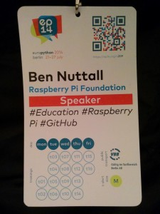
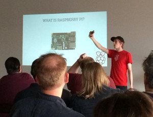
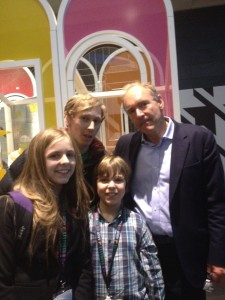
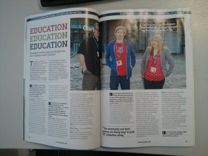
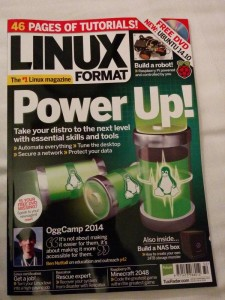
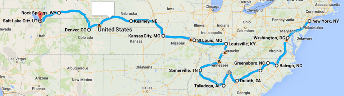
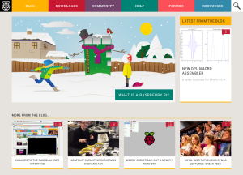
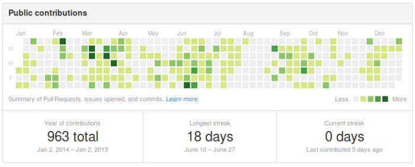

Last December I started my job at the Raspberry Pi Foundation and this time last year, having just
completed my first month, I wrote my [review of 2013](https://bennuttall.com/2013-in-review/) and
all the events which led up to that move. Here is a round-up of all that's happened since then.

## Talks & Conferences

This year I gave my first full conference talk, my first overseas conference
talk, my first keynote, and many more talks throughout the year! I gave over 40 talks and workshops
in 2014, up from 32 in 2013.

<figure class="wp-block-image">

<figcaption>My favourite conference badge of the year</figcaption>
</figure>

The highlights:

- I attended the [BETT](http://www.bettshow.com/) education conference representing Raspberry Pi
- I took my first overseas work trip to Brussels for [FOSDEM](https://fosdem.org/2015/) (Free and
  Open source Software Developers' European Meeting)
- I gave a keynote with Carrie Anne Philbin at Raspberry Jamboree 2014
- I ran a Raspberry Pi camera workshop at
  [Cheltenham Science Festival](http://www.cheltenhamfestivals.com/science)
- I spoke at 5 Python conferences:
    - [EuroPython](https://ep2014.europython.eu/) in Berlin
    - [EuroSciPy](https://www.euroscipy.org/) in Cambridge (keynote)
    - [PyCon UK](http://www.pyconuk.org/) in Coventry
    - [PySS](http://www.pyss.org/) in San Sebastian, Spain (keynote)
    - [PyCon Ireland](http://python.ie/pycon/2014)
- I spoke for the [IMA](http://www.ima.org.uk/activities/branches/north_west.cfm.html) (Institute of
Mathematics and its Applications) at MMU in Manchester
- I gave 17 talks in schools, universities and community spaces on my USA tour (more below)

See my full list of talks with links to videos and slides on my
[talks page](/talks/).

<figure class="wp-block-image">

<figcaption>Speaking at a hackspace in America</figcaption>
</figure>

I also got to meet creator of the world wide web Tim Berners-Lee at the Open Data Institute Summit
where I was supporting Amy Mather who was speaking at the event.

<figure class="wp-block-image">

<figcaption>Meeting Tim Berners-Lee with Amy and Dan Mather</figcaption>
</figure>

## Interviews

I gave a few interviews for magazines and websites:

- An interview I gave with my colleagues Clive Beale and Carrie Anne was [featured in Linux Voice
magazine](http://www.linuxvoice.com/education-education-education/)
- I appeared on the front cover of [Linux Format magazine](http://www.linuxformat.com/), which featured an interview they
conducted with me at [Oggcamp](http://oggcamp.org/)
- I was also interviewed by Russell Barnes for the [raspi.today podcast](http://www.raspi.today/podcast-episode-26/)
about my work on the Raspberry Pi Education Team

<figure class="wp-block-image">

<figcaption>Linux Voice</figcaption>
</figure>

<figure class="wp-block-image">

<figcaption>Me on the front of Linux Format magazine</figcaption>
</figure>

## USA Tour

I was asked to go on a tour of America to do some outreach work for Raspberry Pi – and
I said I'd be travelling from New York to Salt Lake City. I planned a route based around requests
for visits and ended up covering 4200 miles in a hire car, giving 17 talks in schools, universities
and hackspaces. I had a brilliant experience, met some great people and spread the word about what
the Foundation is doing.

<figure class="wp-block-image">

</figure>

The places I visited:

- New York City, New York
- Washington, DC
- Raleigh, North Carolina
- Greensboro, North Carolina
- Charlotte, North Carolina
- Pigeon River, Tennessee
- Lawrenceville, Georgia
- Atlanta, Georgia
- Chattanooga, Tennessee
- Talladega, Alabama
- Somerville, Tennessee
- Louisville, Kentucky
- St. Louis, Missouri
- Colombia, Missouri
- Denver, Colorado
- Boulder, Colorado
- Provo, Utah
- Logan, Utah
- Salt Lake City, Utah

You can read a full account of my trip on the Raspberry Pi blog: [Ben's Mega USA
Tour](http://www.raspberrypi.org/bens-mega-usa-tour/)

## Raspberry Pi Website

In the first few months of the year I worked hard on building a new website for the [Raspberry Pi
Foundation](http://www.raspberrypi.org/), extending the existing blog in to a full website with
various sections and numerous components. This was launched in April and received praise from the
community. It has evolved somewhat since its initial release and took on some new design tweaks
recently with complementary illustrative graphics from
[Sam Alder](https://twitter.com/samalderhyde).

The website now features:

- [Informative homepage](http://www.raspberrypi.org/)
- [Blog](http://www.raspberrypi.org/blog/)
- [Downloads](http://www.raspberrypi.org/downloads/)
- [Documentation](http://www.raspberrypi.org/documentation/) (source on
- [GitHub](https://github.com/raspberrypi/documentation))
- [Community pages](http://www.raspberrypi.org/community/)
- [Help pages](http://www.raspberrypi.org/help/)
- [Free learning resources](http://www.raspberrypi.org/resources/) (source on
- [GitHub](https://github.com/raspberrypilearning))
- [Raspberry Jam events directory](http://www.raspberrypi.org/jam/)
- [Products pages](http://www.raspberrypi.org/products/)
- and more!

<figure class="wp-block-image">

<figcaption>raspberrypi.org in early January 2015</figcaption>
</figure>

## Pi Weekly

I've continued to run [Pi Weekly](http://piweekly.net), putting out a newsletter
each week with help from Ryan Walmsley, who recently stepped down to concentrate on his university
studies. Now at its 81st issue, not having missed a single week since launching in June 2013, it's
going strong with a subscription base of over 11,000, up almost double in a year.

## Raspberry Pi Learning Resources

I wrote a number of learning resources as part of my role at Raspberry Pi. Some
notable ones being:

- [GPIO Push Button](http://www.raspberrypi.org/learning/gpio-music-box/)
- [Push Button Stop Motion](http://www.raspberrypi.org/learning/push-button-stop-motion/)
- [Tweeting Babbage](http://www.raspberrypi.org/learning/tweeting-babbage/)
- [Getting Started with Minecraft Pi](http://www.raspberrypi.org/learning/getting-started-with-minecraft-pi/)

I've been working on other projects such as the upcoming Chef HAT (sous vide cooking with Raspberry Pi and
Energenie) with Rachel Rayns, which will lead to a set of new resources and maybe even a bank of
open source cooking recipes! I've also been running workshops and giving presentations at Picademy –
the free teacher training course we started running this year, introducing teachers to using the
Raspberry Pi in the classroom and giving them the confidence to successfully deliver the new
computing curriculum.

## Open Source Projects

As well as numerous contributions to existing open source projects, I've released my first two
Python modules which can be found on PyPI and installed with pip:

- [energenie](https://pypi.python.org/pypi/energenie) - for controlling power sockets remotely with
  a Raspberry Pi (this included modularising and packaging the work of Amy Mather from her work
  experience at Pi Towers)

- [pyjokes](https://pypi.python.org/pypi/pyjokes) – one line jokes for programmers I'm currently
  working on packaging energenie for Debian, and have some other packaging work to do once I've got
  the hang of it. I've also made a name for myself in my advocacy of GitHub – teaching people how to
  use it or get more from it, and introducing teachers to using it in it education. And here's what
  my year of public GitHub contributions looks like:

<figure class="wp-block-image">

</figure>

## 2015

I'll be doing more of the same in my role at Raspberry Pi, hopefully producing some more
projects and writing more resources. I've just bought myself a nice new camera so I'll be learning
how to use it and posting photos to Flickr at
[flickr.com/photos/ben_nuttall](http://flickr.com/photos/ben_nuttall)
