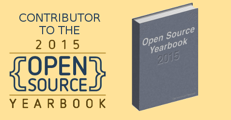

I contributed to the 2015 Open Source Yearbook, created by opensource.com, which you can download as
a PDF or view the individual articles online. It comprises:

1.  [6 creative ways to use
    ownCloud](https://opensource.com/life/15/12/6-creative-ways-use-owncloud) – by Jos Poortvliet,
    ownCloud community manager
2.  [10 tools for visual effects in Linux with
    Kdenlive](https://opensource.com/life/15/12/10-kdenlive-tools) – by Seth Kenlon, independent
    multimedia artist, free culture advocate, and UNIX geek
3.  [6 useful LibreOffice
    extensions](https://opensource.com/business/15/12/6-useful-libreoffice-extensions) – by Italo
    Vignoli, founding member of The Document Foundation
4.  [Top 5 open source community metrics to
    track](https://opensource.com/business/15/12/top-5-open-source-community-metrics-track) – by
    Jesus M. Gonzalez-Barahona, co-founder of Bitergia
5.  **[5 great Raspberry Pi projects for the
    classroom](https://opensource.com/education/15/12/5-great-raspberry-pi-projects-classroom) – by
    Ben Nuttall, education developer advocate for the Raspberry Pi Foundation**
6.  [8 books to make you a more open
    leader](https://opensource.com/open-organization/15/12/8-books-make-you-better-leader) – by
    Bryan Behrenshausen, for The Open Organization
7.  [5 handy Drupal modules](https://opensource.com/business/15/12/5-handy-drupal-modules) – by
    Michael E. Meyers, the VP of Developer Relations at Acquia
8.  [Best Couple of 2015: tar and
    ssh](https://opensource.com/business/15/12/best-couple-2015-tar-and-ssh) – by David Both, Linux
    expert and enthusiast
9.  [3 open hardware projects for
    beginners](https://opensource.com/life/15/12/3-open-hardware-projects-to-build) – by Alicia
    Gibb, CEO of Lunchbox Electronics
10. [10 helpful tools for a sys admin's
    toolbox](https://opensource.com/business/15/12/10-sysadmin-tools) – by Ben Cotton, support
    engineer group leader at Cycle Computing
11. [Top 10 open source projects of
    2015](https://opensource.com/business/15/12/top-10-open-source-projects-2015) – by Jen Wike
    Huger, an editor for Opensource.com
12. [5 favorite 3D printing projects of
    2015](https://opensource.com/life/15/12/5-favorite-3d-printing-projects-2015) – by Harris Kenny,
    VP of Marketing at Aleph Objects
13. [Top 5 open source frameworks every application developer should
    know](https://opensource.com/business/15/12/top-5-frameworks) – by John Esposito,
    Editor-in-Chief at DZone
14. [Publisher's picks: 29 open source books for
    2015](https://opensource.com/business/15/12/favorite-open-source-books) – by Rikki Endsley,
    Community Manager at Opensource.com
15. [Diversity in open source highlights from
    2015](https://opensource.com/life/15/12/diversity-open-source-highlights-2015) – by Cindy
    Pallares-Quezada, an Outreachy alumni
16. [Adafruit's best open source wearables of
    2015](https://opensource.com/life/15/12/best-open-source-wearables-2015) – by Becky Stern,
    director of wearables at Adafruit
17. [2015 was a good year for creating the world's 'missing maps' with
    OpenStreetMap](https://opensource.com/life/15/12/creating-worlds-missing-maps-openstreetmap) –
    by Drishtie Patel, GIS Analyst and Missing Maps Project Coordinator at the American Red Cross
18. [5 favorite open source Django
    packages](https://opensource.com/business/15/12/5-favorite-open-source-django-packages) – by
    Jeff Triplett, Frank Wiles, and Jacob Kaplan-Moss, Django contributors
19. [Facebook's top 5 open source projects of
    2015](https://opensource.com/business/15/12/top-5-facebook-open-source-projects-2015) – by
    Christine Abernathy, Developer Advocate on the Open Source team at Facebook
20. [10 projects to fork in 2016](https://opensource.com/life/15/12/most-likely-succeed-2016) – by
    Jason Baker, Opensource.com
21. [10 cool tools from the Docker
    community](https://opensource.com/business/15/12/10-cool-tools-docker-community) – by Mano
    Marks, director of developer relations at Docker, Inc.
22. [5 best open source games of 2015](https://opensource.com/life/15/12/top-5-open-gaming) – by
    Robin Muilwijk, Internet and e-government advisor

<figure class="wp-block-image">

</figure>
