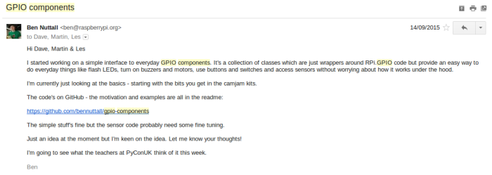
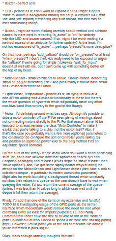
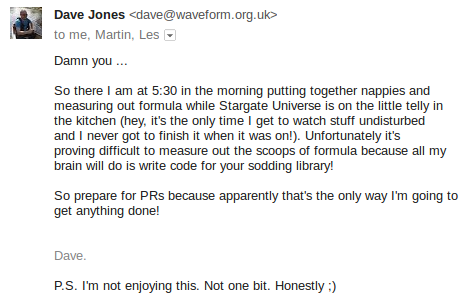
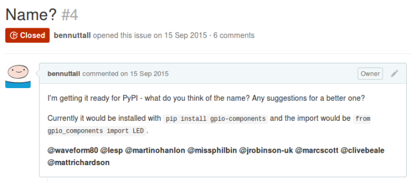
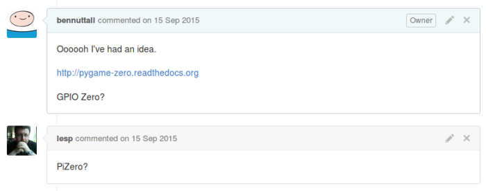
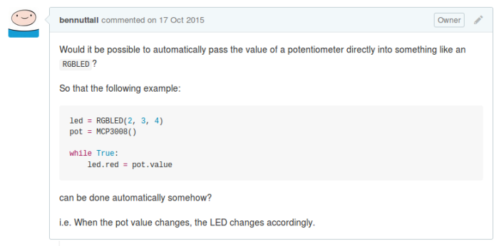
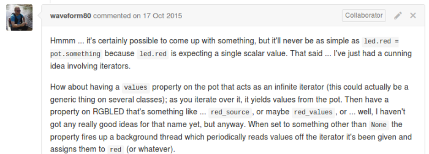

For about the last 3 years, the de-facto method of accessing physical components via the Raspberry
Pi's GPIO pins has been a Python library called *RPi.GPIO*, created by [Ben
Croston](https://twitter.com/crostonben), who originally built it to control his beer brewing
process. Despite its humble beginnings in a personal hobby project, it's ended up being used in
projects of all shapes and sizes by users around the world, and it has a big presence in education.
In the Foundation, we've used it in many of our [learning
resources](https://www.raspberrypi.org/resources/), and we use it at
[Picademy](https://www.raspberrypi.org/picademy/), our teacher training course.

Physical computing is one of the most engaging activities for teaching computing, and has plenty of
scope in computational thinking, programming skills and logic as well as projects being more
relevant to young people (think build a robot vs. sorting arbitrary lists).

## Hello world

RPi.GPIO permits configuring pins as inputs or outputs, and then controlling output pins as high or
low, and reading the state of input pins. Observe the following code, which could be considered the
"hello world" of physical computing (flashing an LED):

```python
import RPi.GPIO as GPIO
from time import sleep

GPIO.setmode(GPIO.BCM)
GPIO.setwarnings(False)

led = 17
GPIO.setup(led, GPIO.OUT)

while True:
    GPIO.output(led, GPIO.HIGH)
    sleep(1)
    GPIO.output(led, GPIO.LOW)
    sleep(1)
```

This "hello world" example is 11 lines long, and contains a number of oddities:

- Import renaming (`from RPi import GPIO` also works)
- Set pin numbering to [BCM mode](http://pinout.xyz/) (actual GPIO pin numbers vs. location on the
  board) – this is necessary, no default mode
- Set warnings off (the library prints warnings if you run a program twice because you already used
  that pin)
- Constants `GPIO.OUT`, `GPIO.HIGH`, `GPIO.LOW` (`True` and `False` also work for high and low)
- Passing reference to pin number integer around

These are the sorts of things a teacher would probably skip over explaining, the way they would if
they were teaching the "hello world" of Java. *It doesn't matter what*
`public static void main(String[] args)` *means, you just have to write it.*

While this is not an intuitive or Pythonic interface, it does allow many components to be used.
Some, like LEDs, can be as simple as this. Others, like sensors, require clever manipulation of pin
state reading to be useful. This makes a whole range of projects to be created, enabling users to
create their application in Python, instead of having to use a lower level language.

## The current state of affairs

RPi.GPIO is the de-facto standard, and its common use soon led to inclusion in the standard
[Raspbian image](https://www.raspberrypi.org/downloads/raspbian/) provided by the Foundation. It's a
Python module implemented in C (the project lives on
[sourceforge](http://sourceforge.net/projects/raspberry-gpio-python/)) and its features include:

- Configure pins as input or output
- Read inputs (high/low)
- Set outputs (high/low)
- Wait for edge (wait for input to go high/low)
- Pin event detection (callback on pin input state change)
- Software PWM (pulse-width modulation)

There's a broad use of RPi.GPIO. It's used in the [Raspberry Pi Learning
Resources](https://www.raspberrypi.org/resources/), there are [23k code search results on
github.com](https://github.com/search?l=python&q=import+rpi+gpio&ref=searchresults&type=Code&utf8=%E2%9C%93).

### Sudo

In Raspbian Wheezy (Raspberry Pi optimised distro based on Debian Wheezy), root access was needed to
access the GPIO pins. Users had to run Python files with sudo because the underlying code runs
`mmap()` on `/dev/mem` . This meant that opening IDLE from the main menu did not allow GPIO code to
be run, and IDLE had to be opened from the Terminal with `sudo idle &`. Since the release of
[Raspbian Jessie](https://www.raspberrypi.org/blog/raspbian-jessie-is-here/), the Pi user was given
access to the GPIO pins via [`/dev/gpiomem`](https://github.com/raspberrypi/linux/pull/1112), which
makes a huge difference to the user experience, particularly for use in education or with beginners.

## Motivation

I've been thinking for a while that there must be a way to make programming for physical computing
more accessible. I gave a talk at the [Cambridge Raspberry Jam](http://camjam.me/) in September,
[*Build a Python API for Raspberry Pi
Hardware*](https://speakerdeck.com/bennuttall/building-a-python-api-for-raspberry-pi-hardware),
which included some basic code examples (wrapper classes around common RPi.GPIO code for LED, etc.)
but mostly focused on packaging and distribution. The idea was to show add-on board manufacturers
how to provide a Python module to go alongside their products, enabling users to make the most of
it. This is something [Pimoroni](https://shop.pimoroni.com/) do very well.

After presenting the talk, I wondered if my example LED class, and similar abstraction classes would
be useful to others. I thought of showing teachers how they can create such classes to make things
easier for their students. Teachers do often say they don't use Python because it's too hard – but
really it's not Python that's hard, it's the modules they're using making it more complicated than
it needs to be, or the poorly written code they're sourcing from the web.

The main problem with RPi.GPIO is that there's too much boilerplate code needed to get started. The
"hello world" LED program shouldn't be 11 lines, and it shouldn't contain anything too complex to
explain to children. When you get to input devices, even simple ones like a push button, you're
forced to explain pull-up and pull-down circuits, a concept coupled with detecting falling and
rising edges. I'm not saying it's not an important concept, and that it should be taught at some
point, but it shouldn't be a barrier to entry. It just causes friction to anyone getting started.
I'm talking about young people, perhaps Primary School or early Secondary, who have been programming
with Scratch. **The jump to Python shouldn't be out of reach or they'll never leave the comfort of
drag-and-drop block programming.**

## Inspiration

Pimoroni have some great products to accompany the Raspberry Pi (check out their range of
[HATs](https://shop.pimoroni.com/collections/hats)) and they do a great service to their customers
by providing Python modules for each of them (created by their software developer, [Phil
Howard](https://twitter.com/gadgetoid)). I've used many of their products, and the libraries and
examples provided enable you to dive straight in, start prototyping and coding up an idea. There are
other great modules available, such as [picamera](http://picamera.readthedocs.org/), the Python
library for the official camera module, created by [Dave Jones](https://twitter.com/waveform80),
allowing users to easily add photo and video functionality to their Python applications.

There's also [PyGame Zero](http://pygame-zero.readthedocs.org), a zero boilerplate wrapper for
PyGame created by [Daniel Pope](https://twitter.com/lordmauve). If you haven't seen it already, it's
well worth a try. Create an empty file, run it with `pgzrun myfile.py` and you have a game window.
Add one line to change the background colour, add another couple to set the window height and width,
add another and you have a playable character. It's brilliantly simple to make a simple game and
there's no limit on where you can take it. The motivation for this was that some teachers at [PyCon
UK](http://www.pyconuk.org/) 2014 said PyGame was too hard to teach with. I felt this needed doing
for physical computing. It needed to be intended for teachers, children and beginners, but also be
useful for hobbyists who knew their way around Python.

## What do you think?

I threw my LED class example into a GitHub repo called gpio-abstraction (soon renamed
gpio-components) and added some basic code. I demonstrated it to a few of my Foundation colleagues
and it went down well. I showed [Eben](https://twitter.com/ebenupton) and he said "I'll have one of
those. Can you get it ready for the next Raspbian release?". I said I wanted to test it out more and
get feedback from some teachers, but probably have it ready for the release after. I then emailed
some friends asking for their opinion:

<figure class="wp-block-image">

</figure>

I got a positive response from them all, and decided to press on. Dave (author of picamera) said he
had a few minor observations:

<figure class="wp-block-image">

</figure>

And he continued...

<figure class="wp-block-image">

</figure>

Then the next day...

<figure class="wp-block-image">

</figure>

As well as using GitHub issues for sourcing ideas feedback, I decided to also create a Google Doc to
lower the barrier to entry for any teachers who wanted to contribute.

## Name?

I posted an issue on GitHub asking for [suggestions for a
name](https://github.com/RPi-Distro/python-gpiozero/issues/4):

<figure class="wp-block-image">

</figure>

I then had the idea to borrow the *Zero* from PyGame Zero, seeing as I was sharing the philosophy of
removing boilerplate to make it easier for use in education:

<figure class="wp-block-image">

</figure>

[Les](https://twitter.com/biglesp) replied, suggesting "PiZero?". Note the timing. This was before
Raspberry Pi Zero was released, but obviously I was aware it was coming. In fact, it's part of the
reason I liked the idea of adding another *Zero* into the mix. I couldn't really explain why calling
the library *Pi Zero* wasn't a good idea, but as Dave agreed *GPIO Zero* was a good name, I
proceeded, renamed the repo and published an initial pre-release to
[PyPI](https://pypi.python.org/pypi/gpiozero).

## The new hello world

Here's my "hello world" program with GPIO Zero:

```python
from gpiozero import LED
from time import sleep

led = LED(17)

while True:
    led.on()
    sleep(1)
    led.off()
    sleep(1)
```

or even:

```python
from gpiozero import LED

led = LED(17)

led.blink()
```

More examples:

```python
led = LED(17)

led.on()  # all on
led.off()  # all off
led.toggle()  # swap state of led
led.blink()  # on for 1 second, off for 1 second, continuously in the background
led.blink(on_time=2, off_time=2)  # change on/off time to 2 seconds
led.blink(n=10)  # stop blinking after 10 iterations
led.blink(n=10, background=False)  # 10 iterations, in the foreground so wait to complete before proceeding
```

## PyCon UK

My Foundation colleagues and I attended PyCon UK, where we ran some workshops and sessions on the
Education track, and I demonstrated it to some teachers who said it was exactly what they needed. I
struggled to get any feedback other than "it's great" – no constructive criticism, just general
positivity. I also gave a [physical computing
talk](https://speakerdeck.com/bennuttall/physical-computing-with-python-and-raspberry-pi-pyconuk-2015)
on the main track, and mentioned by work-in-progress project GPIO Zero at the end. RPi.GPIO's author
Ben Croston happened to be sitting in the talk so I went over to ask what he thought at the end. He
said he liked it and that he'd never intended RPi.GPIO to be an end-user library and expected
someone else to provide a better API.

## CamJam Kit 1

I started adding interfaces to all the components I could lay my hands on. I started with the
[CamJam EduKits](http://camjam.me/edukit) as they contain simple everyday components. Kit 1
comprises a set of LEDs, a button and a buzzer. There are worksheets that come with the kit start
with flashing the LEDs and programming a traffic lights sequence. There's scope to add the button
and buzzer for different road crossings, then go on to reaction games and morse code.

### Button

Input devices in RPi.GPIO are rather obtuse. As well as configuring a pin as an input with GPIO.IN,
you usually also provide a pull state: pull-up or pull-down. Pull-up means the circuit is wired to a
GPIO pin and a ground pin, whereas pull-down means the circuit is wired to a 3V3 pin and a GPIO pin.
So when a pulled-up button is not pressed, the GPIO pin state is high, and low when it is pressed.
This is reversed for a button in a pull-down circuit.

To poll the input state of a pulled-up button using RPi.GPIO:

```python
GPIO.setup(4, GPIO.IN, GPIO.PUD_UP)

while True:
    if not GPIO.input(4):
        print("Pressed")
```

The same code for a pulled-down button:

```python
GPIO.setup(4, GPIO.IN, GPIO.PUD_UP)

while True:
    if GPIO.input(4):
        print("Pressed")
```

These two snippets of code do exactly the same thing for differently wired buttons, but require a
logic shift. Alternatively, you can use `if GPIO.input(4) == GPIO.LOW` and
`if GPIO.input(4) == GPIO.HIGH` but you still have the same issue. My instinct is to jump at the
chance to avoid the GPIO constants and use Python's Truth evaluator as it seems more natural.

However, in GPIO Zero, you create a `Button` object, which assumes the common pull-up circuit by
default. Then to check its state, you access the `is_active` property. The alias `is_pressed` is
provided for the `Button` class:

```python
button = Button(4)

while True:
    if button.is_pressed:
        print("Pressed")
```

To use the pull-down alternative, you just provide `pull_up=False` in the init parameters:

```python
button = Button(4, pull_up=False)

while True:
    if button.is_pressed:
        print("Pressed")
```

Note that the `button.is_pressed` code logic remains unchanged and is not coupled with the pull
state.

### Wait for edge

Another useful function in RPi.GPIO is `wait_for_edge`, which halts the program until a GPIO event
is activated. For example:

```python
GPIO.setup(4, GPIO.IN, GPIO.PUD_UP)

while True:
    GPIO.wait_for_edge(4, GPIO.FALLING)
    print("Pressed")
```

The edge needs to be the opposite direction of the pull state (normal state is high, and a falling
edge indicates the button was pressed). The opposite case:

```python
GPIO.setup(4, GPIO.IN, GPIO.PUD_DOWN)

while True:
    GPIO.wait_for_edge(4, GPIO.RISING)
    print("Pressed")
```

In GPIO Zero, the pull-up case:

```python
button = Button(4)

while True:
    button.wait_for_press()
    print("Pressed")
```

And the pull-down case:

```python
button = Button(4, pull_up=False)

while True:
    button.wait_for_press()
    print("Pressed")
```

Again, there's no need for the configuration and edge type to be coupled, so it's abstracted away.

### Callbacks

Another very useful feature of RPi.GPIO is event detection with callbacks:

```python
GPIO.setup(4, GPIO.IN, GPIO.PUD_UP)

def pressed(pin):
    print("Pressed")

GPIO.add_event_detection(4, GPIO.FALLING, pressed)
```

This means whenever the button is pressed, the `pressed` function will be run.

The equivalent in GPIO Zero is passing in a function to the `when_activated` property (the `Button`
alias is `when_pressed`):

```python
button = Button(4)

def pressed():
    print("Pressed")

button.when_pressed = pressed
```

Note that in the RPi.GPIO example, the function was declared to take a `pin` argument which was
unused. The pin number is always passed in to the callback function. This can be used to determine
which pin caused the callback to run:

```python
GPIO.setup(4, GPIO.IN, GPIO.PUD_UP)

def pressed(pin):
    print("Pin %s pressed" % pin)

GPIO.add_event_detection(4, GPIO.FALLING, pressed)
```

In GPIO Zero, no argument is necessary, but if the function takes one, the device object will be
passed in, which can be inspected for its pin number:

```python
button = Button(4)

def pressed(button):
    print("Pin %s pressed" % button.pin)

button.when_pressed = pressed
```

As well as custom functions, you can also pass another object's method in as the callback:

```python
from gpiozero import LED, Button

led = LED(17)
button = Button(4)

button.when_pressed = led.on
button.when_released = led.off
```

This example uses both the `when_pressed` (`when_activated`) and `when_released`
(`when_deactivated`) properties to allow a LED to be lit when the button is pressed, and unlit when
released.

## PWM

Another obtuse but useful feature of RPi.GPIO is PWM (pulse-width modulation). Oddly, unlike with
regular in/out pins, this involves some object-oriented code:

```python
GPIO.setup(17, GPIO.OUT)

p = GPIO.PWM(17, 100)  # pin 17, frequency 100Hz

p.start(0)  # initial duty cycle
for i in range(101):
    p.ChangeDutyCycle(i)
    sleep(0.01)
```

This code would fade the brightness of an LED from 0 to 100%.

We decided to keep the `LED` class in its simple on/off form, and provide a separate `PWMLED` class
for configurable brightness. The `PWMLED` interface provides the standard `on()` and `off()` methods
but also provides a `value` property:

```python
led = PWMLED(17)

for i in range(101):
    led.value = i / 100
    sleep(0.01)
```

### Full colour LED

Another common component is the RGB LED: three regular LEDs inside one casing. With a binary
interface to each LED, you can only create seven different colours by combining the three primary
colours. However, with PWM to control the brightness of each, you can combine them in different
ways. It's not going to be particularly accurate but it does give you much more flexibility:

```python
led = RGBLED(red=2, green=2, blue=4)

led.red.on()  # full red
led.color = (1, 0, 1)  # purple
led.blue = 0.3  # dim the blue value to 0.3, now (1, 0, 0.3)
```

## Boards and collections

### Traffic Lights

```python
lights = TrafficLights(9, 10, 11)

lights.on()  # all on
lights.off()  # all off
lights.red.on()  # red on
lights.toggle()  # swap state of all lights
lights.blink()  # blink all lights together
```

### Traffic HAT

The Traffic HAT is a neat add-on board using the official [Raspberry Pi HAT
specification](https://www.raspberrypi.org/blog/introducing-raspberry-pi-hats/), and handily
provides three LEDs (in traffic light colours), a button and a buzzer. I created an interface to
this board, partly as a proof-of-concept, partly as a demo to other add-on board manufacturers to
show how it can be done (and why it's useful):

```python
th = TrafficHat()

th.on()  # all lights and buzzer on
th.off()  # all lights and buzzer off
th.lights.on()  # all lights on
th.lights.off()  # all lights off
th.lights.red.on()  # red light on
th.lights.toggle()  # swap state of all lights
th.lights.blink()  # blink all lights together
th.button.when_pressed = th.on
th.button.when_released = th.off
```

Note that this class does not need initialising with pin numbers as they're already known.

An optional feature of this class is enabling PWM on the LEDs:

```python
th = TrafficHat(pwm=True)

th.lights.red.value = 0.2
th.lights.amber.value = 0.4
th.lights.green.value = 0.8
```

## CamJam Kit 2 – Sensors

The second CamJam EduKit contains a Motion Sensor, Light Sensor and Temperature Sensor, broadening
the scope for hobby projects into things like security alarms, darkness triggered lights,
temperature indicator lights and such.

### PIR Motion Sensor

The PIR (passive infra-red) motion sensor is a commonly used component and many people find them
rather difficult to deal with in software. Because they're digital and only yield high or low, you'd
think you'd have to detect the value changing with one of the edge detection methods, but they're
very jittery so you end up writing functions to check the value ten times in a second and assuming
motion if more than half are high. For example, in RPi.GPIO:

```python
def check_motion():
    sleep(0.1)
    return GPIO.input(14)

while True:
    if sum(check_motion() for i in range(10)) > 5:
        print("Motion detected")
```

We implemented something similar to this, but the queue fills automatically in the background, so
you can check the motion state at any point, without having to wait. It's also configurable so you
can specify the queue length, the threshold and more (if you want to). We picked some sensible
defaults that seem to work reasonably well, and of course the API exposed makes it really
straightforward to use:

```python
pir = MotionSensor(4)
led = LED(17)

pir.wait_for_motion()  # alias for wait_for_active
pir.wait_for_no_motion()  # alias for wait_for_inactive
pir.when_motion = led.on  # alias for when_activated
pir.when_no_motion = led.off  # alias for when_deactivated
pir.motion_detected  # alias for is_active
```

### Light Sensor

Similarly, the `LightSensor` interface:

```python
sensor = LightSensor(5)
led = LED(17)

sensor.wait_for_light()  # alias for wait_for_active
sensor.wait_for_dark()  # alias for wait_for_inactive
sensor.when_dark = led.on  # alias for when_deactivated
sensor.when_light = led.off  # alias for when_activated
sensor.light_detected  # alias for is_active
```

### Temperature Sensor

There's already a Python library for the one-wire temperature sensor, and initially I imported it
and added a couple of aliases to make it more like the other interfaces. However, as the library
developed, it became less like the others, and we decided to leave it out for the major release. We
intend to bring it back in at some point in a way that will be purely compatible with other GPIO
Zero component interfaces.

## CamJam Kit 3 – Robot

By this time, CamJam kit 3 had been announced. I'd heard it was going to be a build-your-own-robot
kit.

### Motor

Around this time I had already been playing with some simple motors using a motor controller board
on the Pi. The way a motor works is you control two output pins: if one is high and the other low,
it drives in one direction; if swapped, it goes the other way. I wrapped these steps in the obvious
method names and we had a `Motor` class that worked pretty much as simply as the `LED` class:

```python
motor = Motor(forward=17, backward=18)

motor.forward()  # drive the motor forward
motor.backward()  # drive the motor backward
motor.reverse()  # reverse direction of the motor
motor.stop()  # stop the motor
```

### Robot

Stick two motors on a chassis and you have yourself a robot:

```python
robot = Robot(left=(17, 18), right=(22, 23))

robot.forward()  # drive the robot forward
robot.backward()  # drive the robot backward
robot.left()  # drive the robot left
robot.right()  # drive the robot right
robot.reverse()  # reverse direction of the robot
robot.stop()  # stop the robot
```

I also provided pre-configured robot interfaces for some common motor controller boards to save
users having to configure the pin combinations:

```python
rtk = RyanteckRobot()
cmkr = CamJamKitRobot()
```

## Analogue

The Raspberry Pi has no native analogue pins. However, by wiring up an ADC (analogue-to-digital
converter), you can connect up a number of analogue signal channels.

### MCP3008

A while ago I was introduced to the MCP3008 ADC for a project involving a bunch of linear and rotary
potentiometers. I found some useful code written by Martin O'Hanlon, who created a wrapper class
around some SpiDev code, providing easy access to data values. He kindly contributed it to GPIO Zero
and we normalised its values from 0-1023 to 0-1. I started playing with it. The simplest example is
a loop polling the value property while spinning a potentiometer around:

```python
pot = MCP3008()

while True:
    print(pot.value)
```

I then added an LED and used the potentiometer to dial up and down the brightness, since both are on
a scale from 0-1:

```python
led = PWMLED(2)
pot = MCP3008()

while True:
    led.value = pot.value
```

*Note there are 8 channels on the MCP3008, and the default channel is 0. Use `MCP3008(channel=n)` to
specify another channel. The Pi also allows multiple ADCs to be connected, so you can also provide a
non-zero device number with `MCP3008(device=d, channel=c)`.*

Then I wired up three potentiometers to an RGB LED to the same effect:

```python
led = RGBLED(2, 3, 4)
red_pot = MCP3008(channel=0)
green_pot = MCP3008(channel=1)
blue_pot = MCP3008(channel=2)

while True:
    led.red = red_pot.value
    led.green = green_pot.value
    led.blue = blue_pot.value
```

### #76 while True: led.red = pot.value

Then I thought that this must be a common use case – that you'd often want to connect the value of
one input device directly to an output device, and wondered if there could be a way to do this
*automatically*. As I thought this, it seemed stupid in my head. But it would be handy to not have
to loop it over constantly updating, hogging up the program so nothing else can happen, or making it
hard to update because you're trying to do something else. I wrote an [issue on
GitHub](https://github.com/RPi-Distro/python-gpiozero/issues/76) explaining the idea, and asking if
anything could be possible. I almost didn't submit the issue as I thought it was bound to be
impossible:

<figure class="wp-block-image">

</figure>

I was thrilled to see Dave's reply:

<figure class="wp-block-image">

</figure>

A few comments of discussion later and he had an implementation plan, which soon became a pull
request. My previous examples became:

```python
led = PWMLED(2)
pot = MCP3008()

led.source = pot.values
```

and:

```python
led = RGBLED(2, 3, 4)
red_pot = MCP3008(channel=0)
green_pot = MCP3008(channel=1)
blue_pot = MCP3008(channel=2)

led.red.source = red_pot.values
led.green.source = green_pot.values
led.blue.source = blue_pot.values
```

Dave implemented the `values` iterator property on every device, and the `source` property on every
output device. Another way of writing:

```python
button.when_pressed = led.on
button.when_released = led.off
```

could be:

```python
led.source = button.values
```

Probably not as intuitive in this case, but it demonstrates how input devices can feed their state
into other devices. The same applies to ensuring multiple output devices are synchronised is to set
the source of one as the values of another:

```python
red.source = button.values
blue.source = red.values
```

Or even, the value of one sensor being inverted by use of a custom generator:

```python
def invert(pot):
    while True:
        yield 1 - pot.value

led.source = invert(pot)
```

## GPIO Zero Timeline

- 12 Sept – CamJam talk sparked idea
- 14 Sept – Initial commit on GitHub
- 15 Sept Named GPIO Zero, first PR, first alpha released on PyPI
- 23 Sept – Mentioned in talk at PyCon UK
- 28 Sept – v0.6 public beta 1
- 9 Oct – v0.7 public beta 2
- 16 Oct – v0.8 public beta 3
- 25 Oct – v0.9 public beta 4
- 29 Oct – Featured in *The MagPi*
- 16 Nov – v1.0 released
- 21 Nov – Released in Raspbian Jessie

### v1.0

- ~200 commits
- 2 contributors (+4 minor contributions)
- 103 GitHub issues (53 issues, 50 PRs)
- 4 alpha releases
- 4 beta releases
- 68 days between initial commit and major release

### Future development

- Add more components
- Integrate more add-ons
- Add test suite
- Replace RPi.GPIO dependency
- Promote use of "gpiozero standard" to allow other modules to provide objects which plug-in to
  gpiozero objects easily (e.g. source/values)

### What have I learned?

- Issue-driven development works really well
- Dave Jones is awesome
- User-focused APi design is important
- Getting feedback from teachers is hard
- Getting code contributions is hard
- Getting documentation contributions is easier
- [Documentation by example](http://pythonhosted.org/gpiozero/recipes/) is more empowering than API
  documentation (though both are useful)

## Install GPIO Zero

GPIO Zero now comes pre-installed with Raspbian Jessie available from
[raspberrypi.org](https://www.raspberrypi.org/downloads/raspbian/)

On an older Jessie or Wheezy image, install with:

```
sudo apt-get update
sudo apt-get install python-gpiozero python3-gpiozero
```

## Links

- Documentation at [pythonhosted.org/gpiozero](http://pythonhosted.org/gpiozero/)
- [GPIO Zero on GitHub](https://github.com/RPi-Distro/python-gpiozero/)
- [@ben_nuttall](https://twitter.com/ben_nuttall/) and
  [@waveform80](https://twitter.com/waveform80/) on Twitter
- [\#gpiozero](https://twitter.com/search?q=%23gpiozero) on Twitter

## Thanks

A huge thanks to Dave for his voluntary contributions to GPIO Zero, making it something really
special. To Ben Croston for his excellent work on RPi.GPIO, and giving a foundation to GPIO Zero.
And thanks to everyone who tested out the beta releases and made projects with it so far.
