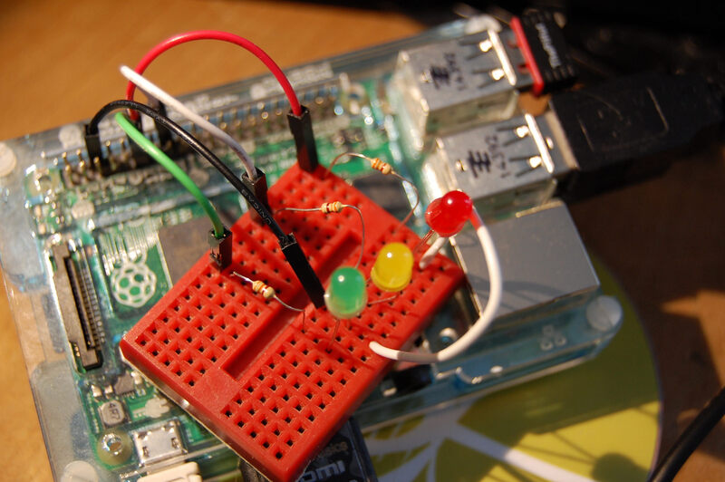
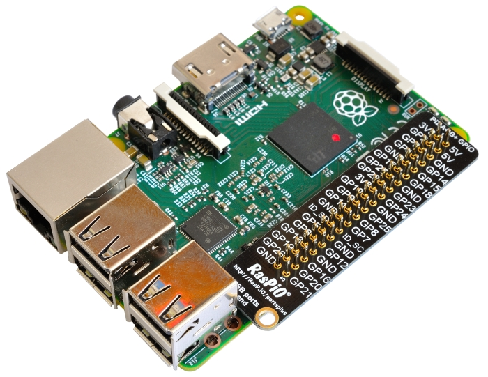
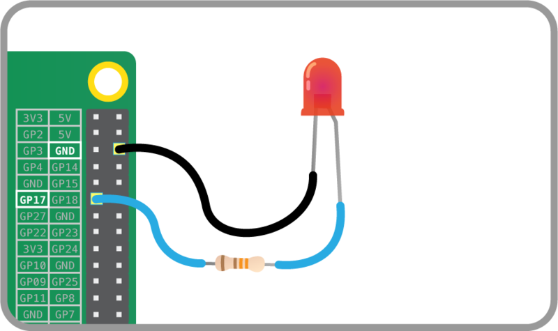
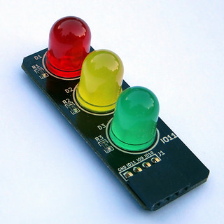
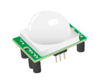
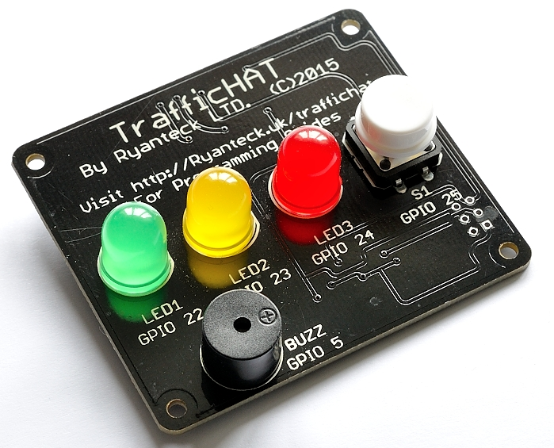
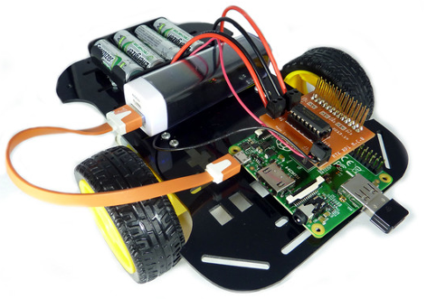

One of the most exciting starter activities to do with a Raspberry Pi is something you can't do on
your regular PC or laptop—make something happen in the real world, such as flash an LED or control a
motor. If you've done anything like this before, you probably did it with Python using the
<a href="https://pypi.python.org/pypi/RPi.GPIO">RPi.GPIO</a> library, which has been
used in countless projects. There's now an even simpler way to interact with physical components: a
new friendly Python API called <a href="https://gpiozero.readthedocs.org/">GPIO Zero</a>.



I recently wrote about [Raspberry Pi Zero](https://bennuttall.com/blog/2016/11/raspberry-pi-zero),
the $5 computer
and latest edition to the world of affordable hardware. Although the names are similar, the GPIO
Zero and Raspberry Pi Zero projects are unrelated and are not coupled. The GPIO Zero library is made
to work on all Raspberry Pi models, and is compatible with both Python 2 and Python 3.

The RPi.GPIO library is bare bones and provides all the essential functionality to do simple things
with the Pi's GPIO pins—set up pins as inputs or outputs, read inputs, set outputs high or low, and
so on. GPIO Zero is built on top of this and provides a collection of simple interfaces to everyday
components, so rather than setting pin 2 high to turn on an LED, you have an LED object and you turn
it on.



## Getting started

With GPIO Zero, you import the name of the interfaces you're using, for example:
`from gpiozero import LED` Also you must correctly wire up any components you're using and connect
them to the GPIO pins. Note that some pins are allocated to 3V3, 5V, and GND; a few are special
purpose and the rest are general purpose. Refer to
<a href="https://pinout.xyz/">pinout.xyz</a> for more information, or use a
<a href="https://rasp.io/portsplus/">port label</a>:



Blink an LED with the following code:

```python
from gpiozero import LED
from time import sleep

led = LED(17)

while True:
    led.on()
    sleep(1)
    led.off()
    sleep(1)
```

Alternatively, use the LED's `blink()` method, but make sure to keep the program alive with
`signal.pause()` like so:

```python
from gpiozero import LED
from signal import pause

led = LED(17)

led.blink()

pause()
```

## Output devices

As well as a basic LED interface, with the methods `on()`, `off()`, `toggle()`, and `blink()`, GPIO
Zero also provides classes for Buzzer and Motor, which work in a similar way:

```python
from gpiozero import Buzzer, Motor
from time import sleep

buzzer = Buzzer(14)
motor = Motor(forward=17, backward=18)

while True:
    motor.forward()
    sleep(10)
    motor.backward()
    buzzer.beep()
    sleep(10)
    buzzer.off()
```

There also are interfaces for PWMLED (control the brightness rather than just on/off), and for RGB
LED, which is an LED comprising red, green, and blue parts using the brightness of each to provide
full color control.

There's even an interface for TrafficLights. Provide the pin numbers the red, amber, and green
lights are connected to, then control with:



```python
lights = TrafficLights(2, 3, 4)

lights.on()
lights.off()
lights.blink()
lights.green.on()
lights.red.on()
```

and so on.

## Input devices

The simplest input device is a push button, and the interface provided makes it easy to control
programs with button presses:


```python
from gpiozero import Button

button = Button(14)

while True:
    if button.is_pressed:
        print("Pressed")
```

Another way to use button pressed to control programs is to use `wait_for_press`:

```python
button.wait_for_press()
print("pressed")
```

This halts the program until the button is pressed, then continues. Alternatively, rather than
polling the button state, you can connect actions to button presses:

```python
button.when_pressed = led.on
button.when_released = led.off
```

Here, the method `led.on` is passed in as the action to be run when the button is pressed, and
`led.off` as the button is released. This means when the button is pressed, the LED comes on, and
when it's released the LED goes off. In addition to using other GPIO Zero object methods, you can
use custom functions:

```python
def hello():
    print("Hello")

def bye():
    print("Bye")

button.when_pressed = hello
button.when_released = bye 
```

Now every time the button is pressed, the `hello` function is called and prints "Hello". When the
button is released it prints "Bye".

The use of custom functions in this way can be a good way to run a set of GPIO instructions, such as
a traffic lights sequence:

```python
def sequence():
    lights.green.off()
    lights.amber.on()
    sleep(1)
    lights.amber.off()
    lights.red.on()
    sleep(20)
    lights.amber.on()
    sleep(1)
    lights.green.on()
    lights.amber.off()
    lights.red.off()

lights.green.on()
button.when_pressed = sequence
```

Now when the button is pressed, the traffic lights will go from green to red, then wait 20 seconds
before turning back to red, in the usual way.

## Sensors

Swapping out a button for another input device, such as a basic sensor, can open up a world of
interesting projects. Instead of a button, use a motion sensor:



```python
from gpiozero import MotionSensor

sensor = MotionSensor(15)
```

Then use `sensor.if_motion`, `sensor.wait_for_motion`, and `sensor.when_motion`. There is a similar
interface provided for LightSensor.

## Analogue devices

The Raspberry Pi has no native analogue input pins, but you can easily connect up an ADC
(analogue-to-digital converter) and access analogue input devices (such as
<a href="https://en.wikipedia.org/wiki/Potentiometer">potentiometers</a>) and read
their value:

```
from gpiozero import MCP3008

pot = MCP3008()

while True:
    print(pot.value)
```

The potentiometer returns values from `0` to `1`, which means you can connect them up to output devices
easily:

```python
from gpiozero import PWMLED, MCP3008

led = PWMLED(4)
pot = MCP3008()

while True:
    led.value = pot.value
```

Now the LED's brightness is controlled directly by the potentiometer value.

Alternatively, a clever feature of GPIO Zero allows you to directly connect two devices together
without continuously updating inside a loop. Every output device has a `source` property, which can
read an infinite generator of values. All devices (input and output) have a `values` property, which
is an infinite generator, yielding the device's current value at all times:

```python
from gpiozero import PWMLED, MCP3008

led = PWMLED(4)
pot = MCP3008()

led.source = pot.values
```

This works exactly the same as the previous example, just without the need for a `while` loop.

You can connect multiple analogue inputs to the same ADC (the MCP3008 chip provides 8 channels).
This example uses three potentiometers allowing control of each color channel in an RGB LED using
the same method:

```python
led = RGBLED(red=2, green=3, blue=4)
red_pot = MCP3008(channel=0)
green_pot = MCP3008(channel=1)
blue_pot = MCP3008(channel=2)

led.red.source = red_pot.values
led.green.source = green_pot.values
led.blue.source = blue_pot.values
```

This allows you to use the three potentiometers as a color mixer for the RGB LED.

## Bundle interfaces

Like the TrafficLights interface, there are others for bundles of components, particularly for use
in commonly used simple add-on boards.

Generic LED board or collection of LEDs, controlled together or individually:

```python
from gpiozero import LEDBoard

lights = LEDBoard(2, 3, 4, 5, 6)
lights.on()
lights.off()
lights.leds[1].on()
lights.leds[3].toggle()
lights.leds[5].on()
lights.leds[2].blink()
lights.leds[4].blink()
```

The Ryanteck TrafficHAT:



```python
from gpiozero import TrafficHat

hat = TrafficHat()

hat.on()
hat.off()
hat.lights.blink()
hat.buzzer.on()
hat.button.when_pressed = hat.lights.on
hat.button.when_released = hat.lights.off
```

Note that the TrafficHat interface did not require a set of pin numbers, because they are already
defined within the class.

Connect up two motors and make a chassis and you have yourself a Raspberry Pi robot:



```python
from gpiozero import Robot

robot = Robot(left=(4, 14), right=(17, 18))

robot.forward()
robot.backward()
robot.reverse()
robot.left()
robot.forward()
robot.stop()
```

## Zero all the things

Now that there's a suite of Zero-named projects, why not use them in conjunction? How about a Pi
Zero-powered robot programmed with GPIO Zero and
<a href="https://pygame-zero.readthedocs.org/en/latest/">PyGame Zero</a>?

GPIO Zero and PyGame Zero do work very well together - perfect for creating on-screen interfaces for
GPIO components.


## Try it now!

GPIO Zero has been included in the
<a href="https://www.raspberrypi.org/blog/raspbian-jessie-is-here/">Raspbian
Jessie</a> image since December, so you can grab a copy from
<a href="https://www.raspberrypi.org/downloads/">raspberrypi.org/downloads</a>. If
you have an older image, install it with:

```
sudo apt-get update
sudo apt-get install python3-gpiozero python-gpiozero
```

Open up IDLE and prototype in the REPL, or create a file to save your scripts. You can also use the
regular Python shell, or install IPython and use that.

## More

Read more about GPIO Zero:

- <a href="https://gpiozero.readthedocs.org/en/rest-docs/">Full documentation on
  readthedocs</a>
- <a href="https://github.com/gpiozero/gpiozero">GPIO Zero source on GitHub</a>
- <a href="https://www.raspberrypi.org/magpi/issues/39/">GPIO Zero in The MagPi #39</a>
- <a href="https://www.raspberrypi.org/blog/gpio-zero-a-friendly-python-api-for-physical-computing/">GPIO Zero: Developing a new friendly Python API for Physical Computing</a>
- <a href="https://www.raspberrypi.org/learning/getting-started-with-gpio-zero/worksheet/">Getting Started with GPIO Zero learning resource</a>
- <a href="https://raspi.tv/2015/gpio-zero-introduction">GPIO Zero introduction on raspi.tv</a>
- <a href="https://www.kickstarter.com/projects/raspitv/raspio-pro-hat-protect-position-raspberry-pi-ports">RasP.iO Pro HAT Kickstarter—perfect for GPIO Zero</a>
- <a href="https://www.suppertime.co.uk/blogmywiki/2015/10/keeping-physical-computing-simple/">Keeping Physical computing simple—by Giles Booth</a>
- <a href="https://www.recantha.co.uk/blog/?p=13787">GPIO Zero: By George, I think I've got it — by Mike Horne</a>
