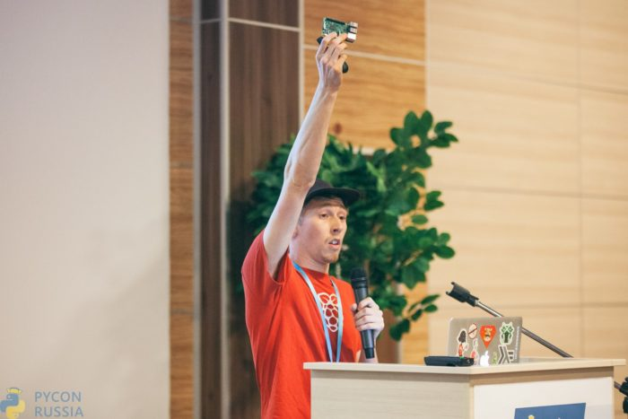

I was invited to give the closing keynote at [PyCon Russia](http://pycon.ru/2016/en/), which took
place in Moscow in July. It was my first visit to Russia – and I had a great trip.

> Today I am mostly being the Raspberry Pi Community at
> [@PyConRu](https://twitter.com/PyConRu?ref_src=twsrc%5Etfw)
> [pic.twitter.com/U88J1rcMNZ](https://t.co/U88J1rcMNZ)
>
> — Ben Nuttall (@ben_nuttall) [July 3,
> 2016](https://twitter.com/ben_nuttall/status/749504659434442752?ref_src=twsrc%5Etfw)

I travelled with [David McIver](https://twitter.com/DRMacIver), the author of property-based testing
framework, [hypothesis](http://hypothesis.works/). I also got to spend some time with other
international speakers including [Jackie Kazil](https://twitter.com/JackieKazil) (whom I met on my
[2014 US Tour](https://www.raspberrypi.org/blog/bens-mega-usa-tour/)), Python core developer
[Raymond Hettinger](https://twitter.com/raymondh), Google developer [Nathaniel
Manista](https://github.com/nathanielmanistaatgoogle), and (local) [Armin
Ronacher](https://twitter.com/mitsuhiko), the creator of the [Flask](http://flask.pocoo.org/) web
framework.

<figure class="wp-block-image">

</figure>

Here's the video of my talk on *Physical computing with Python and Raspberry Pi*. I spoke about the
Raspberry Pi, the Foundation and its mission, and lots of technical detail about the [GPIO
Zero](https://gpiozero.readthedocs.io/) library:

<figure class="wp-block-image">
<iframe width="560" height="315" src="https://www.youtube.com/embed/M2pDCNkRoM8?si=3_G2FngoMZ9x4TPx" title="YouTube video player" frameborder="0" allow="accelerometer; autoplay; clipboard-write; encrypted-media; gyroscope; picture-in-picture; web-share" referrerpolicy="strict-origin-when-cross-origin" allowfullscreen></iframe>
</figure>

You'll find my slides on
[speakerdeck](https://speakerdeck.com/bennuttall/physical-computing-with-python-and-raspberry-pi-pycon-russia).
