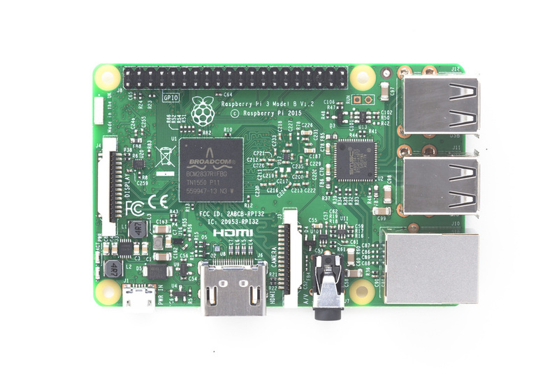
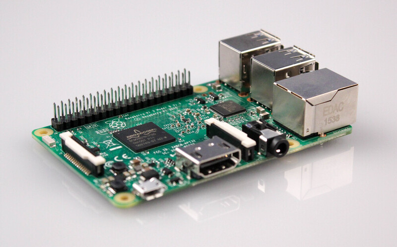
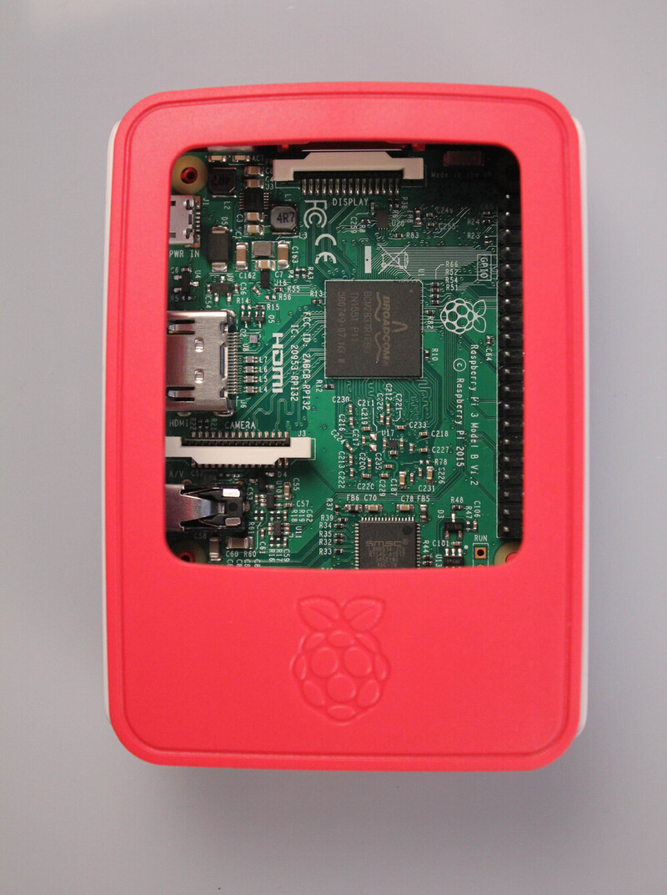

The original Raspberry Pi went on sale four years ago, and more than 8,000,000 units have shipped
since then. Raspberry Pi computers are used in schools and universities, in factories and other
industrial applications, in home automation and hobby projects, and much more.

Today the [Raspberry Pi 3 was announced](https://www.raspberrypi.org/blog/raspberry-pi-3-on-sale/),
featuring a 64-bit quad-core ARMv8 CPU clocked at 1.2GHz, making it roughly 10x the speed of the
original Pi 1. Many people will be pleased to hear that the Raspberry Pi 3 also features on-board
Wi-Fi and Bluetooth, greatly improving the device's connectivity. The new device goes on sale today
at the usual price of $35.

## What's new?

The Raspberry Pi 3 comes with 802.11n wireless LAN, so connecting to your home network to get your
Pi online is easy. The Raspberry Pi 3 also has Bluetooth 4.1 and Bluetooth Low Energy (BLE), so you
can connect a Bluetooth mouse and keyboard, or any other Bluetooth-enabled device. The addition of
these wireless technologies means you don't need to buy extra USB dongles and use up any of the USB
ports and avoid using a hub.

The Pi 3 boots in a matter of seconds, an improvement even on the Pi 2, which was much faster than
Pi 1. Once you're at the desktop, the Pi 3 is noticeably slicker and applications like the web
browser respond more like you'd expect from a modern PC than ever before.

A small but handy change is the microSD card slot, which was previously a push-push mechanism, is
now push-pull (like on the Pi Zero). This means you can't accidentally pop it out while adjusting
your cables.

## Get started

You can buy the new Pi right now from distributors around the world. You'll need a recent
[Raspbian](https://www.raspberrypi.org/downloads/raspbian/) or
[NOOBS](https://www.raspberrypi.org/downloads/noobs/) image on a microSD card, which you can
download from the [Raspberry Pi website](https://www.raspberrypi.org/downloads/). Alternatively,
there are a whole host of Linux distributions, and specific images for various applications—from
media centres to retro gaming platforms.

Check out the [Raspberry Pi learning resources](https://www.raspberrypi.org/resources/) for some
great projects.

## Timeline of devices

- February 2012: Raspberry Pi Model B
- October 2012: Raspberry Pi Model B rev2
- February 2013: Raspberry Pi Model A
- May 2013: Camera module
- October 2013: Infra-red Camera module
- July 2014: Raspberry Pi Model B+
- November 2014: Raspberry Pi Model A+
- April 2014: Raspberry Pi Compute Module
- February 2015: Raspberry Pi 2 Model B
- August 2015: Raspberry Pi Sense HAT
- November 2015: Raspberry Pi Zero
- February 2016: Raspberry Pi 3 Model B

## What's next?

There's room in the family of Raspberry Pi boards for a Pi 3 Model A, and a new compute module with
the Pi 3 chip. These products are expected later in the year. The Pi 3 Model A will take the form
factor of the existing [Model A+](https://www.raspberrypi.org/products/model-a-plus/) from 2014,
which is available now for $20. Because the Pi's camera module accessory's sensor has reached EOL,
an upgraded camera board will be released. There's no firm date, but that's also expected in 2016.

The Pi Zero shocked the world when it landed in November - a tiny $5 computer, but its production
run has been limited (in no small part due to the introduction of Pi 3). But Pi Zero manufacturing
will be continued and more stock will make its way to distributors in due course. However, the
flagship device has always been the current Model B of the time, as it includes the most
connectivity and stands up best as a general purpose PC.
