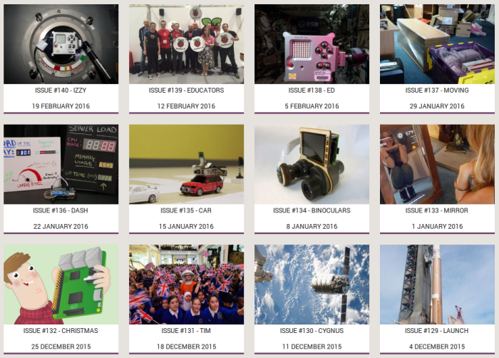

Back in 2013, inspired by [*PyCoders Weekly*](http://pycoders.com/), a great Python email
newsletter, I created [*Pi Weekly*](http://piweekly.net/), the same sort of thing for Raspberry Pi.
Each week I curated a collection of links to news, projects and articles from the Raspberry Pi
community. Its subscriber base grew steadily and within a few weeks it was [featured on the
Raspberry Pi blog](https://www.raspberrypi.org/blog/pi-weekly-a-free-email-newsletter/). Towards the
end of that year I was given the opportunity to go and work for the Raspberry Pi Foundation, and I
continued to run the newsletter in the same format.

140 weeks into the project, having not missed a single week, it was
[relaunched](https://www.raspberrypi.org/blog/raspberry-pi-weekly-stay-connected-with-the-raspberry-pi-community/)
with a new look and moved into the Raspberry Pi website as the [Foundation's official
newsletter](https://www.raspberrypi.org/weekly/).

<figure class="wp-block-image">

<figcaption>All past issues are available to browse on the website</figcaption>
</figure>

I created a simple system for the newsletter generation. The whole thing is based within in a
WordPress site, and issues are just posts with a set of custom fields, a repeater for the links, and
a post template to show the issue as a web page. Then a plugin I wrote generates a full document of
the same content in email-friendly HTML. For Pi Weekly, this was just a bog standard Mailchimp email
template with my content in it, but for the official Raspberry Pi Weekly, I created a custom
template made by our designer Sam Alder. The code for *Pi Weekly* is available on GitHub, it just
requires the [ACF plugin](http://www.advancedcustomfields.com/) and the appropriate custom fields
created. It would be fairly easy to create such a system in another CMS or web framework.

I wrote more about how Pi Weekly started and how it played a part in getting me hired at the
Foundation in *[Pi Weekly – MVP, Evolution and My Dream
Job](/blog/2013/11/pi-weekly-evolution-dream-job/)* and you can see how I announced it in
*[Announcing Pi Weekly](/blog/2013/06/announcing-pi-weekly/).*

<figure class="wp-block-image">

</figure>

Be sure to check out the new Raspberry Pi Weekly!
