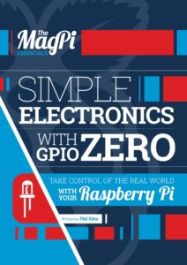
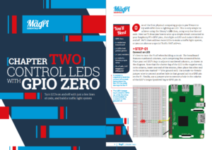

Today the *MagPi* team released a new publication: *Simple Electronics with GPIO Zero*.

<figure class="wp-block-image">

</figure>

This 100-page book takes you from the basics, like lighting an LED, all the way to building projects
like an Internet radio using the GPIO Zero Python library.

This book is available as a [free PDF](https://www.raspberrypi.org/magpi/gpio-zero-essentials/), but
you can also pay to get it for your iPad or Android device with the MagPi app. ~~Soon it will also
be released in print.~~ It's [now available in
print](https://thepihut.com/collections/magpi/products/magpi-essentials-simple-electronics-with-gpio-zero).
All proceeds go towards the Raspberry Pi Foundation's education programmes.

<figure class="wp-block-image">

</figure>

I've been amazed with how the GPIO Zero project has grown. There have been three major releases (a
fourth due later this year), and it has been featured in [*The
MagPi*](https://www.raspberrypi.org/magpi/) many times, and in three Kickstarter projects:

- [RasPiO Pro HAT](https://www.kickstarter.com/projects/raspitv/raspio-pro-hat-protect-position-raspberry-pi-ports?ref=nav_search)
- [Analog Zero](https://www.kickstarter.com/projects/raspitv/raspio-analog-zero-read-8-sensors-at-once-on-raspb?ref=nav_search)
- [GPIO Zero Ruler](https://www.kickstarter.com/projects/raspitv/raspio-gpio-zero-code-reference-ruler-for-raspberr?ref=nav_search)

Also check out the [GPIO Zero documentation](http://gpiozero.readthedocs.io), the [Physical
Computing with Python](https://www.raspberrypi.org/learning/physical-computing-with-python/)
resource, and [GPIO Zero on GitHub](https://github.com/RPi-Distro/python-gpiozero).
