Did you know you can adorn your Raspberry Pi with HATs? Of course we're not talking about hats like
people put on their heads, but rather HATs: hardware attached on top. These are add-on circuit
boards and accessories that add functionality to your Raspberry Pi.

You can, of course, use the Pi on its own, using programming environments like Scratch and Python to
program it. You can connect individual components to the Pi's general-purpose input/output (GPIO)
pins and program them directly. However, there is a wealth of amazing and innovative add-on boards
and accessories that allow you to do more with your Pi without having to wire them into place, and
in neat form factors that sit directly on top of the Pi.

The [HAT specification](https://github.com/raspberrypi/hats) gives specific dimensions to fit neatly
on the Pi, aligning mounting holes, and holes for accessories suchs as cameras and display cables.
Not all add-ons are HATs; add-ons come in multiple shapes and sizes.

In no particular order, here are my favorites.

## Camera module

The camera module is an official product of the Raspberry Pi Foundation. It uses the camera serial
interface (CSI) port, which is present on almost every Pi model, to connect a small camera board to
the Pi using a ribbon cable. The new V2 camera was released earlier this year: it is 8 megapixels
and has a brilliant quality Sony sensor. There is a visible light version, and an infra-red (IR)
version. The IR version lets you see in the dark when you have an infra-red light source. IR cameras
are commonly used in wildlife and plant photography.

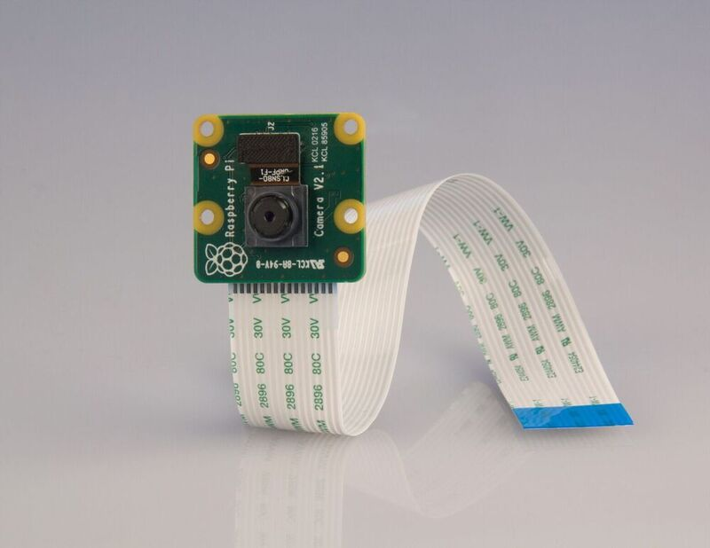

## Sense HAT

The Sense HAT is another official product from Raspberry Pi. It was made for a specific event: it
was sent to the International Space Station with European Space Agency (ESA) astronaut Tim Peake,
and used in experiments coded by school children as part of the Astro Pi competition. The Sense HAT
packs an 8x8 colour LED matrix and a set of environmental sensors.

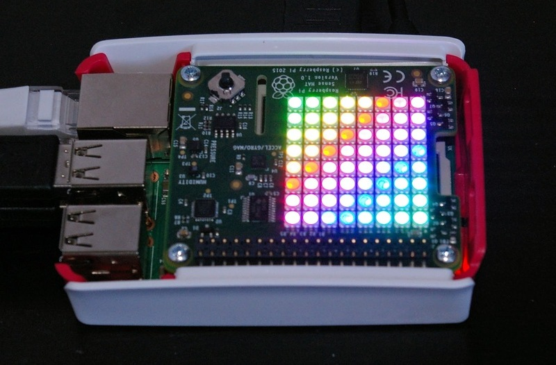

Similarly, a new board from Pimoroni, the [Enviro pHAT](https://shop.pimoroni.com/products/enviro-phat),
is handy for collecting environmental sensor data. It is not a full sized HAT as it is made for the
Pi Zero, but it will fit on top of any modern Pi.

## Unicorn HAT

Like the Sense HAT, [Pimoroni's Unicorn HAT](https://shop.pimoroni.com/products/unicorn-hat) packs
an 8x8 LED matrix. However, the LEDs are bigger and more spread out, so they fill the entire board.
There are no sensors, so this board is perfect for displaying information, patterns, animations, and
status indicators.

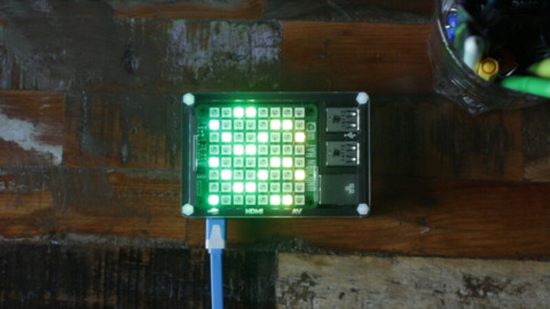

Pimoroni also has a Pi Zero sized board, the [Unicorn
pHAT](https://shop.pimoroni.com/collections/raspberry-pi/products/unicorn-phat), with 8x4 pixels,
and a tiny 1x8 board called [Blinkt!](https://shop.pimoroni.com/products/blinkt)

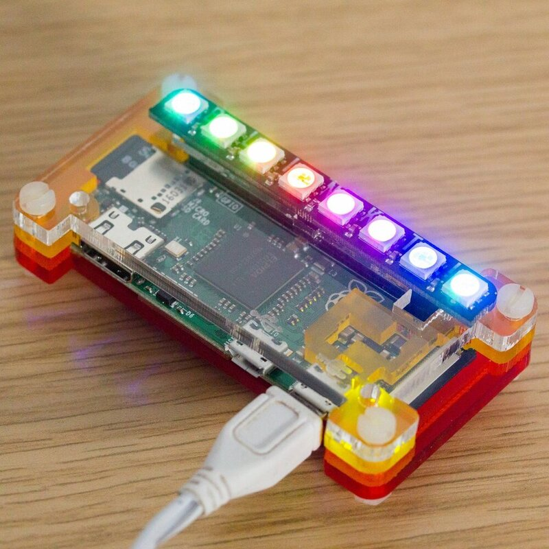

If you don't need great big full colour LEDs, another of my favourites is the [Ciseco
PiLITEr](https://shop.pimoroni.com/products/pi-liter-8-led-strip-for-the-raspberry-pi), a small
add-on with 8 small but bright white pixels in a row. This is perfect for [GPIO Zero bar
graphs](https://gpiozero.readthedocs.io/en/v1.2.0/api_boards.html#piliter-bar-graph), or for making
a [People in Space Indicator](https://www.raspberrypi.org/learning/people-in-space-indicator/).

All of Pimoroni's products come with a Python library and installation instructions, so you won't
have any trouble getting started straight away.

## MotoZero

Another new release: [the MotoZero](https://thepihut.com/products/motozero), designed by Richard
Saville (aka [Average Man vs. Raspberry Pi](https://www.averagemanvsraspberrypi.com/)), manufactured
and sold by the Pi Hut. It is a controller board that controls up to four motors. It is great for
robotics and other motor projects. It is a Zero sized board, and you can program it with the [GPIO
Zero](https://gist.github.com/bennuttall/20ab5f93c5f830276fdae3bf1d74cb94) application programming
interface (API).

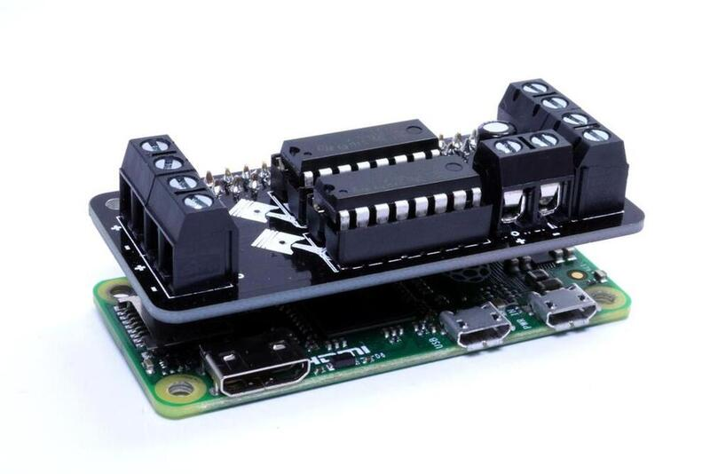

You should also check out the [CamJam Edu Kit
3](https://thepihut.com/products/camjam-edukit-3-robotics), which features a two-motor controller
board,  and the Ryanteck MCB and the 4Tronix Pi Zero Motor Shim, which dock neatly beside the Pi
Zero while maintaining a low profile.

## Traffic HAT

Another Ryanteck product, [the Traffic
HAT](https://ryanteck.uk/hats/1-traffichat-0635648607122.html) displays the standard traffic light
colors of red, yellow and green. It also includes a button and a buzzer, and is easy to program with
GPIO Zero.

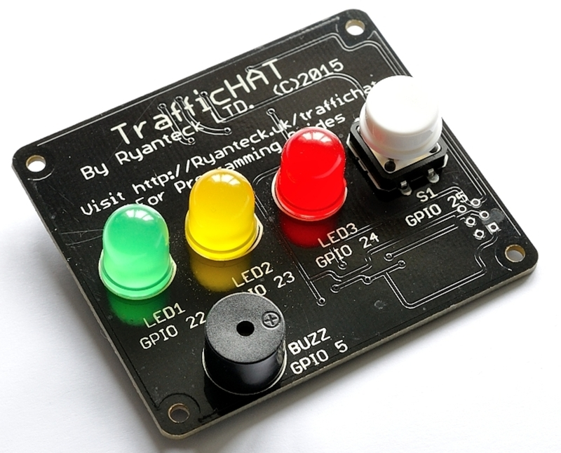

If you don't need the button and buzzer, or you need access to the GPIO pins, you can use a [Pi
Traffic Light](https://lowvoltagelabs.com/products/pi-traffic/) or
[Pi-Stop](https://4tronix.co.uk/store/index.php?rt=product/product&product_id=390), which fit neatly
on the pins and stand up vertically.

## Analog Zero

This board recently landed on Kickstarter. It was only up for seven days, it smashed its target, and
they're already being sent out to backers. The [Analog Zero](https://rasp.io/analogzero/) provides
eight analog inputs to your Raspberry Pi. The Pi's GPIO pins are digital, so you need to use an
analogue-to-digital converter (ADC) to connect analog devices. You can use an ADC chip on a
breadboard, but the wiring can be messy, so the Analog Zero is a great improvement.

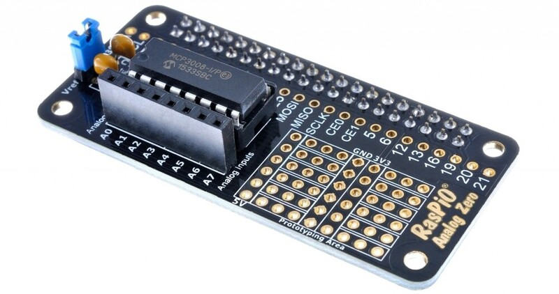

Using the Analog Zero with GPIO Zero makes it easier to program analog inputs like potentiometers
and light sensors.

## RasPiO Pro HAT

Alex Eames (RasPiO and raspi.tv) also made the [RasPiO Pro
H](https://rasp.io/prohat/)[AT](https://rasp.io/prohat/), which provides a breadboard space on a
HAT, with the GPIO pins broken out in numerical order. Additionally, the Pro HAT protects the pins
so you can use LEDS directly without having to add resistors.

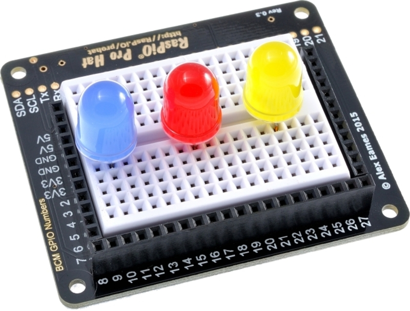

## Adafruit Capacitive Touch HAT

Adafruit make some great boards for the Raspberry Pi, including their [Capacitive Touch
HAT](https://www.adafruit.com/products/2340). It is a simple way of reading capacitive touch inputs
from the Pi, meaning you can make your own fruit drum kit!

## Skywriter HAT

The [Skywriter HAT](https://shop.pimoroni.com/products/skywriter-hat) from Pimoroni allows processes
hand gestures to control things. Start simple and make a Theremin, or go full steam and automate
your house with a host of gestures.

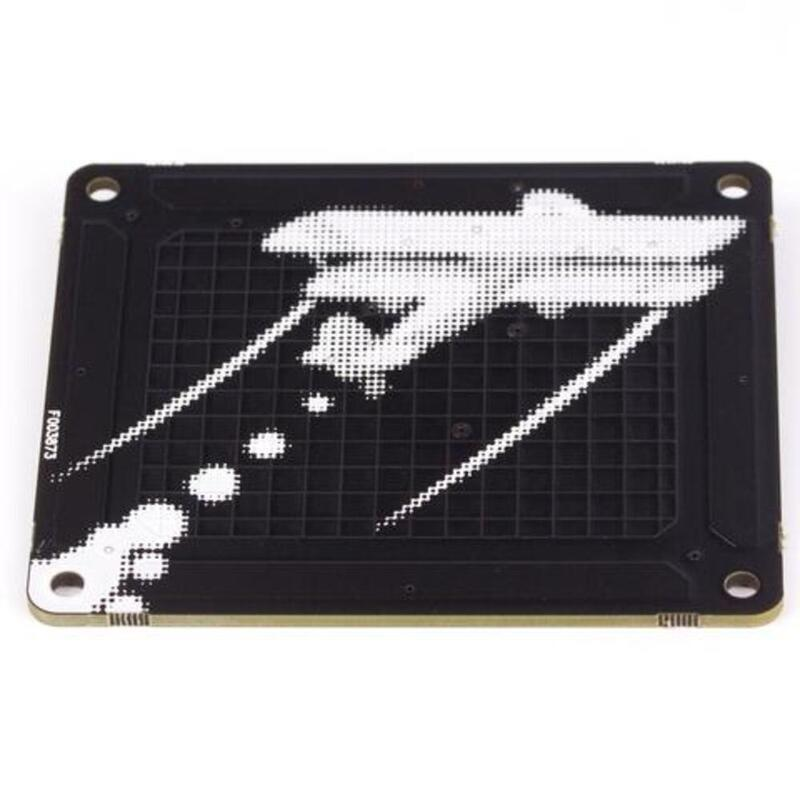

## Energenie Pi-mote

Energenie makes products for controlling power sockets with remote controls. The [Pi-mote add-on
board](https://energenie4u.co.uk/catalogue/product/ENER314) controls power sockets remotely. Connect
with devices using GPIO Zero, and write code to turn them on and off under particular circumstances.

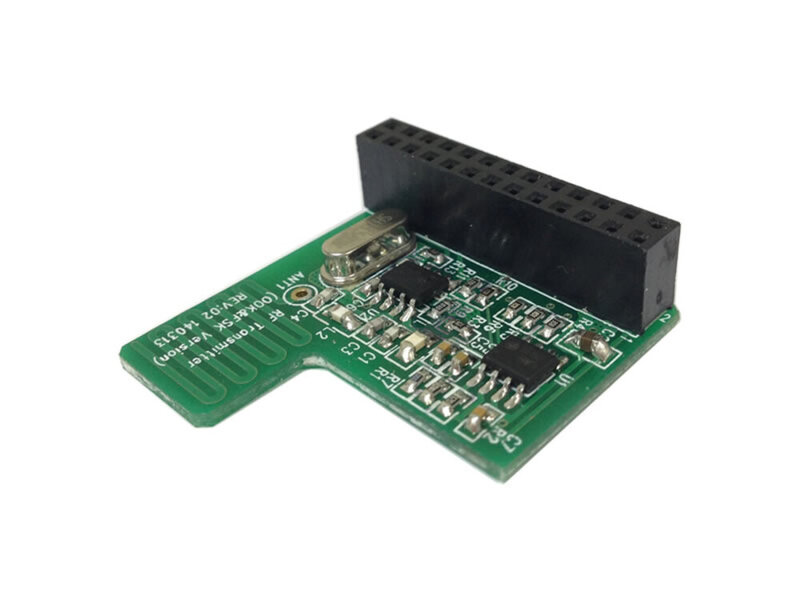

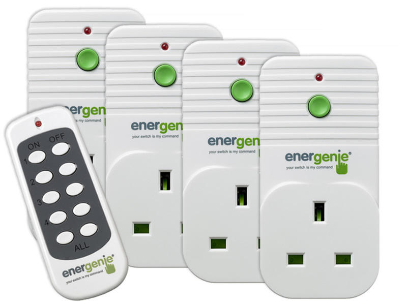