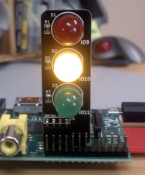
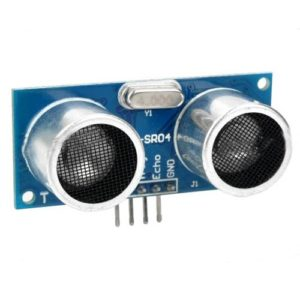
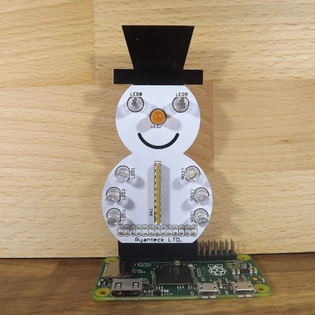
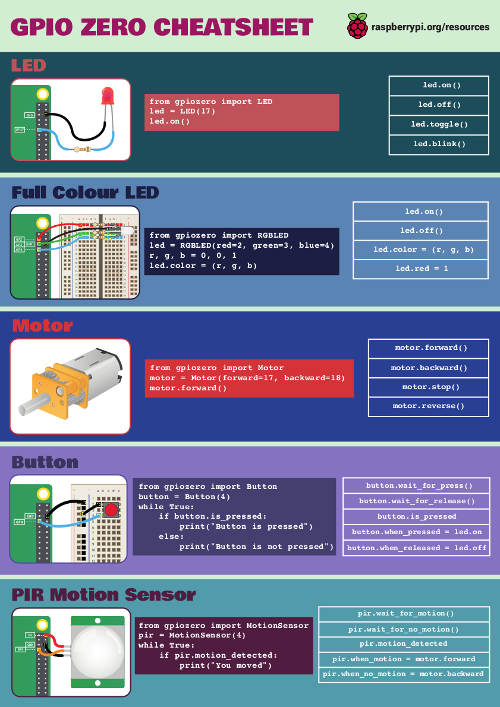

*GPIO Zero is a Python library I created to make physical computing on the Raspberry Pi more
accessible, particularly for use in education. Read more about it on
[raspberrypi.org](https://www.raspberrypi.org/blog/gpio-zero-a-friendly-python-api-for-physical-computing/),
or about how it was created in an article on this blog, [GPIO Zero: Developing a new friendly API
for Physical
Computing](/blog/2016/01/gpio-zero-developing-a-new-friendly-python-api-for-physical-computing/).*

## Background

GPIO Zero is a module providing simple interfaces to GPIO components and devices (LED, Button,
Buzzer, LightSensor, TrafficLights, etc). It provides classes representing these devices, for the
user to create instances to control each of them. Each device has all the features you'd expect the
component to have (e.g. LED has `on`/`off`/`toggle`/`blink` methods), providing a simple way to
perform common tasks with the device. More complex devices (sensors and such) usually require
humongous amounts of code, when using the previous library `RPi.GPIO`, but with GPIO Zero, are
generally as straightforward as the simple LED:

```python
from gpiozero import LED, MotionSensor

led = LED(2)
sensor = MotionSensor(3)

sensor.when_motion = led.on
sensor.when_no_motion = led.off
```

One of the fancier features of the library is
[**source/values**](https://github.com/RPi-Distro/python-gpiozero/issues/76). All devices have a
`value` attribute, which when inspected, shows the current state (An LED shows `1` when on, `0` when
off; a Button shows `1` when pressed, `0` when released), and a `values` attribute, which is an
infinite iterator constantly yielding the current `value`. All output devices have a `source`
attribute, which is initially `None`, but can be set to an infinite iterator. This means you can
easily connect two components together:

```python
led.source = button.values
```

Now the LED's source comes directly from the Button's values. In other words, when the button is
pressed, the LED is lit.

Additionally, it's worth noting that an output device's source can come from an input device (like
above), an output device (blue LED comes on when red LED comes on), or from a custom generator (blue
LED goes off when red LED comes on, or even something unrelated to GPIO components!)

## v1.2

Version 1.2 of GPIO Zero is out now! The next Raspbian release will include it, but you can upgrade
now with:

```
sudo apt-get update
sudo apt-get install python3-gpiozero python-gpiozero
```

*(Note: apt-get install will install a package if it's not already installed, and will upgrade it if
there's a newer version available)*

## Dependencies

This version has **zero dependencies**, so you shouldn't have any issues installing it even on an
older Wheezy image. Previously, the library depended on `RPi.GPIO`, and `spidev`, but these are no
longer requirements. Alternative pin implementations are available (more on that later), including a
pure Python one built in to the library, so `RPi.GPIO` is no longer required. If it's present (more
than likely the case), then it will be used, but three alternatives are sought if it's not! Also, a
software implementation of the SPI protocol has been implemented, meaning it's possible to interface
with SPI devices without using hardware SPI at all (the `spidev` library doesn't need to be
installed, and SPI doesn't even need to be enabled in `raspi-config`).

## Test suite

Something I've wanted to have since the [early
days](https://github.com/RPi-Distro/python-gpiozero/issues/87), but had no idea how to implement.
Dave created a [test suite](https://github.com/RPi-Distro/python-gpiozero/tree/master/tests), which
does a decent job, but does not currently cover the full scope of the library. We have [continuous
integration](https://travis-ci.org/RPi-Distro/python-gpiozero) set up with Travis, and people have
even created GPIO Zero projects related to this – using the Travis CI API to show the test suite
status on [traffic lights](https://github.com/RPi-Distro/python-gpiozero/issues/191).

<figure class="wp-block-image">

</figure>

## What's new?

See the [changelog](http://gpiozero.readthedocs.org/en/v1.2.0/changelog.html) for full details.
We've added the following:

### Energenie

[Energenie](https://energenie4u.co.uk/) is a long-term favourite of mine and others, it's an [add-on
board](https://energenie4u.co.uk/catalogue/product/ENER314) for the Pi which communicates wirelessly
with a special [power socket](https://energenie4u.co.uk/catalogue/product/ENER002) (or [set of
sockets](https://energenie4u.co.uk/catalogue/product/ENER010)). I previously maintained a [Python
module](https://pypi.python.org/pypi/energenie) for controlling the Energenie, providing simple
`switch_on()` and `switch_off()` functions which took a socket number to control. The GPIO Zero
solution is just as simple, a little more elegant, and importantly comes bundled with the fancy
features of a first-class GPIO Zero component (source/values)!

```python
from gpiozero import Button, Energenie

button = Button(21)
light = Energenie(1)

light.source = button.values
```

Here a connection to Energenie's socket \#1 is created, referenced as `light` (an actual wall socket
desk lamp rather than an LED) and the button set to trigger the light to come on. That's right – a
light switch!

<figure class="wp-block-image">

</figure>

### LineSensor

The basic line sensor unit is a simple binary sensor, so its interface is similar to the Button. It
just has aliases for `is_active`, `when_active` and `wait_for_active`.

```python
from gpiozero import LED, LineSensor

led = LED(2)
sensor = LineSensor(3)

sensor.when_line = led.on
sensor.when_no_line = led.off
```

There's one of these in the new CamJam Edu Kit 3 (robotics kit), so it will be handy for that!

### DistanceSensor

The ultrasonic distance sensor is a little more complex in implementation, and requires two GPIO
pins (echo and trigger). Its distance thresholds and such are configurable but basic usage looks
like this:

```python
from gpiozero import LED, DistanceSensor

led = LED(2)
sensor = DistanceSensor(echo=3, trigger=4, max_distance=1)

sensor.when_in_range = led.on
sensor.when_out_of_range = led.off

while True:
    print("Distance: %s" % sensor.distance * 100)
    sleep(1)
```

<figure class="wp-block-image">

</figure>

There's also one of these in CamJam Kit 3 and they're popular for various projects not limited to
robotics.

### SnowPi

An excellent Christmas themed [add-on
board](https://ryanteck.uk/raspberry-pi/114-snowpi-the-gpio-snowman-for-raspberry-pi-0635648608303.html)
made by Ryan Walmsley. It's a snowman with LEDs for eyes, one for the nose, and three for each arm.

<figure class="wp-block-image">

</figure>

Simple to program using nine individual LED objects but we crafted a neater interface:

```python
from gpiozero import SnowPi

sp = SnowPi()

sp.on()  # all on
sp.blink()  # all blinking
sp.off() # all off

sp.nose.on()  # nose on

sp.arms.on()  # all arm leds on
sp.arms.left.off()  # all leds on left arm off
sp.arms.right.blink()  # right arm blinking

sp.arms.left.top.on()  # individually control top left arm led
sp.arms.right.middle.on()  # similarly
sp.arms.left.bottom.on()  # similarly
sp.arms.bottom.off()  # control bottom led of both arm
```

This one's pretty fun to play with! A real stocking filler for next Christmas :)

### Holdable Button

[Martin O'Hanlon](https://twitter.com/martinohanlon)
[suggested](https://github.com/RPi-Distro/python-gpiozero/issues/115) we add a way to detect when a
button is held for a given length of time, rather than just when it was pressed. He submitted a PR
adding a new HoldableButton class, but Dave ended up adding the functionality into the standard
Button class:

```python
from gpiozero import Button

def hello():
    print("Hello")

button = Button(2, hold_time=2)

button.when_held = hello
```

### Pulsing LED

We've had `led.blink()` from the very beginning, and we've had an interface for variable brightness
LEDs (using PWM). Recently we added additional parameters to `PWMLED`'s version of blink so you
could configure *fade in time* and *fade out time*:

```python
from gpiozero import PWMLED

led = PWMLED(2)

led.blink(on_time=1, off_time=1, fade_in_time=1, fade_out_time=1)
```

[Andrew Scheller](https://github.com/lurch) then added a
[PR](https://github.com/RPi-Distro/python-gpiozero/pull/165) for a `pulse()` method which defaulted
`on_time` and `off_time` to `0`. We liked the idea but it seemed rather pointless to create a new
method merely aliasing some different default settings of an existing method. I ended up suggesting
we actually remove the `in_time` and `out_time` parameters, so it's more like regular `blink()` but
with automatic fading, and the time of the fade configurable. So now:

```python
from gpiozero import PWMLED

led = PWMLED(2)

led.pulse(fade_in_time=1, fade_out_time=1)
```

Named parameters are not necessary, so in this example you can just use `led.pulse(1, 1)` – or skip
them altogether as those are the defaults:

```python
led.pulse()
```

### Various ADC chips – and software SPI

We added to our initial support of a couple of ADC chips such as the MCP3008:

- MCP3001
- MCP3002
- MCP3004
- MCP3008
- MCP3201
- MCP3202
- MCP3204
- MCP3208

As I mentioned earlier, there's now a software implementation of the SPI protocol which means you
don't need `spidev` installed or SPI enabled in `raspi-config`.

### pi_info()

There's now a function you can run that returns a whole bunch of information about the Pi you're
using: the revision, model, SoC, manufacturer, memory, storage type and more. As well as providing
this information to the user on request, it is used internally to warn users when they, for example,
try to use a pull-down circuit on a pin with a physical pull-up resistor built in. Also, developers
could use this information to do similar things in their own projects or libraries. See the wealth
of information provided in
[data.py](https://github.com/RPi-Distro/python-gpiozero/blob/master/gpiozero/pins/data.py)

### source/value tools

The source/value feature is more advanced than simply using loops, or even callbacks, but it can be
really powerful. We found that although the basic examples were very simple to use, there were many
alternative common uses that required much more code. For example, if you wanted one LED to mimic
another, that's just `blue.source = red.values`, but if you want one to be the inverse of the other
(i.e. red at 40% brightness should make blue 60% brightness), you'd have to create your own
generator function:

```python
from gpiozero import PWMLED

blue = PWMLED(2)
red = PWMLED(3)

def invert(led):
    while True:
        yield 1 - led.value

blue.source = invert(red)
```

But now we have a set of tools exactly for these common use cases. We have `absoluted`, `clamped`,
`inverted`, `negated`, `post_delayed`, `pre-delayed`, `quantized`, `queued`, `scaled`, `cos`, `sin`,
`random_values`, `all_values`, `any_values` and `averaged`. The *invert* example becomes:

```python
from gpiozero import PWMLED
from gpiozero.tools import inverted
blue = PWMLED(2)
red = PWMLED(3)

blue.source = inverted(red.values)
```

See the documentation on [source tools](http://gpiozero.readthedocs.org/en/v1.2.0/api_tools.html)
for more information and examples.

## Alternative pin implementations

Initially, when I created GPIO Zero, it was just an abstraction layer sitting on top of an existing
GPIO library, RPi.GPIO. However, we now support four multiple back-ends: RPi.GPIO, RPIO, pigpiod and
a native implementation. The priority is such that RPi.GPIO is preferred, being the most stable
option we know of (and 99% of users will be using this implementation, as it's pre-installed in
Raspbian); secondly, RPIO, another Python library with better PWM support; thirdly a Python module
which communicates with a C library (pigpio) running as a daemon (pigpiod), which is an interesting
option I'll explain next; finally, if none of those libraries are found to be available, the
fallback is a pure Python pins implementation Dave wrote as part of GPIO Zero. It's pretty basic at
present, and is rather experimental, but for basic use it does just about work.

### pigpio and pigpiod

[pigpio](http://abyz.co.uk/rpi/pigpio/) is a C library which provides an interface to GPIO, PWM,
SPI, I2C, Serial and more. Its feature set is brilliantly extensive, and its killer feature is the
daemon. pigpiod runs as root, but takes commands via sockets from the regular Pi user, or anywhere
else. It's also got a comprehensive set of documentation. Unfortunately, despite its excellent
quality and usefulness, it's not packaged or distributed. It's just sitting on GitHub. However, we
(the Foundation) intend to do this packaging work and ship it with Raspbian in future. Watch this
space. Or [that space](https://www.raspberrypi.org/), maybe.

One amazing feature of pigpio is remote pin access. Because GPIO Zero has no dependencies, I can
install and run it on my Ubuntu laptop (it would also run on Mac or Windows). I can open a shell,
and type:

```python
from gpiozero import LED
from gpiozero.pins.pigpiod import PiGPIOPin

pin = PiGPIOPin(2, host='192.168.0.2')
led = LED(pin)

led.blink()
```

So rather than creating an LED on pin 2, I create it on a reference to a remote pin elsewhere on the
network. This is seriously cool and I look forward to this being used more broadly once `pigpio` is
packaged. See the [pins docs](http://gpiozero.readthedocs.org/en/v1.2.0/api_pins.html) for more
information on the various pin implementations.

## Cheat sheet

We created a GPIO Zero cheat sheet for a special edition of [*The
MagPi*](https://www.raspberrypi.org/education/magpi-educators-edition/). You can download the poster
for free from
[raspberrypi.org/education/downloads/](https://www.raspberrypi.org/education/downloads/)

<figure class="wp-block-image">

</figure>

## What's next?

Development of
[v1.3](https://github.com/RPi-Distro/python-gpiozero/issues?utf8=%E2%9C%93&q=milestone%3Av1.3+) is
under way. We're planning to add:

- [Servo](https://vine.co/v/ij0OlIap50I)
- One-wire temperature sensor (in CamJam kit 2)
- [DOTS board](https://thepihut.com/collections/raspberry-pi-dots-board)
- Composite robot interfaces (robots with sensors as a single object)
- More – feel free to make suggestions

See the [v1.3 milestone](https://github.com/RPi-Distro/python-gpiozero/milestones/v1.3) for more
information – and feel free to chip in with ideas, suggestions and code!

## Join the Zero revolution

[Daniel Pope](https://twitter.com/lordmauve) created [PyGame
Zero](http://pygame-zero.readthedocs.org), a zero-boilerplate module for making games with Python. I
followed this philosophy with GPIO Zero ([aptly
named](https://github.com/RPi-Distro/python-gpiozero/issues/4) so, just before [Pi
Zero](https://www.raspberrypi.org/blog/raspberry-pi-zero/) came out...)

The [MicroPython API](http://microbit-micropython.readthedocs.org/en/latest/) for the [BBC
micro:bit](https://www.microbit.co.uk/) has been designed with a similar philosophy, and there's now
a [NetworkZero](http://networkzero.readthedocs.org/) library made by [Tim
Golden](https://twitter.com/tjguk). You can read about it in his [blog
post](http://ramblings.timgolden.me.uk/2016/04/14/network-zero/). Nicholas Tollervey has created a
[Py-ZeroZero](https://github.com/py-zerozero) organisation on GitHub for discussion of this family
of -*Zero* libraries and a description of our philosophies.

## Thanks

[Dave Jones](https://twitter.com/waveform80) has gone above and beyond and he's responsible for the
vast majority of the code base (and the feature set). I can't thank him enough for the voluntary
work he's done on the library.

<figure class="wp-block-image">
<a href="https://github.com/RPi-Distro/python-gpiozero/graphs/contributors"></a>
</figure>

Thanks also to [Andrew Scheller](https://github.com/lurch), who's made some great contributions to
the code, and helped a lot by posting issues and commenting on commits and PRs. And to [Martin
O'Hanlon](https://twitter.com/martinohanlon) who helped create the holdable Button; to [Schelto van
Doorn](https://github.com/pcopa), who added numerous ADC chips; and to everyone who's used the
library, given feedback, shared it with others or provided help with documentation, API design or
usage suggestions. Finally thanks to Joan for [pigpio](http://abyz.co.uk/rpi/pigpio/).

> GPIOzero rocks! [#piparty](https://twitter.com/hashtag/piparty?src=hash&ref_src=twsrc%5Etfw)
> [pic.twitter.com/tRFSxyqKBY](https://t.co/tRFSxyqKBY)
>
> — Carrie Anne Philbin MBE (@MissPhilbin) [March 5,
> 2016](https://twitter.com/MissPhilbin/status/706078396476948480?ref_src=twsrc%5Etfw)
