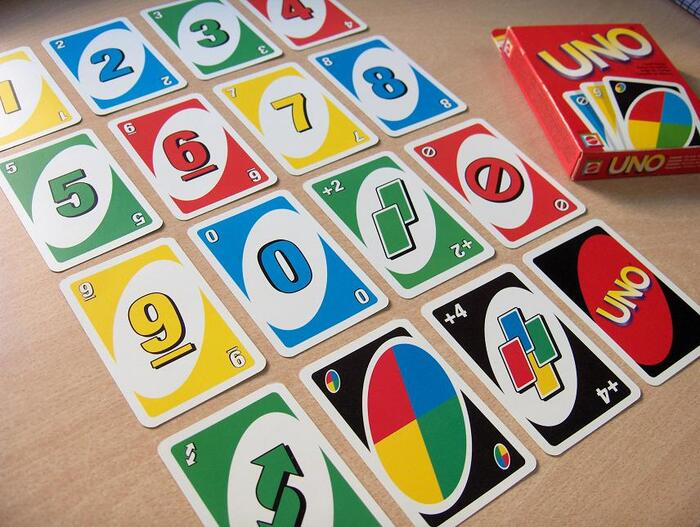
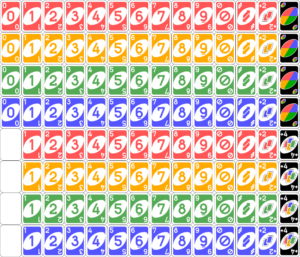
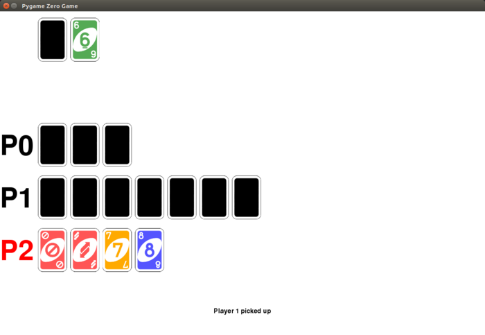

During this Christmas break I decided to have a go at implementing the card game
[Uno](https://en.wikipedia.org/wiki/Uno_(card_game)) in Python. It's a fun and simple game for all
ages, and the rules are easy to pick up and follow – but there's quite a challenge in implementing
the rules in a program! I spent a few hours over a few evenings working on it and now have a
completed version, and wanted to share some of the interesting bits of the code.

## Uno

Uno is played with a bespoke card deck (not a normal deck of playing cards). Uno cards have a colour
and a card type (a number or a symbol). There are four regular colour cards, and there are special
cards which are black.

<figure class="wp-block-image">
<a href="https://en.wikipedia.org/wiki/Uno_(card_game)"></a>
</figure>

Each player is dealt a hand of 7 cards, and they take turns to play a card, trying to become the
first player to get rid of all their cards. A player can only play a card if it has the same colour
or card type as the last played card. If they cannot play a regular card but have a special black
card, this can be played instead. Some cards have consequences, such as the next player having to
pick up extra cards, players skipping turns or reversing order of play.

## Unit tests

I used a test-driven development (TDD) approach to further my progress in building up the game from
simple isolated card logic all the way to simulating gameplay in a multi-player game. I used
[pytest](http://doc.pytest.org/) for its ability to verify exceptions were raised, but otherwise
simply used Python's built-in [assert](https://docs.python.org/3/reference/simple_stmts.html#assert)
statement.

## An Uno Card

I started by writing some tests to check errors were thrown if you tried to create an invalid card,
then proceeded to creating valid cards. The card was implemented as an UnoCard class, whose objects
stored a colour and a card type.

## Card rules

As well as validation on init, I added a method to determine whether a given card was *playable* on
another card. The card playing rules are quite straightforward: you can place a card on another if
they share the same colour, the same number or symbol, or if the card is a wild card.

## The deck

I started building up an `UnoGame` class, where a deck of UnoCard instances was created. The deck
needed to contain a complete set of Uno cards, which I determined from this image on Wikipedia:

<figure class="wp-block-image">
<a href="https://en.wikipedia.org/wiki/Uno_(card_game)"></a>
</figure>

So it turns out there are digit cards 0-9 (and then 1-9 repeated) for each of the four colours, and two of
each special card in each colour. There are also four of each of the two types of black cards.

I started by creating lists defining the colours and card types, and initially created the deck by
combining these lists in a number of for-loops. However, I later
[refactored](https://github.com/bennuttall/uno/commit/d8cabb5b04d2b2c4adfe889ea691ddf1aa96bd8f) this
to use `product`, `repeat` and `chain` from [itertools](https://docs.python.org/3/library/itertools.html)
in the standard library, which made it much neater:

```python
color_cards = product(COLORS, COLOR_CARD_TYPES)
black_cards = product(repeat('black', 4), BLACK_CARD_TYPES)
all_cards = chain(color_cards, black_cards)
deck = [UnoCard(color, card_type) for color, card_type in all_cards]
```

The `UnoGame`'s deck was then simply a list containing `UnoCard` objects.

## Gameplay

In order for there to be a game, there needed to be players. I made `UnoGame` initialise with a given
number of players. This meant a new `UnoPlayer` class. Each player would be dealt a hand of 7 cards
from the shuffled deck. But first, I wrote tests and made sure that an `UnoPlayer` object could be
created with 7 cards, and couldn't be created without them.

## Reverse

In order for gameplay to take place, I needed to work out how I would designate a player as being
the currently active player (whose turn it is). My first thought was
[itertools.cycle](https://docs.python.org/3/library/itertools.html#itertools.cycle) – a handy tool
for infinitely iterating over an iterable object like a list, and just starting back at the
beginning of the list once all items have been exhausted. However, Uno has a *reverse* card, meaning
the order of play can be reversed at any moment.

I thought it through, and decided to design a new `ReversibleCycle` class to implement something
*like* a cycle which could be reversed, as specified by the Uno rules. It took me quite a while to
figure this out exactly, and get all my tests passing, but I was quite happy with the implementation
I ended up with. A tricky part was the edge-case of what happens if the first card drawn (not played
by a player – just the starting card) is a reverse card. According to the rules, play will start
with the player to the right of what would have been the first player (i.e. the last player).
Otherwise, in normal circumstances, the first player will play first, naturally.

I implemented the class as an iterator, so you could loop over it or manually `next()` it. Example
usage of my `ReversibleCycle` class:

```python
>>> rc = ReversibleCycle(range(3))
>>> next(rc)
0
>>> next(rc)
1
>>> rc.reverse()
>>> next(rc)
0
>>> next(rc)
2
```

I wrote tests of the `ReversibleCycle` in an isolated fashion. It works with any iterable, and I
simply created an attribute within my `UnoGame` class which referred to an instance of
`ReversibleCycle`, where the iterable was a list of `UnoPlayer` objects. I used a property to make it
easy to look up which was the current player at any given moment.

## More gameplay

Back to testing the gameplay, now I had a working model for cycling through players, with the
ability to reverse order of play once a reverse card was played, I tested that players could play
cards only when it was their turn, and that they could only play valid cards. I then tested that
players playing cards would cause the correct consequences (e.g. the next player picks up 2, the new
current player is the right one if a skip/reverse/etc. card is played, and so on).

## The winner

I began testing gameplay by allowing the deck not to be shuffled, so that I had a predictable,
testable order of cards. Looking back, I should have used a random seed instead (thanks for the tip,
[Dave](https://twitter.com/waveform80)). I took this game all the way to a player being designated
the winner and the game ending.

## Automated play

I then proceeded to write some code, similar to my test code for the gameplay, which would automate
play for all players, and end at some point declaring one of the players the winner. There was
nothing clever about the way the players played – no strategy – I just determined whether they had
any playable cards, and made them play the first playable one in their hand.

## AI

The last thing I did was to take the automated play code and embed it inside an `AIUnoGame` class,
allowing for a single player to be controlled by the user using text input on request. The playable
player would be shown their hand each round, and asked which card they would like to play. All
actions of other players would be displayed (e.g. "Player 2 plays Red 5", "Player 4 picks up 2"),
and the winner would be declared as before. Again, nothing smart in the AI, but that's something I
may add later.

## GUI?

I had wondered when I started whether it would be feasible for me to create this as a GUI – a real
visual playable game. I obviously wanted to start from a text-based interface, and get the logic of
the game down before I worried about graphics, but again, it's something I would like to look at
next. I wonder if PyGame Zero or guizero would be suitable. Watch this space!

Update: I made a graphical game with pgzero:

<figure class="wp-block-image">

</figure>

## The code

You can find my code on [GitHub](https://github.com/bennuttall/uno/).
