There's much more to managing a project with git beyond just committing code and working with
branches. GitHub-Driven Development is a process that will help you organize and manage the
progression of a project on GitHub, although much of this could be applied to other systems, such as
[GitLab](https://about.gitlab.com/), as well. This concept isn't only for developers; it can be used
for project managers or anyone involved in the development of a project—it could even be applied to
non-code projects.

Source control is a key skill for any developer, particularly people operating in the open source
world (whether as part of their job or as a hobby). My main job isn't software development, but I
dabble heavily in software in and out of work. I use plenty of open source tools, work with teams of
developers and engineers, have made plenty of contributions (large and small) to other people's
projects, and I even lead a few open source projects myself. A lot of what I've learned managing
projects like [GPIO Zero](https://gpiozero.readthedocs.io/) (a Python library for Raspberry Pi GPIO)
is that smart use of the tools provided by [GitHub](https://github.com/) can be a great way to give
direction to a project.

While using `git` on the command line is a useful skill in itself, most people get by with only a
handful of commands. If you're working on the [Linux kernel](https://github.com/torvalds/linux),
it's likely you'll need to know some more advanced git, but if you're keeping your personal projects
on GitHub or contributing to a small open source project, you'll probably mange with `clone`,
`status`, `commit`, `pull`, and `push`. A few extra commands—like `diff`, `branch`,
`checkout`, `stash`, `cherry-pick`, `tag`, and so on—will come in handy and help get you a
bit further.

<figure class="wp-block-image">
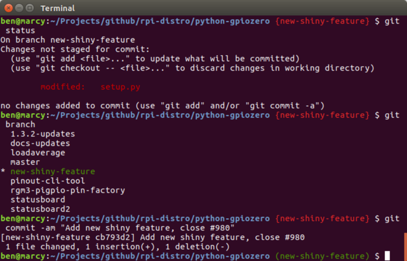
</figure>

## Use issues as a development roadmap

So you're starting a new project. You decide to use GitHub, create a repository, and write a README
with a one-line description of what the project is about. What next? What are you trying to achieve?
Why not post an issue on your project and drive development toward resolving that issue?

GitHub issues aren't just for your users to file bugs, they're also a great way for you, as the
project lead, to create a roadmap for your project. You could start with something small and quickly
achievable, or you could start with your major feature. Some projects start by thinking big.
Ubuntu's bug #1 is *[Microsoft has a majority market
share](https://bugs.launchpad.net/ubuntu/+bug/1)*, which was posted by Mark Shuttleworth in 2004.

It might make sense to post an overview of components your project will have when it is "feature
complete" and closing that issue will be a huge milestone for you. Alternatively, you could start
with something smaller, like the list of features you'd like to see before public release, a
description of a minimal viable product, or even just a single feature you would like to see added
first. Whatever works best for your project; it's completely up to you.

Posting issues on your own repository can help create a roadmap for your project, not just for you
and your team, but for your users and anyone interested in contributing to the project. There are
plenty of ways to manage this (which I'll cover in the following sections), but essentially, you're
simply recording your wish list of future features as issues. When I come up with an idea for GPIO
Zero, I immediately write it up as a GitHub issue ([no matter how unusual I think it
is](https://github.com/RPi-Distro/python-gpiozero/issues/548)). Sometimes it will be dealt with
quickly, by me or another team member. Sometimes the issue stays open for a long time, but the
discussion on the issue will drive decisions.

<figure class="wp-block-image">
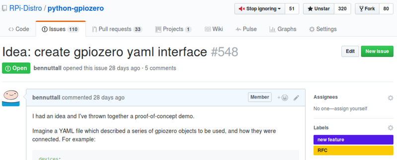
</figure>

This approach is not dissimilar to [test-driven
development](https://en.wikipedia.org/wiki/Test-driven_development) (TDD) in that you start by
writing a test, then you write code to make the test pass. Using test cases to drive your
implementation can be a great way of achieving the API and features you want, focusing on one thing
at a time. An example issue might be: "Users should see their own dashboard when they log in."

It's useful to describe exactly what the end result should look like so that there's something
specific to aim for. In GPIO Zero, I tend to post issues suggesting a new device should be
supported. I detail what the device contains and how it works, then I propose an API I'd like to see
and write code that would work if it were implemented. This helps the developers (who may or may not
be the same person who created the issue) work towards an intended end result and be able to prove
that the issue can be closed by showing that the code I originally suggested now works.

## Make everything a conversation

One of the most important things about managing a project, especially an open source project, is to
make everything a conversation. If you create an issue, people can reply with comments approving of
the issue, making suggestions, and asking questions. You can even reply to your own issue with
further information, which keeps people up to date. Even if you don't really have anything to say,
GitHub lets you respond to a comment with a quick thumbs-up (or similar). The resulting conversation
both informs and documents decision making so that future contributors and stakeholders can gather
full context about the state of the project.

<figure class="wp-block-image">
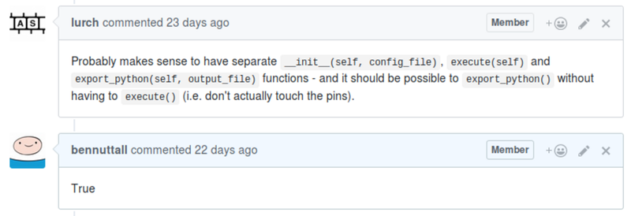
</figure>

## Use checklists to split issues into parts

GitHub issues allow (and encourage) use of
[Markdown](https://github.com/adam-p/markdown-here/wiki/Markdown-Cheatsheet) to format your
comments, and there's even a WYSIWYG toolbar for users unfamiliar with the language to easily format
their replies. Along with bold, italic, and such, you can easily add links, numbered and bulleted
lists, code blocks, and more. You can also use checklists; the format is like a list with checkboxes
by each item. These can be marked as "checked" in the Markdown or physically checked and unchecked
by any user with push rights to the repository. This can be a great way of splitting an issue into
multiple parts and having each of them checked off individually.

<figure class="wp-block-image">
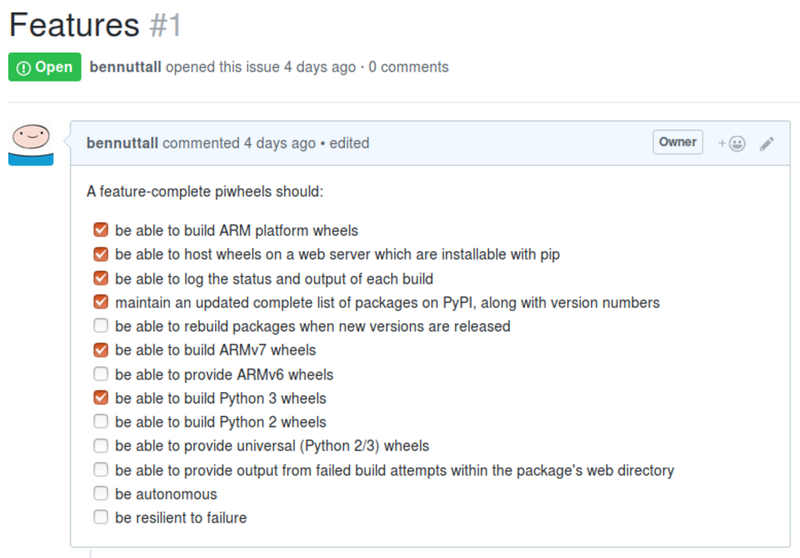
</figure>

## Don't be afraid to ask

One of the most important things I've learned is to not be afraid to ask questions or make
suggestions that you're unsure about. One of the most powerful features of GPIO Zero came out of me
asking (as a GitHub issue on my own project) what I thought was a stupid question. I asked: "[Would
it be possible to do X?](https://github.com/RPi-Distro/python-gpiozero/issues/76)" I almost
discarded the issue before posting, because I felt stupid asking and figured I'd get a
straightforward "no" from my co-author. I did initially, but then he thought about it and came up
with a solution that made my suggestion possible, and which turned out to be really important for
the project.

<figure class="wp-block-image">
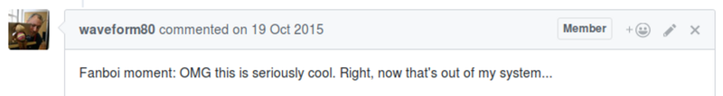
</figure>

On the other hand, if he'd said "no, that's not possible" and closed the issue, it wouldn't have
been the end of the world. Don't be afraid to ask or suggest things you think are out of reach—you
might get there one day. You never know what kinds of thinking your question will spur. If you
consider it an issue, then it's an issue—even if it can't get resolved straight away.

## Close issues

If you think an issue is something that shouldn't be fixed for any reason you see—for example, it is
a misreported bug, has already been fixed, or is something you're not willing to fix (perhaps it's
out of the scope of the project)—you can use the `Close` button on the issue to close it.

Or, if you commit something that resolves an issue, using the issue number in the `commit` message
does two things: First, it links the issue number (e.g., "#1") to the `commit` message on GitHub,
and second, if you use a
[keyword](https://help.github.com/articles/closing-issues-via-commit-messages/) like `close` or
`fix` followed by the issue number, such as:

```
git commit -am "Add user dashboard, close issue #1"
```

then the issue gets closed automatically. For example:

<figure class="wp-block-image">
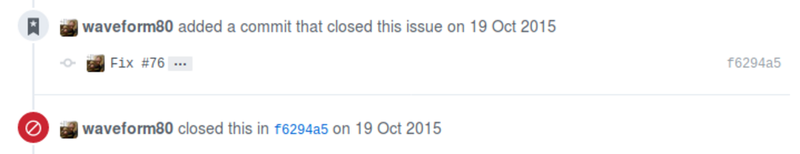
</figure>

You can use the same convention in a pull request. When a pull request is created, it gets a number
just like an issue does (pull requests are issues too). If you make a pull request that closes an
issue, simply use the `close issue #1` format in your pull-request title. If someone else makes
the pull request, you can edit the title to add this information before merging, and the issue will
automatically be closed. Alternatively, you can always click the `Close` button on the issue. And
don't forget you can always reopen an issue once it's been closed.

## Categorize issues with labels

Applying labels to your issues helps you, your contributors, and anyone browsing your project see
the status of each issue or how they can participate. By default, GitHub gives you six color-coded
labels, but you can edit or delete them and add others.

You might want to label issues to say which are bugs, which are feature requests, which are in
progress, which you need help with, which are code issues, which are documentation or test issues,
and so on. You can even use labels to show the difficulty of each issue to make it easy for
contributors to choose something to start working on.

<div class="wp-block-image">
    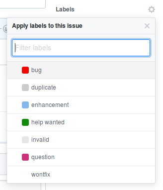
</div>

Without labels, contributors might make the mistake of tackling a complex issue requiring a deep
understanding of the project's codebase, when they might be better off working on something simpler.
You can apply labels, such as an "in progress" label, to make sure new contributors don't start
working on an issue that another developer is working on. You also can assign issues to members of
your team, and GitHub allows you to easily view all issues assigned to a user, which makes it easy
to see what everyone is working on.

## Edit other people's issues

As the owner or a member of a repository, you have permission to edit other people's issues. This,
used sensibly, can benefit your project. For example, users often paste in unformatted code, which
is very hard to read, so I will edit the comment to add fenced code blocks to make it readable for
myself and others. When you make edits, kindly point out your changes to the user in a reply to make
sure they know what you edited and why. Providing tips to your contributors helps them avoid similar
problems in the future and (in the example case) ensures they won't assume GitHub automatically
formats their pasted-in code.

<figure class="wp-block-image">
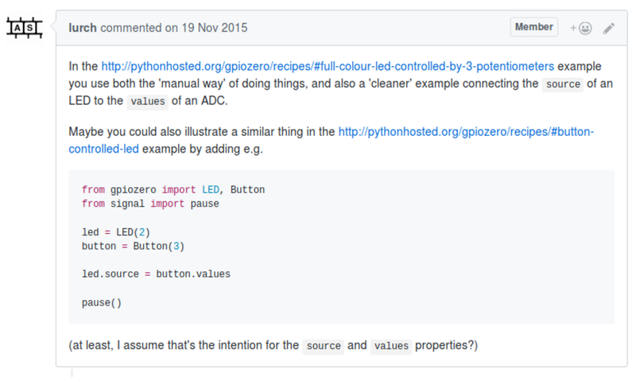
</figure>

GitHub also allows you to lock issues, so if someone is repeatedly replying to a closed issue or
being abusive, you can lock the thread.

## Group issues into milestones

Milestones allow you to group issues together, usually to designate a set of issues required to
constitute a new release or even just a feature set. You can create a milestone, give it a name and
(optionally) a due date, and start to add issues. The checklists of all the issues in a milestone
are automatically checked off as each issue is closed. Issues can be added or removed at any point,
and you can change the due date. You'll always see a percentage showing the progress towards
completion of a milestone.

## Consider project boards to manage workflow

There are many ways to manage your issue backlog when it starts to build up. GitHub provides a tool
called [project boards](https://help.github.com/articles/about-project-boards/) that allows you to
create [Kanban](https://en.wikipedia.org/wiki/Kanban)-style boards of your issues to identify their
status and manage the workflow.

There's also a project called [Waffle](https://waffle.io/) that allows you to create similar boards
from your GitHub issues. Waffle provides a simpler user experience for people to add issues and
comes with tooling to automatically move issue cards between columns, which you can customize.

You might find it useful to use project boards, but they don't work for everyone. Don't feel obliged
to try to make use of every tool available—just find what works for you and your contributors.

## Deal with pull requests

If you're lucky, you might receive pull requests from members of the community. You may find this
helps you; perhaps a user has decided to do some work on your issue backlog or they've identified
and fixed some bugs—great! However, not every pull request will be like this. You may find someone
has worked really hard and contributed something you just don't want, maybe because it's out of the
scope of your project or it overcomplicates things for you. Some pull requests just aren't
helpful—for example, a "I rewrote the app in Go for you" pull request isn't one you're going to rush
to merge.

Some pull requests will be a mix; perhaps they've added two new features—one you want, and one you
don't—and depending on how they did it, you might be able to find a way to resolve this (look up
git [`cherry-pick`](https://stackoverflow.com/questions/9339429/what-does-cherry-picking-a-commit-with-git-mean)).
Sometimes, though, it can be difficult to resolve the pull request without asking them to start
over. If that's the case, explain why, be thankful, and be polite. Try not to ignore them, as this
can lead to disgruntled community members. Even if you're not going to deal with the contribution
right away, just send a quick reply saying thanks.

<figure class="wp-block-image">
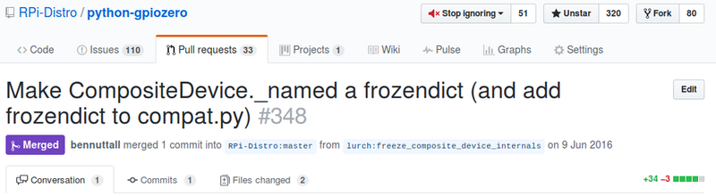
</figure>

Remember, pull requests are issues too, so they have an issue number, and you can close a pull
request with another commit, perhaps one that resolves the issue that the pull request was trying to
resolve (but in a different way). You can (though you don't have to) automatically close both the
issue and the pull request by referencing both issue numbers with "close" keywords. For example, the
following commit closes issue #123 and pull request #124:

```
git commit -am "Add user dashboard, close #123, close #124"
```

You can also give feedback on a pull request and ask the user to make changes, such as if you need
them to add or remove features, apply your own coding standards, or rebase against the latest
version on your master branch. If the user checked the [`Allow edits from
maintainers`](https://help.github.com/articles/allowing-changes-to-a-pull-request-branch-created-from-a-fork/)
box, then you (or anyone with push rights to your project) can push commits to this branch too,
which means you can apply those changes yourself before merging.

Of course, it's OK to turn down pull requests, but it's always best to explain why, be thankful, and
try to ensure future contributors don't waste their time.

## Publish a contribution policy

It's useful to provide a contribution policy for your project. This allows users browsing your
project to learn what your guidelines are, what expectations you have, how you expect people to
interact with the repository, and if there's anything they should do before opening an issue or pull
request.

GitHub provides a standard method of [supplying a contribution
policy](https://help.github.com/articles/setting-guidelines-for-repository-contributors/): Write
your guidelines and publish them in the root of your project (or in a [`.github`
directory](https://github.com/blog/2111-issue-and-pull-request-templates)) in a file called
`Contributing`, `CONTRIBUTING.md`, or similar. When someone goes to create an issue or pull
request, a link to your policy will be shown.

<figure class="wp-block-image">
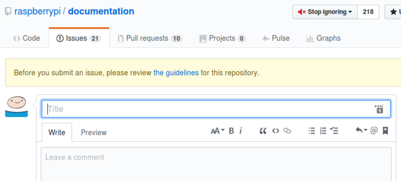
</figure>

## Provide developer documentation

Awesome documentation makes it much easier to get started and make progress with a project. It's
important to provide documentation for your users and make it as accessible as possible. Don't
assume they're as technical as you are—make it easy for people to get started and find out how to
learn more. Write documentation as you go along, and keep it up to date.

<figure class="wp-block-image">
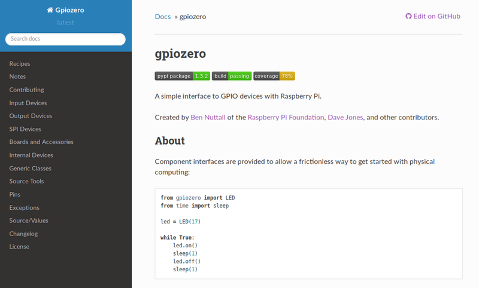
</figure>

However, documentation isn't just for users. If you've ever tried to contribute to another project,
you may have hit a roadblock when trying to set up to work on it. If you have no instructions, you
might run a `git clone` or attempt to run some scripts in the project and see what happens—only to
find lots of missing dependencies and lots of assumptions about what you have installed, or what you
understand about the project, or the tools it uses and how they all work. Just like not providing
user documentation is the easiest way to turn away a potential user, not providing developer
documentation is the easiest way to turn away a potential contributor.

As the project owner, you should consider what a stranger would need to do to be able to get your
project running locally, apply changes to the codebase, run it again, and see the changes in effect.
If you don't give any setup instructions or you assume they have everything you have and know
everything you know, you'll probably lose them quite quickly.

Many developers assume too many things of their users: Linux users assume everyone else is on Linux;
Mac users assume everyone is on a Mac; Python users assume everyone has `pip`, understands
`virtualenv` and a bunch of other tools, and so on. You need to provide a full list of setup
instructions that will work for as many people as possible. You need to assume users don't have all
the tools they'll need, assume they don't understand your codebase, assume they don't know what
`pip` is, start from scratch and help them get where they need to be to start hacking! Try to be
helpful and comprehensive without being condescending.

## Summary

- Create issues to drive your project's development
- Promote conversation around your issues
- Use labels and milestones to organize your issues
- Use other tools to manage your project within GitHub
- Promote and welcome participation
- Ensure participation is as easy as possible
