*My review of the Google OnHub router, and some tips on setting up advanced options like port
forwarding.*

While in the US for a [trip](/blog/2016/12/all-things-open-raspberry-pi-everyone/) in
October, I decided to pick up a [Google OnHub](https://on.google.com/hub/) router, which is only
available in America, and has since been superseded by [Google
WiFi](https://madeby.google.com/wifi/), also only available in America. There are two different
routers available with this brand name – one made by ASUS, the other by TP-Link. I have the TP-Link
model.

**The OnHub is the best router I've ever owned.** It's channel-hopping and will seamlessly switch
you between 2.4GHz and 5GHz with a single SSID. My desktop is two floors up from the router and its
WiFi connection is *solid* (just as good as wired), which is really handy. The OnHub's a little
unique, in that there's no web interface to its configuration – it's all done within an app. This
has its positives and negatives, and had made a lot of nerdy friends of mine shriek at the idea, but
it certainly does make things easy. You can add other users to be a "manager" of the hub, which
allows them to control it from the app too.

<figure class="wp-block-image">
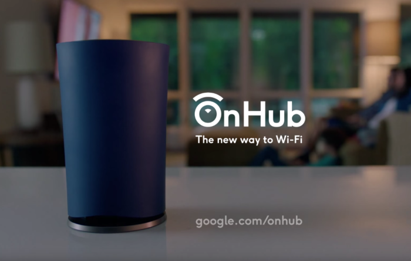
</figure>

It's important to note that the OnHub is only a router, not a modem. It only has an Ethernet port
for connection in – no DSL/ADSL/VDSL, so you have to use a modem, or another router, plugged into
the wall, then connect to that with an Ethernet cable. You *can* use it to connect directly to your
ISP (still via the modem), but that doesn't seem to be possible at the point of setup. It assumes
you have already connected it to the internet at this point – it expects a working internet
connection provided by your modem. But if you want to reconfigure it later, you can (that was an
important step for me – port forwarding wasn't possible until I reconfigured).

You start by installing the app, available for Android and iOS (the app is now [Google
WiFi](https://play.google.com/store/apps/details?id=com.google.android.apps.access.wifi.consumer)),
and you tell it you want to set up a new WiFi point. The whole setup is done from the app: you
connect wirelessly to the hub, choose your SSID name and password and that's about it. You then
manage the hub from the app – via the internet, not via the LAN. So you can manage it remotely using
your phone, but you *cannot* plug an Ethernet cable in and configure it in a browser. It's a shame
configuration is limited to the app – a browser-based version would be really useful – over the
internet and locally. The app can tell you the status of your network while you're away from home
too:

<figure class="wp-block-image">
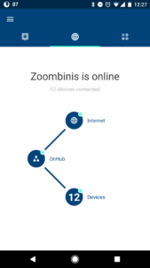
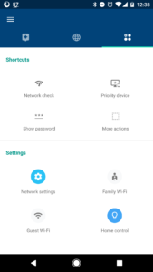
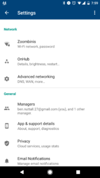
</figure>

I've always preferred a wired connection to wireless, as it tends to be faster, and way more
reliable. But with the OnHub I'm more than happy not to have had to run Ethernet cables all over my
house, because the speed and reliability are spot on – it wouldn't be worth cabling. It's also handy
as I use a lot of Raspberry Pis day-to-day, and the [Pi
3](https://www.raspberrypi.org/products/raspberry-pi-3-model-b/) and the new [Pi Zero
W](https://www.raspberrypi.org/products/pi-zero-w/) both have decent 2.4GHz WiFi so I can easily
connect to them without worrying about wiring them all up. This is also the perfect time to mention
that the app shows you all the devices on your network, and their IP address (all in the
192.168.86.x range), which makes it easy to connect to a headless Pi I just plugged in:

<figure class="wp-block-image">
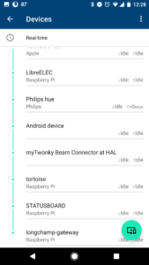
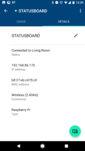
</figure>

It's really easy to reserve IPs for your devices:

<figure class="wp-block-image">
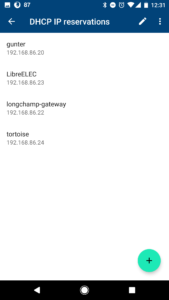
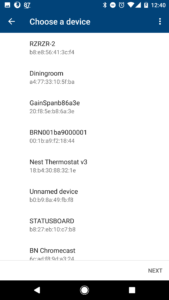
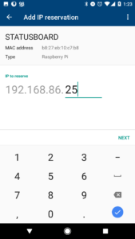
</figure>

The one difficulty I had was with **port forwarding**. Now, in theory, this is dead simple. The app
has a "port forwarding" option in the menu, and it's completely intuitive. You have to reserve an IP
for your device in order to set up port forwarding, but that's no problem. Any rules I set up just
didn't seem to work, and I didn't understand why.

<figure class="wp-block-image">
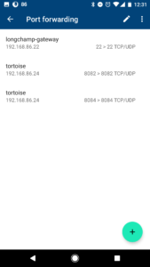
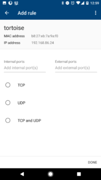
</figure>

Of course, searching online for help only gave me [simple
instructions](https://support.google.com/wifi/answer/6274503?hl=en) using the app – exactly what I'd
done. But I figured something was missing. Originally, I'd been using the Plusnet router from my ISP
as the modem, and just connecting the OnHub to it directly, but of course this meant that the
PlusNet router was handling port forwarding requests. I reconfigured this router into its "modem"
mode – but still no luck. I replaced it with a simpler modem, the [Netgear
DM200](http://www.netgear.co.uk/home/products/networking/dsl-modems-routers/DM200.aspx). Annoyingly
the DM200 had both modem-only and router+modem modes too, so I switched to modem mode and simply
couldn't get it to work.

It was suggested to me (thanks [Dave](https://twitter.com/waveform80)) to see if the OnHub had a
**PPPoE mode**, as that would allow me to configure it with my ISP's login credentials. Setting up
PPPoE mode wasn't easy, as you have to take the OnHub offline to do it. But the key was that
previously, the hub's own WAN IP was a local IP, given by the Netgear modem, but that in order to
deal with outside requests, needed to be an external IP. I needed to give it my ISP's info.

<figure class="wp-block-image">
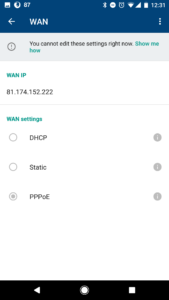
</figure>

I tried this, and ended up having to restart the setup procedure on both devices multiple times, but
eventually, managed to get it sorted – and port forwarding worked at last! I then had a working SSH
gateway, and [online tortoise cam](https://github.com/waveform80/pistreaming/):

<figure class="wp-block-image">

</figure>

<figure class="wp-block-image">
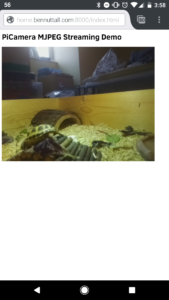
</figure>

The app also lets you perform a speed test, both on your internet connection and WiFi speed, and you
can see historical data on your average speed each day:

<figure class="wp-block-image">
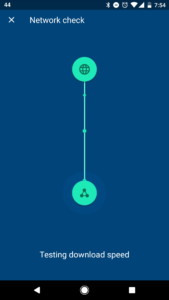
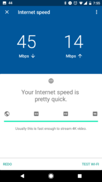
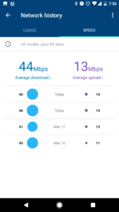
</figure>

The OnHub only has a single Ethernet port for connecting another device, so if you need to connect
more than one wired device, you'll need a hub.

The OnHub is quite pricey, but you get one hell of a router. I paid about $125 for it. You can't
really buy them any more, but Google WiFi costs about the same. It's not clear to me what the
differences are. People say the WiFi is superior, but they seem to recommend you get 3 of them and
mesh them – so 3x the price of the OnHub... but perhaps this isn't absolutely necessary. If it's
anything like the OnHub then one will reach all corners of a regular sized house just fine.
