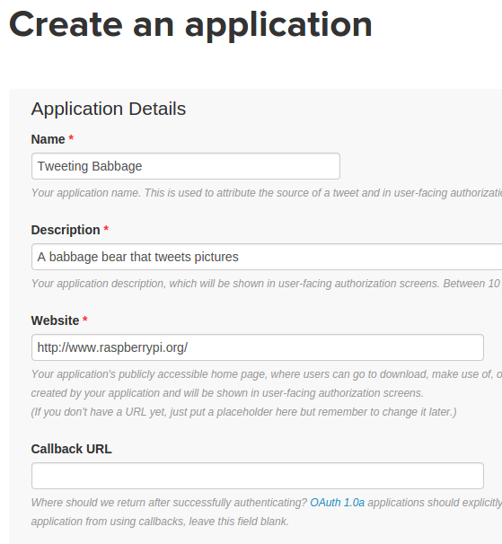

Twitter is a wonderful communication and social media platform. It has everything: breaking news,
political opinion, humor, celebrities, entertainment, special interest chat, and, well, anything.
Individuals, companies, departments, projects, and more—really anyone or anything—can have a Twitter
account. Some Twitter accounts are not even run manually by a person or a group of people—they're
automated bots.

It's very simple to write a [Twitter bot](https://en.wikipedia.org/wiki/Twitterbot) using Python —
and a Raspberry Pi is the perfect tool to run the code; rather leaving a PC or laptop switched on
permanently, you can leave your Raspberry Pi running 24/7 and hardly any power will be used. That
said, if you don't have a Raspberry Pi, most of this tutorial will still work for you on a PC.

## Getting started with the Twitter API

Twitter is a web service that provides an application programing interface (API), which means you
can write software that communicates with the live Twitter service—perhaps to read tweets in real
time or to automatically publish tweets.

The API is free to use, but you have to have a Twitter account and to register your application in
order to get access to the API, but that's easy enough.

Start by going to [apps.twitter.com](https://apps.twitter.com/). Create a new app by completing the
required fields—ensure you select `Read and Write` under your app's permissions. This will
generate a `Consumer key`, `Consumer secret`, `Access token`, and `Access token secret`.
You'll need these four keys to connect to your Twitter account from your Python code. Don't share
these keys with anyone, as they can be used without the account's password. If you share your code
online, *make sure you don't include these keys*.



To access the Twitter API from Python, you'll need to install the
[Twython](https://github.com/ryanmcgrath/twython) library. Install this using
[pip](https://pypi.python.org/pypi/pip) in a terminal window:

```
sudo pip3 install twython
```

Open your Python editor and create a new file. Save it as `auth.py` and insert your own API keys
into this example code:

```python
consumer_key        = 'ABCDEFGHIJKLKMNOPQRSTUVWXYZ'
consumer_secret     = '1234567890ABCDEFGHIJKLMNOPQRSTUVXYZ'
access_token        = 'ZYXWVUTSRQPONMLKJIHFEDCBA'
access_token_secret = '0987654321ZYXWVUTSRQPONMLKJIHFEDCBA'
```

In another file, write this simple program to test whether you can send a tweet:

```python
from twython import Twython

from auth import (
    consumer_key,
    consumer_secret,
    access_token,
    access_token_secret
)
twitter = Twython(
    consumer_key,
    consumer_secret,
    access_token,
    access_token_secret
)
message = "Hello world!"
twitter.update_status(status=message)
print("Tweeted: {}".format(message))
```

Save and run this file. It should send a tweet saying "Hello world!" from your account.


If you get an error, check that your API keys were copied correctly.

Now try adding some randomness to your program. Add the `random` module at the top:

```python
import random
```

Add a list of messages, and select one at random:

```python
messages = [
    "Hi Twitter",
    "Hello from Python",
    "Hello from my Raspberry Pi",
    "I'm a bot",
]
```

Then change your code to pick a random message from the list before tweeting it:

```python
message = random.choice(messages)
```

You might also want to try tweeting images:

```python
message = "Hello world - here's a picture!"
with open('/home/pi/Downloads/image.jpg', 'rb') as photo:
    twitter.update_status_with_media(status=message, media=photo)
```

## Reading Twitter

In addition to using Python to send tweets, you can also read tweets using the `TwythonStreamer`
class:

```python
from twython import TwythonStreamer
from auth import (
    consumer_key,
    consumer_secret,
    access_token,
    access_token_secret
)
class MyStreamer(TwythonStreamer):
    def on_success(self, data):
        if 'text' in data:
            print(data['text'])
stream = MyStreamer(
    consumer_key,
    consumer_secret,
    access_token,
    access_token_secret
)
stream.statuses.filter(track='raspberry pi')
```

This code tracks all tweets containing the phrase "raspberry pi." When it finds a tweet, it sends a
collection of data about the tweet into the `on_success` method. `Data` is a dictionary
containing the tweet text, along with lots of metadata. Here, we just printed out the tweet
contents. You can leave it running, and it will run the `on_success` method every time a new tweet
matches the search. This could be a word, a phrase, or a hashtag.

This example prints out the username of the account that tweeted, as well as the tweet contents:

```python
class MyStreamer(TwythonStreamer):
    def on_success(self, data):
        if 'text' in data:
            username = data['user']['screen_name']
            tweet = data['text']
            print("@{}: {}".format(username, tweet))
```

For more information, see Raspberry Pi's learning guide on [using the Twitter API with
Python](https://www.raspberrypi.org/learning/getting-started-with-the-twitter-api/).

If you want to have your Twitter bot code run 24/7, you can install it on a web server, run it on a
Raspberry Pi at home, or even use a [hosted Raspberry Pi](https://www.mythic-beasts.com/order/rpi).

## Physical components


With a Raspberry Pi, you can easily add physical components, such as buttons and LEDs, to your
Twitter program. For example, you could set it to send a random tweet when a physical button is
pressed:

```python
from gpiozero import Button

button = Button(2)

button.wait_for_press()
message = "Hello world!"
twitter.update_status(status=message)
print("Tweeted: {}".format(message))
```

Or tweet a [Sense HAT](https://www.raspberrypi.org/products/sense-hat/)'s temperature reading:

```python
from sense_hat import SenseHat

sense = SenseHat()

message = "The temperature is currently {:2.2f} 
degrees".format(sense.temperature)

twitter.update_status(status=message)
```

Or light up an LED when a tweet matches a search:

```python
from gpiozero import LED

led = LED(3)

class MyStreamer(TwythonStreamer):
    def on_success(self, data):
        if 'text' in data:
            led.on()
            username = data['user']['screen_name']
            tweet = data['text']
            print("@{}: {}".format(username, tweet))
            sleep(10)
            led.off()
```


Or scroll the tweet on a Sense HAT display:

```python
from sense_hat import SenseHat

sense = SenseHat()

class MyStreamer(TwythonStreamer):
    def on_success(self, data):
        if 'text' in data:
            username = data['user']['screen_name']
            tweet = data['text']
            sense.show_message("@{}: {}".format(username, tweet))
```

For more information on physical computing with Raspberry Pi, see my articles on GPIO Zero and the
Sense HAT. You can also make a tweeting Raspberry Pi camera project by following the
[Tweeting Babbage](https://www.raspberrypi.org/learning/tweeting-babbage/) tutorial on Raspberry Pi
Learning Resources.

## Real Twitter bots

Some time ago I created a Twitter bot called `pyjokes` that tweets out geeky jokes from a Python
module I maintain. The code is very straightforward:

```python
import pyjokes

joke = pyjokes.get_joke()
twitter.update_status(status=joke)
```

I simply use [Cron](https://en.wikipedia.org/wiki/Cron) to schedule the task to run.

Follow [@pyjokes_bot](https://twitter.com/pyjokes_bot) for hilarious one-liners. You can read more
about pyjokes on the project website [pyjok.es](https://pyjok.es/), and you can see the code for the
Twitter bot [on GitHub](https://github.com/pyjokes/pyjokes-bot).

I recently made another Twitter bot that tweets [on this day](https://twitter.com/raspberrypi_otd)
links to previous years' content from the Raspberry Pi Foundation's blog.


It's a little more complex because it maintains a (single-table) database of all the historical blog
posts, but the bot code is very simple. It just queries the database for all posts with a date
matching the current date's month and day, picks one at random, and tweets out the year, title, and
a link:

```python
date = datetime.now().date()
month = date.month
day = date.day
posts = db.get_posts_on_date(month=month, day=day)

post = random.choice(posts)

year = int(post['year'])
title = html.unescape(post['title'])
slug = post['slug']
url = 'https://www.raspberrypi.org/blog/{}'.format(slug)

tweet = "On this day in {}: {} {}".format(year, title, url)
print('Tweeting: {}'.format(tweet))
twitter.update_status(status=tweet)
```

You can follow this feed [@raspberrypi_otd](https://twitter.com/raspberrypi_otd) and see the bot's
code [on GitHub](https://github.com/bennuttall/rpi-otd-bot).
