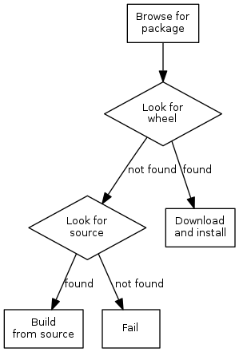
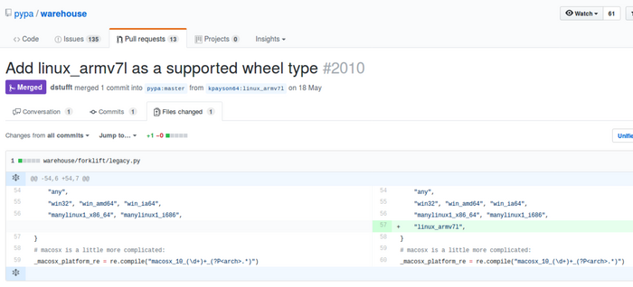
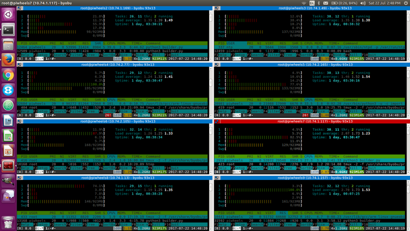
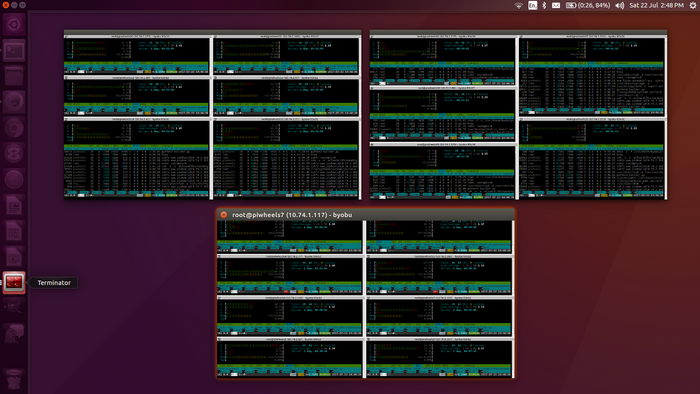
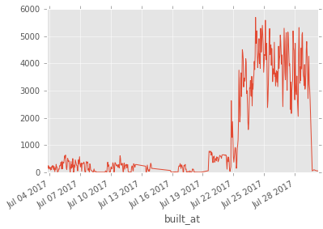
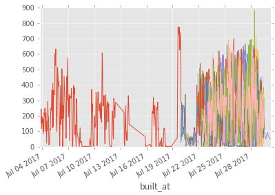
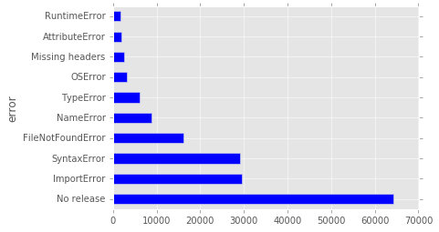

*The title may have given away the article contents, but feel free to read on pretending you don't
know the ending. Background: I work for the Raspberry Pi Foundation and I do a lot of Python stuff
on Raspberry Pi. I presented this project recently in a lightning talk at EuroPython.*

## Motivation: space

If you didn't already know, there are two Raspberry Pis on the International Space Station, as part
of a programme we run called [Astro Pi](http://astro-pi.org/). They went up with British ESA
astronaut [Tim Peake](https://twitter.com/astro_timpeake) in 2015. They're both Pi 1 Model B+. They
have [Sense HATs](https://www.raspberrypi.org/products/sense-hat/) (a particular sensor board we
made especially for this mission) housed in [space-grade aluminum
cases](https://astro-pi.org/about/hardware/flight-case/). We run competitions for kids to write
Python code on Raspberry Pis and Sense HATs in school (or in an emulator we provide) that gets run
in space.

Anyway, my excellent colleague [Dave](https://twitter.com/dave_spice), who runs the programme, asked
me for help one day. They'd just finished a competition cycle, and some of the kids' code had
third-party library dependencies. He needed to be able to install new libraries on the Pis in space.
The Pis are actually connected to the space station LAN, but not to the internet. So `pip install`
isn't an option. The only thing we can do is provide ESA with files and instructions.

He said "is there a way we can install these libraries offline?" I said "Yes, I think you can build
wheels for the libraries, and install from the wheel files". We tested it and it worked as expected.
It took a long time, because some of the packages had their own dependency requirements. But since
there was no way of excluding the libraries we *already* have available (without traversing the
dependency tree and comparing manually), we just let it build them all. This included numpy. As I
said, these are Pi 1s, so they're ARMv6. We had to build on a Pi 1 to get an ARMv6 tagged wheel. It
took 2 hours 30 minutes to build numpy alone. But we kept busy...

<figure class="wp-block-image">
<a href="https://xkcd.com/303/"></a>
</figure>

## PyPI and Python wheels

When you install a package from PyPI (the Python Package Index) using pip, for example
`pip install numpy`, it downloads the package and installs it on your system. If the package is
implemented in Python, this is usually quite quick. However, if (like numpy), the package is
implemented in C, then you have to compile the C code and build it before you can install it. pip
handles this for you, but it can sometimes take a long time to build a package. A general solution
to this exists: [Python wheels](http://pythonwheels.com/).

Wheels are pre-built binaries package maintainers can use to distribute pre-built versions of their
packages to save users having to build packages themselves. If a wheel has been provided by the
maintainer, then pip downloads the wheel (the built distribution) instead of the source distribution
(a tarball or zip), and this speeds up the installation process.

However, wheels for packages implemented in C are architecture-specific: a wheel will only work on
the architecture on which it was complied: e.g. a wheel built on Windows x86 will not work on a
Windows x86_64 machine. This does not apply to pure Python packages, which are tagged with
architecture `any`. Not all package maintainers [choose to distribute
wheels](http://pythonwheels.com/) at all, and those who do are likely to only provide wheels for
architectures they have the means to build for. Maintainers of popular packages like
[numpy](https://pypi.python.org/pypi/numpy) which take a long time to build from source tend to
provide wheels for a variety of common architectures. For example, numpy distributes wheels for many
combinations of:

- Windows x86
- Windows x86_64
- Mac x86
- Mac x86_64
- Linux x86
- Linux x86_64

for each version of Python they support (2.7, 3.4, 3.5 and 3.6). There are 22 wheels in total, plus
the source zip.

When you build a wheel, the filename is made up of a number of parts:

- The package name
- The package version
- The Python tag (e.g. `cp34`)
- The ABI tag (e.g. `cp34m`)
- The platform tag (e.g. `linux_armv7l`)

Hence: `numpy-1.13.1-cp34-cp34m-linux_armv7l.whl`

Read more in [PEP-425](https://www.python.org/dev/peps/pep-0425/).

The problem is:

- Building numpy on a Raspberry Pi 3 takes about 20 minutes
- Building numpy on a Raspberry Pi 1 takes about 2 hours 30 minutes

When you type `pip install numpy`, the flow goes like this:

<figure class="wp-block-image">

</figure>

So, you're on a Raspberry Pi. You type `pip install numpy`. It goes through the flow shown above.
But there's no wheel matching your architecture: you're not `manylinux_x86`, `manylinux_x86_64`, or
any of the others. You're actually `linux_armv7l`. So PyPI says "Here's the source. Build it
yourself".

*What? This is an outrage! Don't the maintainers of numpy care about Raspberry Pi users?*

Well, even if they did, they can't do anything about it because PyPI doesn't allow uploading ARM
wheels. There's an architecture tag whitelist, and it's not on the list.

*What? This is an outrage! Don't the maintainers of PyPI care about Raspberry Pi users?*

Well, I'll get to that.

What's worse is when packages only provide wheels. That's fine if you're on an Intel machine,
there'll probably be a matching wheel for your architecture. But if you're on ARM, there's no source
to fall back to, so you can't even build it yourself. An example of this is
[tensorflow](https://pypi.python.org/pypi/tensorflow/): 12 wheels, no source. There's a [project on
GitHub](https://github.com/samjabrahams/tensorflow-on-raspberry-pi) where a member of the Pi
community has documented how you build tensorflow, and he distributes the wheel.

## Fine, I'll build my own package repository...

<figure class="wp-block-image">

</figure>

So, enter piwheels.

After solving the one-time space problem for Dave, I considered whether a more permanent, automated
solution was possible. *Surely I can just build them all?*

The command `pip wheel numpy` will build a wheel of numpy. If you do it on a Raspberry Pi 3, it will
build a Raspberry Pi 3 compatible wheel you can distribute.

Well, if I did this, I'd want to do it in Python, not in a bash script. *A quick google yields a
[stack overflow answer](https://stackoverflow.com/a/15950647/806889) about using `import pip`.*

Well, if I did this I'd need to access the list of all packages on PyPI. *A quick google search
yields a [stack overflow answer](https://stackoverflow.com/a/30787985/806889) about accessing a list
of all packages on PyPI.*

Well, if I did this I'd want to maintain a database of packages, and the output from build attempts.
*And so on...*

## piwheels v1

I [started in
April](https://github.com/bennuttall/piwheels/commit/aad101114a8a94ea790dcc620ab3a8ca0e2d7d3f) with
a Pi 3 in my living room, running Raspbian Jessie Lite (a minimal server image). I read up on
hosting a custom PyPI server and it turns out the minimum you can do is provide a directory listing,
like Apache does by default. I built some wheels, and put them in `/var/www/html/{package}/` and
tested installing them, telling pip to install from the IP address of the Pi. Installing numpy took
just a few seconds!

I created a little Python project which could build a wheel from a given package name, store the
build success and the output data in a postgres database, and move it to the right place in the web
directory. I created a packages table and before long I was performing a full build run, iterating
over a list of packages, and storing the output in a builds table. At the time there were 106,000
packages on PyPI.

I added some features, I hit some snags, but things were going well. I started adding up the
cumulative build time, and I estimated it would take 10 days to complete the run. I thought "that's
not bad", and kept it going. Occasionally the build would get stuck, or something would go wrong,
and I'd lose some build time, but I would patch and keep moving. I created a web index which was
populated with some build statistics so I could keep an eye on it. I even built individual package
pages with the build output so you could browse it and see why things failed.

My estimate was correct: it took 237 hours (just under 10 days) in total (though a few weeks in real
time, with it breaking on occasion). I got a 76% success rate – seeing a range of reasons for
failure: missing dependencies, Python 2 only, and so on.

I was only building the latest version of every package, and so I knew I would need to keep up with
new releases, but that seemed feasible. Then I realised that version numbers often differed between
what PyPI had and what the output wheel file contained, and had some issues around working out which
packages needed updating. And then it occurred to be that rather than only hosting the *latest
version of every package*, I probably needed *every version of every package*.

I left the project sitting for a while, took a break and considered what to do next. Meanwhile, some
Google developers working on packaging some Python libraries for the Google assistant API for the
[Google AIY kit](https://aiyprojects.withgoogle.com/) for the Pi got in touch to say they'd come
across piwheels and thought it was great. They asked how I was going to market it to maintainers to
upload ARM wheels to PyPI. I said "I'm not – because they can't upload ARM wheels – PyPI doesn't
allow it". So one of them filed an [issue on
warehouse](https://github.com/pypa/warehouse/issues/2003) (the next generation PyPI project) and
Donald Stufft accepted the suggestion and made the change to allow ARMv6 and ARMv7 wheels. Thanks
both!

<figure class="wp-block-image">
<a href="https://github.com/pypa/warehouse/issues/2003"></a>
</figure>

This means you can now upload ARM wheels to PyPI, if you set the repository URL in your `~/.pypirc`
file to:

```
repository=https://upload.pypi.io/legacy/
```

Yay! But that doesn't make piwheels redundant. Most maintainers won't bother uploading ARM wheels.
piwheels aims to build everything.

## piwheels v2

Raspberry Pi's web hosting provider, [Mythic Beasts](https://www.mythic-beasts.com/), are local to
Cambridge, and its directors and staff can often be found working from nearby pubs. I happened to
notice Pete, one of the company directors, was in the Haymakers one evening, and I talked him
through my project. Mythic Beasts provide [Raspberry Pi 3
hosting](https://www.mythic-beasts.com/order/rpi): they have a rack of Pis in their London data
centre and they rent them out like regular servers. He was thinking what I was thinking: let's put
this in the cloud. *There is no Raspberry Pi cloud, just other people's Raspberry Pis*. He gave me
access to one. I was very impressed with the ease of use: it was easy to order, and I was shelled
into it within minutes.

I started prepping it to be a piwheels server, and did some work on refactoring the code, writing
some documentation of the configuration and writing a test suite. I wanted v2 to be a nicer
open-source project people could easily contribute to. I wanted it to be easy to reconstruct the
whole thing on a Pi, and make it possible for people to run a version of it on their PC so they
could play around, contribute something and send a pull request with confidence. I spent lots of
time not building anything, just casually working on the codebase.

I provisioned the cloud Pi, and ran a script to update the database with a full list of packages,
and introduced a new table for package versions, populating that with references to every version of
every package. This took a day or two to complete, and I discovered that there were around 750,000
package versions on PyPI. At the rate I was building before, that would take around 70 days – which
isn't terrible, but I wanted to be finished quicker than that. In the first few days I noticed
builds were taking even longer than I expected – some of the exact same packages I had built on my
Pi at home were now building slower than before. I asked Pete about it and he said it would be due
to the fact the cloud Pis are
[netbooted](https://www.raspberrypi.org/blog/pi-3-booting-part-ii-ethernet-all-the-awesome/), rather
than run from an SD card, and it will be suffering from IO bandwidth. So at this rate I estimated
100 days.

I went to EuroPython, and left it running the whole time. It was going very slow, less than 1% a day
as expected. I chatted with a few people about the project, and they seemed interested in the idea.
I gave a [lightning talk](https://speakerdeck.com/bennuttall/piwheels-lightning-talk), and had a
couple of people express interest in it. Both suggested cross-compiling. I had my reservations about
this, as it's not all about speed: it's about reliability and compatibility. I know these packages,
built on a Pi 3 will work on a Pi 3. And of course, I want to [*eat my own dog
food*](https://en.wikipedia.org/wiki/Eating_your_own_dog_food).

Then I met Pete in the Devonshire (another local pub), and proposed a solution: I said "I've done
the maths, and it will take 100 Pi days. With one Pi it will take 100 days. With 2 Pis it will take
50 days, with 10 Pis: 10 days. Can I have access to more Pis, for just a week or two?". He said that
was fine – and kindly gave me enough credits on my account to fire Pis up at will. I started with a
second Pi, provisioned it like the first, but without the web server and the database. Instead, I
let it connect to the database on the first Pi. Before long, they were both building simultaneously.
I added a third Pi, and started making a provisioning script. I got that running too, and then took
it up to five. "I'll be done in no time", I thought. But the output I was getting was... about the
same as one Pi.

<figure class="wp-block-image">

<figcaption>Using terminator to monitor all the Pis at once</figcaption>
</figure>

I analysed what was going on and realised this didn't scale (as is). The Pis were all querying the
database for which package to build next, and that query was taking a long time. My friend
[Dave](https://twitter.com/waveform80) (not the space one, a different one) chipped in with some
query optimisations, and then created a simple queuing system with zeromq. I deployed this and it
worked like magic: five Pis building in harmony, each as fast as the first one was originally. We
ended up retiring the original Pi from building duties and made it the "master". I quickly doubled
my count to ten Pis, and again to twenty. Provisioning was faster as they didn't need DB credentials
and adding to master's iptables any more.


<figure class="wp-block-image">

<figcaption>ALL the cloud Pis</figcaption>
</figure>

I completed about 12% in the next 24 hours – it was just a matter of time now! I tweaked the web
index stats page and excitedly monitored the countdown. Today, the build completed its full run! It
took about 150 days of build time in total, which is more that anticipated due to the occasional
duplicates from the different Pis.

You can now install packages from the piwheels server using:

```
sudo pip3 install <package> -i https://www.piwheels.hostedpi.com/simple
```

or as an additional index:

```
sudo pip3 install <package> --extra-index-url https://www.piwheels.hostedpi.com/simple
```

*Note: piwheels is now hosted at [www.piwheels.org](https://piwheels.org)*

## The results

- Total packages: 113, 649
- Package versions: 752, 817
- Build success rate: 76%
- Total cumulative time spent building: 156 days, 18 hours (including duplicates)
  - In real time this was 26 days:
    - 16 days with 1 Pi building
    - 10 days with up to 19 Pis building
- Total disk usage from wheels: 250GB

Some graphs Dave generated from the build data:

<figure class="wp-block-image">

<figcaption>Builds over time</figure>
</figure>

You can see the first two weeks of build time with a single Pi, then it quickly ramped up as we
introduced more Pis.

<figure class="wp-block-image">

<figcaption>Builds per Pi over time</figure>
</figure>

Reasons for failure: some releases are registered but nothing is uploaded, so there's nothing to
build. Then there are a fraction of import errors, synax errors and so on:

<figure class="wp-block-image">

<figcaption>Reasons for failure</figure>
</figure>

### Tags

Python tag:

- **py3**: 601, 405
- **py2.py3**: 112, 534
- **cp34**: 15, 693
- others redacted

ABI tag:

- **none**: 715, 081
- **cp34m**: 15, 548
- **noabi**: 1 (oddly, this was the [wheel](https://pypi.python.org/pypi/wheel) package)

Platform tag:

- **any**: 715, 062
- **linux_armv7l**: 15, 561
- **manylinux_armv7l**: 6
- **noarch**: 1 (again, [wheel](https://pypi.python.org/pypi/wheel))

See more analysis in Dave's [Jupyter
notebook](https://github.com/waveform80/piwheels-analysis/blob/master/analysis.ipynb).

### People do stupid things

Blindly running other people's software can be risky. Even though I'm just running their `setup.py`
to build it, not actually installing their package, funny things can happen:

- Random files created in my home directory
- Random stuff appended to my `.bashrc` file
- Some people run `git clone` in their `setup.py`
  - Seriously. The number of times I checked on a builder to find it waiting at a github.com
    username prompt...
- Inadvertently importing numpy, even though they don't need to, and failing.
  - For example, in `setup.py`: `from mypackage import __version`
  - This then imports their main library file, just to get the version number. The file contains
    `import numpy`, because their library uses it. However, I don't need numpy in order to build the
    package. There's a difference between *build dependencies* and *user dependencies*. Your
    package's build script shouldn't have unnecessary dependencies, and fall over when something
    like numpy (which isn't used) isn't installed.

## What's next?

- Continue to keep up with new releases by maintaining a small number of builders
- Add [SSL](https://www.mythic-beasts.com/support/domains/letsencrypt_dns_01) to web domain (done!)
- Create individual package pages with build output
- Install key dependencies and rebuild failures, based on analysis
- Rebuild all packages tagged with `py34` for Python 3.5, 3.6 and maybe 2.7.
- Ensure ARMv6 wheels are available too
  - You can just rename an ARMv7 wheel and it'll work on ARMv6. I'll present a duplicate of the file
    with the right platform tag where necessary, and that should work fine. Note that this is not
    required for Pure Python packages as they are tagged with `any` as the platform.
- Add the piwheels URL to pip's config in Raspbian so that everyone gets wheels for free (zero
  marketing required)

## Thanks

Huge thanks to Mythic Beasts for providing me with the cloud Pis.

<a href="https://www.mythic-beasts.com/order/rpi"></a>

Thanks also to [Dave Jones](https://twitter.com/waveform80) for his contributions.

## Links

- The piwheels server: [www.piwheels.org](https://www.piwheels.org/)
- piwheels on GitHub: [github.com/bennuttall/piwheels](https://github.com/bennuttall/piwheels)
- Analysis:
  [github.com/waveform80/piwheels-analysis](https://github.com/waveform80/piwheels-analysis/blob/master/analysis.ipynb)
- Mythic Beasts Raspberry Pi 3 servers:
  [mythic-beasts.com/order/rpi](https://www.mythic-beasts.com/order/rpi)
- Follow me on Twitter: [@ben_nuttall](https://twitter.com/ben_nuttall)