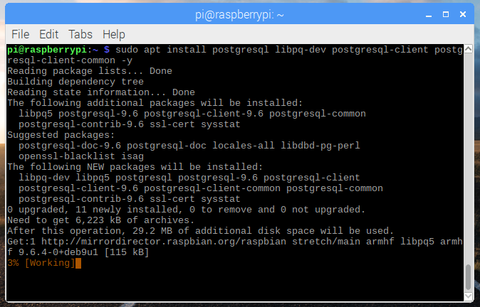
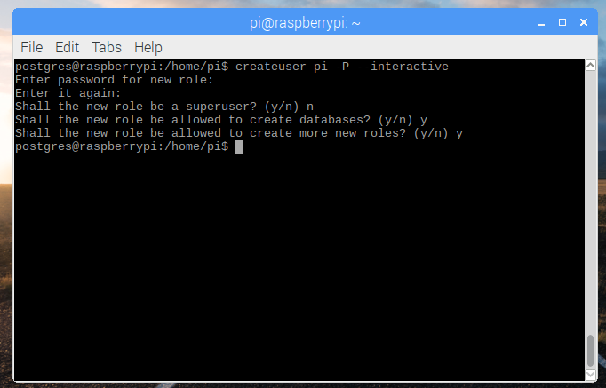
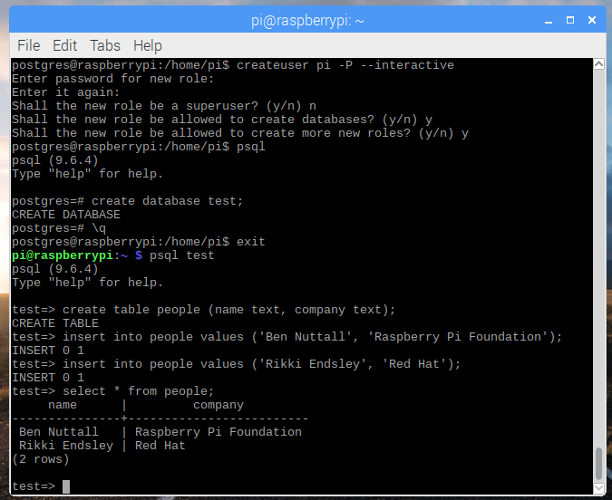
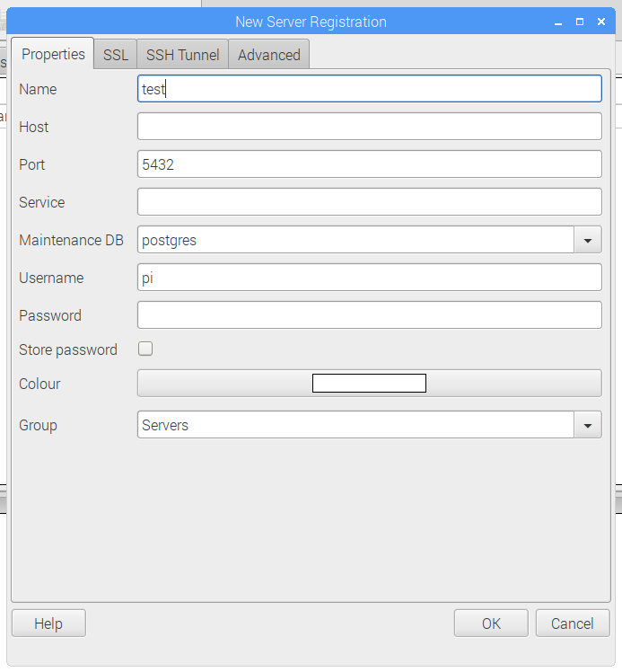
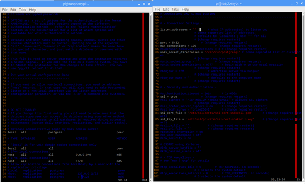
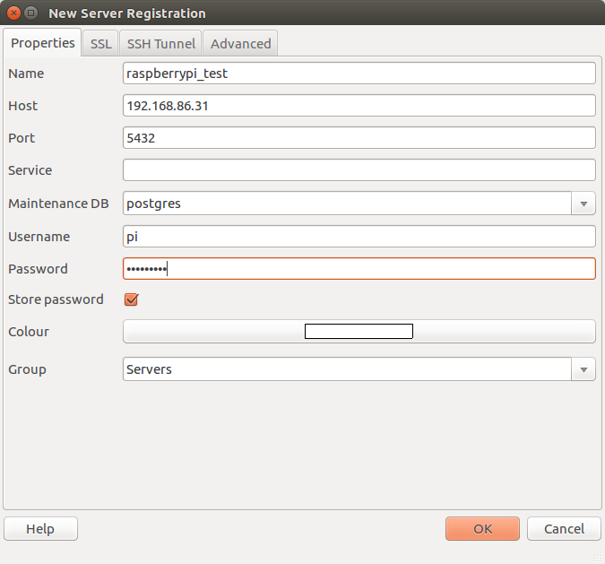
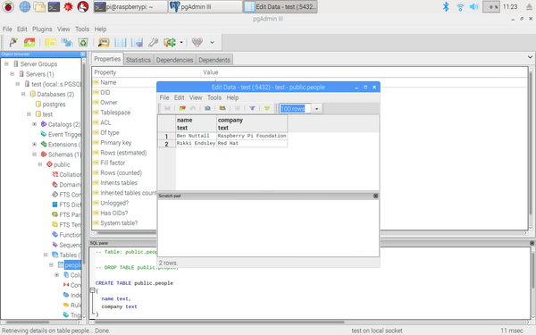
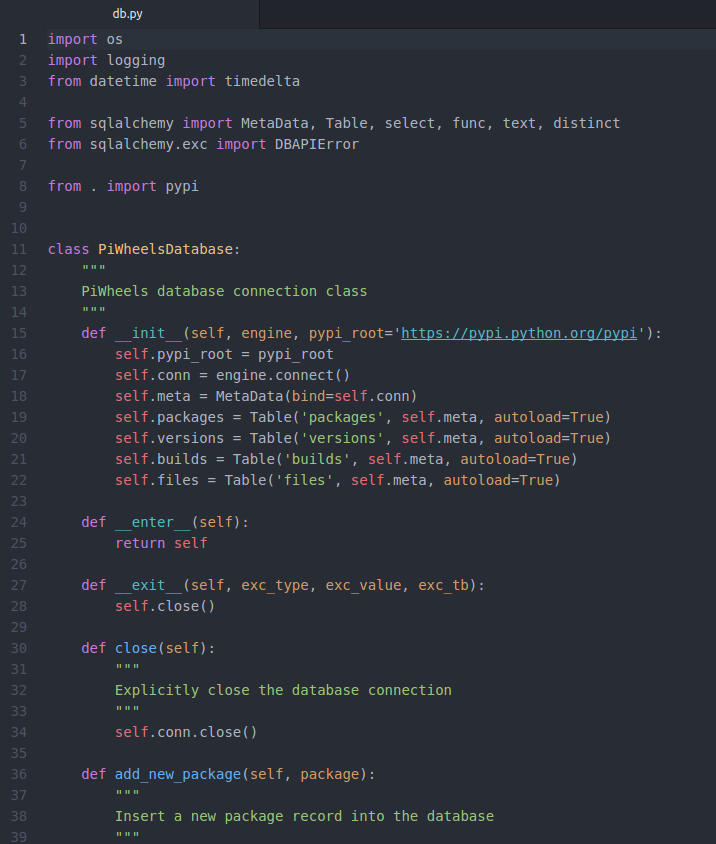

Databases are a great way to add data persistence to your project or application. You can write data
in one session and it'll be there the next time you want to look. A well-designed database can be
efficient at looking up data in large datasets, and you won't have to worry about how it looks, just
what you want it to find. It's fairly simple to set up a database for basic
[CRUD](https://en.wikipedia.org/wiki/Create,_read,_update_and_delete) (create, record, update,
delete) applications, which is a common pattern, and it is useful in many projects.

Why [PostgreSQL](https://www.postgresql.org/), commonly known as Postgres? It's considered to be the
best open source database in terms of features and performance. It'll feel familiar if you've used
MySQL, but when you need more advanced usage, you'll find the optimization in Postgres is far
superior. It's easy to install, easy to use, easy to secure, and runs well on the Raspberry Pi 3.

This tutorial explains how to install Postgres on a Raspberry Pi; create a table; write simple
queries; use the pgAdmin GUI on a Raspberry Pi, a PC, or a Mac; and interact with the database from
Python.

Once you've learned the basics, you can take your application a lot further with complex queries
joining multiple tables, at which point you need to think about optimization, best design practices,
using primary and foreign keys, and more.

## Installation

To get started, you'll need to install Postgres and some other packages. Open a terminal window and
run the following command while connected to the internet:

```
sudo apt install postgresql libpq-dev postgresql-client 
postgresql-client-common -y
```

<figure class="wp-block-image">

</figure>

When that's complete, switch to the Postgres user to configure the database:

```
sudo su postgres
```

Now you can create a database user. If you create a user with the same name as one of your Unix user
accounts, that user will automatically be granted access to the database. So, for the sake of
simplicity in this tutorial, I'll assume you're using the default pi user. Run the `createuser`
command to continue:

```
createuser pi -P --interactive
```

When prompted, enter a password (and remember what it is), select `n` for superuser, and `y` for
the next two questions.

<figure class="wp-block-image">

</figure>

Now connect to Postgres using the shell and create a test database:

```
$ psql
> create database test;
```

Exit from the psql shell and again from the Postgres user by pressing Ctrl+D twice, and you'll be
logged in as the pi user again. Since you created a Postgres user called pi, you can access the
Postgres shell from here with no credentials:

```
$ psql test
```

You're now connected to the "test" database. The database is currently empty and contains no tables.
You can create a simple table from the psql shell:

```
test=> create table people (name text, company text);
```

Now you can insert data into the table:

```
test=> insert into people values ('Ben Nuttall', 'Raspberry Pi Foundation');

test=> insert into people values ('Rikki Endsley', 'Red Hat');
```

And try a select query:

```
test=> select * from people;

     name      |         company         
---------------+-------------------------
 Ben Nuttall   | Raspberry Pi Foundation
 Rikki Endsley | Red Hat
(2 rows)
```

<figure class="wp-block-image">

</figure>

```
test=> select name from people where company = 'Red Hat';

     name      | company 
---------------+---------
 Rikki Endsley | Red Hat
(1 row)
```

## pgAdmin

You might find it useful to use a graphical tool to access the database. PgAdmin is a full-featured
PostgreSQL GUI that allows you to create and manage databases and users, create and modify tables,
write and execute queries, and browse results in a more familiar view, similar to a spreadsheet. The
psql command-line tool is fine for simple queries, and you'll find many power users stick with it
for speed (and because they don't need the assistance the GUI gives), but midlevel users may find
pgAdmin a more approachable way to learn and do more with a database.

Another useful thing about pgAdmin is that you can either use it directly on the Pi or on another
computer that's remotely connected to the database on the Pi.

If you want to access it on the Raspberry Pi itself, you can just install it with `apt`:

```
sudo apt install pgadmin3
```

It's exactly the same if you're on a Debian-based system like Ubuntu; if you're on another
distribution, try the equivalent command for your system. Alternatively, or if you're on Windows or
macOS, try downloading pgAdmin from [pgAdmin.org](https://www.pgadmin.org/download/). Note that the
version available in `apt` is pgAdmin3 and a newer version, pgAdmin4, is available from the
website.

To connect to your database with pgAdmin on the same Raspberry Pi, simply open pgAdmin3 from the
main menu, click the `new connection` icon, and complete the registration fields. In this case,
all you'll need is a name (you choose the connection name, e.g. test), change the username to "pi,"
and leave the rest of the fields blank (or as they were). Click OK and you'll find a new connection
in the side panel on the left.

<figure class="wp-block-image">

</figure>

To connect to your Pi's database with pgAdmin from another computer, you'll first need to edit the
PostgreSQL configuration to allow remote connections:

1. Edit the PostgreSQL config file `/etc/postgresql/9.6/main/postgresql.conf` to uncomment the
`listen_addresses` line and change its value from `localhost` to `*`. Save and exit.

2. Edit the `pg_hba` config file `/etc/postgresql/9.6/main/pg_hba.conf` to change
`127.0.0.1/32` to `0.0.0.0/0` for IPv4 and `::1/128` to `::/0` for IPv6. Save and exit.

3. Restart the PostgreSQL service: `sudo service postgresql restart`.

Note the version number may be different if you're using an older Raspbian image or another
distribution.

<figure class="wp-block-image">

</figure>

Once that's done, open pgAdmin on your other computer and create a new connection. This time, in
addition to giving the connection a name, enter the Pi's IP address as the host (this can be found
by hovering over the WiFi icon in the taskbar or by typing `hostname -I` in a terminal).

<figure class="wp-block-image">

</figure>

Whether you connected locally or remotely, click to open `Server Groups > Servers > test >
Schemas > public > Tables`, right-click the `people` table and select `View Data > View top
100 Rows`. You'll now see the data you entered earlier.

<figure class="wp-block-image">

</figure>

You can now create and modify databases and tables, manage users, and write your own custom queries
using the GUI. You might find this visual method more manageable than using the command line.

## Python

To connect to your database from a Python script, you'll need the
[Psycopg2](https://initd.org/psycopg/) Python package. You can install it with
[pip](https://pypi.python.org/pypi/pip):

```
sudo pip3 install psycopg2
```

Now open a Python editor and write some code to connect to your database:

```python
import psycopg2

conn = psycopg2.connect('dbname=test')
cur = conn.cursor()

cur.execute('select * from people')

results = cur.fetchall()

for result in results:
    print(result)
```

Run this code to see the results of the query. Note that if you're connecting remotely, you'll need
to supply more credentials in the connection string, for example, adding the host IP, username, and
database password:

```python
conn = psycopg2.connect('host=192.168.86.31 user=pi password=raspberry dbname=test')
```

You could even create a function to look up this query specifically:

```python
def get_all_people():
    query = """
    SELECT
        *
    FROM
        people
    """
    cur.execute(query)
    return cur.fetchall()
```

And one including a lookup:

```python
def get_people_by_company(company):
    query = """
    SELECT
        *
    FROM
        people
    WHERE
        company = %s
    """
    values = (company, )
    cur.execute(query, values)
    return cur.fetchall()
```

Or even a function for adding records:

```python
def add_person(name, company):
    query = """
    INSERT INTO
        people
    VALUES
        (%s, %s)
    """
    values = (name, company)
    cur.execute(query, values)
```

Note this uses a safe method of injecting strings into queries. You don't want to get caught out by
[little bobby tables](https://xkcd.com/327/)!

<figure class="wp-block-image">

</figure>

Now you know the basics. If you want to take Postgres further, check out this article on [Full Stack
Python](https://www.fullstackpython.com/postgresql.html).
