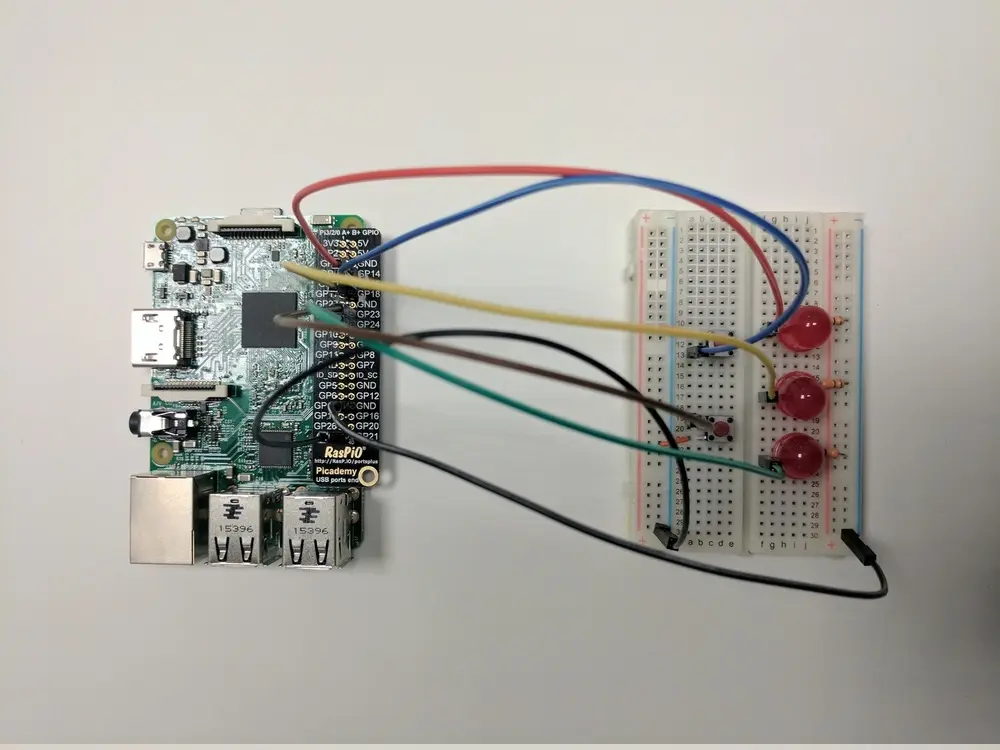
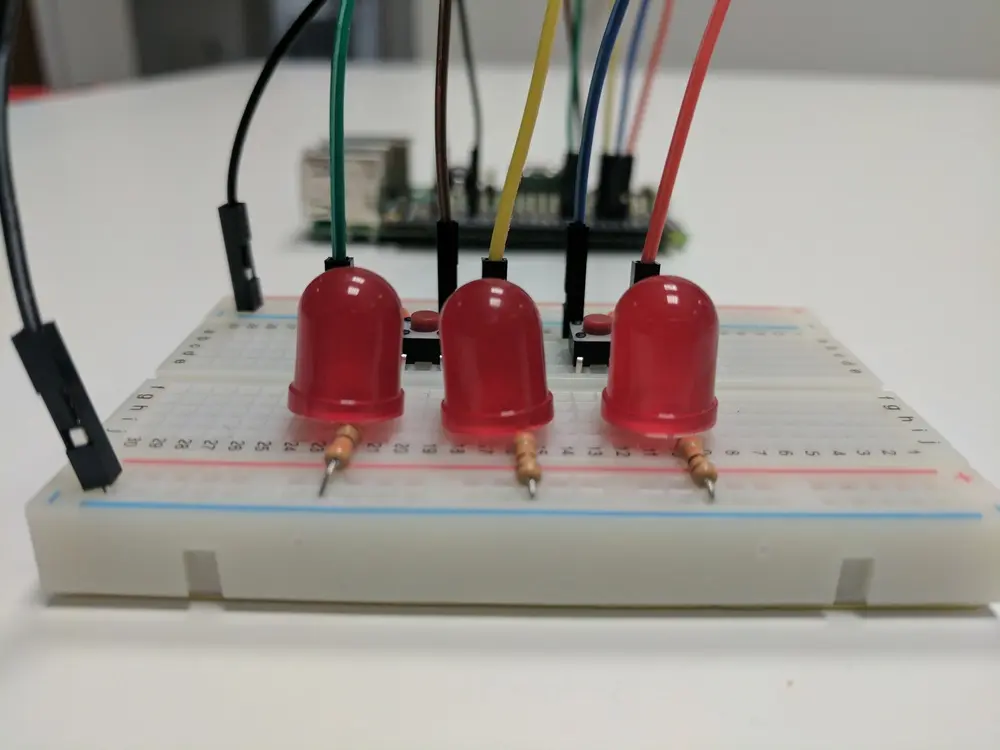

Here's an article I wrote for [The Magpi #55](https://magazine.raspberrypi.com/issues/55)


Source/values is easy to get started with, and takes a keen mind to master. There's some magic going
on beneath the hood! You will learn how it all works, and put it into action by creating logic gates
(AND, OR, and NAND), using LEDs and buttons.

## What is source/values?

GPIO Zero is more than just a friendly API: it comes with some powerful tools for helping you
program your next project. While you can start with simple procedural code, where each line is
followed in sequence, you can progress to event-driven programming, meaning various events can be
triggered in any order, or at the same time. And finally, the darkest of dark arts, source/values
brings forth a third programming paradigm: declarative. This means you describe an object's
behaviour in one line, and it will follow that instruction in the background. This is really handy
if you have lots of things going on at once!

Source/values is the name for the concept in GPIO Zero for telling a device how it should behave, or
for connecting up multiple devices together so they act in a particular way. Every GPIO Zero device
has a `.value` property which you can read at any time: a button will tell you if it's pressed
(`True`) or released (`False`), and an LED will tell you if it's lit (`True`) or not (`False`).
Output devices (like LEDs) can have their value set; `led.value = True` will light the LED, just
like using `led.on()`.

Every device also has a `.values` property, which is an iterator constantly yielding the current
value. Output devices have a `.source` property which is where you tell the device where it should
get its values from. Commonly, this will be another device's `.values` property, which is an easy
way of connecting two devices together. For example, `led.source = button.values` means the LED will
be on when the button is pressed.

## The magic under the hood

This concept was developed by Dave Jones (author of the picamera library and co-developer of GPIO
Zero) based on an idea formed in a GitHub issue. The way it works is that when a device's source is
set, a background thread is created to constantly set the device's value to the next item in the
iterator. If source is set to another device's `.values`, this is effectively always reading the
other device's current value. It doesn't have to be, though: it can be any iterator, or you can
write your own function to send values to the device.

A handy thing about GPIO Zero is the fact that devices tend to have a standard value range – usually
a sliding scale from 0 to 1 (or `True` and `False`, which are effectively just 0 and 1). This means
that you can pass the values from one device into another: like a potentiometer (0-1) into a PWM LED
(0-1) to dial up the brightness. Exceptions include Motor, which goes from -1 to 1 (-1 being full
speed backwards, 1 full speed forwards), and composite devices like Robot, which is a tuple (-1, -1)
to (1, 1) for left and right motor speeds. Why is it useful?

Using this method of connecting devices is much more concise. Rather than using a while loop (five
lines) to constantly check if a button is pressed to turn an LED on or off, or using an event-driven
approach (two lines: `when_pressed` and `when_released`), one line tells it to match the button:
`led.source = button.values`.

As well as connecting two devices directly together, you can process the value in between, using a
custom function. GPIO Zero provides a set of commonly used tools for this kind of processing.
Importing the negated function from `gpiozero.tools` allows you to specify that an LED should be lit
when the button isn't pressed: `led.source = negated(button.values)`. See more [source
tools](https://gpiozero.readthedocs.io/en/stable/api_tools.html) in the docs.

## Programming logic gates

Let's begin. First, wire up two buttons and three LEDs on a breadboard. You'll need to import the
gpiozero `LED` and `Button` classes, and the `all_values`, `any_values`, and `negated` source tools.
Create objects representing each of the LEDs and buttons, providing the pin numbers they're wired
to. The buttons represent two inputs; the LEDs three outputs. You're going to program the first LED
to represent the binary AND of the two inputs, the second to represent the OR, and the third the
NAND.



To define the AND of the two buttons, you'll need to use the `all_values` function from
`gpiozero.tools`; `all_values` yields `True` if *all* of the inputs are `True`, which is an AND
gate:

```python
out_1.source = all_values(in_1.values, in_2.values)
```

To define the OR of the two buttons, you can use the `any_values` source tool; `any_values` yields
`True` if *any* of the inputs are `True`, like an OR gate:

```python
out_2.source = any_values(in_1.values, in_2.values)
```

You could define the NAND button using a combination of `negated` and `all_values`, but since you
have already calculated the AND, you can simply read the state of the AND LED and negate that:

```python
out_3.source = negated(out_1.values)
```

Finally, if you're running this code from a file rather than a Python shell, the last line,
`pause()`, will keep your script running. Run your code and you'll see the NAND LED lit up. That's
because (with no buttons pressed), it's the only gate that's active according to the rules. Try
pressing the buttons in different combinations to check your logic! Now try programming some more
logic gates: XOR, NOR, and XNOR.

