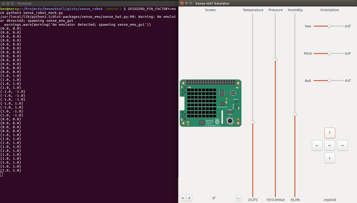

While preparing for a workshop last week, my colleague [Marc](https://twitter.com/coding2learn) and
I started brainstorming ideas. One of the ideas I came up with was to use the mini joystick on a
[Sense HAT](https://www.raspberrypi.org/products/sense-hat/) (a sensor board add-on for the
Raspberry Pi) to remotely control a robot using GPIO Zero's remote pins feature. I soon started
writing the code for it on my laptop. Then I realised I could actually prototype the whole idea
without touching a Raspberry Pi, using a combination of the [Sense HAT's desktop
emulator](https://www.raspberrypi.org/blog/desktop-sense-hat-emulator/) developed by [Dave
Jones](https://twitter.com/waveform80), and GPIO Zero's
[mockpin](http://gpiozero.readthedocs.io/en/stable/api_pins.html#mock-pins) interface (erm... also
developed by Dave Jones).

The first proof-of-concept demo was really simple: it was just a case of connecting the joystick
events with robot actions, i.e. joystick up =\> robot forward, and so on:

```python
from gpiozero import Robot
from sense_emu import SenseHat
from time import sleep

sense = SenseHat()
robot = Robot(left=(2, 3), right=(4, 5), pwm=False)

sense.stick.direction_up = robot.forward
sense.stick.direction_down = robot.backward
sense.stick.direction_left = robot.left
sense.stick.direction_right = robot.right
sense.stick.direction_middle = robot.stop

while True:
    print(tuple(robot.value))
    sleep(1)
```

*Note: I've turned PWM off (used for variable motor speed) here because the motors are only being
driven at full speed in this case, and using PWM with mockpin would add a few lines.*

With [gpiozero](https://pypi.python.org/pypi/gpiozero/) and
[sense_emu](https://pypi.python.org/pypi/sense-emu) installed with pip, running this script with:

```
GPIOZERO_PIN_FACTORY=mock python3 sense_robot_mock.py
```

This opens up the Sense HAT emulator window and continuously prints the left and right motor speed
values (1 is forward, -1 is backward, 0 is stopped). When you click the up/down/left/right joystick
buttons, the motor values change accordingly, and when you click the middle button, it stops:
`(0, 0)`.

<figure class="wp-block-image">

</figure>

Now, to run this on a Raspberry Pi, I just made a few small adjustments:

```python
from gpiozero import Robot
from gpiozero.pins.pigpio import PiGPIOFactory
from sense_hat import SenseHat
from signal import pause

factory = PiGPIOFactory(host='192.168.1.5')

sense = SenseHat()
robot = Robot(left=(2, 3), right=(4, 5), pin_factory=factory)

sense.stick.direction_up = robot.forward
sense.stick.direction_down = robot.backward
sense.stick.direction_left = robot.left
sense.stick.direction_right = robot.right
sense.stick.direction_middle = robot.stop

pause()
```

Because remote pins only works for controlling devices available in GPIO Zero, the Sense HAT
interaction has to be done locally and the GPIO stuff has to be remote on another Pi. So I create a
pin factory referring to the other Pi's IP address, and create the robot using that pin factory.
This time, of course, I'm using `sense_hat` not `sense_emu` but (by design) the library APIs are
identical. And now I'm seeing the robot move around for real, so I use `pause()` just to keep the
script running instead of printing the values in a loop.

While this implementation is fine, it doesn't account for releasing the joystick (so when you press
it up, it goes forward but when you release it, it doesn't stop until you middle press the joystick
which is ok but not ideal).

So I considered an alternative implementation. Like Python itself, GPIO Zero and the Sense HAT
library provide a multiple programming paradigms, allowing users to choose between procedural and
event-driven styles according to their needs. The previous example is event-driven, and while I'd
consider procedural the less advanced option, in this case it gives us an advantage:

```python
from gpiozero import Robot
from sense_emu import SenseHat

sense = SenseHat()
robot = Robot(left=(2, 3), right=(4, 5), pwm=False)

while True:
    event = sense.stick.wait_for_event()
    if event.action in ('pressed', 'held'):
        if event.direction == 'up':
            robot.forward()
        elif event.direction == 'down':
            robot.backward()
        elif event.direction == 'left':
            robot.left()
        elif event.direction == 'right':
            robot.right()
    else:
        robot.stop()
    print(tuple(robot.value))
```

Here we constantly check the joystick state is 'pressed' or 'held', then check the direction, and
drive the robot accordingly. This leaves any 'released' state to stop the robot. Again, I print the
value to see what's going on.

And to run on the Pi itself:

```python
from gpiozero import Robot
from gpiozero.pins.pigpio import PiGPIOFactory
from sense_hat import SenseHat

factory = PiGPIOFactory(host='192.168.1.5')

sense = SenseHat()
robot = Robot(left=(2, 3), right=(4, 5), pin_factory=factory)

while True:
    event = sense.stick.wait_for_event()
    if event.action in ('pressed', 'held'):
        if event.direction == 'up':
            robot.forward()
        elif event.direction == 'down':
            robot.backward()
        elif event.direction == 'left':
            robot.left()
        elif event.direction == 'right':
            robot.right()
    else:
        robot.stop()
```

Easy!
