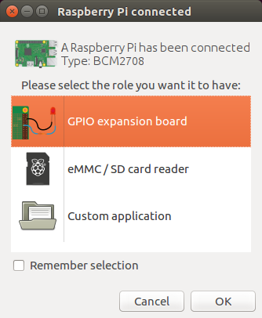
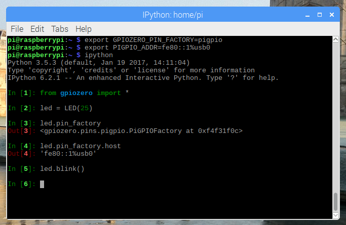
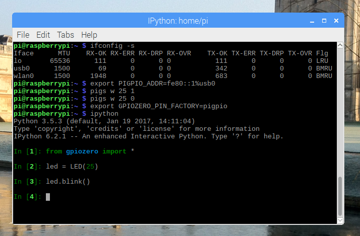
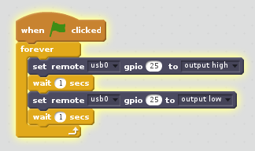
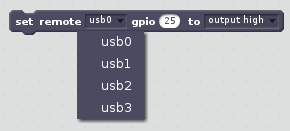
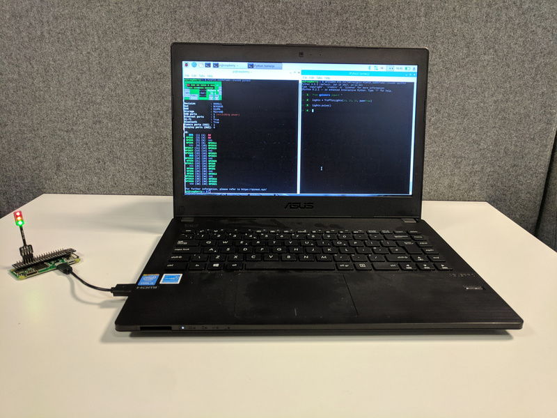

The recent announcement of the latest release of the [Raspberry Pi Desktop
x86](https://www.raspberrypi.org/blog/stretch-pcs-macs-raspbian-update/) image alongside Raspbian
Stretch for Raspberry Pi included mention of a GPIO expander tool, which was followed up by [another
blog post](https://www.raspberrypi.org/blog/gpio-expander/) explaining how it works and how to use
it. Since it uses pigpio to control the GPIO pins, that means you can use my [GPIO
Zero](https://gpiozero.readthedocs.io/en/stable/) Python library to use it. And as of yesterday, you
can easily set this up on an Ubuntu PC, not just Raspberry Pi Desktop.

<figure class="wp-block-image">

</figure>

## What is it?

The GPIO expander tool means you can connect a [Pi
Zero](https://www.raspberrypi.org/products/raspberry-pi-zero/) or [Pi Zero
W](https://www.raspberrypi.org/products/raspberry-pi-zero-w/) to a regular PC with just a USB micro
cable, no SD card required, and control the GPIO pins. It currently works on Linux only, but support
for Windows and Mac should be expected ... at some point.

For now, if you don't use Linux, you can live boot the [Raspberry Pi Desktop x86
OS](https://www.raspberrypi.org/downloads/raspberry-pi-desktop/) from a DVD or USB stick, and do it
from a Windows PC or a Mac, but eventually it should be possible to do natively from those operating
systems.

## How does it work?

The Pi Zero features a USB OTG port, allowing you to boot over USB from a PC. Your PC sends the
required boot firmware to the Pi over the USB cable, launching a mini version of Raspbian and
booting it in RAM. The OS then starts the pigpio daemon, allowing "remote" access over the USB
cable.

## How to use on Raspberry Pi Desktop x86

You can download an ISO of the [Raspberry Pi Desktop
OS](https://www.raspberrypi.org/downloads/raspberry-pi-desktop/) from raspberrypi.org which you can
[write to a USB stick or burn to a
DVD](https://www.raspberrypi.org/magpi/install-raspberry-pi-desktop-x86/). This must be the Stretch
release, not the older Jessie image.

You can use these to live boot your PC or Mac into the OS (select "Run with persistence" and your
computer will be back to normal afterwards). The OS comes with everything you need, ready to go.

Plug in your Pi Zero, and you'll be prompted to select a role for the device. Select GPIO expansion
board and continue. It will take 30 seconds or so to flash it, then the dialogue will disappear.

## How to use on a Raspberry Pi

Using on Raspbian on a Pi is almost as easy as the x86 image, except that the `usbbootgui` tool is
not pre-installed. You can install it on Raspbian Stretch:

```
sudo apt update
sudo apt install usbbootgui
```

Now when you plug in your Pi Zero, you get the dialogue as above.

## How to use on Ubuntu

We have created a [PPA](https://launchpad.net/~rpi-distro/+archive/ubuntu/ppa) of the packages you
need to make this work. Start by adding the PPA:

```
sudo add-apt-repository ppa:rpi-distro/ppa
sudo apt update
```

If you have previously installed gpiozero or pigpio with pip, uninstall these first:

```
sudo pip3 uninstall gpiozero pigpio
```

Then install the required packages from the PPA:

```
sudo apt install usbbootgui python3-gpiozero python3-pigpio
```

Now when you plug in your Pi Zero, you get the dialogue as above.

## Access the GPIOs

Looking at the output of `ifconfig`, and you'll see a new ethernet connection with an IPv6 address.
On Raspbian and Raspberry Pi Desktop, this will be `usb0`. On Ubuntu it's some silly string (mine is
`enp0s29u1u7i2`).

You can ping it (be sure to use `ping6` as it's IPv6 only) using the address `fe80::1%` followed by
the connection string, e.g:

```
ping6 fe80::1%usb0
```

If you set the `PIGPIO_ADDR` environment variable, all calls to pigpio therafter will use that as
the address to connect to:

```
export PIGPIO_ADDR=fe80::1%usb0
```

For a simple test, you can use the command line interface provided by pigpio, named `pigs`:

```
pigs w 25 1 # turn pin 25 on
pigs w 25 0 # turn pin 25 off
```

## Enter GPIO Zero

For a while now, GPIO Zero has supported using pigpio as the back-end. This meant you could connect
to a Pi on the network from a PC or another Pi, and even control multiple Pis from the same script,
but that required the remote Pi to have an SD card and Raspbian running, and the pigpio daemon
running, and allowing remote connections. Similarly, Pi Zero OTG mode was possible, but that also
required an SD card, and lots of configuration.

Since the GPIO expander tool does exactly the same thing, naturally GPIO Zero just works out of the
box! Like connecting to a remote Pi, you just specify that you're using pigpio as the pin factory,
and specify the address (as done earlier). You can do this with another environment variable:

```
export GPIOZERO_PIN_FACTORY=pigpio
```

Now when you use GPIO Zero within Python, connections will be to the Pi Zero:

<figure class="wp-block-image">

</figure>

Set your environment variables as above, and use python/python3/ipython at the command line, or an
IDE. You probably want to set the environment variables globally – just export them in your
`.profile` file like so:

```
export GPIOZERO_PIN_FACTORY=pigpio
export PIGPIO_ADDR=fe80::1%usb0
```

<figure class="wp-block-image">

</figure>

## Scratch too

Scratch 2 is now included in Raspbian and Raspberry Pi Desktop x86. This includes a GPIO extension
which uses pigpio. The x86 version has been adapted to allow access to Pi Zeros over USB:

<figure class="wp-block-image">

</figure>

## Multiple Pi Zeros?

In theory, this should work for multiple Pi Zeros. However, it seems there's an issue with the USB
boot tool, knocking the first one out when you add a second.

On Raspberry Pi Desktop each Pi comes up with an enumerated name (`usb0`, `usb1`, etc). On Ubuntu
mine were `enp0s29u1u7i2` and `enp0s29u1u8i2`, but they're easy to look up in `ifconfig`.

In GPIO Zero, if this worked, you'd be able to create devices on multiple devices using the
`pin_factory` parameter:

```python
from gpiozero import TrafficHat
from gpiozero.pins.pigpio import PiGPIOFactory
from signal import pause

usb0 = PiGPIOFactory('fe80::1%usb0')
usb1 = PiGPIOFactory('fe80::1%usb1')

hat0 = TrafficHat(pin_factory=usb0)
hat1 = TrafficHat(pin_factory=usb1)

hat0.button.when_pressed = hat1.lights.on
hat0.button.when_released = hat1.lights.off
hat1.button.when_pressed = hat0.lights.on
hat1.button.when_released = hat0.lights.off

pause()
```

(this example makes each Traffic HAT's button control the lights of the other one)

Scratch 2 contains a dropdown for `usb0` to `usb3`:

<figure class="wp-block-image">

</figure>

But as I say, it doesn't work yet.

## Limitations

The major limitations are that you cannot flash code to the Pi Zero, and that not all software is
supported.

Since the Pi Zero has booted from your PC, as soon as you disconnect it, any running programs will
terminate. There's no way of keeping a battery attached, or anything like that, so you can only
prototype your ideas with it, not deploy any finished projects to it without transitioning to the
regular SD card setup.

Also, since GPIO access relies on the pigpio library, only software compatible with pigpio will
work. Since GPIO Zero features multiple back-ends (you can use a number of different low-level pin
libraries to do the GPIO stuff but the API for the code you write remains the same), and supports
pigpio, then anything in GPIO Zero will work just fine.

However, things like Pimoroni's extensive collection of HATs, which are written using libraries
which do not support remote GPIO, just direct GPIO/SPI/I2C, will not be compatible. If you have GPIO
software which is built on top of RPi.GPIO, wiringpi, spidev and others, you will need to
re-implement to use pigpio in order to gain support for the GPIO expander. This includes the Sense
HAT.

Also, the Scratch support is currently limited to Scratch 2. While Scratch 2 is a better and more
modern interface, some people prefer Scratch 1 as it's much faster (hugely optimised Smalltalk vs.
late Adobe Flash port). In theory, Scratch 1 should be able to access Pi Zeros using this method, as
it also uses pigpio for GPIO. However, it seems to be hard-coded to use localhost, and the code
doesn't seem accessible. Perhaps this will be addressed in a future release.

<figure class="wp-block-image">

</figure>

## Workshops

This is a real game changer for [Raspberry Jams](https://www.raspberrypi.org/jam/), [Code
Clubs](https://www.codeclub.org.uk/), [CoderDojos](https://coderdojo.com/) and use in schools. You
can live boot the Raspberry Pi Desktop OS from a USB stick, use Linux PCs or even install Raspberry
Pi Desktop on old computers. Then you have really simple access to physical computing without full
Raspberry Pi setups, and no SD cards to configure.
