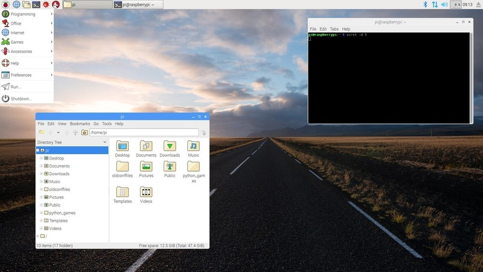
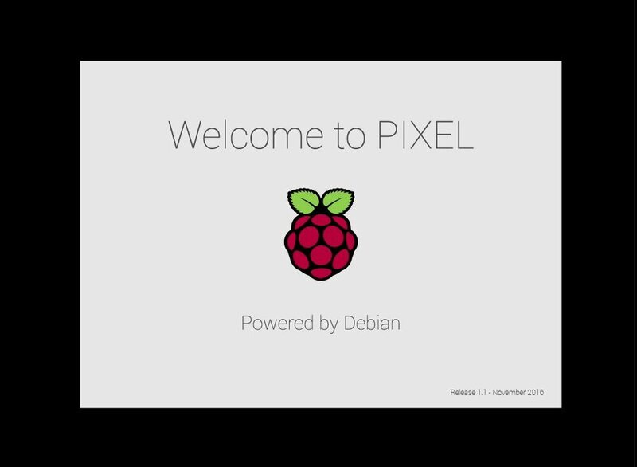
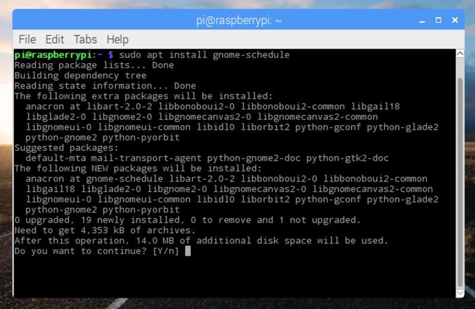
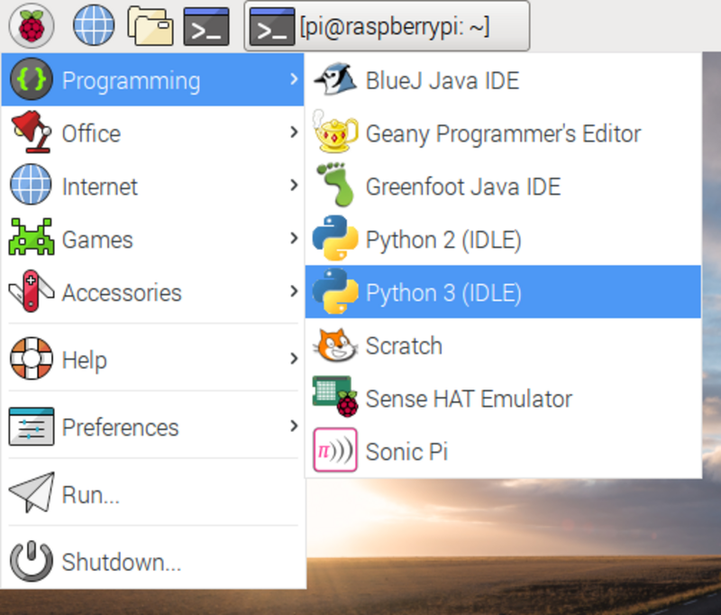
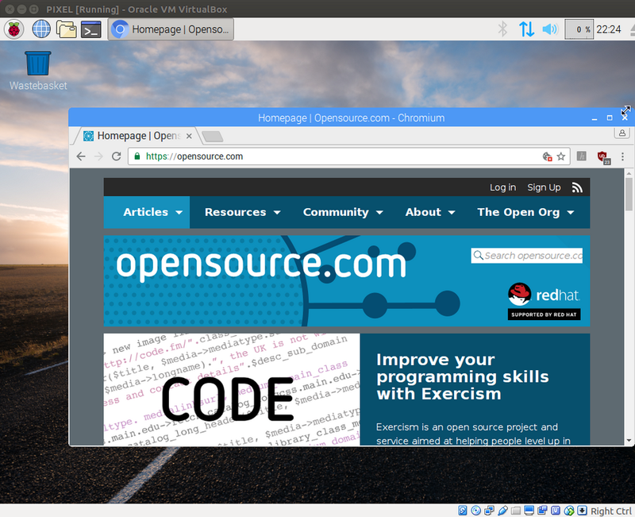

Over the last four years, the Raspberry Pi Foundation has put a great deal of effort into optimizing
Raspbian, its port of Debian, for Pi hardware, including creating new educational software,
programming tools, and a nicer looking desktop. In September, we released an update that introduced
PIXEL (Pi Improved Xwindows Environment, Lightweight), the Pi's new desktop environment. Just before
Christmas, we released a version of the OS that runs on x86 PCs, so now you can install it on your
PC, Mac, or laptop. \ Of course, like many well-supported Linux distros, the
OS runs really well on old hardware. Raspbian is a great way to breathe new life into that old
Windows machine that you gave up on years ago. The \[PIXEL
ISO\](https://downloads.raspberrypi.org/pixel_x86/images/pixel_x86-2016-12-13/) is available for
download from the Raspberry Pi website, and a bootable live DVD was given away on the front of \[The
MagPi\](https://www.raspberrypi.org/magpi/issues/53/) magazine. \
We released Raspberry Pi's OS for PCs to remove the barrier to entry for people looking to learn
computing.\*\*\* \*\*\*This release is even cheaper than buying a Raspberry Pi because it is free
and you can use it on your existing computer. PIXEL is the Linux desktop we've always wanted, and we
want it to be available to everyone. \## Powered by Debian Raspbian, or the x86 PIXEL distro,
wouldn't be possible without its construction on top of Debian. Debian has a huge bank of amazing
free and open source software, programs, games, and other tools from the apt repository. On the
Raspberry Pi, you're limited to packages that are compiled to run on
\[ARM\](https://en.wikipedia.org/wiki/ARM_Holdings) chips. However, on the PC image, you have a much
wider scope for which packages will run on your machine, because Intel chips found in PCs have much
greater support. \ \## What PIXEL contains Both Raspbian with PIXEL and Debian
with PIXEL come bundled with a whole host of software. Raspbian comes with: - Programming
environments for Python, Java, Scratch, Sonic Pi, Mathematica\\, Node-RED, and the Sense HAT
emulator - The LibreOffice office suite - Chromium (including Flash) and Epiphany web browsers -
Minecraft: Pi edition (including a Python API)\\ - Various tools and utilities \\The only
programs from this list not included in the x86 version are Mathematica and Minecraft, due to
licensing limitations. \ \## Create a PIXEL live disk You can download
the PIXEL ISO and write it to a blank DVD or a USB stick. Then you can boot your PC from the disk,
and you'll see the PIXEL desktop in no time. You can browse the web, open a programming environment,
or use the office suite, all without installing anything on your computer. When you're done, just
take out the DVD or USB drive, shut down your computer, and when you power up your computer again,
it'll boot back up into your usual OS as before. \## Run PIXEL in a virtual machine One way of
trying out PIXEL is to install it in a virtual machine using a tool like VirtualBox.
\ This allows you to try out the image without installing it, or
you can just run it in a window alongside your main OS, and get access to the software and tools in
PIXEL. It also means your session will persist, rather than starting from scratch every time you
reboot, as you would with a live disk. \## Install PIXEL on your PC If you're really ready to
commit, you can wipe your old operating system and install PIXEL on your hard drive. This might be a
good idea if you're wanting to make use of an old unused laptop. \## PIXEL in education Many schools
use Windows on all their PCs, and have strict controls over what software can be installed on them.
This makes it difficult for teachers to use the software tools and IDE (integrated development
environment) necessary to teach programming skills. Even online-based programming initiatives like
Scratch 2 can be blocked by overcautious network filters. In some cases, installing something like
Python is simply not possible. The Raspberry Pi hardware addresses this by providing a small, cheap
computer that boots from an SD card packed with educational software, which students can connect up
to the monitor, mouse, and keyboard of an existing PC. However, a PIXEL live disc allows teachers to
boot into a system loaded with ready-to-use programming languages and tools, all of which do not
require installation permissions. At the end of the lesson, they can shut down safely, bringing the
computers back to their original state. This is also a handy solution for Code Clubs, CoderDojos,
youth clubs, Raspberry Jams, and more. \## Remote GPIO One of the features that sets the Raspberry
Pi apart from traditional desktop PCs is the presence of GPIO pins (General Purpose Input/Output),
which allow you to connect electronic components and add-on boards to devices in the real world,
opening up new worlds, such as hobby projects, home automation, connected devices, and the Internet
of Things. One wonderful feature of the \[GPIO Zero\](https://gpiozero.readthedocs.io/) Python
library is the ability to control the GPIO pins of a Raspberry Pi over the network with some simple
code written on your PC. \> PC running x86 PIXEL controlling Pi's GPIO over the network using
gpiozero \> \[pic.twitter.com/SAfmQsDx3P\](https://t.co/SAfmQsDx3P) \> \> — Ben Nuttall
(@ben_nuttall) \[December 21, \> 2016\](https://twitter.com/ben_nuttall/status/811511740907261952)
Remote GPIO is possible from one Raspberry Pi to another or from any PC running any OS, but, of
course, with PIXEL x86 you have everything you need pre-installed and it works out of the box. See
Josh's \[blog
post\](https://www.allaboutcode.co.uk/single-post/2016/12/21/GPIOZero-Remote-GPIO-with-PIXEL-x86)
and refer to my \[gist\](https://gist.github.com/bennuttall/572789b0aa5fc2e7c05c7ada1bdc813e) for
more information. \## Further guidance \[Issue \#53 of The
MagPi\](https://www.raspberrypi.org/magpi/issues/53/) features some great guides for trying out and
installing PIXEL, including using the live disc with a persistence drive to maintain your files and
applications. You can buy a copy, or download the PDF for free. Check it out to read more.
