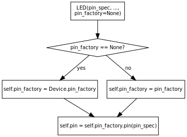
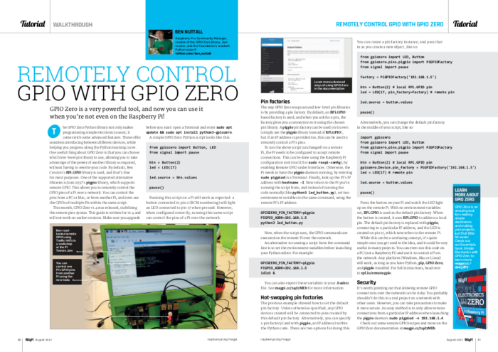
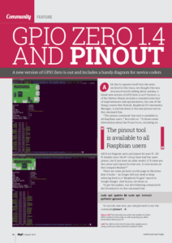
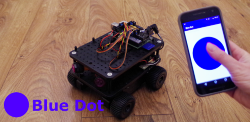

It's been a while since [the last GPIO Zero
release](https://bennuttall.com/whats-new-gpio-zero-v1-3/), so it's with great pleasure I announce
[v1.4 is here](https://pypi.python.org/pypi/gpiozero/1.4.0). Upgrade now on your Raspberry Pi:

```
sudo apt update
sudo apt install python-gpiozero python3-gpiozero
```

Or on your PC:

```
pip install gpiozero
```

Why on your PC?

- Run Python code on your PC to remotely control a Raspberry Pi
- Use a handy command-line tool to see the Raspberry Pi's pinout
- Use the mock pin interface to test your code

## So what's new?

In summary:

- Improved remote GPIO support
  - Remote hardware SPI is now possible
  - Abstraction of Pin classes – we now provide pin factories
  - New simple syntax for hot-swapping between pin libraries and different remote Pis
- Support for the Pi Hut's upcoming STATUS and STATUS Zero boards (designed by Rachel Rayns)
- New pinout command-line tool
- Improved documentation
  - As well as API docs, we provide [beginner
    recipes](https://gpiozero.readthedocs.io/en/stable/recipes.html) and [advanced
    recipes](https://gpiozero.readthedocs.io/en/stable/recipes_advanced.html)
  - Added [remote GPIO remote
    configuration](https://gpiozero.readthedocs.io/en/stable/remote_gpio.html) including
    PC/Mac/Linux and Pi Zero OTG, and a section of [GPIO
    recipes](https://gpiozero.readthedocs.io/en/stable/recipes_remote_gpio.html)
  - New sections on [source/values](https://gpiozero.readthedocs.io/en/stable/source_values.html),
    [command-line tools](https://gpiozero.readthedocs.io/en/stable/cli_tools.html),
    [FAQs](https://gpiozero.readthedocs.io/en/stable/faq.html), [Pi
    information](https://gpiozero.readthedocs.io/en/stable/api_info.html) and [library
    development](https://gpiozero.readthedocs.io/en/stable/development.html)
  - Better organised documentation

Read on for details!

## Pin factories and remote GPIO

Up to v1.0, everything was built directly on top of the
[RPi.GPIO](https://pypi.python.org/pypi/RPi.GPIO) library. Then in v1.1, my co-author Dave created a
pin class abstraction which allowed us to implement pin interaction in any given library, so people
could select a pin library to be used, and we added support for
[RPIO](https://pypi.python.org/pypi/RPIO) and Dave even wrote a pure Python one called
[NativePin](https://github.com/RPi-Distro/python-gpiozero/blob/master/gpiozero/pins/native.py). In
v1.2 we added support for the [pigpio](https://pypi.python.org/pypi/pigpio) library, which allows
remote connections. This meant you could use GPIO Zero to control one Raspberry Pi's pins from
another, or even install GPIO Zero on a PC and control a Pi's pins remotely.

### History

Remote GPIO Support in v1.2 was sketchy. It improved in v1.3, but in v1.4 we have come up with a
much neater mechanism for selecting and re-selecting pin libraries, and we've stabilised the API.
We've also introduced documentation for configuring remote GPIO on Windows, Mac, Linux and Raspberry
Pi, and added a section for recipes specifically showcasing remote GPIO use cases.

### New pin factory syntax

Previously, there were two methods of selecting a pin library to use: by setting environment
variables, or by using Pin objects in the code. Both of these methods have changed:

Environment variables no longer require you specify the pin class name, just the library name in
lowercase:

- Old: `GPIOZERO_PIN_FACTORY=PiGPIOPin`
- New: `GPIOZERO_PIN_FACTORY=pigpio`

Pin factories are now used rather than pin objects:

- Old:

```python
from gpiozero import LED
from gpiozero.pins.pigpiod import PiGPIOPin
led = LED(PiGPIOPin(17, host='192.168.1.5'))
```

- New:

```python
from gpiozero import LED
from gpiozero.pins.pigpio import PiGPIOFactory
factory = PiGPIOFactory(host='192.168.1.5')
led = LED(17, pin_factory=factory)
```

While this example is one extra line, it does make it easier in many more cases, and when you're
using a class which doesn't take a pin parameter, like a HAT with pre-defined pin numbers, you
couldn't previously change the pin library in the constructor. Now you can:

```python
from gpiozero import LED
from gpiozero.pins.pigpio import PiGPIOFactory

factory2 = PiGPIOFactory(host='192.168.1.2')
factory3 = PiGPIOFactory(host='192.168.1.3')

local_hat = TrafficHat()
remote_hat2 = TrafficHat(pin_factory=factory2)
remote_hat3 = TrafficHat(pin_factory=factory3)
```

The flow for a device electing a pin factory is as follows:

<figure class="wp-block-image">
<a href="https://gpiozero.readthedocs.io/en/stable/api_pins.html"></a>
</figure>

Read more in the [pins API documentation](https://gpiozero.readthedocs.io/en/stable/api_pins.html).

This opens up a lot of possibilities. Check out the remote recipes for some inspiration (and feel
free to suggest some more!). I'm now going to be shouting much more about remote pins – it could be
a real game changer. I wrote an article in *The MagPi #60* introducing people to remote GPIO. You
can [buy or download](https://www.raspberrypi.org/magpi/issues/60/) the full issue, or read [this
article](https://www.raspberrypi.org/magpi/remote-control-gpio-raspberry-pi-gpio-zero/) [this PDF
from the magazine](https://bennuttall.com/wp-content/uploads/2017/07/remote-gpio.pdf)

<figure class="wp-block-image">

</figure>

### Mock pin

Another pin factory we provide is called
[mock](https://gpiozero.readthedocs.io/en/stable/api_pins.html#module-gpiozero.pins.mock). Dave
created this to make it possible to test the GPIO Zero code base with a [test
suite](https://travis-ci.org/RPi-Distro/python-gpiozero). It just uses MockPin to simulate pins
going high and low and having mock device objects reacting to each other as they should. It's also
handy for testing your code out without using a Raspberry Pi, or if you don't have all the
components you need handy. Simply launch a Python shell or editor with mock as your pin factory, and
you can test that it behaves as it should:

```python
$ GPIOZERO_PIN_FACTORY=mock python3
>>> from gpiozero import LED
>>> led = LED(22)
>>> led.blink()
>>> led.value
True
>>> led.value
False
```

You can even tell pins to change state (e.g. to simulate a button being pressed) by accessing an
object's pin property:

```python
>>> from gpiozero import LED
>>> led = LED(22)
>>> button = Button(23)
>>> led.source = button.values
>>> led.value
False
>>> button.pin.drive_low()
>>> led.value
True
```

## pinout command-line tool

There's a pi_info function in GPIO Zero we use to determine which Pi model you're on to give
appropriate warnings when you're trying to do stuff on, say, pins that don't exist on your Pi. I
suggested we add some pretty-print for the output of this function, particularly the pin header
layout, and one thing led to another, Dave created ASCII art to show the Pi along with the
information. A guy named Steward Adcock joined our sprint table at PyCon UK last year and asked if
there was something easy he could dip into. I suggested producing a command-line tool for pinout and
he helped get it started. Et voila:

[](http://gpiozero.readthedocs.io/en/v1.4.0/cli_tools.html#pinout)It
works on any Pi model, and gives you the correct pinout for the Pi you're on. Run it on your Pi:

```
$ pinout
```

You can even use it on your PC – just use an environment variable to use MockPin, and (optionally)
provide a Pi revision (otherwise the default is a Pi 3):

```
$ GPIOZERO_PIN_FACTORY=mock pinout -r 9000c1
```

The great thing about `pinout` is that anyone can use it – regardless of whether they're using GPIO
Zero or Python, it's just a stand-alone tool. Again, this was featured in *The MagPi #60:*



## STATUS

Rachel designed two boards for The Pi Hut, which go on sale soon: STATUS, and STATUS Zero. They're
general purpose status indicators you can use for all sorts of projects.

STATUS is a HAT-sized board with five strips, each containing a red/green LED pair, and a button.
There's also a label space on the strip for you to write in what it's monitoring. STATUS Zero is
similar, but Zero-sized, and just contains three strips (without buttons). See an [early prototype
of the Zero](https://twitter.com/RachelRayns/status/842413266185916416).

Here's an example using our internal device
[`PingServer`](https://gpiozero.readthedocs.io/en/stable/api_other.html#pingserver) to show who's
home, based on pinging IP addresses of known devices:

```python
from gpiozero import PingServer, StatusZero
from gpiozero.tools import negated

status = StatusZero('mum', 'dad', 'alice')

statuses = {
    PingServer('192.168.1.5'): status.mum,
    PingServer('192.168.1.6'): status.dad,
    PingServer('192.168.1.7'): status.alice,
}

for server, leds in statuses.items():
    leds.green.source = server.values
    leds.green.source_delay = 60
    leds.red.source = negated(leds.green.values)
```

This was really easy to implement, as our
[`LEDBoard`](https://gpiozero.readthedocs.io/en/stable/api_boards.html#ledboard) class can be
constructed with nested `LEDBoard`s, which can (optionally) be given names. An example
implementation of a similar two-strip board would be:

    strip = LEDBoard(
        one=LEDBoard(red=14, green=15),
        two=LEDBoard(red=17, green=18),
    )

[More examples](https://gpiozero.readthedocs.io/en/stable/recipes_advanced.html#ledboard) of
`LEDBoard` use are now included in the advanced recipes page.

## Source/values

This is nothing new – but we added a source/values documentation page, explaining how the feature
works and how you can use it in your projects. A quick recap:

```python
led.source = button.values
```

This is a simple approach to connecting devices together using a declarative style of programming.
In one line, we declare that the LED should get its values from the button: i.e. when the button is
pressed, the LED should be on. Rather than write a while loop, constantly checking the button state
and setting the LED state, we just tell one to follow the other. We also provide a set of source
tools for applying common operators to process values in between devices, and show how you can write
your own tools.

Since the last release, [Martin O'Hanlon](https://twitter.com/martinohanlon) created a
zero-boilerplate Python library for allowing users to control things on their Raspberry Pi remotely
using their Android device: it's called [BlueDot](https://bluedot.readthedocs.io/). The API is very
similar to GPIO Zero, and it even incorporates the value/values properties, which means you can hook
it up to GPIO devices easily:

```python
from bluedot import BlueDot
from gpiozero import LED

bd = BlueDot()
led = LED(17)

led.source = bd.values
```

i.e. the LED is lit when the blue dot is pressed

[](http://bluedot.readthedocs.io/)

We even included a couple of [BlueDot
examples](https://gpiozero.readthedocs.io/en/stable/recipes_advanced.html#bluedot-led) in our
recipes.

## What's next?

In v1.5 we're looking to add support for more GPIO devices, but particularly to introduce
[I2C](https://en.wikipedia.org/wiki/I%C2%B2C) support which will give us access to a lot more
devices, and provide a seamless step-up from simple GPIO to more advanced projects using I2C sensors
and such, without having to learn a new low-level library, just sticking with the nice high-level
GPIO Zero API. This will also allow us to utilise the pin factory concept with I2C expander chips,
meaning you'll easily be able to add more GPIO pins to your Pi. We also plan to add support for SPI
output devices and a wider variety of motors and robots.

We have plenty more on the [roadmap](https://github.com/RPi-Distro/python-gpiozero/projects/1),
there are plenty of issues to work through, and some of it will be later rather than sooner, so I
can't be certain what will make the next release, but we will keep working on it and hopefully I'll
have some great new stuff to write about for v1.5.

Thanks as always to [Dave Jones](https://twitter.com/waveform80) for the great effort he's put into
the library. Thanks also to Steward Adcock for contributing towards the pinout command-line tool.
