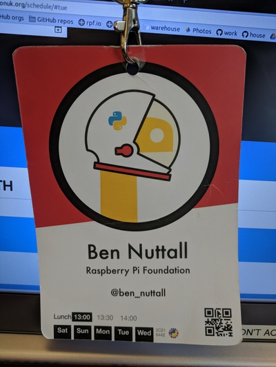
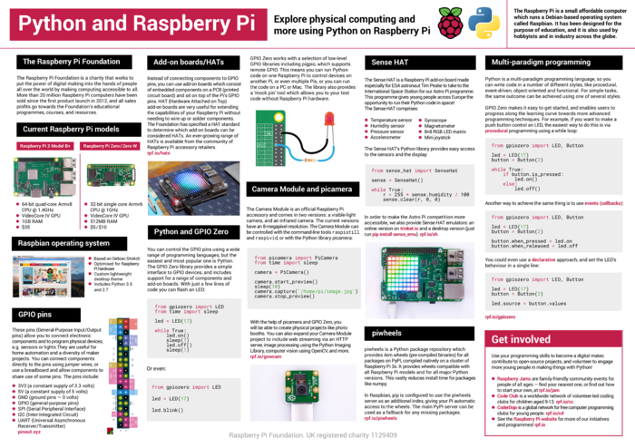

I've been lucky enough to have been able to attend (and speak at) two great Python conferences –
EuroPython and PyCon UK – (almost) every year since 2014. I've been to EuroPython in Berlin, Bilbao
and Rimini, and this year it came to the UK – specifically, the beautiful city of Edinburgh.

<figure class="wp-block-image">

</figure>

I presented a new iteration of my Python and Raspberry Pi poster at both conferences this year
(click to download):

<figure class="wp-block-image">

</figure>

The talk I developed for this year's conference season was entitled *Programming paradigms for
physical computing and IoT*. It introduces four programming concepts I feel are necessary for
writing effective and meaningful code for describing how devices behave.

Here's the video from me giving the talk at EuroPython:

<figure class="wp-block-image">
<iframe width="560" height="315" src="https://www.youtube.com/embed/pRtpXzS2Weo?si=63n2foGMPlYJE9SS" title="YouTube video player" frameborder="0" allow="accelerometer; autoplay; clipboard-write; encrypted-media; gyroscope; picture-in-picture; web-share" referrerpolicy="strict-origin-when-cross-origin" allowfullscreen></iframe>
</figure>

I evolved the talk a bit (and cut some stuff out for a shorter talk slot) for PyCon UK:

<figure class="wp-block-image">
<iframe width="560" height="315" src="https://www.youtube.com/embed/T2R1JAnL7-I?si=hSXRUIn5tDAAM2RV" title="YouTube video player" frameborder="0" allow="accelerometer; autoplay; clipboard-write; encrypted-media; gyroscope; picture-in-picture; web-share" referrerpolicy="strict-origin-when-cross-origin" allowfullscreen></iframe>
</figure>

I also gave a lightning talk about piwheels:

<figure class="wp-block-image">
<iframe width="560" height="315" src="https://www.youtube.com/embed/7w_qgGZM4ao?si=Uf--8Z4SlbGb02_B" title="YouTube video player" frameborder="0" allow="accelerometer; autoplay; clipboard-write; encrypted-media; gyroscope; picture-in-picture; web-share" referrerpolicy="strict-origin-when-cross-origin" allowfullscreen></iframe>
</figure>

And part way through a very busy week of PyCon UK, in between running the education summit,
presenting my poster, giving a lightning talk and my scheduled talk, I was announced as one of the
recipients of the [John Pinner
Award](https://community.uk.python.org/news/2018/09/16/john-pinner-award-recipients/), which was a
really nice way to be recognised by the community that's given me so much. Thanks to Daniele, Peter,
all the other organisers and congratulations to all other recipients.
