"Hello world" is the beginning of everything when it comes to computing and
programming. It's the first thing you learn in a new programming language, and
it's the way you test something out, or check to see if something's working
because it's usually the simplest way of testing simple functionality.

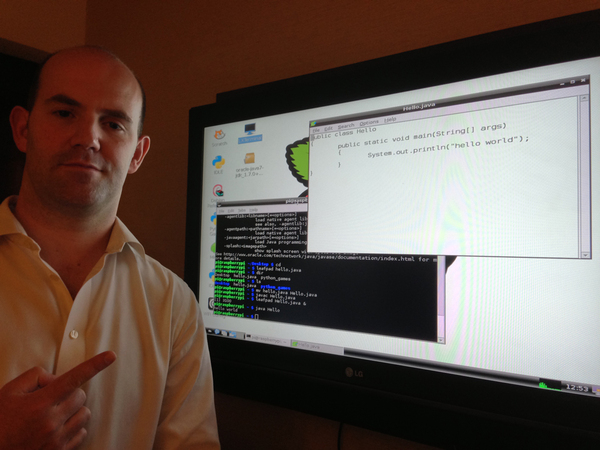

Warriors of programming language wars often cite their own language's "hello
world" against that of another, saying theirs is *shorter* or *more concise*
or *more explicit* or something. Having a nice simple readable "hello world"
program makes for a good intro for beginners learning your language, library,
framework or tool.

I thought it would be cool to create a list of as many different "hello world"
programs as possible that can be run on the Raspberry Pi using its Raspbian
operating system, but without installing any additional software than what comes bundled when you download it from the Raspberry Pi website. I've created a
[GitHub repository](https://github.com/bennuttall/hello-world-raspberry-pi) of
these programs, and I've explained ten of them for you here.

## 1. Scratch

Scratch is a graphical block-based programming environment designed for kids to
learn programming skills without having to type or learn the synax of a
programming language. The "hello world" for Scratch is simple - and very visual!

1. Open **Scratch 2** from the main menu

1. Click **Looks**

1. Drag a **say Hello!** block into the workspace on the right

    

1. Change the text to `Hello world`

1. Click on the block to run the code

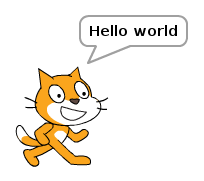

## 2. Python

Python is a powerful and professional language that's also great for beginners -
and it's lots of fun to learn. Since one of Python's main objectives was to be
readable and stick to simple English, its "hello world" program is as simple as
possible.

1. Open **Thonny Python IDE** from the main menu

1. Enter the following code:

    ```python
    print("Hello world")
    ```

1. Save the file as `hello3.py`

1. Click the **Run** button

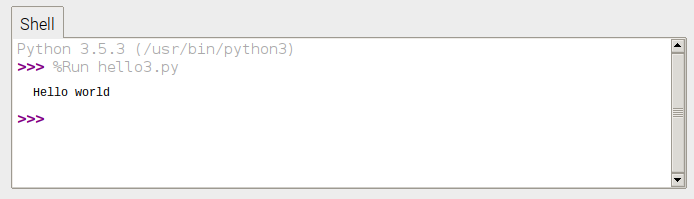

## 3. Ruby / Sonic Pi

Ruby is another powerful language that's friendly for beginners. Sonic Pi, the
live coding music synth, is built on top of Ruby, so what users actually type is
a form of Ruby.

1. Open **Sonic Pi** from the main menu

1. Enter the following code:

    ```bash
    puts "Hello world"
    ```

1. Press **Run**

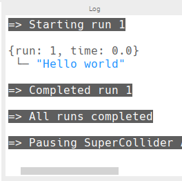

Unfortunately, "hello world" does not do Sonic Pi justice in the
slightest, but after you've finished this article you should check out its
creator [Sam Aaron live coding](https://www.youtube.com/watch?v=KJPdbp1An2s),
and see the [tutorials on the Sonic Pi website](http://sonic-pi.net/).

Alternatively, write Ruby code in a text editor and run it in the Terminal:

1. Open **Text Editor** from the main menu

1. Enter the following code:

    ```bash
    puts "Hello world"
    ```

1. Save the file as `hello.rb` in the home directory

1. Open **Terminal** from the main menu

1. Run the following command:

    ```bash
    ruby hello.rb
    ```

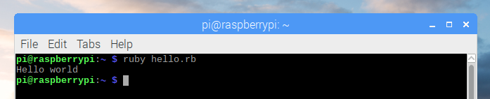

## 4. JavaScript

This is a bit of a cheat as I just make use of client-side JavaScript within the
web browser using the Web Inspector console, but it still counts!

1. Open **Chromium Web Browser** from the main menu

1. Right-click the empty web page and select **Inspect** from the context menu

1. Click the **Console** tab

1. Enter the following code:

    ```python
    console.log("Hello world")
    ```

1. Press **Enter** to run

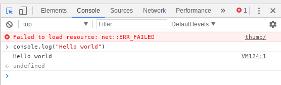

You can also install NodeJS on the Raspberry Pi, and write server-side
JavaScript, but that's not available in the standard Raspbian image.

## 5. Bash

Bash (Bourne Again Shell) is the default Unix shell command language in most
Linux distributions, including Raspbian. You can enter Bash commands directly
into a terminal window, or script them into a file and execute the file like a
programming script.

1. Open **Text Editor** from the main menu

1. Enter the following code:

    ```bash
    echo "Hello world"
    ```

1. Save the file as `hello.sh` in the home directory

1. Open **Terminal** from the main menu

1. Run the following command:

    ```bash
    bash hello.sh
    ```

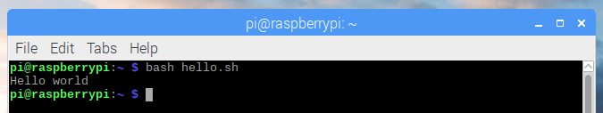

Note you'd usually see a "hashbang" at the top of the script (`#!/bin/bash`) but
since I'm calling this script directly using the `bash` command, it's not
necessary (and I'm trying to keep all these examples as short as possible!).

You'd also usually make the file executable with `chmod +x` but again, this is
not necessary as I'm executing with `bash`.

## 6. Java

Java is a popular language in industry, and is commonly taught to undergraduates
studying computer science. I learned it at university and have tried to avoid
touching it since then. Apparently, now I do (very small amounts of) it for
fun...

1. Open **Text Editor** from the main menu

1. Enter the following code:

    ```java
    public class Hello {
        public static void main(String[] args) {
            System.out.println("Hello world");
        }
    }
    ```

1. Save the file as `Hello.java` in the home directory

1. Open **Terminal** from the main menu

1. Run the following commands:

    ```bash
    javac Hello.java
    java Hello
    ```

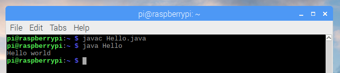

I could *almost* remember the "hello world" for Java off the top of my head, but
not quite. I always forget where the `String[] args` bit goes, but it's obvious
when you think about it...

## 7. C

C is a fundamental low-level programming language. It's what many programming
languages are written in. It's what operating systems are written in. See for
yourself - take a look at the source for
[Python](https://github.com/python/cpython/) and [the Linux
kernel](https://github.com/torvalds/linux). If that looks a bit hazy, get
started with "hello world":

1. Open **Text Editor** from the main menu

1. Enter the following code:

    ```c
    #include <stdio.h>

    int main() {
        printf("Hello world\n");
    }
    ```

1. Save the file as `hello.c` in the home directory

1. Open **Terminal** from the main menu

1. Run the following commands:

    ```bash
    gcc -o hello hello.c
    ./hello
    ```

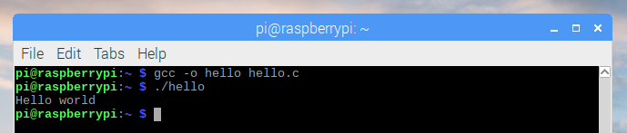

Note that in the previous examples, only one command was required to run the
code, e.g. `python3 hello.py` or `ruby hello.rb` because these languages are interpreted rather than compiled (actually Python is compiled at runtime but
that's a minor detail). C code is compiled into byte code and the byte code is
executed.

If you're interested in learning C, the Raspberry Pi Foundation publishes a book
[Learning to code with C](https://www.raspberrypi.org/magpi/issues/essentials-c-v1/)
written by one of its engineers. You can buy it in print or download for free.

## 8. C++

C's younger bother, C++ (that's C incremented by one...) is another fundamental
low-level language, with more advanced language features included (such as
classes). It's popular in a range of uses including game development, and chunks
of your operating system will be written in C++ too.

1. Open **Text Editor** from the main menu

1. Enter the following code:

    ```cpp
    #include <iostream>
    using namespace std;

    int main()
    {
        cout << "Hello world\n";
    }
    ```

1. Save the file as `hello.cpp` in the home directory

1. Open **Terminal** from the main menu

1. Run the following commands:

    ```bash
    g++ -o hellopp hello.cpp
    ./hellocpp
    ```

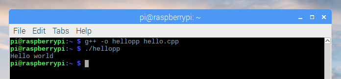

Readers familiar with C/C++ will notice I have not included the main function
return values in my examples. This is intentional as to remove boilerplate which
is not strictly necessary.

## 9. Perl

Perl gets a lot of stick for being hard to read, but nothing much gets in the
way of understanding its "hello world" program. So far so good!

1. Open **Text Editor** from the main menu

1. Enter the following code:

    ```bash
    print "Hello world\n"
    ```

1. Save the file as `hello.pl` in the home directory

1. Open **Terminal** from the main menu

1. Run the following command:

    ```bash
    perl hello.sh
    ```

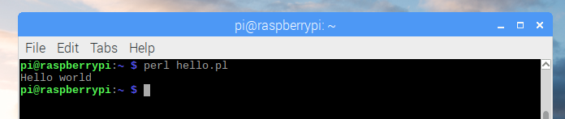

Again, I learned Perl at university, but unlike Java I have managed to
*successfully* avoid it.

## 10. Python extras - Minecraft and the Sense HAT emulator

So that's 9 different programming languages covered, but let's finish with a bit
more Python. The popular computer game Minecraft is available for Raspberry Pi,
and comes bundled with Raspbian. A Python library allows you to communicate with
your Minecraft world, so open Minecraft and a Python editor side-by-side for
some fun hacking your virtual world with code.

1. Open **Minecraft Pi** from the main menu

1. Create and enter a Minecraft world

1. Press **Tab** to release your focus from the Minecraft window

1. Open **Thonny Python IDE** from the main menu

1. Enter the following code:

    ```python
    from mcpi.minecraft import Minecraft

    mc = Minecraft.create()

    mc.postToChat("Hello world")
    ```

1. Save the file as `hellomc.py`

1. Click the **Run** button

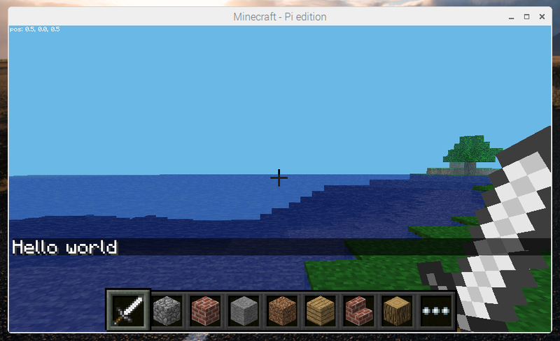

Finally, let's look at the Sense HAT Emulator. This tool provides a graphical representation of the
Sense HAT, en add-on board for Raspberry Pi made especially to go to space for reasons explained in
[this article](https://opensource.com/education/15/4/uk-students-compete-chance-have-their-raspberry-pi-code-run-space).

The `sense_emu` Python library is identical to the `sense_hat` library except
that its commands get executed in the emulator rather than on a physical piece
of hardware. Since the Sense HAT includes an 8x8 LED display, we can use its
`show_message` function to write "hello world".

1. Open another tab in Thonny and enter the following code:

    ```python
    from sense_emu import SenseHat

    sense = SenseHat()

    sense.show_message("Hello world")
    ```

1. Save the file as `sense.py`

1. Click the **Run** button

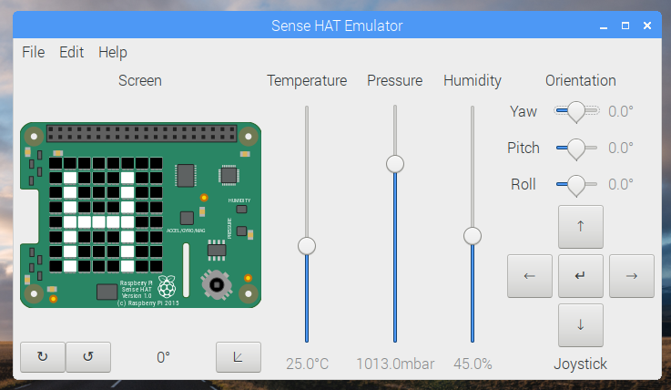

## More

That's it! I hope you learned something new, and have fun trying out new "hello world" programs on
your Raspberry Pi!

You can find more on the [GitHub repository](https://github.com/bennuttall/hello-world-raspberry-pi)
- and feel free to suggest more in an issue, or send me a pull request with your contribution.
