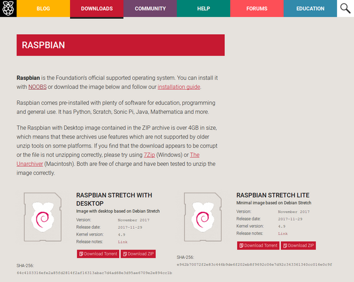
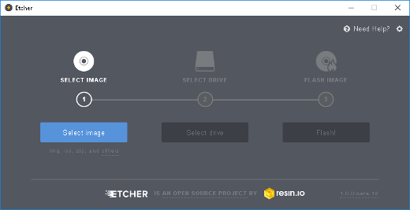
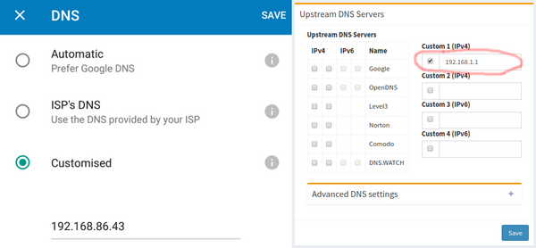
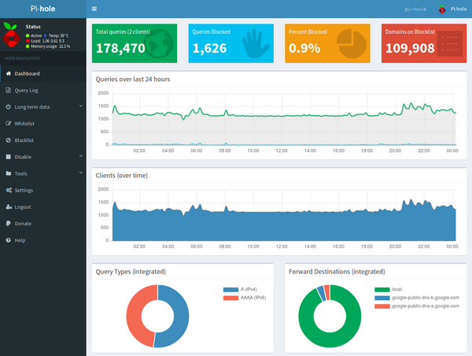
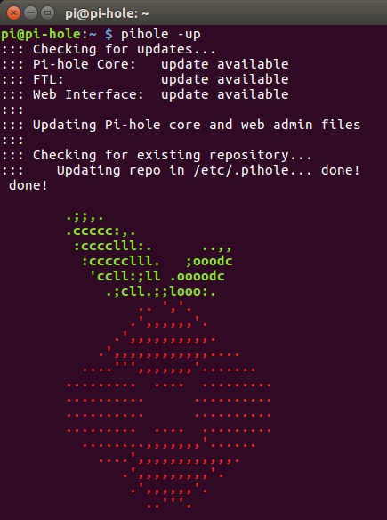

Got an old Raspberry Pi lying around? Hate seeing ads while browsing the web? pi-hole is an open-source software project that blocks ads for all devices on your home network by routing all advertising servers into nowhere. What's best is it takes just a few minutes to set up.

<div class="wp-block-image">

</div>

pi-hole blocks over 100,000 ad-serving domains, it blocks advertisements on any device (including mobiles, tablets and PCs), and because it completely blocks ads rather than just hide them, this improves overall network performance (because ads are never downloaded). You can monitor performance and statistics in a web interface, and there's even an API you can use.

## What you will need

- Raspberry Pi + SD card
- USB power cable
- Ethernet cable

You don't need a recent Raspberry Pi model - an older one will do the job, as long as it's got at least 512MB RAM, so either Pi 1 Model B (rev 2), Model B+, or a Pi 2 or 3. You could use a Pi Zero, but you'll need a USB micro Ethernet adapter too. You could use a Pi Zero W with WiFi rather than Ethernet, but as it's part of your network infrastructure I'd recommend a good solid wired connection instead.

## Prepare the SD card

First of all, you'll probably want to install Raspbian Stretch Lite onto an SD card. The card should be at least 4GB (the full desktop Raspbian image requires at least 8GB but the Lite image is, well, lighter). You can use the full Raspbian desktop image if you prefer, but as this is going to be running as a headless application, you don't need anything more.

<div class="wp-block-image">

</div>

Using your main PC, download the Raspbian Stretch Lite image from the Raspberry Pi website. Now unzip it to extract the `.img` file within, and you'll write this image to your SD card. It doesn't matter if the SD card is blank or not, as everything on it will be wiped.

If you're using Linux, the easiest way to write the image is using the command line tool `dd`. Alternatively, you can use cross-platform software [Etcher](https://etcher.io/).

<div class="wp-block-image">

</div>

Once your SD card image has burned, you can insert it into your Raspberry Pi, connect a keyboard, monitor and ethernet cable, and then plug in the power. After the initial setup, the Pi won't need the keyboard or monitor. If you're experienced working with the Pi headless, you can [enable SSH](https://www.raspberrypi.org/blog/a-security-update-for-raspbian-pixel/) and set it up [remotely](https://www.raspberrypi.org/documentation/remote-access/ssh/README.md).

## Install pi-hole

Once your Raspberry Pi boots up, log in with the default username (`pi`) and password (`raspberry`). Now you're at the command line, and you're readu to install pi-hole. Simply type the following command and press Enter:

```
curl -sSL https://install.pi-hole.net | bash
```

This command downloads the pi-hole installer script and executes it. You can take a look at the contents by browsing `https://install.pi-hole.net` in your browser, to see what it's doing. It will generate an admin password for you, and print it to the screen along with other installer information.

That's it! In just a few minutes, your Pi will be ready to start blocking ads.

Before you disconnect the Pi, you need to know its IP address, and your router's IP address (if you don't already know it). Just type `hostname -I` in the terminal, for the Pi's IP address, and `ip route | grep default` to locate your router. It will look something like `192.168.1.1`.

## Configure your router

Your Raspberry Pi is now running a DNS server, and you can tell your router to use pi-hole as its DNS server instead of your ISP's default. Log into your router's management console web interface. This can usually be found by typing your router's IP address into your web browser's address bar.

Look for DHCP/DNS settings under LAN settings, and set your primary DNS server to the IP address of the pi-hole. It should look something like these:

<div class="wp-block-image">

</div>

See the [pi-hole discourse](https://discourse.pi-hole.net/t/how-do-i-configure-my-devices-to-use-pi-hole-as-their-dns-server/245) for more information on this step.

You'll also want to make sure your pi-hole maintains the same IP address, so also look for DHCP IP reservations, and add an entry for your Pi.

## Test it out

Now shut down the Pi by running the command `sudo halt` and disconnecting the power. You can remove the monitor cable and the keyboard, and place the pi-hole in its permanent location - probably plugged in near your router. Ensure the ethernet is connected, and boot it back up by reconnecting the power.

Navigate to a website on your PC or a device on your WiFi to check that your internet access is working correctly (if not, you may have misconfigured your DNS settings). If web browsing seems to work as expected, it's set up correctly. Now, when you browse the web, it should be ad-free! Even ads served within apps on your mobile devices won't get through! Happy surfing!

If you really want to flex your new ad-blocking muscles, you can try browsing some of the ad-ridden websites listed on this page: https://pi-hole.net/pages-to-test-ad-blocking-performance/

Now access the pi-hole's web interface by entering its IP address into your web browser's address bar (or `http://pi.hole` should work too). You should see the pi-hole dashboard and some statistics (they will be very low at this stage). Once you log in using the password you were given during installation, you'll see some pretty graphs too:

<div class="wp-block-image">

</div>

You can also tweak your pi-hole's settings, like whitelist and blacklist domains, disable permanently or temporarily, as well as access the stats for blocked queries, and more.

Occasionally, you'll want to upgrade your pi-hole installation. The web interface includes an update notification when one is available. If you have enabled SSH, you can log in remotely, otherwise you'll have to reconnect the monitor and keyboard. When logged in, simply run the command `pihole -up`.

<div class="wp-block-image">

</div>
