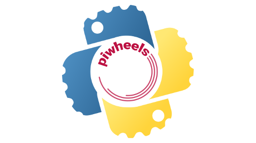
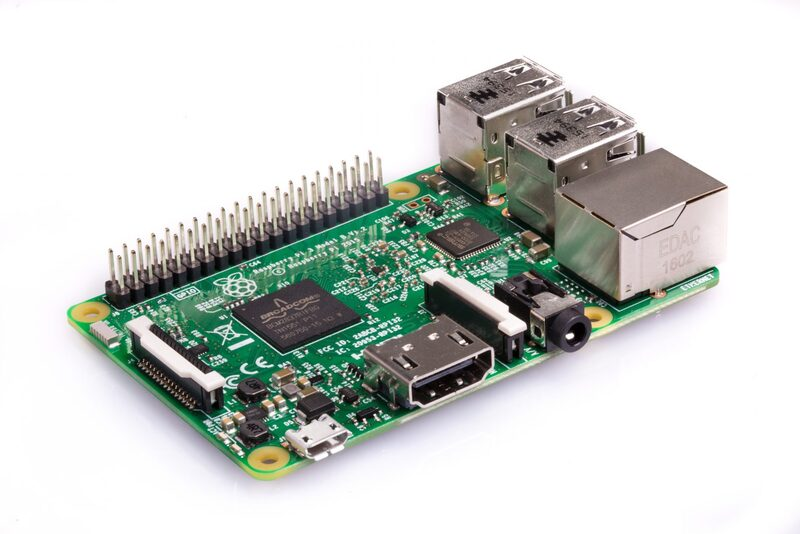
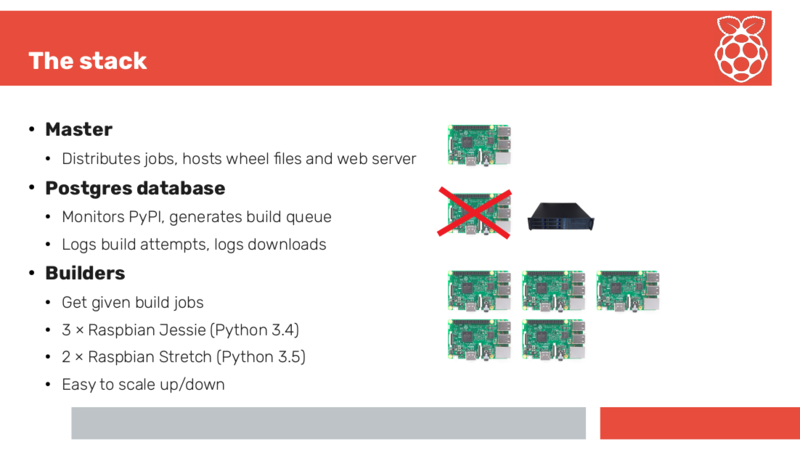

One of the great things about the Python programming language is [PyPI](https://pypi.org/) - the Python Package Index, where third-party libraries are hosted, available for anyone to install to gain access to pre-existing functionality without starting from scratch. These libraries are handy utilities written by members of the community which are not found within the Python standard library, but they work in much the same way - you import them in your code and have access to functions and classes you didn't write yourself.

## Background

Many of the 150,000+ libraries hosted on PyPI are written in Python, but that's not the only option - you can write Python libraries in C, C++ or anything with Python bindings. The benefit of writing a library in C or C++ is usually speed. The numpy project is a good example of this: numpy provides highly powerful mathamatical functionality for dealing with matrix operations. It is highly optimised code which allows users to write in Python but have access to speedy mathematics operations.

The problem comes when trying to distribute libraries for others to use, cross-platform. The standard for doing this is creating *built distributions* called Python wheels. While pure Python libraries are automatically compatible cross-platform, those implemented in C/C++ require building separately for each operating system, Python version and system architecture. So if a library wanted to support Windows, Mac and Linux, 32-bit and 64-bit computers for Python 2.7, 3.4, 3.5 and 3.6 - that would mean building 24 different versions! And some packages do this, but others rely on users building the package from the source code - which can take a long time and can often be complex.

## Raspberry Pi and Arm

While the Raspberry Pi runs Linux, it's not the same architecture as your regular PC - it's Arm, rather than Intel. That means that the Linux wheels don't work, and Raspberry Pi users were forced to build from source - until the piwheels project came to fruition last year. [piwheels](https://www.piwheels.org/) is an open source project which aims to build Raspberry Pi platform wheels for every package on PyPI.

Packages are natively compiled on real Raspberry Pi 3 hardware, hosted in a data centre provided by UK based [Mythic Beasts](https://www.mythic-beasts.com/order/rpi), who provide cloud Pis as part of their hosting service. The piwheels website hosts the wheels in a pip-compatible web server configuration so that Raspberry Pi users can use it easily. Raspbian Stretch even comes pre-configured to use piwheels.org as an additional index to PyPI by default.

## The piwheels stack

The piwheels project runs (almost) entirely on Raspberry Pi hardware:

- **Master**
  - A Raspberry Pi web server hosts the wheel files and distributes jobs to the builder Pis
- **Database server**
  - All package information is stored in a Postgres database
  - This server logs build attempts and logs downloads
- **Builders**
  - Builder Pis are given build jobs to attempt, and they communicate with the database
  - The backlog of packages was completed using around 20 Raspberry Pis
  - In order to keep up with new releases, a smaller number of Pis is required. This is currently three with Raspbian Jessie (Python 3.4) and two with Raspbian Stretch (Python 3.5)

The database server was a Raspberry Pi originally but was later moved to another server when the database got very big!

## Time saved

Around 500,000 packages are downloaded from piwheels.org every month!

When a package is built by piwheels, its status information (including build duration) is recorded in a database, and every time a package is downloaded, it's also recorded. Therefore, it's possible to calculate the amount of time has been saved by providing pre-compiled packages.

In the 10 months the service has been running, over 25 years of build time has been saved!

## Great for projects

Raspberry Pi project tutorials requiring Python libraries would often include warnings like "this step takes a few hours" - but piwheels makes it easy for makers and developers to dive straight in to their project and not get bogged down waiting for software to install. Amazing libraries are just a `pip install` away, no need to wait for compilation.

piwheels has wheels for numpy, scipy, opencv, keras and even [Tensorflow](https://www.tensorflow.org/), Google's machine learning framework. These libraries are great for [projects at home](https://opensource.com/article/17/4/5-projects-raspberry-pi-home), including image and facial recognition with the [camera module](https://opensource.com/life/15/6/raspberry-pi-camera-projects). For inspiration, take a look at the Raspberry Pi category on [pyimagesearch](https://www.pyimagesearch.com/category/raspberry-pi/), which was one of my [top 10 Raspberry Pi blogs to follow](https://opensource.com/article/18/8/top-10-raspberry-pi-blogs-follow)!

Read more about piwheels on the project's [blog](https://blog.piwheels.org/), see the annoncement on the [Raspberry Pi blog](https://www.raspberrypi.org/blog/piwheels/), see the [source code on GitHub](https://github.com/bennuttall/piwheels) and check out the [piwheels website](https://www.piwheels.org/). If you want to contribute to the project, check the [missing packages tag](https://github.com/bennuttall/piwheels/issues?q=is%3Aissue+is%3Aopen+label%3A%22missing+package%22) and see if you can successfully build one of the packages.
