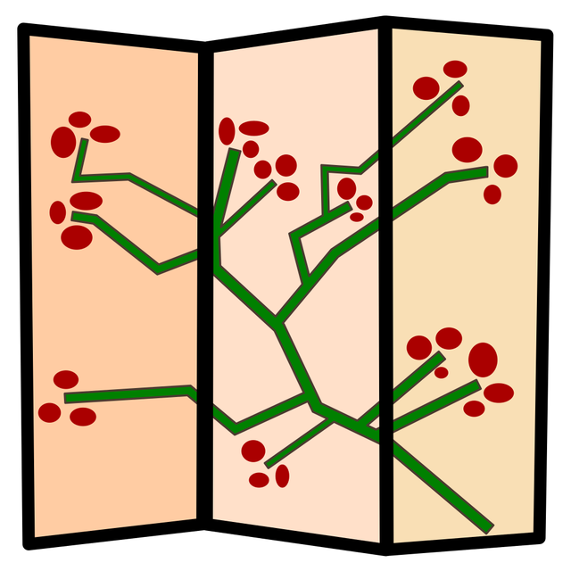

Byobu is a text-based window manager and terminal multiplexer. If you've ever used *screen*, it's
similar but more modern and more intuitive.

If you SSH'd into a Pi or server, ran `sudo apt update && sudo apt upgrade` for example, and lost
your internet connection while it was running, your command would be lost to the void. If you start
a byobu session first, it keeps running and when you reconnect, it's been running happily without
your eyes on it.

Byobu allows you to maintain multiple terminal windows, connect via SSH, disconnect, reconnect, even
let other people access it, all the time keeping the session alive.

<div class="wp-block-image">
<figure class="aligncenter is-resized">

<figcaption>Byobu is named for <em>a Japanese term for decorative, multi-panel screens that serve as
folding room dividers</em>, which I think is quite fitting.</figcaption>
</figure>
</div>

To install byobu on Debian/Raspbian/Ubuntu:

```
sudo apt install byobu
```

Then enable it:

```
byobu-enable
```

Now drop out of your SSH session and log back in – you'll land in a byobu session. Run a command
like `sudo apt update` and close the window (or enter the escape sequence
[Enter-tilde-dot](https://www.google.com/search?client=ubuntu&channel=fs&q=Enter-tilde-dot&ie=utf-8&oe=utf-8))
and log back in. You'll see the update running as you left it.

There are a *lot* of features I don't use regularly or at all. The most common ones I use are:

- **F2** – New window
- **F3/F4** – Navigate between windows
- **Ctrl-F2** – Split pane vertically
- **Shift-F2** – Split pane vertically
- **Shift-left/Shift-right** – navigate between splits
- **Shift-F11** – Zoom in on a split (same to zoom back out)

You'll learn more visually by watching this video:

<figure>
<iframe width="560" height="315" src="https://www.youtube.com/embed/NawuGmcvKus?si=q1bYgxRibII9g41q" title="YouTube video player" frameborder="0" allow="accelerometer; autoplay; clipboard-write; encrypted-media; gyroscope; picture-in-picture; web-share" referrerpolicy="strict-origin-when-cross-origin" allowfullscreen></iframe>
</figure>

Byobu has been great for maintenance of piwheels. We have a horizontal split showing the piwheels
monitor in the top half and the syslog entries being scrolled in real time in the bottom half. Then
if we wnat to do something else, we switch to another window. It's particularly handy when we're
investigating something together, as I can see what Dave types (and correct his typos) while we chat
in IRC.

I also have byobu enabled on my home and work servers, so I can log in and everything is as I left
it – multiple jobs running, a window left in a particular directory, running a process as another
user, that kind of thing.

<figure class="wp-block-image">

</figure>

It's handy for development on Raspberry Pis too. You can launch byobu on the desktop, run a command,
then SSH in and attach yourself to the session where that command is running. Just note that
enabling byobu won't change what the terminal launcher does. Just run `byobu` to launch it.
