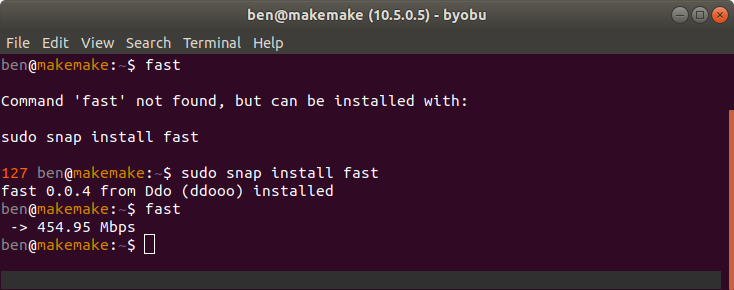
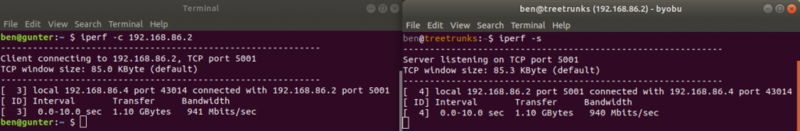
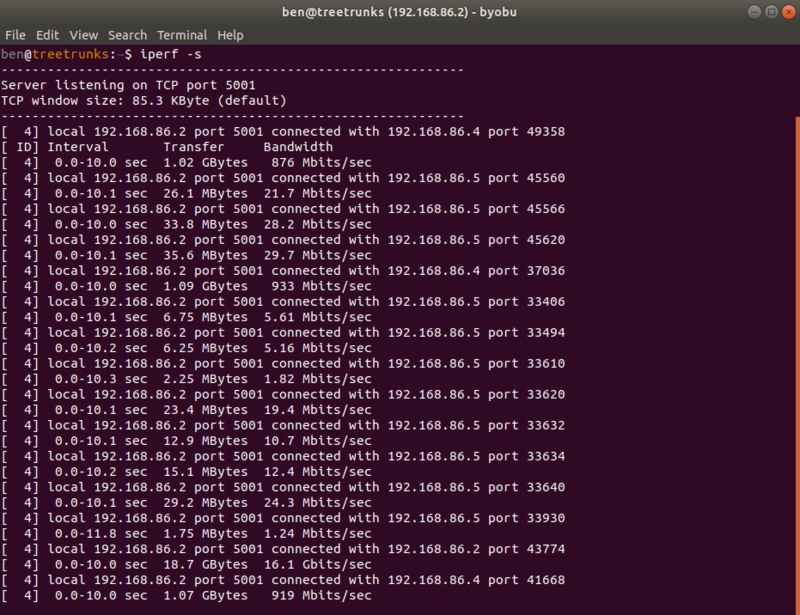
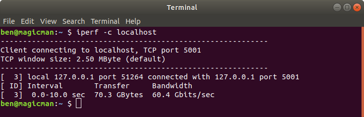

Today I'm sharing three tools for checking your internet and LAN speed: speedtest, fast and iperf.

## speedtest

speedtest is an old favourite. It's implemented in Python, packaged in apt and also available with
pip. You can use it as a command line tool, or within a Python script.

Install it with:

```
sudo apt install speedtest-cli
```

or:

```
sudo pip3 install speedtest-cli
```

Then run with the command speedtest:

You'll see your download and upload internet speeds.

## fast

fast is a service provided by Netflix, its web interface is at [fast.com](https://fast.com) and it
has a command line interface available as a snap (for Ubuntu):

```
sudo snap install fast
```

<figure class="wp-block-image">

</figure>

There's another implementation that's done in node, so you can install that with npm instead, on any
other system:

```
sudo npm install fast-cli
```

Both provide the same basic interface: just type fast and hit enter:

You'll see your internet download speed. The version that's in the snap store doesn't seem to
support getting your upload speed, but the npm one does, via the `-u` flag.

## iperf

iperf is a great way to test your LAN speed, rather than your internet speed. Debian, Raspbian and
Ubuntu users can install it with apt:

```
sudo apt install iperf
```

It's also [available for Mac and Windows](https://iperf.fr/).

Once it's installed, you'll need two machines on the same network (both with iperf installed).
Designate one as the server and run:

```
iperf -s
```

That will wait for incoming connections from clients. Use another machine as a client, and run:

```
iperf -c 192.168.86.2
```

using the IP address of the server.

<div class="wp-block-image">

<figure class="aligncenter">

</figure>

</div>

It only takes a few seconds to do a test, and it'll come back with the transfer size and calculated
bandwidth. I ran a few tests from my PC and my laptop, using my home server as the server. I
recently put in Cat6 ethernet around my house so I get up to 1Gbps speeds from my wired connections,
but a much lower speed on WiFi connections:

<figure class="wp-block-image">

</figure>

You may also notice a recorded 16Gbps! That was me testing using the server to test itself, so it's
just testing how fast it can write to its own disk. The server has HDDs, so it's only 16Gbps, but my
desktop PC gets 46Gbps and my (newer) laptop gets over 60Gbps as they have SSDs!

<div class="wp-block-image">

<figure class="aligncenter">

</figure>

</div>
