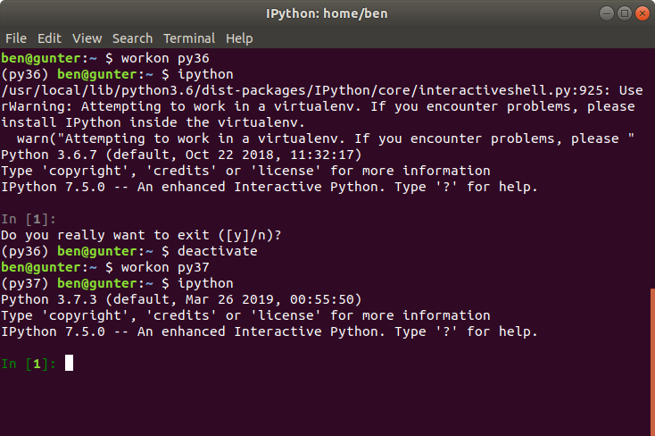

The [deadsnakes PPA](https://launchpad.net/~deadsnakes/+archive/ubuntu/ppa) lets you install
multiple Python versions on your Ubuntu system, so instead of only having just the Python 2.x and
Python 3.x that comes with your distribution (18.04 comes with Python 3.6, and 2.7 is available),
you can install older or newer versions, from 2.3 (!) to the latest prerelease version of Python 3.

<figure class="wp-block-image">

</figure>

The way PPAs (Personal Package Archives) work is that someone maintains a personal set of apt
packages on launchpad, allowing others to add their PPA to their apt sources so that `apt install`
picks up their packages as well as the standard Ubuntu ones.

To add the PPA:

```
sudo add-apt-repository ppa:deadsnakes/ppa
sudo apt-get update
```

Then to install a particular Python version:

```
sudo apt install python3.11 python3.11-pip python3.11-venv
```

It's installed alongside your system Python:

```
$ which python
/usr/bin/python3.11
```

You can run a Python shell for this version of Python:

```
$ python3.11
Python 3.11.13 (main, Jun  4 2025, 08:57:30) [GCC 13.3.0] on linux
Type "help", "copyright", "credits" or "license" for more information.
>>>
```

You may find you need additional packages for everything to work, e.g `python3.11-full`.

You can create virtual environments targeting a specific Python version:

```
python3.11 -m venv py311
source ./py311/bin/activate
```

Then you can run `python` and get your virtualenv instance of this version of Python:

```
$ which python
/home/ben/py311/bin/python3.11
$ python
Python 3.11.13 (main, Jun  4 2025, 08:57:30) [GCC 13.3.0] on linux
Type "help", "copyright", "credits" or "license" for more information.
>>>
```

and use `pip` to install libraries for it:

```
pip install pyjokes
```

It's much easier with virtualenvwrapper:

```
mkvirtualenv -p `which python3.11` py311
pip install pyjokes
```

Deactivate a virtualenv with `deactivate` and activate with e.g. `workon py311`:

<figure class="wp-block-image">

</figure>