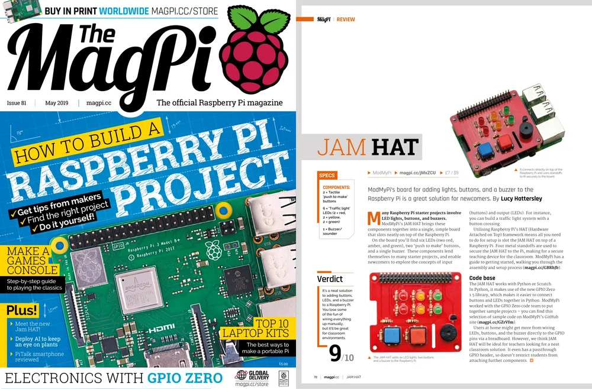
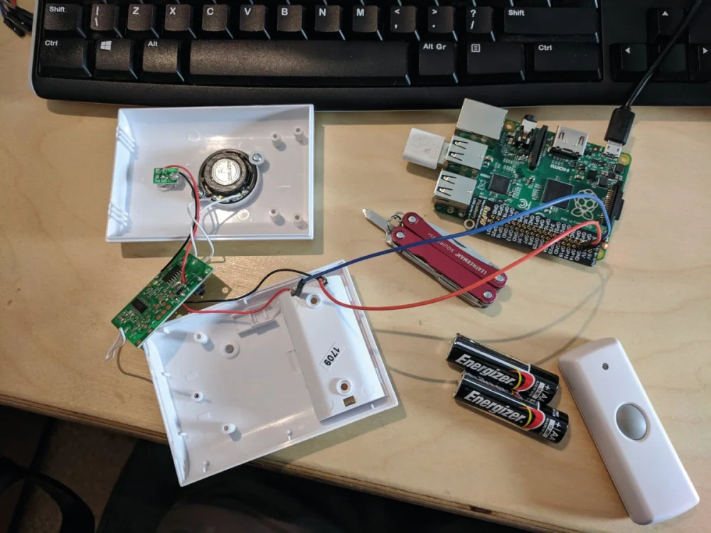
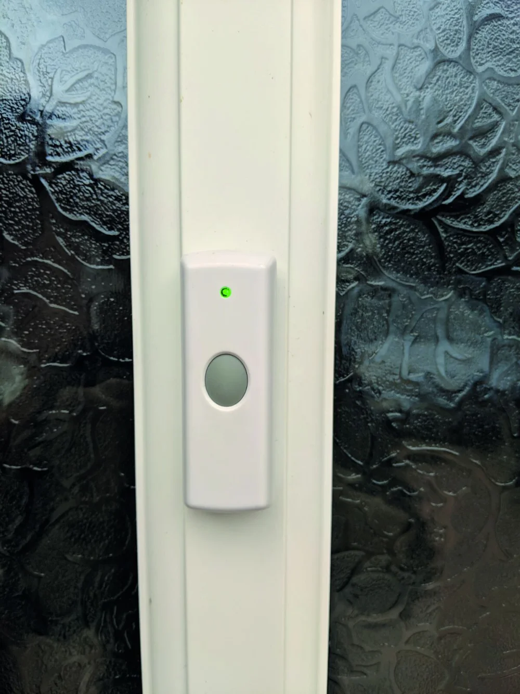
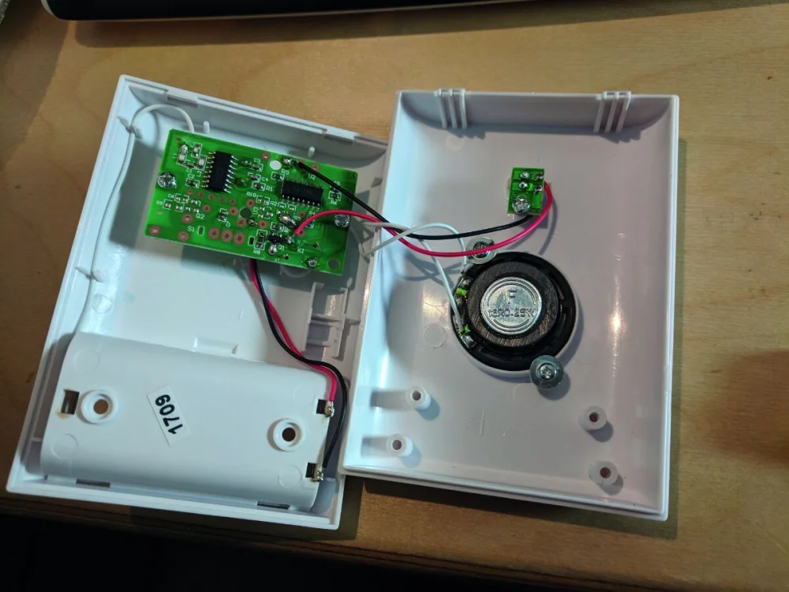
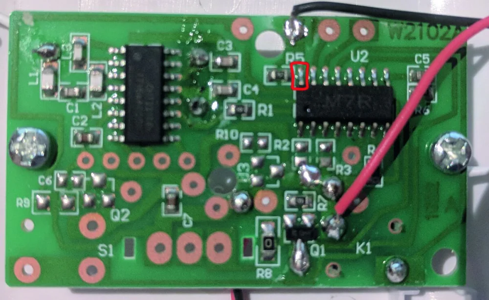
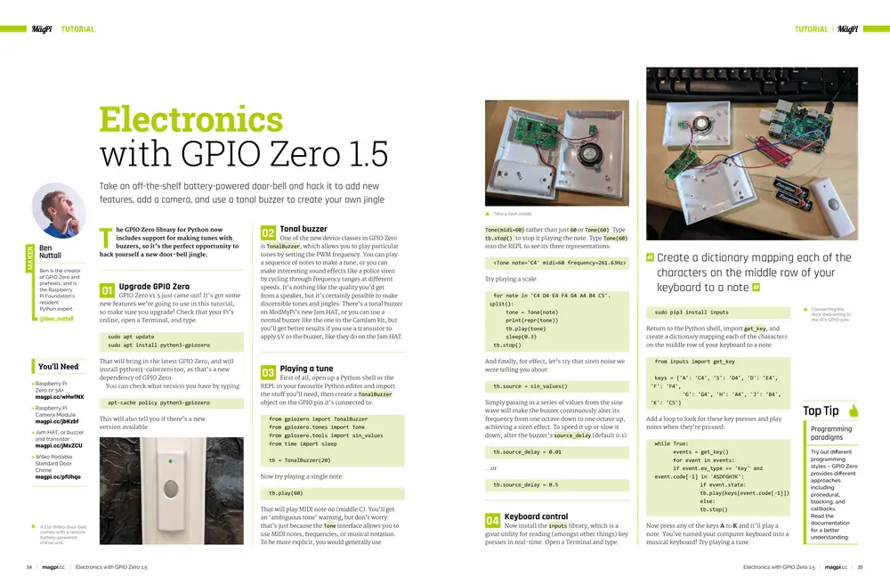
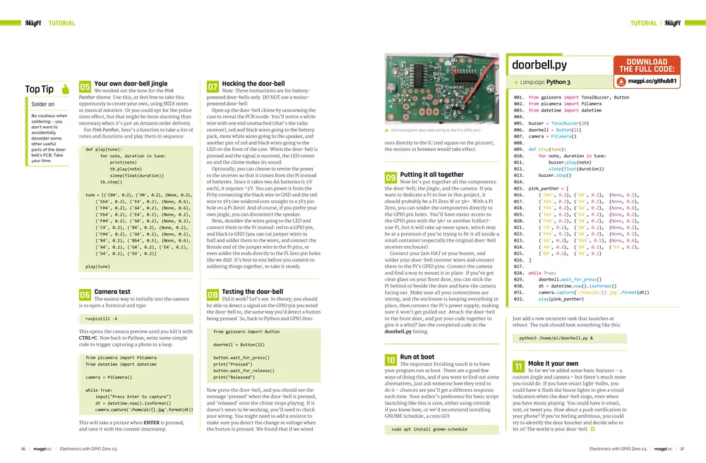

This is a tutorial I wrote for [MagPi Issue #81](https://magazine.raspberrypi.com/issues/81) — how
to take an off-the-shelf battery-powered doorbell and hack it to add new features, add a camera, and
use a tonal buzzer to create your own jingle.

<figure>
<a href="https://magazine.raspberrypi.com/issues/81"></a>
<figcaption>
This issue also covered a primer for the new JAM HAT which I use in the tutorial.
</figcaption>
</figure>

The GPIO Zero library for Python now includes support for making tunes with buzzers, so it's the
perfect opportunity to hack yourself a new doorbell jingle. GPIO Zero v1.5 just came out! It's got
some new features we're going to use in this tutorial, so make sure you upgrade!

<figure>

<figcaption>
Take an off-the-shelf battery-powered doorbell and hack it to add new features, add a camera, and
use a tonal buzzer to create your own jingle
</figcaption>
</figure>

One of the new device classes in GPIO Zero is `TonalBuzzer`, which allows you to play particular
tones by setting the PWM frequency. You can play a sequence of notes to make a tune, or you can make
interesting sound effects like a police siren by cycling through frequency ranges at different
speeds. It's nothing like the quality you'd get from a speaker, but it's certainly possible to make
discernible tones and jingles. There's a tonal buzzer on ModMyPi's new Jam HAT, or you can use a
normal buzzer like the one in the CamJam kit, but you'll get better results if you use a transistor
to apply 5V to the buzzer, like they do on the Jam HAT.

## Playing a tune

First of all, open up a Python shell or the REPL in your favourite Python editor and import the
stuff you'll need, then create a `TonalBuzzer` object on the GPIO pin it's connected to:

```python
from gpiozero import TonalBuzzer
from gpiozero.tones import Tone
from gpiozero.tools import sin_values
from time import sleep

tb = TonalBuzzer(20)
```

Now try playing a single note:

```python
tb.play(60)
```

That will play MIDI note 60 (middle C). You'll get an 'ambiguous tone' warning, but don't worry:
that's just because the `Tone` interface allows you to use MIDI notes, frequencies, or musical
notation. To be more explicit, you would generally use `Tone(midi=60)` rather than just `60` or
`Tone(60)`. Type `tb.stop()` to stop it playing the note. Type `Tone(60)` into the REPL to see its
three representations:

```python
<Tone note='C4' midi=60 frequency=261.63Hz>
```

Try playing a scale:

```python
for note in 'C4 D4 E4 F4 G4 A4 B4 C5'.split():
    tone = Tone(note)
    print(repr(tone))
    tb.play(tone)
    sleep(0.3)
tb.stop()
```

And finally, for effect, let's try that siren noise we were telling you about:

```python
tb.source = sin_values()
```

Simply passing in a series of values from the sine wave will make the buzzer continuously alter its
frequency from one octave down to one octave up, achieving a siren effect. To speed it up or slow it
down, alter the buzzer's `source_delay` (default `0.1`):

```python
tb.source_delay = 0.01
```

or:

```python
tb.source_delay = 0.5
```

## Keyboard control

Now install the inputs library, which is a great utility for reading (amongst other things) key
presses in real-time. Open a Terminal and type:

```
sudo pip3 install inputs
```

Return to the Python shell, import `get_key`, and create a dictionary mapping each of the characters
on the middle row of your keyboard to a note:

```python
from inputs import get_key

keys = {'A': 'C4', 'S': 'D4', 'D': 'E4', 'F': 'F4', 'G': 'G4', 'H': 'A4', 'J': 'B4', 'K': 'C5'}
```

Add a loop to look for these key presses and play notes when they're pressed:

```python
while True:
    events = get_key()
    for event in events:
        if event.evtype == 'Key' and event.code[-1] in 'ASDFGHJK':
            if event.state:
                tb.play(keys[event.code[-1]])
            else:
                tb.stop()
```

Now press any of the keys A to K and it'll play a note. You've turned your computer keyboard into a
musical keyboard! Try playing a tune.

## Your own doorbell jingle

We worked out the tune for the Pink Panther theme. Use this, or feel free to take this opportunity
to create your own, using MIDI notes or musical notation. Or you could opt for the police siren
effect, but that might be more alarming than necessary when it's just an Amazon order delivery.

For Pink Panther, here's a function to take a list of notes and durations and play them in sequence.

```python
def play(tune):
    for note, duration in tune:
        print(note)
        tb.play(note)
        sleep(float(duration))
    tb.stop()

tune = [
    ('C#4', 0.2), ('D4', 0.2),  (None, 0.2),
    ('Eb4', 0.2), ('E4', 0.2),  (None, 0.6),
    ('F#4', 0.2), ('G4', 0.2),  (None, 0.6),
    ('Eb4', 0.2), ('E4', 0.2),  (None, 0.2),
    ('F#4', 0.2), ('G4', 0.2),  (None, 0.2),
    ('C4', 0.2),  ('B3', 0.2),  (None, 0.2),
    ('F#4', 0.2), ('G4', 0.2),  (None, 0.2),
    ('B4', 0.2),  ('Bb4', 0.5), (None, 0.6),
    ('A4', 0.2),  ('G4', 0.2),  ('E4', 0.2),
    ('D4', 0.2),  ('E4', 0.2)
]

play(tune)
```

## Camera test

The easiest way to initially test the camera is to open a Terminal and type:

```
raspistill -k
```

This opens the camera preview until you kill it with `CTRL+C`. Now back to Python; write some simple
code to trigger capturing a photo in a loop:

```python
from picamera import PiCamera
from datetime import datetime

camera = PiCamera()

while True:
    input("Press Enter to capture")
    dt = datetime.now().isoformat()
    camera.capture('/home/pi/{}.jpg'.format(dt))
```

This will take a picture when ENTER is pressed, and save it with the current timestamp.

## Hacking a doorbell with GPIO Zero 1.5

Note: These instructions are for battery-powered doorbells only. DO NOT use a mains-powered
doorbell.

<figure>

<figcaption>
A £10 Wilko doorbell comes with a remote battery-powered chime unit
</figcaption>
</figure>

Open up the doorbell chime by unscrewing the case to reveal the PCB inside. You'll notice a white
wire with one end unattached (that's the radio receiver), red and black wires going to the battery
pack, more white wires going to the speaker, and another pair of red and black wires going to the
LED on the front of the case. When the doorbell is pressed and the signal is received, the LED comes
on and the chime makes its sound.

Optionally, you can choose to rewire the power to the receiver so that it comes from the Pi instead
of batteries. Since it takes two AA batteries (1.5 V each), it requires ~3 V. You can power it from
the Pi by connecting the black wire to GND and the red wire to 3V3 (we soldered ours straight to a
3V3 pin hole on a Pi Zero). And of course, if you prefer your own jingle, you can disconnect the
speaker.

Next, desolder the wires going to the LED and connect them to the Pi instead: red to a GPIO pin, and
black to GND (you can cut jumper wires in half and solder them to the wires, and connect the female
end of the jumper wire to the Pi pins, or even solder the ends directly to the Pi Zero pin holes
like we did). It's best to test before you commit to soldering things together, so take it steady.

## Testing the doorbell

Did it work? Let's see. In theory, you should be able to detect a signal on the GPIO pin you wired
the doorbell to, the same way you'd detect a button being pressed. So, back to Python and GPIO Zero:

```python
from gpiozero import Button

doorbell = Button(21)

doorbell.wait_for_press()
print("Pressed")
doorbell.wait_for_release()
print("Released")
```

Now press the doorbell, and you should see the message 'pressed' when the doorbell is pressed, and
'released' once the chime stops playing. If it doesn't seem to be working, you'll need to check your
wiring. You might need to add a resistor to make sure you detect the change in voltage when the
button is pressed. We found that if we wired ours directly to the IC (red square on the picture),
the resistor in between would take effect.

<figure>

<figcaption>
Take a look inside the doorbell
</figcaption>
</figure>

<figure>

<figcaption>
Connecting the doorbell wiring to the Pi's GPIO pins
</figcaption>
</figure>

## Putting it all together

Now let's put together all the components: the doorbell, the jingle, and the camera. If you want to
dedicate a Pi to live in this project, it should probably be a Pi Zero W or 3A+. With a Pi Zero, you
can solder the components directly to the GPIO pin holes. You'll have easier access to the GPIO pins
with the 3A+ or another full(er)-size Pi, but it will take up more space, which may be at a premium
if you're trying to fit it all inside a small container (especially the original doorbell receiver
enclosure).

Connect your Jam HAT or your buzzer, and solder your doorbell receiver wires and connect them to the
Pi's GPIO pins. Connect the camera and find a way to mount it in place. If you've got clear glass on
your front door, you can stick the Pi behind or beside the door and have the camera facing out. Make
sure all your connections are strong, and the enclosure is keeping everything in place, then connect
the Pi's power supply, making sure it won't get pulled out. Attach the doorbell to the front door,
and put your code together to give it a whirl! See the completed code in the `doorbell.py` listing.

## Run at boot

The important finishing touch is to have your program run at boot. There are a good few ways of
doing this, and if you want to find out some alternatives, just ask someone how they tend to do it –
chances are you'll get a different response each time. Your author's preference for basic script
launching like this is cron, either using crontab if you know how, or we'd recommend installing
GNOME Schedule, a cron GUI:

```
sudo apt install gnome-schedule
```

Just add a new recurrent task that launches at reboot. The task should look something like this:

```
python3 /home/pi/doorbell.py &
```

## Make it your own

So far we've added some basic features – a custom jingle and camera – but there's much more you
could do. If you have smart lightbulbs, you could have it flash the house lights to give a visual
indication when the doorbell rings, even when you have music playing. You could have it email, text,
or tweet you. How about a push notification to your phone? If you're feeling ambitious, you could
try to identify the door knocker and decide who to let in! The world is your doorbell.

[](https://magazine.raspberrypi.com/issues/81)

[](https://magazine.raspberrypi.com/issues/81)