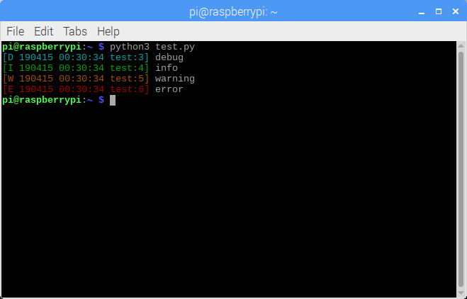
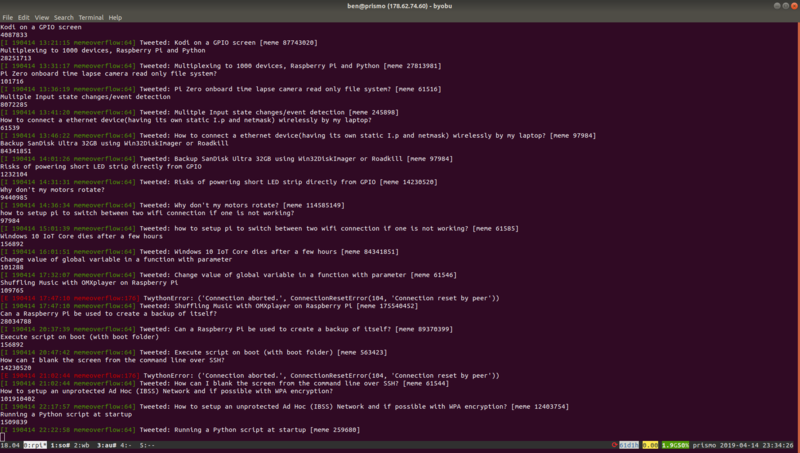

I'm not sure whether logzero took its name to fit in with the series of "zero boilerplate" libraries
like pygame-zero, GPIO Zero and guizero, but it's certainly in that category. It's a Python library
that makes logging straightforward. It makes logging as easy as a print statement, which is a big
win for education, as it saves from explaining another concept.

You can just use its basic logging to stdout functionality the same way you might use print for
information and debugging purposes, and it has a smooth learning curve towards more advanced
logging, like logging to a file.

To start, install logzero with pip:

```
pip install logzero
```

Now in a Python file, import logger and try one or all of these logging examples:

```python
from logzero import logger

logger.debug("hello")
logger.info("info")
logger.warning("warning")
logger.error("error")
```

The output is automatically coloured:  

<div class="wp-block-image">

<figure class="aligncenter">

</figure>

</div>

So now instead of using `print` to figure out what's going on, use `logger` instead, with the
relevant log level. If you only read this far and make that one change in the way you write code,
that's good enough for me. If you want to go further, read on!

You can also log to a file:

```python
from logzero import logger, logfile

logfile('/home/pi/test.log')
```

Now your log entries will be logged into the file test.log. You can specify some more options too:

```python
logfile('/home/pi/test.log', maxBytes=1e6, backupCount=3)
```

Now when the logfile reaches 1MB (1×10<sup>6</sup> bytes), it will rotate entries through
`test.log.1`, `test.log.2`, and so on. You might want to log to `/var/log` like a pro. Just create a
directory and make your user the owner so they can write to it:

```
$ sudo mkdir /var/log/test
$ sudo chown pi /var/log/test
```

Then in your code, set the logfile path:

```python
logfile('/var/log/test/test.log', maxBytes=1e6, backupCount=3)
```

When it comes to catching exceptions in your logfile – you can either use `logging.exception`:

```python
try:
    c = a / b
except Exception as e:
    logger.exception(e)
```

This will produce the following (in the case that b is zero):

```python
[E 190422 23:41:59 test:9] division by zero
     Traceback (most recent call last):
       File "test.py", line 7, in 
         c = a / b
     ZeroDivisionError: division by zero
```

You get the log entry followed by the full traceback.

Alternatively, you could use `logging.error` and hide the traceback:

```python
try:
     c = a / b
 except Exception as e:
     logger.error('{}: {})'.format(e.__class__.__name__, e))
```

Now this will produce the more succinct:

```
[E 190423 00:04:16 test:9] ZeroDivisionError: division by zero
```

<div class="wp-block-image">
<figure class="aligncenter">

<figcaption>logzero in use in my meme-overflow project</figcaption>
</figure>
</div>

There are plenty more options which you can read in the docs at
[logzero.readthedocs.io](https://logzero.readthedocs.io/en/latest/)
