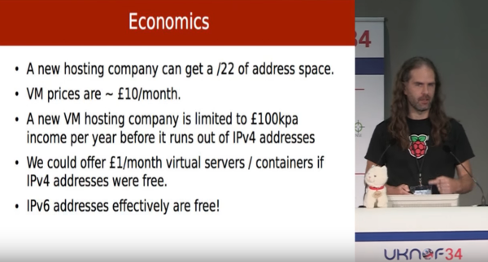
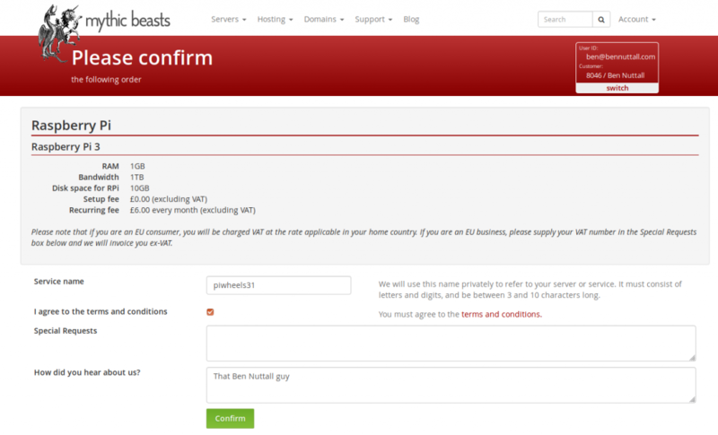
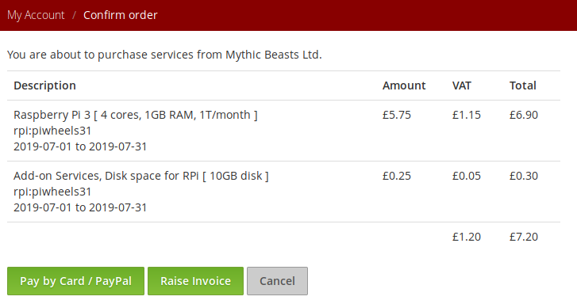
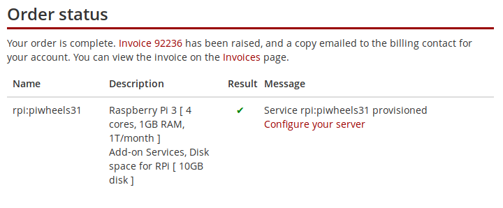
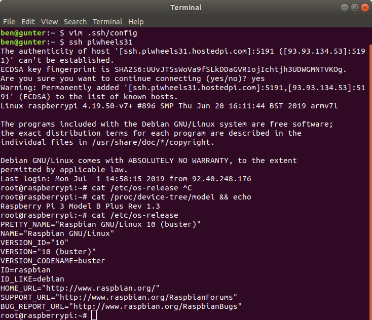
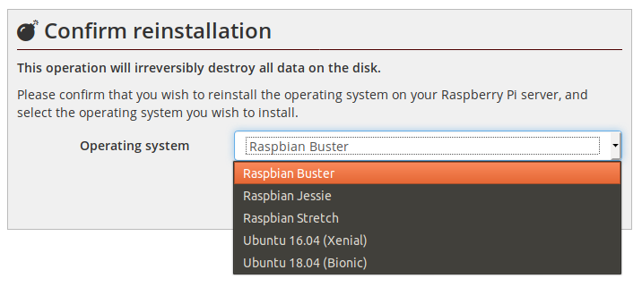
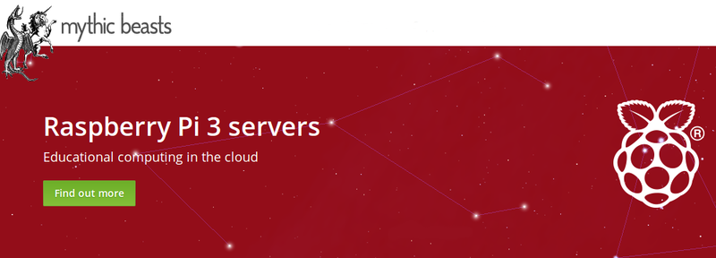

[Mythic Beasts](https://www.mythic-beasts.com/) is an awesome hosting company based in Cambridge.
They host the Raspberry Pi website, including the Raspbian archive and download images, and like to
make sure we eat our own dog food by hosting the website on new Raspberry Pi hardware for product
launches.

<figure class="wp-block-image">

<figcaption>Pete Stevens of Mythic Beasts – don't get him started on IPv4</figcaption>
</figure>

Mythic built a Raspberry Pi server rack in their London data centre, affectionately known and
marketed as the *Pi cloud*. It's a sophisticated system for centrally managing Raspberry Pis using
PoE and netboot. Rather than using SD cards with Pis, they use one of the Pi 3's alternative booting
options: PXE. You get partitioned some disk space on an NFS mount, and this contains your OS and
files. 10GB is the default, but you can get more if you want.

<figure class="wp-block-image">

</figure>

<figure class="wp-block-image">

</figure>

<figure class="wp-block-image">

</figure>

It takes less than five minutes to register a Pi and SSH onto it. Start here, click all the right
buttons, and paste in an SSH key at the end. It'll tell you which SSH port to use, as they have an
IPv4to-v6 proxy so that each Pi doesn't need its own IPv4 address (that would cost half the price of
a Pi!).

<figure class="wp-block-image">

</figure>

You can choose to reimage a Pi server at any time, either to start from scratch, or to choose a new
distro or version. You can choose between Raspbian Jessie, Stretch and Buster, and Ubuntu Xenial and
Bionic. As of today, the default is Buster.

<figure class="wp-block-image">

</figure>

The Pis in the datacentre are 3B and recently they added some 3B+. It's random what you get, but I
think your chances of getting a 3B+ are high based on current usage of 3B.

The main benefit of Pi hosting is if you need to run your code on real Raspberry Pi hardware,
without emulation. You can run real web apps or host a website if you want; though I don't think
that's a practical option until the Pi 4 rolls out. Static sites actually run pretty well served
from the Pi. [piwheels.org](https://www.piwheels.org/) is hosted on a single cloud Pi (3B) and that
serves between 500k and 900k files per month.

It's no secret I'm a big user of the Pi cloud. I run the piwheels project, which is run almost
entirely on cloud Pis (we had to move the postgres database onto a VM as it kept running out of RAM
– and swap over NFS is no fun). Once netboot support is added to Raspberry Pi 4, I can see Mythic
promptly adding Pi 4s to the rack. Exciting times ahead! That should mean we can move the piwheels
database back to a Pi, as long as it's one with plenty of RAM!

[Get your cloud Pi now!](https://www.mythic-beasts.com/order/rpi)

<figure class="wp-block-image">

</figure>

Update: I've now also made a [screencast](https://www.youtube.com/watch?v=V4vMPjdYsdc) of this
process:

<figure class="wp-block-image">
<iframe width="560" height="315" src="https://www.youtube.com/embed/V4vMPjdYsdc?si=yjwJv_vUU5_wMoRp" title="YouTube video player" frameborder="0" allow="accelerometer; autoplay; clipboard-write; encrypted-media; gyroscope; picture-in-picture; web-share" referrerpolicy="strict-origin-when-cross-origin" allowfullscreen></iframe>
</figure>
