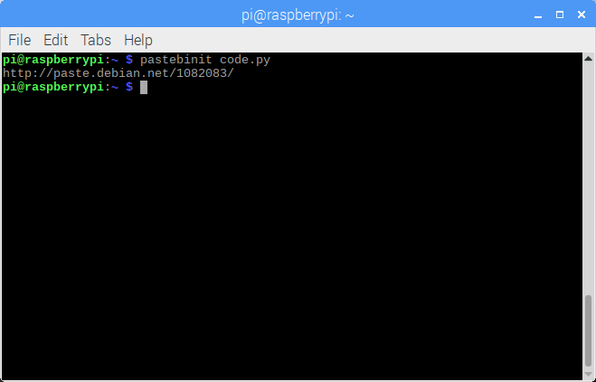

Have you ever used pastebin websites like pastebin.com to share snippets of code, data or text? Did
you know you can publish a file from your computer or a Raspberry Pi to a pastebin site with a
single command?

Install pastebinit:

```
sudo apt install pastebinit
```

Mac users can install with brew.

Usage:

```
pastebinit <filename>
```

pastebinit then returns the URL for your paste:

<figure class="wp-block-image">

</figure>

The default pastebin provider in Raspbian is paste.debian.net and Ubuntu have their own at
paste.ubuntu.com, which is the default in Ubuntu.

*Update: apparently, Les wrote a Tooling Tuesday post about this in 2017, following a recommendation
from me! We've come full circle:*
[*bigl.es/tuesday-tooling-pastebinit*](https://bigl.es/tuesday-tooling-pastebinit/)
