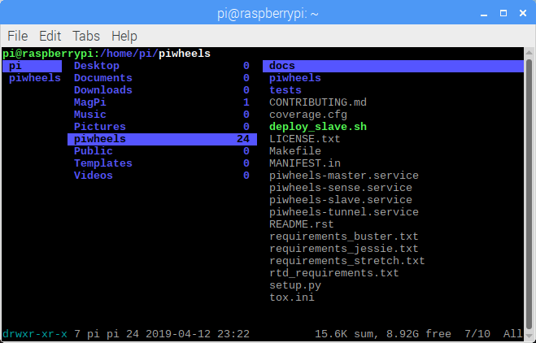
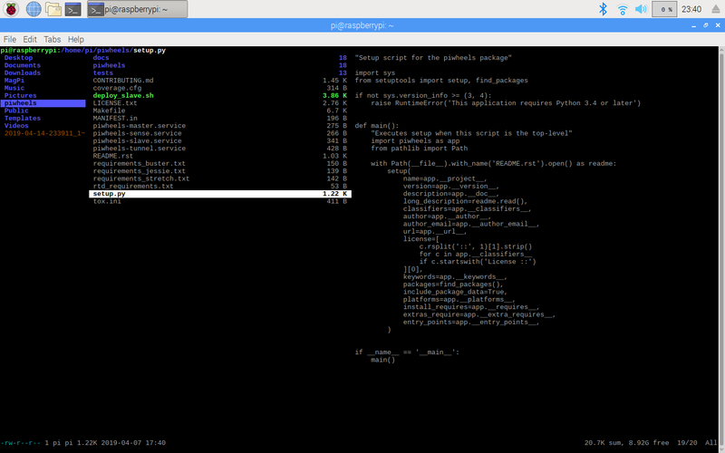

I was recently introduced to ranger by [Dave Jones](https://twitter.com/waveform80). It's an
incredibly handy terminal based file navigator that's written in Python and is available in Debian,
Raspbian and Ubuntu.

Ranger allows you to navigate your filesystem using the arrow keys on your keyboard: up/down to
select files in the current directory (middle pane); left/right to hop back and forth through levels
and into directories. When you're focused on a directory, it shows you the contents in the right
hand pane:

<figure class="wp-block-image">

</figure>

When you're focused on any kind of text file, it shows you a preview of the contents in the pane:

<figure class="wp-block-image">

</figure>

If you hit the right arrow key it opens it in your default editor (e.g. nano or vim), then quitting
the editor brings you back to where you were. You can even use some vim-like key commands to manage
your files, like `D` to delete a file. I'm still learning all the handy tricks but just being able
to navigate the filesystem using arrow keys, easily being able to see the contents of multiple
directories and update the view dynamically is really handy. The ability to quickly view or edit a
file while you skim through some contents is great too. I'd highly recommend it to anyone who uses
the command line on a Pi or Linux PC or server regularly. Whether you're confined to SSH, prefer
command line access or need to navigate around quicker than with the GUI, it's a great tool. No more
`cd`, `ls`, `cd`, `ls`, `cd ..` `tree`, `find`, `grep`...

To install it:

```
sudo apt install ranger
```

Then type `ranger` to begin.

The version that's in the current Ubuntu LTS (18.04) and current stable Debian/Raspbian (Stretch) is
unfortunately dependent on Python 2.7, but it's been upgraded to Python 3 and that version can be
found in both the upcoming [Ubuntu 19.04 (disco)](https://packages.ubuntu.com/disco/ranger) and
[Debian Buster](https://packages.debian.org/buster/ranger). Alternatively, it's on
[PyPI](https://pypi.org/project/ranger-fm/#files) too so you can `pip install ranger-fm` (not
`ranger`!) too.
