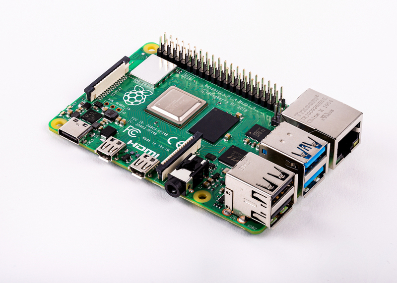
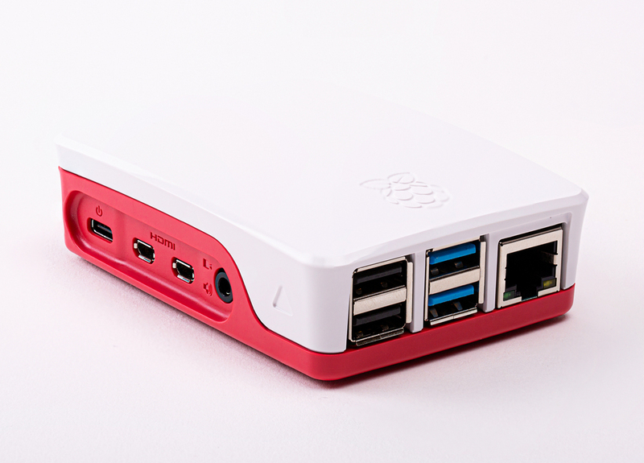
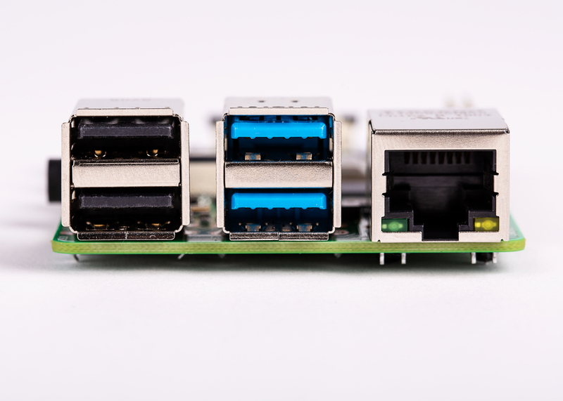
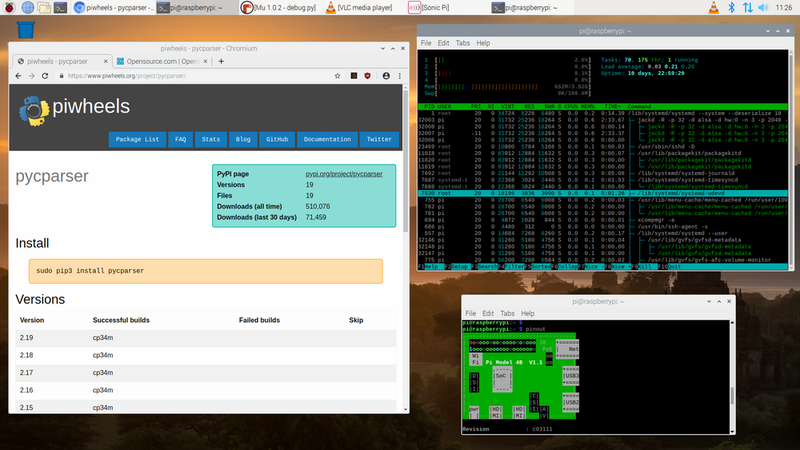

Today the Raspberry Pi 4 is released, featuring a new 1.5GHz Arm chip and
VideoCore GPU. It brings some brand new additions to the board: dual-HDMI 4K
display output; USB3 ports; Gigabit Ethernet; even multiple RAM options up to
4GB. The Raspberry Pi 4 is a very powerful single board computer and starts at
the usual price of $35. That price gets you the standard 1GB RAM, or you can pay
$45 for the 2GB model or $55 for the 4GB model - premium priced models a first
for Raspberry Pi.

The specs at-a-glance:

- 64-bit BCM2711 quad-core A72 CPU @ 1.5GHz
- VideoCore VI GPU
- Gigabit Ethernet port
- 1GB, 2GB or 4GB LPDDR4 RAM
- 2x micro-HDMI ports
- 2x USB3 ports
- 2x USB2 ports
- Dual-band (2.4GHz and 5GHz) WiFi
- Bluetooth 5.0
- USB Type C power port
- CSI camera interface
- DSI display interface
- Micro SD card slot
- Power over Ethernet pins
- Full compatibility with all previous Raspberry Pi models

## USB and networking

The Raspberry Pi 4 has the benefit of USB3, as it's powered by a USB Type C
cable and provides two USB3 ports as well as two USB2 ports. You can now connect
USB3 hard drives and other peripherals and make use of faster connectivity.

The BCM2835-based chip used in Raspberry Pi 1 to 3 only provided one native USB
port, and no ethernet, so on the board there's always been a USB hub that
provides more USB ports and an ethernet port. The 3B+ added a dedicated LAN chip
which gave it gigabit ethernet, but this was limited to USB2 speeds. The Pi 4
has truly dedicated gigabit ethernet, and it's not throttled over USB any more,
making its networking speeds much faster.

The Pi 4 takes advantage of the technology built into the 3B+ which made the Pi
the first single board computer with dual-band WiFi. This means you can connect
to both 2.4GHz and 5GHz networks.

## Displays

When the first Raspberry Pi was launched, the balance of its CPU and GPU
performance was tipped heavily in favour of the GPU. The VideoCore IV was a
very powerful graphics processor, capable of full-HD 1080p multimedia, which is
why the Pi has always been so popular as a home media center. The Pi 2
rebalanced things somewhat, and brought the CPU in line, taking the Pi from a
single-core to a quad-core Arm chip. Now the Pi 4 shows both taking a big step
forward together. The new VideoCore VI GPU gives the Pi 4K video, and allows for
two displays, so the board provides two HDMI ports. To keep the board the same
size, they have to be micro-HDMI, so you'll need an adapter or a micro-to-full
HDMI cable to use it with an HDMI monitor.

Dual displays are a godsend when you need more screen real estate to keep eye
contact with multiple windows - if you're programming you might have your code
on one screen and the website or app you're building; your database; your web
browser; your emails or anything else on the other. For the first time,
development on Raspberry Pi won't be limited to a single monitor. It's also
handy if you want to build the Pi into a project, and have different things
appear on different screens.

Don't forget the Pi also has a DSI (Display Serial Interface) port which you can
drive another special display from - not another monitor as such, but you can
connect the official Raspberry Pi touch screen to it via a flex cable.

## Raspbian Buster

This product launch happily coincides with a major Debian release, and the fact
the new Pi supports OpenGL ES 3 means it made sense for any software work on
the Pi 4 to target Raspbian Buster. Buster brings a few user interface tweaks
and a whole host of software upgrades, including Python 3.7.

It had previously been indicated that the Raspberry Pi 4 would be another year
away, but luckily, the chip design turned out to be ready for production much
earlier than anticipated, so here it is!
