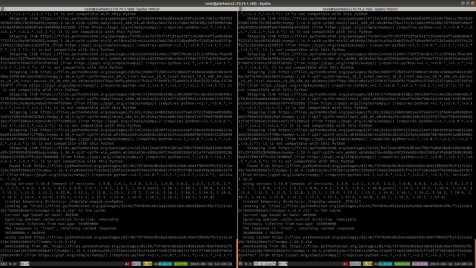
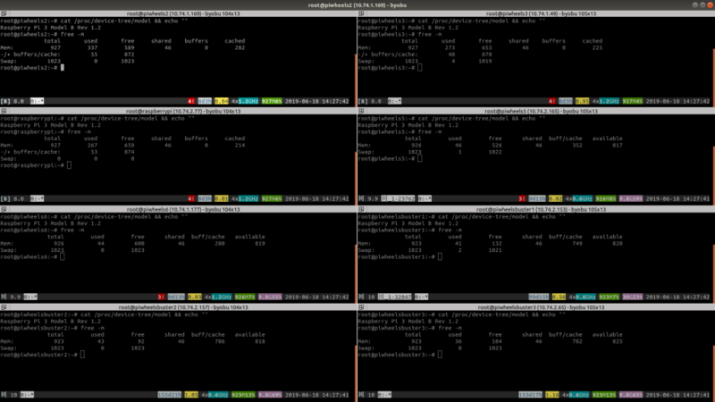

Last week I covered terminal multiplexer byobu, and this week's tool is quite similar. Terminator is
a single-window split-screen terminal multiplexer that allows you to send identical keystrokes to
all terminals at once. This means you can SSH into any number of machines, and run the same commands
simultaneously, and see them all at the same time.

Install terminator with:

```
sudo apt install terminator
```

Then when you open the app, it's just a regular terminal window. You can use it on its own, or right
click somewhere to split the screen (vertically or horizontally). Then you can type into each one
individually, or choose the option to broadcast to all windows, or to a group.

<figure class="wp-block-image">

<figcaption>Accessing and controlling two machines at once with terminator</figcaption>
</figure>

Obviously great care must be taken when running commands on multiple machines. It's easy to make a
mistake. You must also be aware that running the same command can take varying amounts of time to
complete, or can have different outputs. If you type an ssh command to connect to a number of
different servers, and hit Enter on them all together, some may require you to type "yes" to
continue if you haven't connected to it before. Typing "yes" and enter on a machine probably won't
do any harm (actually, [try it](https://linux.die.net/man/1/yes) and see!), but it's not a habit to
get into. If you need to control windows individually, you can turn off "broadcasting", and turn it
back on when you're ready.

I often use terminator for managing piwheels build servers:

<figure class="wp-block-image">

</figure>

It's a very handy tool for certain jobs – good to know about!
