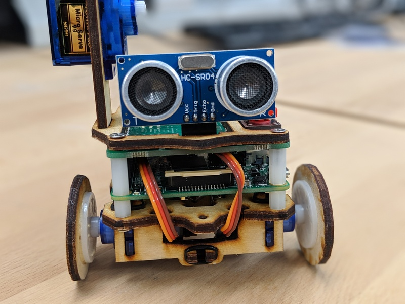
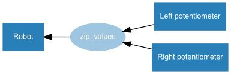

It's become customary for me to summarise what each new GPIO Zero release brings. This one's been a
long time coming. It's been a quite while since our last release (a whole year since the last point
release and 18 months since v1.4). I mostly attribute the lack of development to the launch of my
other project, [piwheels](https://www.piwheels.org/). I think that was time well spent, but I'm
sorry to say that GPIO Zero hasn't come along as far as I'd hoped by now. But hopefully you'll find
the contents of this release to be a satisfying step in the right direction.

Upgrade now:

```
sudo apt update
sudo apt install python3-gpiozero python-gpiozero
```

You can see the summary of what GPIO Zero v1.5.0 brings in the
[changelog](https://gpiozero.readthedocs.io/en/stable/changelog.html). I'm pleased to say it's the
longest changelog entry to date – lots of fairly small changes, plus some pretty big
(under-the-hood) ones thrown in for good measure.

So, what's new?

## New device classes

- **[PiHutXmasTree](https://gpiozero.readthedocs.io/en/stable/api_boards.html#pihutxmastree)**
  - The Pi Hut's 3D Christmas tree board Rachel designed is now natively supported, so you don't
    have to create your own LEDBoard with all the pins.
- **[PumpkinPi](https://gpiozero.readthedocs.io/en/stable/api_boards.html#pumpkinpi)**
  - A neat new Halloween themed LED board from ModMyPi
- **[JamHat](https://gpiozero.readthedocs.io/en/stable/api_boards.html#jamhat)**
  - Another new board from ModMyPi, the Jam HAT comprises two sets of traffic light LEDs, two
    buttons and a tonal buzzer
- **[TonalBuzzer](https://gpiozero.readthedocs.io/en/stable/api_output.html#tonalbuzzer)**
  - As featured on the Jam HAT, this component allows you to make audible tones using PWM
- **[LoadAverage](https://gpiozero.readthedocs.io/en/stable/api_internal.html#loadaverage)**
  - A new "internal" device you can use to read your Pi's load average, or even feed its values into
    an output device, e.g. an LED or LED bar graph
- **[DiskUsage](https://gpiozero.readthedocs.io/en/stable/api_internal.html#diskusage)**
  - Similarly, another new internal device for showing the disk usage, say of your SD card or other
    media

## Tones

Claire Pollard wrote some RPi.GPIO code to play tones on the tonal buzzer on the Jam HAT, and then
converted it to GPIO Zero. I took what she'd done, and wrapped it in a `TonalBuzzer` class, a
composite device taking inspiration from `Servo`, where the value is not directly tied to the duty
cycle, like a standard `PWMOutputDevice` or a `PWMLED`, but instead proportional to the mid tone. I
also replaced the dictionary look-up for MIDI notes and frequencies with the maths to calculate it.
Then Dave moved the note/tone/frequency conversion into its own class, proving all that
functionality in one place. On their own, tones could be used elsewhere, similar to the colour
manipulation that was previously embedded within picamera, but became colorzero. Here's a set of
examples for creating tones:

```python
>>> from gpiozero.tones import Tone
>>> Tone(frequency=440)
>>> Tone(midi=69)
>>> Tone(note='A4')
```

And used with `TonalBuzzer`:

```python
>>> from gpiozero import TonalBuzzer
>>> from gpiozero.tones import Tone
>>> buzzer = TonalBuzzer(20)
>>> buzzer.play(Tone(note='A4'))
```

You can even set the source of a TonalBuzzer to play a series of tones, a source of artificial
values or directly from another device. A siren effect can be achieved by setting the source to a
sine wave:

```python
from gpiozero import TonalBuzzer
from gpiozero.tools import sin_values

buzzer = TonalBuzzer()
buzzer.source = sin_values()
```

Since TonalBuzzer has a value range from -1->1, where -1 is an octave below its mid tone, and 1 is
an octave above (by default), that means if you set its source to come from a device whose values
are -1->1 you can control its full tonal range, and a device with range 0->1 can control from its
mid tone to an octave above, but either way can be effective. Since sin_values outputs values from
-1 to 1, it's a perfect example (as is cos_values). You can use source_delay to speed up or slow
down the rate it iterates over the values.

Another good example is `DistanceSensor` which has values between 0 (no distance to object) and 1
(max distance, configurable). So if you send the `DistanceSensor`'s values into a `TonalBuzzer` you
effectively have a theremin:

```python
from gpiozero import TonalBuzzer
from gpiozero.tools import sin_values

buzzer = TonalBuzzer()
buzzer.source = sin_values()
```

## Distance Sensor

Speaking of `DistanceSensor`, we had identified issues with the distance it reports. Our
implementation is complex and uses threading. The inherent complexity is essential for the device to
work with other GPIO Zero devices, and without requiring blocking other code from running or using
up 100% of the CPU. However, where there is complexity there is scope for bugs. Thanks to some
clever work from Dave, we now use timing information provided by underlying drivers, so that timing
events from pins will be considerably more accurate (see
[#655](https://github.com/RPi-Distro/python-gpiozero/pull/665)). Also, Dave found that the default
pin library, RPi.GPIO, would often miss edges during callbacks, which threw off the timing, so we
now drop missed edges and get better accuracy as a result (see
[#719](https://github.com/RPi-Distro/python-gpiozero/pull/719)). We recommend using the pigpio pin
factory for the best results, particularly with Pi 1 or Pi Zero.

<figure class="wp-block-image">

</figure>

## Source/values

My friend Robie has built his own z-wave home automation project using a GPIO Zero-like API which
includes a similar source/values interface, allowing him to easily connect devices together, like a
light switch controlling a light but also a humidity sensor (depending on the humidity sensor
reading) – and has completely custom rules for all the devices in his house. He suggested to me one
day that sometimes you need access to the device object itself when setting source, not just the
device's values, and I realised that this would make the API even simpler as a result. So now you
can use:

```python
led.source = btn
```

Instead of:

```python
led.source = btn.values
```

Although both methods still work. This also simplifies more complex device rules, as you can replace
every instance of `device.values` with just `device`, and so:

```python
led.source = all_values(btn1.values, btn2.values, btn3.values, btn4.values)
```

becomes:

```python
led.source = all_values(btn1, btn2, btn3, btn4)
```

We also added [graphviz](https://www.graphviz.org/) diagrams for all the examples in the
[Source/Values](https://gpiozero.readthedocs.io/en/stable/source_values.html) docs page which I
think helps visualise the examples:

<figure class="wp-block-image">

</figure>

## Other improvements

- Import time is massively reduced – we used to do an expensive pin factory computation at import
  time, but we removed that due to `pkg_resources` being *slow as hell*.
- It's now possible to import gpiozero without a valid pin factory, or any environment variables
  set.
- [RGBLED](https://gpiozero.readthedocs.io/en/stable/api_output.html#rgbled) now supports
  [colorzero](https://github.com/waveform80/colorzero), which is an awesome module previously buried
  in [picamera](https://picamera.readthedocs.io/), but I persuaded Dave it would be a useful as a
  separate library. It's also used by Dave's Sense HAT library
  [pisense](https://pisense.readthedocs.io/). Anyway, now you can now set the colour of an RGBLED
  using e.g. `Color('purple')` and do lots of really useful colour manipulation such as gradients.

Finally, a new flag allows you to type:

```python
pinout -x
```

And it opens up the website [pinout.xyz](https://pinout.xyz/) in a web browser.  

Now, back to [piwheels](https://github.com/bennuttall/piwheels) for a brief spell – we have some
awesome stuff in the works – all to be revealed soon – not least the expansion to Python 3.7 for
Raspbian Buster – but more on that soon. Then once that's out the door, back to GPIO Zero. I am
planning on upping the release cycle back to one per quarter, like in the good old days. You can
count on it!
