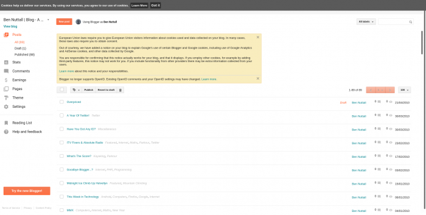
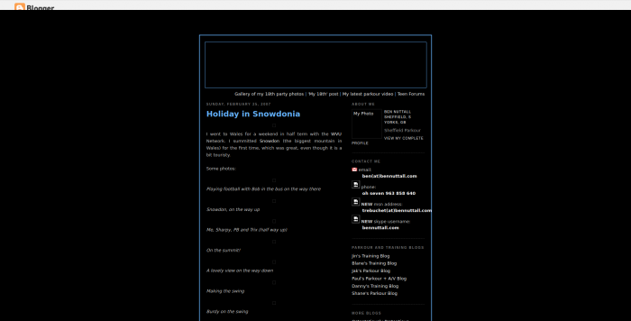
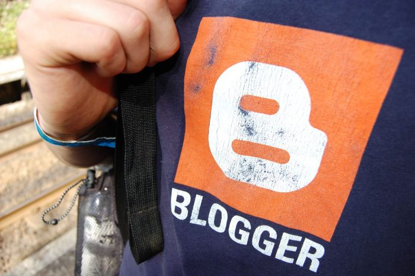
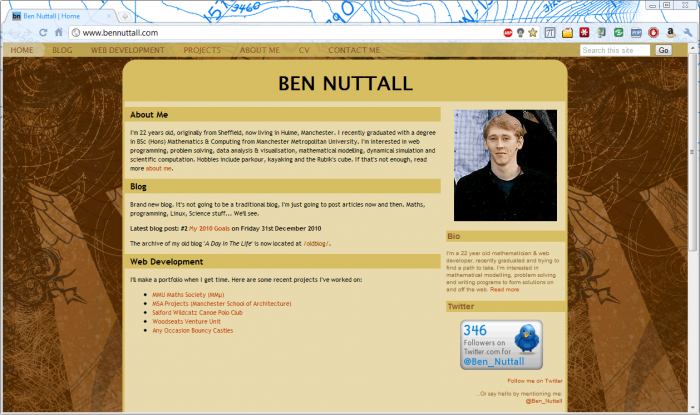
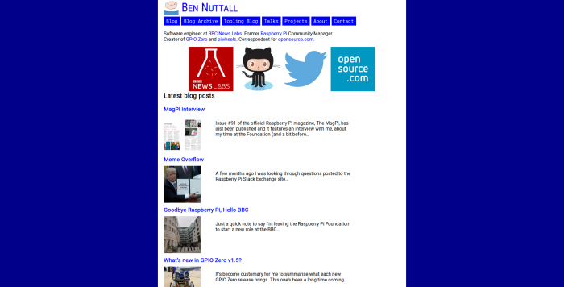
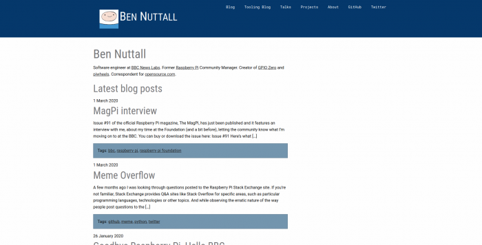

I've had a blog since 2006. I started using
[Blogger](https://en.wikipedia.org/wiki/Blogger_(service)) — Google's 2003 acquisition — allowing
17-year-old-me to publish my thoughts and share my adventures with the world in my own corner of web
space at blogspot.com.

<figure class="wp-block-image">

<figcaption>I can still log in to my blogspot account and see the old posts – although it changed a
lot at some point! I wonder if anyone still uses it...</figcaption>
</figure>

I spent countless hours writing HTML and CSS from scratch, or tweaking custom styles from other
Blogger users. I'm sure it will resonate with many developers around my age that when we were
younger, that any opportunity to write or tweak code/styles/markup to personalise our own web space
(whether that was Blogger or MySpace) didn't go to waste. We were proud of what we created back
then, and it was a wonderful learning experience.

<figure class="wp-block-image">

<figcaption>A slightly broken snapshot of my blogspot site from 2007</figcaption>
</figure>

I later got my own domain name — bennuttall.com — and at the time, Blogger allowed you to
publish to a custom domain. They ended up discontinuing this feature, so I was forced to move
elsewhere. I packed up, exported my posts and undertook the rite-of-passage of an aspiring web
developer that is building your own CMS to power your personal site.

<figure class="wp-block-image">

<figcaption>My Blogger t-shirt, circa 2007. <a
href="https://www.flickr.com/photos/shanerounce/1018974796/">Photo</a> by <a
href="https://twitter.com/srounce/">Shane Rounce</a>.</figcaption>
</figure>

Obviously that was dumb, and totally unnecessary, and I learned a lot of things the hard way. I had
forgotten all about this iteration of my site – but [wayback machine](https://web.archive.org/)
reminds me the pain I put myself through. I seem to have created a file-based CMS using PHP includes
and lots of manual routing. The thought of maintaining something like that now fills me with dread.
But I was slowly learning all the foundational elements of web and software development, a field
I've now been working in professionally for around ten years.

Moving forward through the wayback engine, I see that after about a year of MySQL errors, it seems I
ended up with a database-backed custom blog. Again, dumb looking back now, but a great learning
experience at the time. It was these skills, not my degree, that led to my employment after
graduation.

<figure class="wp-block-image">

</figure>

## Enter WordPress

I later ditched the custom CMS and moved to WordPress. I cherry-picked and imported many posts from
my original Blogger blog, and the custom CMS, preserving much of the content I'd authored since
2006. Over the next few years I switched between off-the-self WordPress themes and completely custom
ones a few times. I find writing a custom theme from scratch a strangely satisfying pastime. I long
since moved away from working exclusively in web development, so I missed the wave of revolutionary
changes that took place after Web 2.0. Therefore I'm comfortable writing HTML templates, CSS styling
and sticking in PHP tags to tell it where to place my WordPress content, so I've stuck with that
ever since. It's easy and flexible enough, has all the functionality I need, and comes with an
[editor](https://wordpress.org/gutenberg/) I really like writing in. Importantly, it's self-hosted
and easy to manage.

## Enter COVID-19

I've been thinking for quite a while now, that it's about time I revamped my blog — because I never
usually go more than a couple of years with the same one. Occasionally I see someone's personal site
and it's all retro looking with custom quirks — and it makes me want to have a site like that. And
what with all the free time we all now have, thanks to the deadly virus, I thought I'd polish off my
CSS skills and have a go at realising my dream.

I spent a couple of evenings working on what I had in mind. I borrowed bits of logic from other
templates I'd made previously, but the layout was largely new. It was retro and quirky. I tried to
get away with using a monospace font for the entire thing, and it looked good but looking at a few
blog posts it was clear I needed to differentiate paragraph text from inline code and pre-formatted
code blocks.

<figure class="wp-block-image">

<figcaption>The bennuttall.com that never was</figcaption>
</figure>

It was good fun throwing it together — and I liked it — but I just didn't think it was good enough
to roll out for real. I realised I much preferred the [one I
made](https://github.com/piwheels/piwheels-wordpress-theme) for the [piwheels
blog](https://blog.piwheels.org/) – which I retro-fitted into a static site Dave and I had built for
[piwheels](https://www.piwheels.org/) itself, which uses the Foundation CSS framework. So I decided
I'd just use that as a starting point, and change the colours. So I did that last night, and here it
is! I've also rolled it out to my new-ish [*Tooling Tuesday*](https://tooling.bennuttall.com/) blog.

<figure class="wp-block-image">

<figcaption>The new normal</figcaption>
</figure>

I think it's important to maintain a long-standing web presence, and to be able to share your
thoughts and ideas in an old fashioned way that is self-owned, self-hosted and preserved beyond
mergers, takeovers and deprecations. Tweets seem to get more eyes than blog posts, but unless
they're massively controversial, they disappear. I don't write on here as much as I'd like, but I
like that it's here, and I try use it to share important updates and occasional deep-dives. I
recently launched *[Tooling Tuesday](https://tooling.bennuttall.com/)* to encourage myself to share
short tips more often.

You can see this and other WordPress themes I mentioned on GitHub:

- Current blog theme: [bn-foundation](https://github.com/bennuttall/bn-foundation)
- Custom retro theme (unused): [bennuttall-twenty](https://github.com/bennuttall/bennuttall-twenty)
- piwheels blog theme:
  [piwheels-wordpress-theme](https://github.com/piwheels/piwheels-wordpress-theme)

I wonder how long before I get bored of this template and create or find another!
